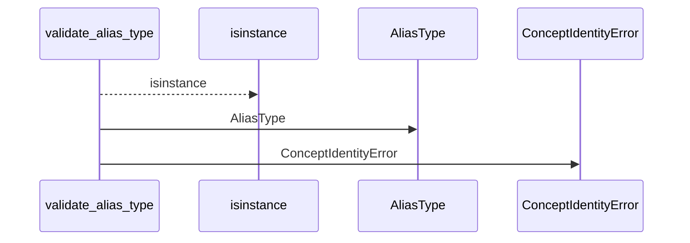
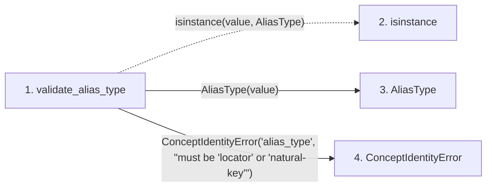

# validate_alias_type

**Entry point:** `validate_alias_type` (`api`)
**Source:** [concept_identity](../modules/concept_identity.md)
**Modules touched:** [concept_identity](../modules/concept_identity.md)

## Call sequence

<!-- Auto-generated from static call edges. Dashed arrows are external or unresolved calls. Reviewed runtime conditions and side effects belong in Behavior. -->

## Data flow

<!-- Auto-generated static analysis. Treat values and boundaries as best-effort hints, not runtime proof. -->

### Step data

| Step | Inputs | Reads | Writes | Returns |
|---|---|---|---|---|
| `validate_alias_type` | `value: AliasType \| str` | `AliasType` | - | `...` |
| `isinstance` | - | - | - | - |
| `AliasType` | - | - | - | - |
| `ConceptIdentityError` | - | - | - | - |

### Call data

| From | To | Line | Call |
|---|---|---:|---|
| validate_alias_type | isinstance | 445 | `isinstance(value, AliasType)` |
| validate_alias_type | AliasType | 445 | `AliasType(value)` |
| validate_alias_type | ConceptIdentityError | 447 | `ConceptIdentityError('alias_type', "must be 'locator' or 'natural-key'")` |

### Boundary effects

*No boundary effects detected.*

### Static analysis gaps

| Kind | Step | Target | Line |
|---|---|---|---:|
| unresolved_call | `validate_alias_type` | `isinstance` | 445 |

## Behavior

This flow starts at `validate_alias_type` and is classified as `api`. The generated call and data-flow sections are bounded static projections; runtime conditions and side effects require source-level confirmation.
