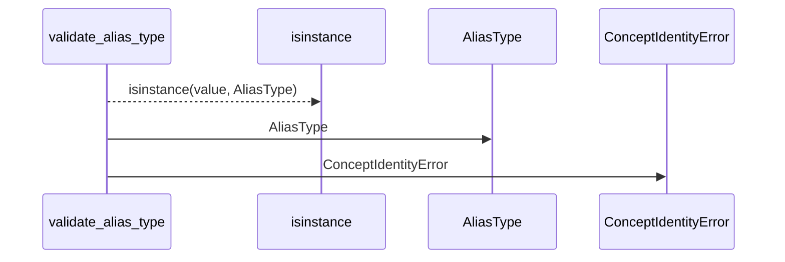
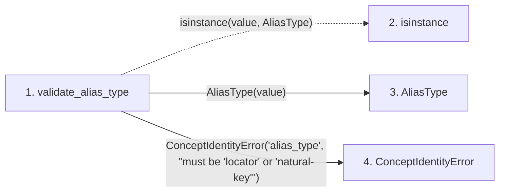

# validate_alias_type

**Entry point:** `validate_alias_type` (`api`)
**Source:** [concept_identity](../modules/concept_identity.md)
**Modules touched:** [concept_identity](../modules/concept_identity.md)

## Call sequence

> Static overview in presentation order, not runtime execution order. Arrows retain captured callers; representative internal continuations and boundary examples precede repeated helper detail.

<!-- Auto-generated from static call edges. Dashed arrows are external or unresolved calls. Reviewed runtime conditions and side effects belong in Behavior. -->

```mermaid
sequenceDiagram
    participant p0 as validate_alias_type
    participant p1 as isinstance
    participant p2 as AliasType
    participant p3 as ConceptIdentityError
    p0-->>p1: isinstance(value, AliasType)
    p0->>p2: AliasType
    p0->>p3: ConceptIdentityError
```

> Call sequence diagram shows 3 of 3 interactions; 0 omitted to keep the visualization within the 30-interaction and generated-diagram limits, with uncertain identities omitted rather than inferred.

> Captured boundary calls: external 1 of 1 (0 omitted); unresolved 0 of 0 (0 omitted). These counts cover the captured static trace.
> Detailed flow queries retain their own coverage and limits; omitted paths may execute at runtime.

## Data flow

<!-- Auto-generated static analysis. Treat values and boundaries as best-effort hints, not runtime proof. -->

### Analysis coverage

**Effect analysis partially available.** Flow assembly and source effect analysis are separate; empty observations do not prove an empty handler body.

Source steps: 3; effect analysis evaluated: 1, partial: 0, unavailable: 2. Counts include steps omitted from the displayed trace.

Collector observations for 1 source steps with known totals: observed: 3, emitted: 3, omitted: 0. Unavailable totals are excluded.

- Callable record unavailable for one or more source steps; those steps have no represented callable body.
- Effect collector totals unavailable; observed counts cover captured records only.

| Step | Callable record | Effect analysis | Collector totals | Observed | Emitted | Omitted |
|---|---|---|---|---:|---:|---:|
| `validate_alias_type` | `available` | `evaluated` | `available` | `3` | `3` | `0` |
| `isinstance` | `not_applicable` | `not_applicable` | `not_applicable` | — | — | — |
| `AliasType` | `unavailable` | `unavailable` | `unavailable` | — | — | — |
| `ConceptIdentityError` | `unavailable` | `unavailable` | `unavailable` | — | — | — |

```mermaid
flowchart LR
    s1["1. validate_alias_type"]
    s2["2. isinstance"]
    s3["3. AliasType"]
    s4["4. ConceptIdentityError"]
    s1 -. "isinstance(value, AliasType)" .-> s2
    s1 -->|"AliasType(value)"| s3
    s1 -->|"ConceptIdentityError('alias_type', #34;must be 'locator' or 'natural-key'#34;)"| s4
    click s1 "../modules/concept_identity.md"
    click s3 "../modules/concept_identity.md"
    click s4 "../modules/concept_identity.md"
```

### Step data

| Step | Inputs | Reads | Writes | Returns |
|---|---|---|---|---|
| `validate_alias_type` | `value: AliasType \| str` | `AliasType` | - | `...` |
| `isinstance` | - | - | - | - |
| `AliasType` | - | - | - | - |
| `ConceptIdentityError` | - | - | - | - |

### Call data

| From | To | Line | Call |
|---|---|---:|---|
| validate_alias_type | isinstance | 475 | `isinstance(value, AliasType)` |
| validate_alias_type | AliasType | 475 | `AliasType(value)` |
| validate_alias_type | ConceptIdentityError | 477 | `ConceptIdentityError('alias_type', "must be 'locator' or 'natural-key'")` |

### Boundary effects

*No boundary-effect observations were captured in this static trace.*

### Static analysis gaps

| Kind | Step | Target | Line |
|---|---|---|---:|
| external_call | `validate_alias_type` | `isinstance` | 475 |

## Behavior

This flow starts at `validate_alias_type` and is classified as `api`. The generated call and data-flow sections are bounded static projections; runtime conditions and side effects require source-level confirmation.
