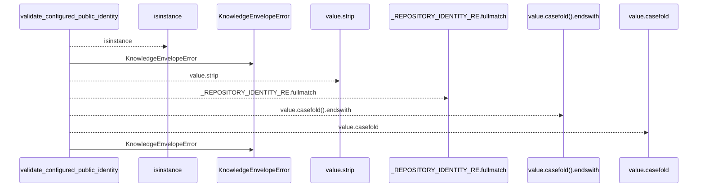
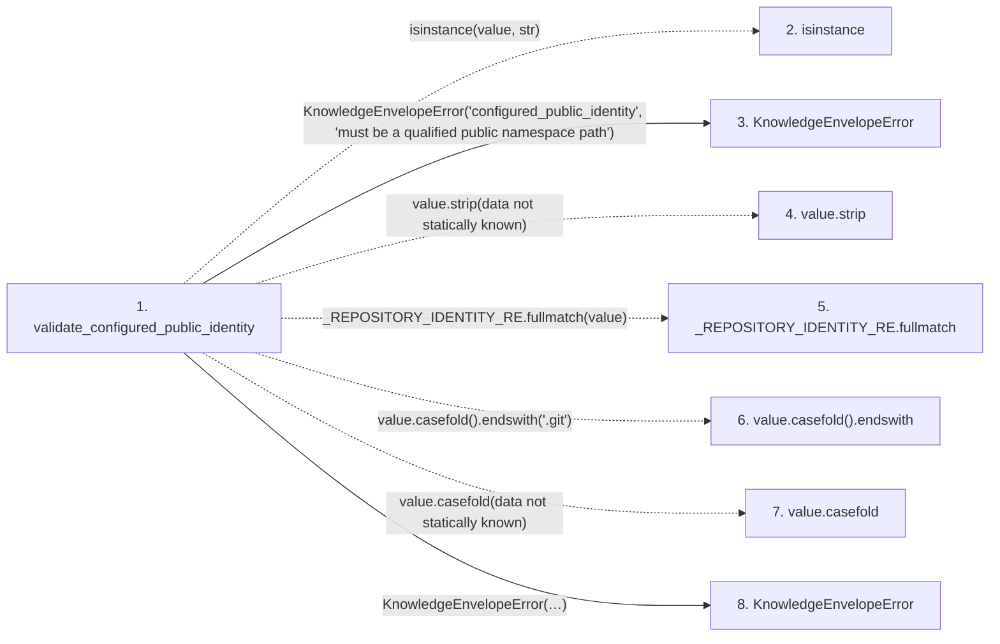

# validate_configured_public_identity

**Entry point:** `validate_configured_public_identity` (`api`)
**Source:** [knowledge_envelope](../modules/knowledge_envelope.md)
**Modules touched:** [knowledge_envelope](../modules/knowledge_envelope.md)

## Call sequence

<!-- Auto-generated from static call edges. Dashed arrows are external or unresolved calls. Reviewed runtime conditions and side effects belong in Behavior. -->

## Data flow

<!-- Auto-generated static analysis. Treat values and boundaries as best-effort hints, not runtime proof. -->

### Step data

| Step | Inputs | Reads | Writes | Returns |
|---|---|---|---|---|
| `validate_configured_public_identity` | `value: object` | - | - | `value` |
| `isinstance` | - | - | - | - |
| `KnowledgeEnvelopeError` | - | - | - | - |
| `value.strip` | - | - | - | - |
| `_REPOSITORY_IDENTITY_RE.fullmatch` | - | - | - | - |
| `value.casefold().endswith` | - | - | - | - |
| `value.casefold` | - | - | - | - |
| `KnowledgeEnvelopeError` | - | - | - | - |

### Call data

| From | To | Line | Call |
|---|---|---:|---|
| validate_configured_public_identity | isinstance | 687 | `isinstance(value, str)` |
| validate_configured_public_identity | KnowledgeEnvelopeError | 688 | `KnowledgeEnvelopeError('configured_public_identity', 'must be a qualified public namespace path')` |
| validate_configured_public_identity | value.strip | 693 | `value.strip(data not statically known)` |
| validate_configured_public_identity | _REPOSITORY_IDENTITY_RE.fullmatch | 694 | `_REPOSITORY_IDENTITY_RE.fullmatch(value)` |
| validate_configured_public_identity | value.casefold().endswith | 695 | `value.casefold().endswith('.git')` |
| validate_configured_public_identity | value.casefold | 695 | `value.casefold(data not statically known)` |
| validate_configured_public_identity | KnowledgeEnvelopeError | 697 | `KnowledgeEnvelopeError('configured_public_identity', "must be a normalized public namespace path without scheme, credentials, port, query, fragment, dot segment, or '.git' suffix")` |

### Boundary effects

*No boundary effects detected.*

### Static analysis gaps

| Kind | Step | Target | Line |
|---|---|---|---:|
| external_call | `validate_configured_public_identity` | `isinstance` | 687 |
| unresolved_call | `validate_configured_public_identity` | `value.strip` | 693 |
| unresolved_call | `validate_configured_public_identity` | `_REPOSITORY_IDENTITY_RE.fullmatch` | 694 |
| unresolved_call | `validate_configured_public_identity` | `value.casefold().endswith` | 695 |
| unresolved_call | `validate_configured_public_identity` | `value.casefold` | 695 |

## Behavior

This flow starts at `validate_configured_public_identity` and is classified as `api`. The generated call and data-flow sections are bounded static projections; runtime conditions and side effects require source-level confirmation.
