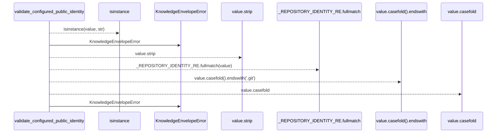
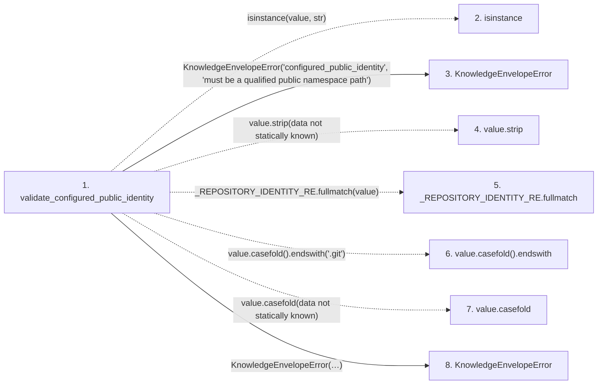

# validate_configured_public_identity

**Entry point:** `validate_configured_public_identity` (`api`)
**Source:** [knowledge_envelope](../modules/knowledge_envelope.md)
**Modules touched:** [knowledge_envelope](../modules/knowledge_envelope.md)

## Call sequence

> Static overview in presentation order, not runtime execution order. Arrows retain captured callers; representative internal continuations and boundary examples precede repeated helper detail.

<!-- Auto-generated from static call edges. Dashed arrows are external or unresolved calls. Reviewed runtime conditions and side effects belong in Behavior. -->

```mermaid
sequenceDiagram
    participant p0 as validate_configured_public_identity
    participant p1 as isinstance
    participant p2 as KnowledgeEnvelopeError
    participant p3 as value.strip
    participant p4 as _REPOSITORY_IDENTITY_RE.fullmatch
    participant p5 as value.casefold().endswith
    participant p6 as value.casefold
    p0-->>p1: isinstance(value, str)
    p0->>p2: KnowledgeEnvelopeError
    p0-->>p3: value.strip
    p0-->>p4: _REPOSITORY_IDENTITY_RE.fullmatch(value)
    p0-->>p5: value.casefold().endswith('.git')
    p0-->>p6: value.casefold
    p0->>p2: KnowledgeEnvelopeError
```

> Call sequence diagram shows 7 of 7 interactions; 0 omitted to keep the visualization within the 30-interaction and generated-diagram limits, with uncertain identities omitted rather than inferred.

> Captured boundary calls: external 1 of 1 (0 omitted); unresolved 4 of 4 (0 omitted). These counts cover the captured static trace.
> Detailed flow queries retain their own coverage and limits; omitted paths may execute at runtime.

## Data flow

<!-- Auto-generated static analysis. Treat values and boundaries as best-effort hints, not runtime proof. -->

### Analysis coverage

**Effect analysis partially available.** Flow assembly and source effect analysis are separate; empty observations do not prove an empty handler body.

Source steps: 3; effect analysis evaluated: 1, partial: 0, unavailable: 2. Counts include steps omitted from the displayed trace.

Collector observations for 1 source steps with known totals: observed: 2, emitted: 2, omitted: 0. Unavailable totals are excluded.

- Callable record unavailable for one or more source steps; those steps have no represented callable body.
- Effect collector totals unavailable; observed counts cover captured records only.

| Step | Callable record | Effect analysis | Collector totals | Observed | Emitted | Omitted |
|---|---|---|---|---:|---:|---:|
| `validate_configured_public_identity` | `available` | `evaluated` | `available` | `2` | `2` | `0` |
| `isinstance` | `not_applicable` | `not_applicable` | `not_applicable` | — | — | — |
| `KnowledgeEnvelopeError` | `unavailable` | `unavailable` | `unavailable` | — | — | — |
| `value.strip` | `not_applicable` | `not_applicable` | `not_applicable` | — | — | — |
| `_REPOSITORY_IDENTITY_RE.fullmatch` | `not_applicable` | `not_applicable` | `not_applicable` | — | — | — |
| `value.casefold().endswith` | `not_applicable` | `not_applicable` | `not_applicable` | — | — | — |
| `value.casefold` | `not_applicable` | `not_applicable` | `not_applicable` | — | — | — |
| `KnowledgeEnvelopeError` | `unavailable` | `unavailable` | `unavailable` | — | — | — |

```mermaid
flowchart LR
    s1["1. validate_configured_public_identity"]
    s2["2. isinstance"]
    s3["3. KnowledgeEnvelopeError"]
    s4["4. value.strip"]
    s5["5. _REPOSITORY_IDENTITY_RE.fullmatch"]
    s6["6. value.casefold().endswith"]
    s7["7. value.casefold"]
    s8["8. KnowledgeEnvelopeError"]
    s1 -. "isinstance(value, str)" .-> s2
    s1 -->|"KnowledgeEnvelopeError('configured_public_identity', 'must be a qualified public namespace path')"| s3
    s1 -. "value.strip(data not statically known)" .-> s4
    s1 -. "_REPOSITORY_IDENTITY_RE.fullmatch(value)" .-> s5
    s1 -. "value.casefold().endswith('.git')" .-> s6
    s1 -. "value.casefold(data not statically known)" .-> s7
    s1 -->|"KnowledgeEnvelopeError(…)"| s8
    click s1 "../modules/knowledge_envelope.md"
    click s3 "../modules/knowledge_envelope.md"
    click s8 "../modules/knowledge_envelope.md"
```

### Step data

| Step | Inputs | Reads | Writes | Returns |
|---|---|---|---|---|
| `validate_configured_public_identity` | `value: object` | - | - | `value` |
| `isinstance` | - | - | - | - |
| `KnowledgeEnvelopeError` | - | - | - | - |
| `value.strip` | - | - | - | - |
| `_REPOSITORY_IDENTITY_RE.fullmatch` | - | - | - | - |
| `value.casefold().endswith` | - | - | - | - |
| `value.casefold` | - | - | - | - |
| `KnowledgeEnvelopeError` | - | - | - | - |

### Call data

| From | To | Line | Call |
|---|---|---:|---|
| validate_configured_public_identity | isinstance | 687 | `isinstance(value, str)` |
| validate_configured_public_identity | KnowledgeEnvelopeError | 688 | `KnowledgeEnvelopeError('configured_public_identity', 'must be a qualified public namespace path')` |
| validate_configured_public_identity | value.strip | 693 | `value.strip(data not statically known)` |
| validate_configured_public_identity | _REPOSITORY_IDENTITY_RE.fullmatch | 694 | `_REPOSITORY_IDENTITY_RE.fullmatch(value)` |
| validate_configured_public_identity | value.casefold().endswith | 695 | `value.casefold().endswith('.git')` |
| validate_configured_public_identity | value.casefold | 695 | `value.casefold(data not statically known)` |
| validate_configured_public_identity | KnowledgeEnvelopeError | 697 | `KnowledgeEnvelopeError('configured_public_identity', "must be a normalized public namespace path without scheme, credentials, port, query, fragment, dot segment, or '.git' suffix")` |

### Boundary effects

*No boundary-effect observations were captured in this static trace.*

### Static analysis gaps

| Kind | Step | Target | Line |
|---|---|---|---:|
| external_call | `validate_configured_public_identity` | `isinstance` | 687 |
| unresolved_call | `validate_configured_public_identity` | `value.strip` | 693 |
| unresolved_call | `validate_configured_public_identity` | `_REPOSITORY_IDENTITY_RE.fullmatch` | 694 |
| unresolved_call | `validate_configured_public_identity` | `value.casefold().endswith` | 695 |
| unresolved_call | `validate_configured_public_identity` | `value.casefold` | 695 |

## Behavior

This flow starts at `validate_configured_public_identity` and is classified as `api`. The generated call and data-flow sections are bounded static projections; runtime conditions and side effects require source-level confirmation.
