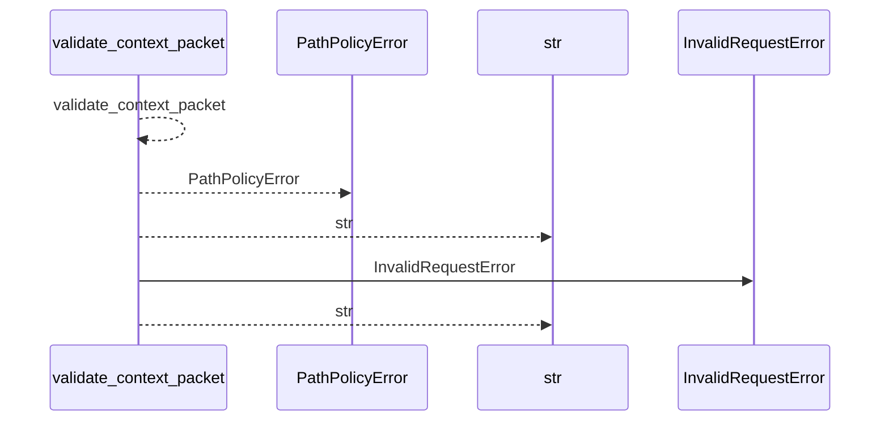
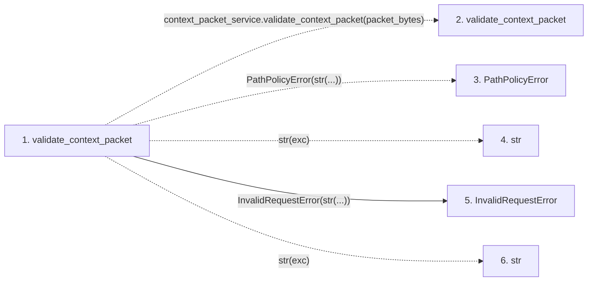

# validate_context_packet

**Entry point:** `validate_context_packet` (`api`)
**Source:** [api](../modules/api.md)
**Modules touched:** [api](../modules/api.md)

## Call sequence

<!-- Auto-generated from static call edges. Dashed arrows are external or unresolved calls. Reviewed runtime conditions and side effects belong in Behavior. -->

## Data flow

<!-- Auto-generated static analysis. Treat values and boundaries as best-effort hints, not runtime proof. -->

### Step data

| Step | Inputs | Reads | Writes | Returns |
|---|---|---|---|---|
| `validate_context_packet` | `packet_bytes: bytes \| bytearray \| memoryview` | `context_packet_service`, `context_packet_service` | - | `validation` |
| `validate_context_packet` | - | - | - | - |
| `PathPolicyError` | - | - | - | - |
| `str` | - | - | - | - |
| `InvalidRequestError` | - | - | - | - |
| `str` | - | - | - | - |

### Call data

| From | To | Line | Call |
|---|---|---:|---|
| validate_context_packet | validate_context_packet | 944 | `context_packet_service.validate_context_packet(packet_bytes)` |
| validate_context_packet | PathPolicyError | 946 | `PathPolicyError(str(...))` |
| validate_context_packet | str | 946 | `str(exc)` |
| validate_context_packet | InvalidRequestError | 948 | `InvalidRequestError(str(...))` |
| validate_context_packet | str | 948 | `str(exc)` |

### Boundary effects

*No boundary effects detected.*

### Static analysis gaps

| Kind | Step | Target | Line |
|---|---|---|---:|
| external_call | `validate_context_packet` | `context_packet_service.validate_context_packet` | 944 |
| unresolved_call | `validate_context_packet` | `PathPolicyError` | 946 |

## Behavior

This flow starts at `validate_context_packet` and is classified as `api`. The generated call and data-flow sections are bounded static projections; runtime conditions and side effects require source-level confirmation.
