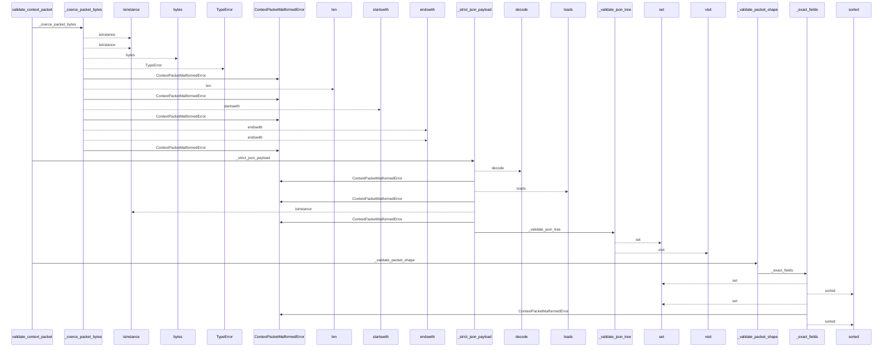
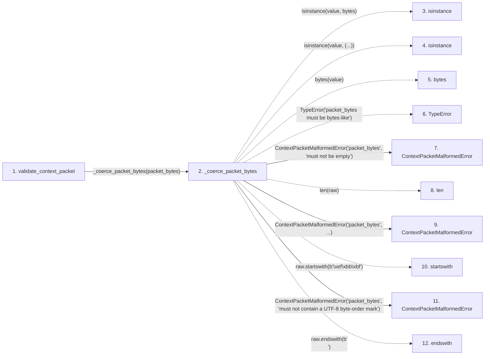

# validate_context_packet

**Entry point:** `validate_context_packet` (`api`)
**Source:** [context_packet](../modules/context_packet.md)
**Modules touched:** [context_packet](../modules/context_packet.md), [knowledge_evidence](../modules/knowledge_evidence.md)

## Call sequence

<!-- Auto-generated from static call edges. Dashed arrows are external or unresolved calls. Reviewed runtime conditions and side effects belong in Behavior. -->

> Call sequence diagram shows 30 of 212 interactions; 182 omitted to keep the visualization within the 30-interaction and generated-diagram limits.

> Trace truncated at the depth limit; deeper calls are omitted.

## Data flow

<!-- Auto-generated static analysis. Treat values and boundaries as best-effort hints, not runtime proof. -->

### Step data

| Step | Inputs | Reads | Writes | Returns |
|---|---|---|---|---|
| `validate_context_packet` | `packet_bytes: bytes \| bytearray \| memoryview` | - | - | `ContextPacketValidation(...)` |
| `_coerce_packet_bytes` | `value: bytes \| bytearray \| memoryview` | `_MAX_PACKET_BYTES`, `_MAX_PACKET_BYTES` | - | `raw` |
| `isinstance` | - | - | - | - |
| `isinstance` | - | - | - | - |
| `bytes` | - | - | - | - |
| `TypeError` | - | - | - | - |
| `ContextPacketMalformedError` | - | - | - | - |
| `len` | - | - | - | - |
| `ContextPacketMalformedError` | - | - | - | - |
| `startswith` | - | - | - | - |
| `ContextPacketMalformedError` | - | - | - | - |
| `endswith` | - | - | - | - |

### Call data

| From | To | Line | Call |
|---|---|---:|---|
| validate_context_packet | _coerce_packet_bytes | 859 | `_coerce_packet_bytes(packet_bytes)` |
| _coerce_packet_bytes | isinstance | 1557 | `isinstance(value, bytes)` |
| _coerce_packet_bytes | isinstance | 1559 | `isinstance(value, (...))` |
| _coerce_packet_bytes | bytes | 1560 | `bytes(value)` |
| _coerce_packet_bytes | TypeError | 1562 | `TypeError('packet_bytes must be bytes-like')` |
| _coerce_packet_bytes | ContextPacketMalformedError | 1564 | `ContextPacketMalformedError('packet_bytes', 'must not be empty')` |
| _coerce_packet_bytes | len | 1565 | `len(raw)` |
| _coerce_packet_bytes | ContextPacketMalformedError | 1566 | `ContextPacketMalformedError('packet_bytes', ...)` |
| _coerce_packet_bytes | startswith | 1570 | `raw.startswith(b'\xef\xbb\xbf')` |
| _coerce_packet_bytes | ContextPacketMalformedError | 1571 | `ContextPacketMalformedError('packet_bytes', 'must not contain a UTF-8 byte-order mark')` |
| _coerce_packet_bytes | endswith | 1575 | `raw.endswith(b'\n')` |

### Boundary effects

*No boundary effects detected.*

### Static analysis gaps

| Kind | Step | Target | Line |
|---|---|---|---:|
| unresolved_call | `_coerce_packet_bytes` | `isinstance` | 1557 |
| unresolved_call | `_coerce_packet_bytes` | `isinstance` | 1559 |
| unresolved_call | `_coerce_packet_bytes` | `bytes` | 1560 |
| unresolved_call | `_coerce_packet_bytes` | `TypeError` | 1562 |
| unresolved_call | `_coerce_packet_bytes` | `raw.startswith` | 1570 |
| unresolved_call | `_coerce_packet_bytes` | `raw.endswith` | 1575 |
| step_limit | `validate_context_packet` | `first 12 steps` | 0 |
| truncated_flow | `validate_context_packet` | `depth limit` | 0 |

## Behavior

This flow starts at `validate_context_packet` and is classified as `api`. The generated call and data-flow sections are bounded static projections; runtime conditions and side effects require source-level confirmation.
