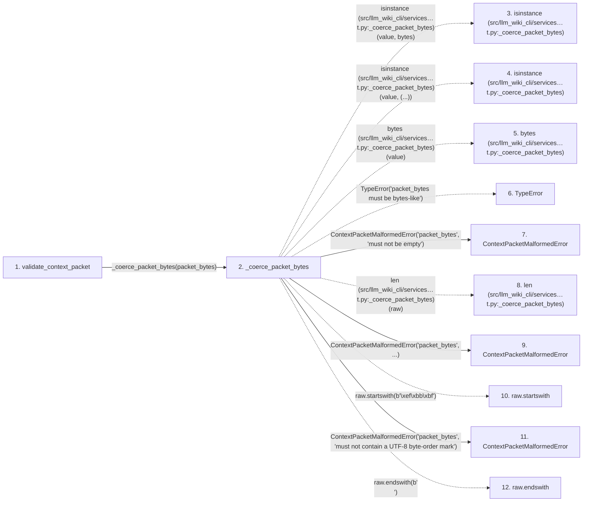

# validate_context_packet

**Entry point:** `validate_context_packet` (`api`)
**Source:** [context_packet](../modules/context_packet.md)
**Modules touched:** [change_selection](../modules/change_selection.md), [context_budget](../modules/context_budget.md), [context_packet](../modules/context_packet.md), [context_service](../modules/context_service.md), and 6 more

**Complete modules touched:**

- [change_selection](../modules/change_selection.md)
- [context_budget](../modules/context_budget.md)
- [context_packet](../modules/context_packet.md)
- [context_service](../modules/context_service.md)
- [knowledge_evidence](../modules/knowledge_evidence.md)
- [knowledge_graph](../modules/knowledge_graph.md)
- [knowledge_model](../modules/knowledge_model.md)
- [maintenance_status](../modules/maintenance_status.md)
- [packet_field_policy](../modules/packet_field_policy.md)
- [validation](../modules/validation.md)

## Call sequence

> Static overview in presentation order, not runtime execution order. Arrows retain captured callers; representative internal continuations and boundary examples precede repeated helper detail.

<!-- Auto-generated from static call edges. Dashed arrows are external or unresolved calls. Reviewed runtime conditions and side effects belong in Behavior. -->

```mermaid
sequenceDiagram
    participant p0 as validate_context_packet
    participant p1 as _coerce_packet_bytes
    participant p2 as _strict_json_payload
    participant p3 as _packet_contract_for_schema
    participant p4 as _validate_packet_shape
    participant p5 as _encode_packet_payload
    participant p6 as _packet_id
    participant p7 as _path_policy_receipt
    participant p8 as QualifiedContextPacket._from_validated_payload
    participant p9 as ContextPacketMalformedError
    participant p10 as ContextPacketPathPolicyError
    participant p11 as ContextPacketValidation
    participant p12 as _exact_fields
    participant p13 as _freeze_json
    participant p14 as _validate_assurance
    participant p15 as _validate_packet_request
    participant p16 as _validate_response
    participant p17 as _validate_basis
    participant p18 as _validate_response_basis_consistency
    participant p19 as _validate_delivery
    participant p20 as _validate_path_policy_shape
    participant p21 as _mapping
    participant p22 as _validate_protocol_request
    participant p23 as _path_policy_digest
    participant p24 as _validate_repository_basis
    participant p25 as _validate_knowledge_basis
    participant p26 as _validate_explicit_ranking_policy
    participant p27 as _context_policy_digest
    participant p28 as _validate_freshness_basis
    participant p29 as len (src/llm_wiki_cli/services…y:validate_context_packet)
    participant p30 as payload.get
    p0->>p1: _coerce_packet_bytes
    p0->>p2: _strict_json_payload
    p0->>p3: _packet_contract_for_schema
    p0->>p4: _validate_packet_shape
    p0->>p5: _encode_packet_payload
    p0->>p6: _packet_id
    p0->>p7: _path_policy_receipt
    p0->>p8: QualifiedContextPacket._from_validated_payload
    p0->>p9: ContextPacketMalformedError
    p0->>p10: ContextPacketPathPolicyError
    p0->>p11: ContextPacketValidation
    p4->>p12: _exact_fields
    p8->>p13: _freeze_json
    p4->>p14: _validate_assurance
    p4->>p15: _validate_packet_request
    p4->>p16: _validate_response
    p4->>p17: _validate_basis
    p4->>p18: _validate_response_basis_consistency
    p4->>p19: _validate_delivery
    p4->>p20: _validate_path_policy_shape
    p14->>p21: _mapping
    p15->>p22: _validate_protocol_request
    p20->>p23: _path_policy_digest
    p17->>p24: _validate_repository_basis
    p17->>p25: _validate_knowledge_basis
    p16->>p26: _validate_explicit_ranking_policy
    p17->>p27: _context_policy_digest
    p17->>p28: _validate_freshness_basis
    p0-->>p29: len (src/llm_wiki_cli/services…y:validate_context_packet)(raw)
    p0-->>p30: payload.get('schema_version')
```

> Call sequence diagram shows 30 of 754 interactions; 724 omitted to keep the visualization within the 30-interaction and generated-diagram limits, with uncertain identities omitted rather than inferred.

> Captured boundary calls: external 1 of 231 (230 omitted); unresolved 1 of 135 (134 omitted). These counts cover the captured static trace.

Omitted captured detail, grouped by actual caller occurrence and target module:

| Caller | Parent step | Target module | Kind | Omitted interactions |
| --- | --- | --- | --- | --- |
| `src/llm_wiki_cli/services/context_packet.py:_coerce_packet_bytes` | 2 | - | external | 5 |
| `src/llm_wiki_cli/services/context_packet.py:_coerce_packet_bytes` | 2 | [src/llm_wiki_cli/services/context_packet.py](../modules/context_packet.md) | internal | 4 |
| `src/llm_wiki_cli/services/context_packet.py:_coerce_packet_bytes` | 2 | - | unresolved | 3 |
| `src/llm_wiki_cli/services/context_packet.py:_strict_json_payload` | 15 | - | unresolved | 1 |
| `src/llm_wiki_cli/services/context_packet.py:_strict_json_payload` | 15 | [src/llm_wiki_cli/services/context_packet.py](../modules/context_packet.md) | internal | 4 |
| `src/llm_wiki_cli/services/context_packet.py:_strict_json_payload` | 15 | - | external | 2 |
| `src/llm_wiki_cli/services/context_packet.py:_validate_json_tree` | 22 | - | external | 1 |
| `src/llm_wiki_cli/services/context_packet.py:_validate_json_tree` | 22 | - | unresolved | 1 |
> Omission summary shows 8 of 148 groups; 140 further groups are not expanded here. Counts above include all omitted interactions.
> Detailed flow queries retain their own coverage and limits; omitted paths may execute at runtime.

> Trace truncated at the depth limit; deeper calls are omitted.

## Data flow

<!-- Auto-generated static analysis. Treat values and boundaries as best-effort hints, not runtime proof. -->

```mermaid
flowchart LR
    s1["1. validate_context_packet"]
    s2["2. _coerce_packet_bytes"]
    s3["3. isinstance (src/llm_wiki_cli/services…t.py:_coerce_packet_bytes)"]
    s4["4. isinstance (src/llm_wiki_cli/services…t.py:_coerce_packet_bytes)"]
    s5["5. bytes (src/llm_wiki_cli/services…t.py:_coerce_packet_bytes)"]
    s6["6. TypeError"]
    s7["7. ContextPacketMalformedError"]
    s8["8. len (src/llm_wiki_cli/services…t.py:_coerce_packet_bytes)"]
    s9["9. ContextPacketMalformedError"]
    s10["10. raw.startswith"]
    s11["11. ContextPacketMalformedError"]
    s12["12. raw.endswith"]
    s1 -->|"_coerce_packet_bytes(packet_bytes)"| s2
    s2 -. "isinstance (src/llm_wiki_cli/services…t.py:_coerce_packet_bytes)(value, bytes)" .-> s3
    s2 -. "isinstance (src/llm_wiki_cli/services…t.py:_coerce_packet_bytes)(value, (...))" .-> s4
    s2 -. "bytes (src/llm_wiki_cli/services…t.py:_coerce_packet_bytes)(value)" .-> s5
    s2 -. "TypeError('packet_bytes must be bytes-like')" .-> s6
    s2 -->|"ContextPacketMalformedError('packet_bytes', 'must not be empty')"| s7
    s2 -. "len (src/llm_wiki_cli/services…t.py:_coerce_packet_bytes)(raw)" .-> s8
    s2 -->|"ContextPacketMalformedError('packet_bytes', ...)"| s9
    s2 -. "raw.startswith(b'\xef\xbb\xbf')" .-> s10
    s2 -->|"ContextPacketMalformedError('packet_bytes', 'must not contain a UTF-8 byte-order mark')"| s11
    s2 -. "raw.endswith(b'\n')" .-> s12
    click s1 "../modules/context_packet.md"
    click s2 "../modules/context_packet.md"
    click s7 "../modules/context_packet.md"
    click s9 "../modules/context_packet.md"
    click s11 "../modules/context_packet.md"
```

### Step data

| Step | Inputs | Reads | Writes | Returns |
|---|---|---|---|---|
| `validate_context_packet` | `packet_bytes: bytes \| bytearray \| memoryview` | - | - | `ContextPacketValidation(...)` |
| `_coerce_packet_bytes` | `value: bytes \| bytearray \| memoryview` | `_MAX_PACKET_BYTES`, `_MAX_PACKET_BYTES` | - | `raw` |
| `isinstance (src/llm_wiki_cli/services…t.py:_coerce_packet_bytes)` | - | - | - | - |
| `isinstance (src/llm_wiki_cli/services…t.py:_coerce_packet_bytes)` | - | - | - | - |
| `bytes (src/llm_wiki_cli/services…t.py:_coerce_packet_bytes)` | - | - | - | - |
| `TypeError` | - | - | - | - |
| `ContextPacketMalformedError` | - | - | - | - |
| `len (src/llm_wiki_cli/services…t.py:_coerce_packet_bytes)` | - | - | - | - |
| `ContextPacketMalformedError` | - | - | - | - |
| `raw.startswith` | - | - | - | - |
| `ContextPacketMalformedError` | - | - | - | - |
| `raw.endswith` | - | - | - | - |

### Call data

| From | To | Line | Call |
|---|---|---:|---|
| validate_context_packet | _coerce_packet_bytes | 1771 | `_coerce_packet_bytes(packet_bytes)` |
| _coerce_packet_bytes | isinstance (src/llm_wiki_cli/services…t.py:_coerce_packet_bytes) | 2547 | `isinstance(value, bytes)` |
| _coerce_packet_bytes | isinstance (src/llm_wiki_cli/services…t.py:_coerce_packet_bytes) | 2549 | `isinstance(value, (...))` |
| _coerce_packet_bytes | bytes (src/llm_wiki_cli/services…t.py:_coerce_packet_bytes) | 2550 | `bytes(value)` |
| _coerce_packet_bytes | TypeError | 2552 | `TypeError('packet_bytes must be bytes-like')` |
| _coerce_packet_bytes | ContextPacketMalformedError | 2554 | `ContextPacketMalformedError('packet_bytes', 'must not be empty')` |
| _coerce_packet_bytes | len (src/llm_wiki_cli/services…t.py:_coerce_packet_bytes) | 2555 | `len(raw)` |
| _coerce_packet_bytes | ContextPacketMalformedError | 2556 | `ContextPacketMalformedError('packet_bytes', ...)` |
| _coerce_packet_bytes | raw.startswith | 2560 | `raw.startswith(b'\xef\xbb\xbf')` |
| _coerce_packet_bytes | ContextPacketMalformedError | 2561 | `ContextPacketMalformedError('packet_bytes', 'must not contain a UTF-8 byte-order mark')` |
| _coerce_packet_bytes | raw.endswith | 2565 | `raw.endswith(b'\n')` |

### Boundary effects

*No boundary effects detected.*

### Static analysis gaps

| Kind | Step | Target | Line |
|---|---|---|---:|
| external_call | `_coerce_packet_bytes` | `isinstance` | 2547 |
| external_call | `_coerce_packet_bytes` | `isinstance` | 2549 |
| external_call | `_coerce_packet_bytes` | `bytes` | 2550 |
| external_call | `_coerce_packet_bytes` | `TypeError` | 2552 |
| unresolved_call | `_coerce_packet_bytes` | `raw.startswith` | 2560 |
| unresolved_call | `_coerce_packet_bytes` | `raw.endswith` | 2565 |
| step_limit | `validate_context_packet` | `first 12 steps` | 0 |
| truncated_flow | `validate_context_packet` | `depth limit` | 0 |

## Behavior

This flow starts at `validate_context_packet` and is classified as `api`. The generated call and data-flow sections are bounded static projections; runtime conditions and side effects require source-level confirmation.
