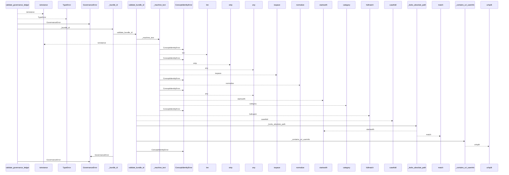
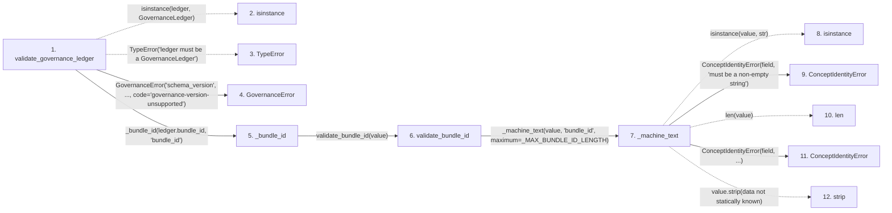

# validate_governance_ledger

**Entry point:** `validate_governance_ledger` (`api`)
**Source:** [knowledge_governance](../modules/knowledge_governance.md)
**Modules touched:** [concept_identity](../modules/concept_identity.md), [knowledge_evidence](../modules/knowledge_evidence.md), [knowledge_governance](../modules/knowledge_governance.md), [validation](../modules/validation.md), and 2 more

**Complete modules touched:**

- [concept_identity](../modules/concept_identity.md)
- [knowledge_evidence](../modules/knowledge_evidence.md)
- [knowledge_governance](../modules/knowledge_governance.md)
- [validation](../modules/validation.md)
- [wiki_media](../modules/wiki_media.md)
- [wiki_surface](../modules/wiki_surface.md)

## Call sequence

<!-- Auto-generated from static call edges. Dashed arrows are external or unresolved calls. Reviewed runtime conditions and side effects belong in Behavior. -->

> Call sequence diagram shows 30 of 351 interactions; 321 omitted to keep the visualization within the 30-interaction and generated-diagram limits.

> Trace truncated at the depth limit; deeper calls are omitted.

## Data flow

<!-- Auto-generated static analysis. Treat values and boundaries as best-effort hints, not runtime proof. -->

### Step data

| Step | Inputs | Reads | Writes | Returns |
|---|---|---|---|---|
| `validate_governance_ledger` | `ledger: GovernanceLedger`, `expected_bundle_id: str \| None` | `GovernanceLedger`, `GOVERNANCE_SCHEMA_VERSION`, `GOVERNANCE_SCHEMA_VERSION`, `GovernanceAllocation`, `ConceptIdentityError`, `ALIAS_NATURAL_KEY`, `ALIAS_LOCATOR`, `ALIAS_NATURAL_KEY` | `current_keys[...]`, `alias_counts[...]`, `alias_owners[...]` | `GovernanceLedger(...)` |
| `isinstance` | - | - | - | - |
| `TypeError` | - | - | - | - |
| `GovernanceError` | - | - | - | - |
| `_bundle_id` | `value: object`, `path: str` | `ConceptIdentityError` | - | `validate_bundle_id(...)` |
| `validate_bundle_id` | `value: object` | `_MAX_BUNDLE_ID_LENGTH` | - | `text` |
| `_machine_text` | `value: object`, `field: str`, `maximum: int` | - | - | `value` |
| `isinstance` | - | - | - | - |
| `ConceptIdentityError` | - | - | - | - |
| `len` | - | - | - | - |
| `ConceptIdentityError` | - | - | - | - |
| `strip` | - | - | - | - |

### Call data

| From | To | Line | Call |
|---|---|---:|---|
| validate_governance_ledger | isinstance | 523 | `isinstance(ledger, GovernanceLedger)` |
| validate_governance_ledger | TypeError | 524 | `TypeError('ledger must be a GovernanceLedger')` |
| validate_governance_ledger | GovernanceError | 526 | `GovernanceError('schema_version', ..., code='governance-version-unsupported')` |
| validate_governance_ledger | _bundle_id | 531 | `_bundle_id(ledger.bundle_id, 'bundle_id')` |
| _bundle_id | validate_bundle_id | 3357 | `validate_bundle_id(value)` |
| validate_bundle_id | _machine_text | 288 | `_machine_text(value, 'bundle_id', maximum=_MAX_BUNDLE_ID_LENGTH)` |
| _machine_text | isinstance | 912 | `isinstance(value, str)` |
| _machine_text | ConceptIdentityError | 913 | `ConceptIdentityError(field, 'must be a non-empty string')` |
| _machine_text | len | 914 | `len(value)` |
| _machine_text | ConceptIdentityError | 915 | `ConceptIdentityError(field, ...)` |
| _machine_text | strip | 916 | `value.strip(data not statically known)` |

### Boundary effects

*No boundary effects detected.*

### Static analysis gaps

| Kind | Step | Target | Line |
|---|---|---|---:|
| unresolved_call | `validate_governance_ledger` | `isinstance` | 523 |
| unresolved_call | `validate_governance_ledger` | `TypeError` | 524 |
| unresolved_call | `_machine_text` | `isinstance` | 912 |
| unresolved_call | `_machine_text` | `value.strip` | 916 |
| step_limit | `validate_governance_ledger` | `first 12 steps` | 0 |
| truncated_flow | `validate_governance_ledger` | `depth limit` | 0 |

## Behavior

This flow starts at `validate_governance_ledger` and is classified as `api`. The generated call and data-flow sections are bounded static projections; runtime conditions and side effects require source-level confirmation.
