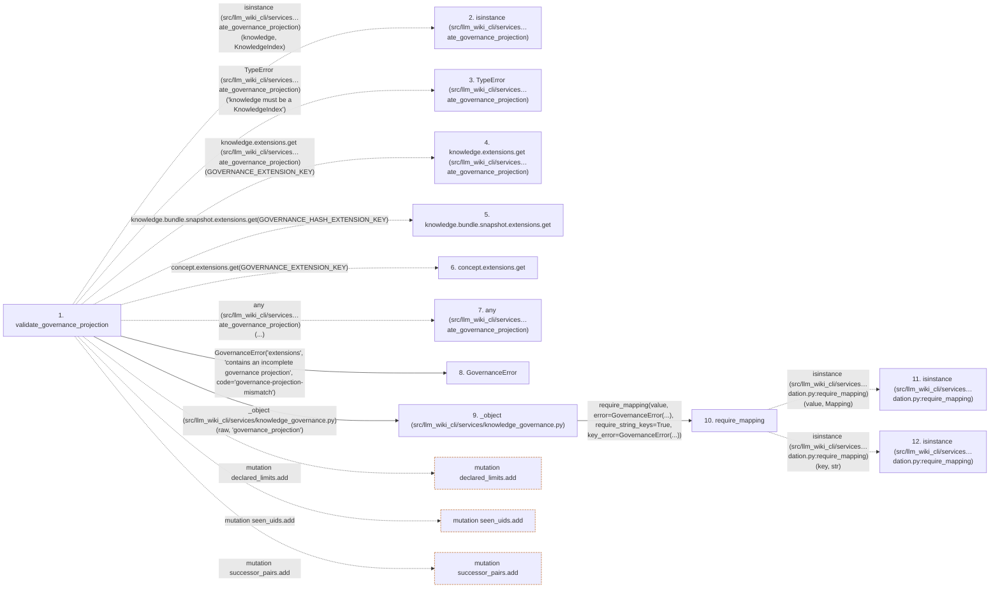

# validate_governance_projection

**Entry point:** `validate_governance_projection` (`api`)
**Source:** [knowledge_governance](../modules/knowledge_governance.md)
**Modules touched:** [concept_identity](../modules/concept_identity.md), [knowledge_evidence](../modules/knowledge_evidence.md), [knowledge_governance](../modules/knowledge_governance.md), and 5 more

**Complete modules touched:**

- [concept_identity](../modules/concept_identity.md)
- [knowledge_evidence](../modules/knowledge_evidence.md)
- [knowledge_governance](../modules/knowledge_governance.md)
- [knowledge_graph](../modules/knowledge_graph.md)
- [knowledge_model](../modules/knowledge_model.md)
- [validation](../modules/validation.md)
- [wiki_media](../modules/wiki_media.md)
- [wiki_surface](../modules/wiki_surface.md)

## Call sequence

```mermaid
sequenceDiagram
    participant p0 as validate_governance_projection
    participant p1 as isinstance (src/llm_wiki_cli/services…ate_governance_projection)
    participant p2 as TypeError (src/llm_wiki_cli/services…ate_governance_projection)
    participant p3 as knowledge.extensions.get (src/llm_wiki_cli/services…ate_governance_projection)
    participant p4 as knowledge.bundle.snapshot.extensions.get
    participant p5 as concept.extensions.get
    participant p6 as any (src/llm_wiki_cli/services…ate_governance_projection)
    participant p7 as GovernanceError
    participant p8 as _object (src/llm_wiki_cli/services/knowledge_governance.py)
    participant p9 as require_mapping
    participant p10 as isinstance (src/llm_wiki_cli/services…dation.py:require_mapping)
    participant p11 as key.encode
    participant p12 as dict (src/llm_wiki_cli/services…dge_governance.py:_object)
    participant p13 as _exact_fields
    participant p14 as require_exact_fields
    participant p15 as isinstance (src/llm_wiki_cli/services…n.py:require_exact_fields)
    participant p16 as str (src/llm_wiki_cli/services…n.py:require_exact_fields)
    participant p17 as set (src/llm_wiki_cli/services…n.py:require_exact_fields)
    participant p18 as tuple (src/llm_wiki_cli/services…n.py:require_exact_fields)
    participant p19 as sorted (src/llm_wiki_cli/services…n.py:require_exact_fields)
    participant p20 as invalid_error
    participant p21 as error_factory
    p0-->>p1: isinstance (src/llm_wiki_cli/services…ate_governance_projection)
    p0-->>p2: TypeError (src/llm_wiki_cli/services…ate_governance_projection)
    p0-->>p3: knowledge.extensions.get (src/llm_wiki_cli/services…ate_governance_projection)
    p0-->>p4: knowledge.bundle.snapshot.extensions.get
    p0-->>p5: concept.extensions.get
    p0-->>p6: any (src/llm_wiki_cli/services…ate_governance_projection)
    p0->>p7: GovernanceError
    p0->>p8: _object (src/llm_wiki_cli/services/knowledge_governance.py)
    p8->>p9: require_mapping
    p9-->>p10: isinstance (src/llm_wiki_cli/services…dation.py:require_mapping)
    p9-->>p10: isinstance (src/llm_wiki_cli/services…dation.py:require_mapping)
    p9-->>p11: key.encode
    p8->>p7: GovernanceError
    p8->>p7: GovernanceError
    p8-->>p12: dict (src/llm_wiki_cli/services…dge_governance.py:_object)
    p0->>p13: _exact_fields
    p13->>p14: require_exact_fields
    p14-->>p15: isinstance (src/llm_wiki_cli/services…n.py:require_exact_fields)
    p14-->>p16: str (src/llm_wiki_cli/services…n.py:require_exact_fields)
    p14-->>p17: set (src/llm_wiki_cli/services…n.py:require_exact_fields)
    p14-->>p17: set (src/llm_wiki_cli/services…n.py:require_exact_fields)
    p14-->>p17: set (src/llm_wiki_cli/services…n.py:require_exact_fields)
    p14-->>p18: tuple (src/llm_wiki_cli/services…n.py:require_exact_fields)
    p14-->>p19: sorted (src/llm_wiki_cli/services…n.py:require_exact_fields)
    p14-->>p18: tuple (src/llm_wiki_cli/services…n.py:require_exact_fields)
    p14-->>p19: sorted (src/llm_wiki_cli/services…n.py:require_exact_fields)
    p14-->>p20: invalid_error
    p14-->>p21: error_factory
    p13->>p7: GovernanceError
    p13->>p7: GovernanceError
```

<!-- Auto-generated from static call edges. Dashed arrows are external or unresolved calls. Reviewed runtime conditions and side effects belong in Behavior. -->

> Call sequence diagram shows 30 of 1356 interactions; 1326 omitted to keep the visualization within the 30-interaction and generated-diagram limits.

> Trace truncated at the depth limit; deeper calls are omitted.

## Data flow

<!-- Auto-generated static analysis. Treat values and boundaries as best-effort hints, not runtime proof. -->

### Step data

| Step | Inputs | Reads | Writes | Returns |
|---|---|---|---|---|
| `validate_governance_projection` | `knowledge: KnowledgeIndex`, `ledger: GovernanceLedger \| None`, `event_limit: int \| None` | `KnowledgeIndex`, `GOVERNANCE_EXTENSION_KEY`, `GOVERNANCE_HASH_EXTENSION_KEY`, `GOVERNANCE_EXTENSION_KEY`, `GOVERNANCE_SCHEMA_VERSION`, `GOVERNANCE_SCHEMA_VERSION`, `GOVERNANCE_HASH_EXTENSION_KEY`, `GOVERNANCE_EXTENSION_KEY` | - | `None`, `projection` |
| `isinstance (src/llm_wiki_cli/services…ate_governance_projection)` | - | - | - | - |
| `TypeError (src/llm_wiki_cli/services…ate_governance_projection)` | - | - | - | - |
| `knowledge.extensions.get (src/llm_wiki_cli/services…ate_governance_projection)` | - | - | - | - |
| `knowledge.bundle.snapshot.extensions.get` | - | - | - | - |
| `concept.extensions.get` | - | - | - | - |
| `any (src/llm_wiki_cli/services…ate_governance_projection)` | - | - | - | - |
| `GovernanceError` | - | - | - | - |
| `_object (src/llm_wiki_cli/services/knowledge_governance.py)` | `value: object`, `path: str` | - | - | `dict(...)` |
| `require_mapping` | `value: object`, `error: Exception`, `require_string_keys: bool`, `key_error: Exception \| None`, `require_utf8_keys: bool`, `utf8_key_error: Exception \| None` | `Mapping` | - | `value` |
| `isinstance (src/llm_wiki_cli/services…dation.py:require_mapping)` | - | - | - | - |
| `isinstance (src/llm_wiki_cli/services…dation.py:require_mapping)` | - | - | - | - |

### Call data

| From | To | Line | Call |
|---|---|---:|---|
| validate_governance_projection | isinstance (src/llm_wiki_cli/services…ate_governance_projection) | 1815 | `isinstance(knowledge, KnowledgeIndex)` |
| validate_governance_projection | TypeError (src/llm_wiki_cli/services…ate_governance_projection) | 1816 | `TypeError('knowledge must be a KnowledgeIndex')` |
| validate_governance_projection | knowledge.extensions.get (src/llm_wiki_cli/services…ate_governance_projection) | 1817 | `knowledge.extensions.get(GOVERNANCE_EXTENSION_KEY)` |
| validate_governance_projection | knowledge.bundle.snapshot.extensions.get | 1818 | `knowledge.bundle.snapshot.extensions.get(GOVERNANCE_HASH_EXTENSION_KEY)` |
| validate_governance_projection | concept.extensions.get | 1822 | `concept.extensions.get(GOVERNANCE_EXTENSION_KEY)` |
| validate_governance_projection | any (src/llm_wiki_cli/services…ate_governance_projection) | 1826 | `any(...)` |
| validate_governance_projection | GovernanceError | 1829 | `GovernanceError('extensions', 'contains an incomplete governance projection', code='governance-projection-mismatch')` |
| validate_governance_projection | _object (src/llm_wiki_cli/services/knowledge_governance.py) | 1835 | `_object(raw, 'governance_projection')` |
| _object (src/llm_wiki_cli/services/knowledge_governance.py) | require_mapping | 3136 | `require_mapping(value, error=GovernanceError(...), require_string_keys=True, key_error=GovernanceError(...))` |
| require_mapping | isinstance (src/llm_wiki_cli/services…dation.py:require_mapping) | 727 | `isinstance(value, Mapping)` |
| require_mapping | isinstance (src/llm_wiki_cli/services…dation.py:require_mapping) | 731 | `isinstance(key, str)` |

### Boundary effects

| Kind | Target | Step | Line |
|---|---|---|---:|
| mutation | `declared_limits.add` | `validate_governance_projection` | 1920 |
| mutation | `seen_uids.add` | `validate_governance_projection` | 1927 |
| mutation | `successor_pairs.add` | `validate_governance_projection` | 1942 |

### Static analysis gaps

| Kind | Step | Target | Line |
|---|---|---|---:|
| external_call | `validate_governance_projection` | `isinstance` | 1815 |
| external_call | `validate_governance_projection` | `TypeError` | 1816 |
| unresolved_call | `validate_governance_projection` | `knowledge.extensions.get` | 1817 |
| unresolved_call | `validate_governance_projection` | `knowledge.bundle.snapshot.extensions.get` | 1818 |
| unresolved_call | `validate_governance_projection` | `concept.extensions.get` | 1822 |
| external_call | `validate_governance_projection` | `any` | 1826 |
| external_call | `require_mapping` | `isinstance` | 727 |
| external_call | `require_mapping` | `isinstance` | 731 |
| step_limit | `validate_governance_projection` | `first 12 steps` | 0 |
| truncated_flow | `validate_governance_projection` | `depth limit` | 0 |

## Behavior

This flow starts at `validate_governance_projection` and is classified as `api`. The generated call and data-flow sections are bounded static projections; runtime conditions and side effects require source-level confirmation.
