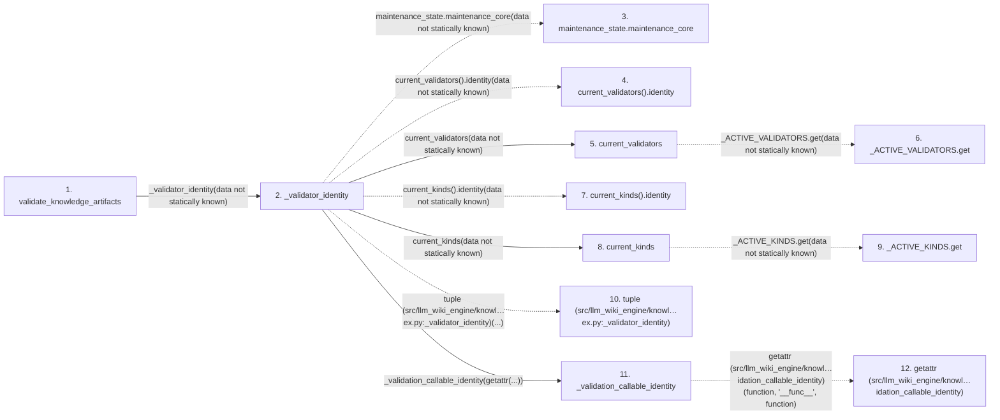

# validate_knowledge_artifacts

**Entry point:** `validate_knowledge_artifacts` (`api`)
**Source:** [knowledge_artifacts](../modules/knowledge_artifacts.md)
**Modules touched:** [canonical_json](../modules/canonical_json.md), [concept_identity](../modules/concept_identity.md), [filesystem_guard](../modules/filesystem_guard.md), [immutable](../modules/immutable.md), and 29 more

**Complete modules touched:**

- [canonical_json](../modules/canonical_json.md)
- [concept_identity](../modules/concept_identity.md)
- [filesystem_guard](../modules/filesystem_guard.md)
- [immutable](../modules/immutable.md)
- [infrastructure_state](../modules/infrastructure_state.md)
- [integrations](../modules/integrations.md)
- [knowledge_artifacts](../modules/knowledge_artifacts.md)
- [knowledge_envelope](../modules/knowledge_envelope.md)
- [knowledge_evidence](../modules/knowledge_evidence.md)
- [knowledge_governance](../modules/knowledge_governance.md)
- [knowledge_graph](../modules/knowledge_graph.md)
- [knowledge_index](../modules/knowledge_index.md)
- [knowledge_kinds](../modules/knowledge_kinds.md)
- [knowledge_links](../modules/knowledge_links.md)
- [knowledge_model](../modules/knowledge_model.md)
- [knowledge_packs](../modules/knowledge_packs.md)
- [knowledge_reuse_format](../modules/knowledge_reuse_format.md)
- [knowledge_storage](../modules/knowledge_storage.md)
- [knowledge_storage_io](../modules/knowledge_storage_io.md)
- [knowledge_validators](../modules/knowledge_validators.md)
- [maintenance_evidence](../modules/maintenance_evidence.md)
- [maintenance_projection](../modules/maintenance_projection.md)
- [maintenance_shapes](../modules/maintenance_shapes.md)
- [maintenance_state](../modules/maintenance_state.md)
- [manifest_storage](../modules/manifest_storage.md)
- [markdown_sections](../modules/markdown_sections.md)
- [progress](../modules/progress.md)
- [section_ownership](../modules/section_ownership.md)
- [source_retirement](../modules/source_retirement.md)
- [sync_manifest](../modules/sync_manifest.md)
- [validation](../modules/validation.md)
- [wiki_media](../modules/wiki_media.md)
- [wiki_surface](../modules/wiki_surface.md)

## Call sequence

> Static overview in presentation order, not runtime execution order. Arrows retain captured callers; representative internal continuations and boundary examples precede repeated helper detail.

<!-- Auto-generated from static call edges. Dashed arrows are external or unresolved calls. Reviewed runtime conditions and side effects belong in Behavior. -->

```mermaid
sequenceDiagram
    participant p0 as validate_knowledge_artifacts
    participant p1 as _validator_identity
    participant p2 as _storage_validator_identity
    participant p3 as validate_surface_index_bytes
    participant p4 as _require_validation_receipt
    participant p5 as freeze
    participant p6 as StorageReadSession.read
    participant p7 as SyncManifest.from_payload
    participant p8 as StorageReadSession.recheck
    participant p9 as open_knowledge_store
    participant p10 as _validated_index_data
    participant p11 as _validate_artifact_parity
    participant p12 as KnowledgeArtifactError
    participant p13 as _model_to_payload
    participant p14 as _decode_json_object
    participant p15 as StorageReadSession
    participant p16 as KnowledgeStorageError
    participant p17 as physical_objects
    participant p18 as _is_future_schema_version
    participant p19 as logical_digest
    participant p20 as validate_knowledge_index
    participant p21 as _require_relative_name
    participant p22 as _mapping_value
    participant p23 as StorageReadSession.phase
    participant p24 as _validation_module_identity
    participant p25 as _validate_surface_payload
    participant p26 as _surface_page_index
    participant p27 as StorageReadSession.read_ranges
    participant p28 as _validate_typed_graph_concept_bindings
    participant p29 as Path
    participant p30 as Path(…).resolve
    p0->>p1: _validator_identity
    p0->>p2: _storage_validator_identity
    p0->>p3: validate_surface_index_bytes
    p0->>p4: _require_validation_receipt
    p0->>p5: freeze
    p0->>p6: StorageReadSession.read
    p0->>p7: SyncManifest.from_payload
    p0->>p8: StorageReadSession.recheck
    p0->>p9: open_knowledge_store
    p0->>p10: _validated_index_data
    p0->>p11: _validate_artifact_parity
    p0->>p12: KnowledgeArtifactError
    p0->>p13: _model_to_payload
    p0->>p14: _decode_json_object
    p0->>p15: StorageReadSession
    p0->>p16: KnowledgeStorageError
    p0->>p17: physical_objects
    p0->>p18: _is_future_schema_version
    p0->>p19: logical_digest
    p0->>p20: validate_knowledge_index
    p6->>p21: _require_relative_name
    p7->>p22: _mapping_value
    p8->>p23: StorageReadSession.phase
    p2->>p24: _validation_module_identity
    p3->>p25: _validate_surface_payload
    p3->>p26: _surface_page_index
    p8->>p27: StorageReadSession.read_ranges
    p11->>p28: _validate_typed_graph_concept_bindings
    p0-->>p29: Path(wiki_dir)
    p0-->>p30: Path(…).resolve
```

> Call sequence diagram shows 30 of 2468 interactions; 2438 omitted to keep the visualization within the 30-interaction and generated-diagram limits, with uncertain identities omitted rather than inferred.

> Captured boundary calls: external 1 of 704 (703 omitted); unresolved 1 of 429 (428 omitted). These counts cover the captured static trace.

Omitted captured detail, grouped by actual caller occurrence and target module:

| Caller | Parent step | Target module | Kind | Omitted interactions |
| --- | --- | --- | --- | --- |
| `src/llm_wiki_engine/knowledge_index.py:_validator_identity` | 2 | - | unresolved | 4 |
| `src/llm_wiki_engine/knowledge_index.py:_validator_identity` | 2 | [src/llm_wiki_engine/knowledge_validators.py](../modules/knowledge_validators.md) | internal | 1 |
| `src/llm_wiki_engine/knowledge_validators.py:current_validators` | 5 | - | unresolved | 1 |
| `src/llm_wiki_engine/knowledge_index.py:_validator_identity` | 2 | [src/llm_wiki_engine/knowledge_kinds.py](../modules/knowledge_kinds.md) | internal | 1 |
| `src/llm_wiki_engine/knowledge_kinds.py:current_kinds` | 8 | - | unresolved | 1 |
| `src/llm_wiki_engine/knowledge_index.py:_validator_identity` | 2 | - | external | 5 |
| `src/llm_wiki_engine/knowledge_index.py:_validator_identity` | 2 | [src/llm_wiki_engine/knowledge_index.py](../modules/knowledge_index.md) | internal | 2 |
| `src/llm_wiki_engine/knowledge_index.py:_validation_callable_identity` | 11 | - | external | 10 |
> Omission summary shows 8 of 578 groups; 570 further groups are not expanded here. Counts above include all omitted interactions.
> Detailed flow queries retain their own coverage and limits; omitted paths may execute at runtime.

> Trace truncated at the depth limit; deeper calls are omitted.

## Data flow

<!-- Auto-generated static analysis. Treat values and boundaries as best-effort hints, not runtime proof. -->

### Analysis coverage

**Effect analysis partially available.** Flow assembly and source effect analysis are separate; empty observations do not prove an empty handler body.

Source steps: 1336; effect analysis evaluated: 755, partial: 41, unavailable: 540. Counts include steps omitted from the displayed trace.

Collector observations for 796 source steps with known totals: observed: 4038, emitted: 3853, omitted: 185. Unavailable totals are excluded.

- Callable record unavailable for one or more source steps; those steps have no represented callable body.
- Effect collector omitted observations before flow assembly; displayed effects are partial.
- Effect collector totals unavailable; observed counts cover captured records only.

| Step | Callable record | Effect analysis | Collector totals | Observed | Emitted | Omitted |
|---|---|---|---|---:|---:|---:|
| `validate_knowledge_artifacts` | `available` | `partial` | `available` | `26` | `17` | `9` |
| `_validator_identity` | `available` | `evaluated` | `available` | `2` | `2` | `0` |
| `maintenance_state.maintenance_core` | `not_applicable` | `not_applicable` | `not_applicable` | — | — | — |
| `current_validators().identity` | `not_applicable` | `not_applicable` | `not_applicable` | — | — | — |
| `current_validators` | `available` | `evaluated` | `available` | `2` | `2` | `0` |
| `_ACTIVE_VALIDATORS.get` | `not_applicable` | `not_applicable` | `not_applicable` | — | — | — |
| `current_kinds().identity` | `not_applicable` | `not_applicable` | `not_applicable` | — | — | — |
| `current_kinds` | `available` | `evaluated` | `available` | `2` | `2` | `0` |
| `_ACTIVE_KINDS.get` | `not_applicable` | `not_applicable` | `not_applicable` | — | — | — |
| `tuple (src/llm_wiki_engine/knowl…ex.py:_validator_identity)` | `not_applicable` | `not_applicable` | `not_applicable` | — | — | — |
| `_validation_callable_identity` | `available` | `evaluated` | `available` | `6` | `6` | `0` |
| `getattr (src/llm_wiki_engine/knowl…idation_callable_identity)` | `not_applicable` | `not_applicable` | `not_applicable` | — | — | — |

```mermaid
flowchart LR
    s1["1. validate_knowledge_artifacts"]
    s2["2. _validator_identity"]
    s3["3. maintenance_state.maintenance_core"]
    s4["4. current_validators().identity"]
    s5["5. current_validators"]
    s6["6. _ACTIVE_VALIDATORS.get"]
    s7["7. current_kinds().identity"]
    s8["8. current_kinds"]
    s9["9. _ACTIVE_KINDS.get"]
    s10["10. tuple (src/llm_wiki_engine/knowl…ex.py:_validator_identity)"]
    s11["11. _validation_callable_identity"]
    s12["12. getattr (src/llm_wiki_engine/knowl…idation_callable_identity)"]
    s1 -->|"_validator_identity(data not statically known)"| s2
    s2 -. "maintenance_state.maintenance_core(data not statically known)" .-> s3
    s2 -. "current_validators().identity(data not statically known)" .-> s4
    s2 -->|"current_validators(data not statically known)"| s5
    s5 -. "_ACTIVE_VALIDATORS.get(data not statically known)" .-> s6
    s2 -. "current_kinds().identity(data not statically known)" .-> s7
    s2 -->|"current_kinds(data not statically known)"| s8
    s8 -. "_ACTIVE_KINDS.get(data not statically known)" .-> s9
    s2 -. "tuple (src/llm_wiki_engine/knowl…ex.py:_validator_identity)(...)" .-> s10
    s2 -->|"_validation_callable_identity(getattr(...))"| s11
    s11 -. "getattr (src/llm_wiki_engine/knowl…idation_callable_identity)(function, '__func__', function)" .-> s12
    click s1 "../modules/knowledge_artifacts.md"
    click s2 "../modules/knowledge_index.md"
    click s5 "../modules/knowledge_validators.md"
    click s8 "../modules/knowledge_kinds.md"
    click s11 "../modules/knowledge_index.md"
```

### Step data

| Step | Inputs | Reads | Writes | Returns |
|---|---|---|---|---|
| `validate_knowledge_artifacts` | `surface_index_bytes: bytes`, `knowledge_index_bytes: bytes`, `manifest: SyncManifest`, `object_reader: Callable[[str, int], bytes] \| None`, `wiki_dir: str \| Path \| None`, `_validation_receipt: object \| None`, `_receipt_wiki_root: Path \| None`, `_storage_validation_receipt: object \| None` | `STORE_SCHEMA`, `PACKED_SCHEMAS`, `STORE_SCHEMA`, `PACKED_SCHEMAS`, `KNOWLEDGE_INDEX_FILENAME`, `SURFACE_INDEX_FILENAME`, `MANIFEST_FILENAME`, `MAX_EXPANDED_BYTES` | - | `_validate_artifact_parity(...)` |
| `_validator_identity` | - | `KNOWLEDGE_SCHEMA_VERSION` | - | `(...)` |
| `maintenance_state.maintenance_core` | - | - | - | - |
| `current_validators().identity` | - | - | - | - |
| `current_validators` | - | `DEFAULT_VALIDATORS` | - | `...` |
| `_ACTIVE_VALIDATORS.get` | - | - | - | - |
| `current_kinds().identity` | - | - | - | - |
| `current_kinds` | - | `DEFAULT_KINDS` | - | `...` |
| `_ACTIVE_KINDS.get` | - | - | - | - |
| `tuple (src/llm_wiki_engine/knowl…ex.py:_validator_identity)` | - | - | - | - |
| `_validation_callable_identity` | `function`, `active` | `partial` | - | `(...)`, `(...)`, `(...)` |
| `getattr (src/llm_wiki_engine/knowl…idation_callable_identity)` | - | - | - | - |

### Call data

| From | To | Line | Call |
|---|---|---:|---|
| validate_knowledge_artifacts | _validator_identity | 320 | `_validator_identity(data not statically known)` |
| _validator_identity | maintenance_state.maintenance_core | 374 | `maintenance_state.maintenance_core(data not statically known)` |
| _validator_identity | current_validators().identity | 377 | `current_validators().identity(data not statically known)` |
| _validator_identity | current_validators | 377 | `current_validators(data not statically known)` |
| current_validators | _ACTIVE_VALIDATORS.get | 199 | `_ACTIVE_VALIDATORS.get(data not statically known)` |
| _validator_identity | current_kinds().identity | 378 | `current_kinds().identity(data not statically known)` |
| _validator_identity | current_kinds | 378 | `current_kinds(data not statically known)` |
| current_kinds | _ACTIVE_KINDS.get | 266 | `_ACTIVE_KINDS.get(data not statically known)` |
| _validator_identity | tuple (src/llm_wiki_engine/knowl…ex.py:_validator_identity) | 379 | `tuple(...)` |
| _validator_identity | _validation_callable_identity | 379 | `_validation_callable_identity(getattr(...))` |
| _validation_callable_identity | getattr (src/llm_wiki_engine/knowl…idation_callable_identity) | 386 | `getattr(function, '__func__', function)` |

### Boundary effects

*No boundary-effect observations were captured in this static trace.*

### Static analysis gaps

| Kind | Step | Target | Line |
|---|---|---|---:|
| unresolved_call | `_validator_identity` | `maintenance_state.maintenance_core` | 374 |
| unresolved_call | `_validator_identity` | `current_validators().identity` | 377 |
| unresolved_call | `current_validators` | `_ACTIVE_VALIDATORS.get` | 199 |
| unresolved_call | `_validator_identity` | `current_kinds().identity` | 378 |
| unresolved_call | `current_kinds` | `_ACTIVE_KINDS.get` | 266 |
| external_call | `_validation_callable_identity` | `getattr` | 386 |
| step_limit | `validate_knowledge_artifacts` | `first 12 steps` | 0 |
| truncated_flow | `validate_knowledge_artifacts` | `depth limit` | 0 |

## Behavior

This flow starts at `validate_knowledge_artifacts` and is classified as `api`. The generated call and data-flow sections are bounded static projections; runtime conditions and side effects require source-level confirmation.
