# validate_knowledge_index

**Entry point:** `validate_knowledge_index` (`api`)
**Source:** [knowledge_index](../modules/knowledge_index.md)
**Modules touched:** [concept_identity](../modules/concept_identity.md), [knowledge_envelope](../modules/knowledge_envelope.md), [knowledge_evidence](../modules/knowledge_evidence.md), and 12 more

**Complete modules touched:**

- [concept_identity](../modules/concept_identity.md)
- [knowledge_envelope](../modules/knowledge_envelope.md)
- [knowledge_evidence](../modules/knowledge_evidence.md)
- [knowledge_governance](../modules/knowledge_governance.md)
- [knowledge_graph](../modules/knowledge_graph.md)
- [knowledge_index](../modules/knowledge_index.md)
- [knowledge_links](../modules/knowledge_links.md)
- [knowledge_model](../modules/knowledge_model.md)
- [knowledge_reuse](../modules/knowledge_reuse.md)
- [markdown_sections](../modules/markdown_sections.md)
- [progress](../modules/progress.md)
- [section_ownership](../modules/section_ownership.md)
- [validation](../modules/validation.md)
- [wiki_media](../modules/wiki_media.md)
- [wiki_surface](../modules/wiki_surface.md)

## Call sequence

```mermaid
sequenceDiagram
    participant p0 as validate_knowledge_index
    participant p1 as isinstance (src/llm_wiki_cli/services…:validate_knowledge_index)
    participant p2 as parse_knowledge_index
    participant p3 as _record
    participant p4 as _object (src/llm_wiki_cli/services/knowledge_model.py)
    participant p5 as dict (src/llm_wiki_cli/services…nowledge_model.py:_object)
    participant p6 as require_mapping
    participant p7 as isinstance (src/llm_wiki_cli/services…dation.py:require_mapping)
    participant p8 as key.encode
    participant p9 as KnowledgeModelError
    participant p10 as sorted (src/llm_wiki_cli/services…nowledge_model.py:_record)
    participant p11 as set (src/llm_wiki_cli/services…nowledge_model.py:_record)
    participant p12 as _child
    participant p13 as _parse_extensions
    participant p14 as sorted (src/llm_wiki_cli/services…odel.py:_parse_extensions)
    participant p15 as _QUALIFIED_NAME_RE.fullmatch (src/llm_wiki_cli/services…odel.py:_parse_extensions)
    participant p16 as _normalize_json_value
    participant p17 as _normalize_json_value_inner
    participant p18 as isinstance (src/llm_wiki_cli/services…ormalize_json_value_inner)
    participant p19 as _string
    p0-->>p1: isinstance (src/llm_wiki_cli/services…:validate_knowledge_index)
    p0->>p2: parse_knowledge_index
    p2->>p3: _record
    p3->>p4: _object (src/llm_wiki_cli/services/knowledge_model.py)
    p4-->>p5: dict (src/llm_wiki_cli/services…nowledge_model.py:_object)
    p4->>p6: require_mapping
    p6-->>p7: isinstance (src/llm_wiki_cli/services…dation.py:require_mapping)
    p6-->>p7: isinstance (src/llm_wiki_cli/services…dation.py:require_mapping)
    p6-->>p8: key.encode
    p4->>p9: KnowledgeModelError
    p4->>p9: KnowledgeModelError
    p4->>p9: KnowledgeModelError
    p3-->>p10: sorted (src/llm_wiki_cli/services…nowledge_model.py:_record)
    p3-->>p11: set (src/llm_wiki_cli/services…nowledge_model.py:_record)
    p3->>p9: KnowledgeModelError
    p3->>p12: _child
    p3-->>p10: sorted (src/llm_wiki_cli/services…nowledge_model.py:_record)
    p3-->>p11: set (src/llm_wiki_cli/services…nowledge_model.py:_record)
    p3->>p9: KnowledgeModelError
    p3->>p12: _child
    p3->>p13: _parse_extensions
    p13->>p4: _object (src/llm_wiki_cli/services/knowledge_model.py)
    p13-->>p14: sorted (src/llm_wiki_cli/services…odel.py:_parse_extensions)
    p13-->>p15: _QUALIFIED_NAME_RE.fullmatch (src/llm_wiki_cli/services…odel.py:_parse_extensions)
    p13->>p9: KnowledgeModelError
    p13->>p12: _child
    p13->>p16: _normalize_json_value
    p16->>p17: _normalize_json_value_inner
    p17-->>p18: isinstance (src/llm_wiki_cli/services…ormalize_json_value_inner)
    p17->>p19: _string
```

<!-- Auto-generated from static call edges. Dashed arrows are external or unresolved calls. Reviewed runtime conditions and side effects belong in Behavior. -->

> Call sequence diagram shows 30 of 2042 interactions; 2012 omitted to keep the visualization within the 30-interaction and generated-diagram limits.

> Trace truncated at the depth limit; deeper calls are omitted.

## Data flow

```mermaid
flowchart LR
    s1["1. validate_knowledge_index"]
    s2["2. isinstance (src/llm_wiki_cli/services…:validate_knowledge_index)"]
    s3["3. parse_knowledge_index"]
    s4["4. _record"]
    s5["5. _object (src/llm_wiki_cli/services/knowledge_model.py)"]
    s6["6. dict (src/llm_wiki_cli/services…nowledge_model.py:_object)"]
    s7["7. require_mapping"]
    s8["8. isinstance (src/llm_wiki_cli/services…dation.py:require_mapping)"]
    s9["9. isinstance (src/llm_wiki_cli/services…dation.py:require_mapping)"]
    s10["10. key.encode"]
    s11["11. KnowledgeModelError"]
    s12["12. KnowledgeModelError"]
    s1 -. "isinstance (src/llm_wiki_cli/services…:validate_knowledge_index)(value, KnowledgeIndex)" .-> s2
    s1 -->|"parse_knowledge_index(_model_to_payload(...))"| s3
    s3 -->|"_record(payload, '', {...}, required={...})"| s4
    s4 -->|"_object (src/llm_wiki_cli/services/knowledge_model.py)(value, ...)"| s5
    s5 -. "dict (src/llm_wiki_cli/services…nowledge_model.py:_object)(require_mapping(...))" .-> s6
    s5 -->|"require_mapping(…)"| s7
    s7 -. "isinstance (src/llm_wiki_cli/services…dation.py:require_mapping)(value, Mapping)" .-> s8
    s7 -. "isinstance (src/llm_wiki_cli/services…dation.py:require_mapping)(key, str)" .-> s9
    s7 -. "key.encode('utf-8')" .-> s10
    s5 -->|"KnowledgeModelError(path, 'must be an object')"| s11
    s5 -->|"KnowledgeModelError(path, 'object keys must be strings')"| s12
    click s1 "../modules/knowledge_index.md"
    click s3 "../modules/knowledge_model.md"
    click s4 "../modules/knowledge_model.md"
    click s5 "../modules/knowledge_model.md"
    click s7 "../modules/validation.md"
    click s11 "../modules/knowledge_model.md"
    click s12 "../modules/knowledge_model.md"
```

<!-- Auto-generated static analysis. Treat values and boundaries as best-effort hints, not runtime proof. -->

### Step data

| Step | Inputs | Reads | Writes | Returns |
|---|---|---|---|---|
| `validate_knowledge_index` | `value: KnowledgeIndex \| object`, `inputs: KnowledgeIndexInputs \| None` | `KnowledgeIndex` | - | `model` |
| `isinstance (src/llm_wiki_cli/services…:validate_knowledge_index)` | - | - | - | - |
| `parse_knowledge_index` | `payload: object` | `KNOWLEDGE_SCHEMA_VERSION`, `KNOWLEDGE_SCHEMA_VERSION` | - | `model` |
| `_record` | `value: object`, `path: str`, `fields: AbstractSet[str]`, `required: AbstractSet[str]` | - | - | `(...)` |
| `_object (src/llm_wiki_cli/services/knowledge_model.py)` | `value: object`, `path: str` | - | - | `dict(...)` |
| `dict (src/llm_wiki_cli/services…nowledge_model.py:_object)` | - | - | - | - |
| `require_mapping` | `value: object`, `error: Exception`, `require_string_keys: bool`, `key_error: Exception \| None`, `require_utf8_keys: bool`, `utf8_key_error: Exception \| None` | `Mapping` | - | `value` |
| `isinstance (src/llm_wiki_cli/services…dation.py:require_mapping)` | - | - | - | - |
| `isinstance (src/llm_wiki_cli/services…dation.py:require_mapping)` | - | - | - | - |
| `key.encode` | - | - | - | - |
| `KnowledgeModelError` | - | - | - | - |
| `KnowledgeModelError` | - | - | - | - |

### Call data

| From | To | Line | Call |
|---|---|---:|---|
| validate_knowledge_index | isinstance (src/llm_wiki_cli/services…:validate_knowledge_index) | 254 | `isinstance(value, KnowledgeIndex)` |
| validate_knowledge_index | parse_knowledge_index | 256 | `parse_knowledge_index(_model_to_payload(...))` |
| parse_knowledge_index | _record | 526 | `_record(payload, '', {...}, required={...})` |
| _record | _object (src/llm_wiki_cli/services/knowledge_model.py) | 1581 | `_object(value, ...)` |
| _object (src/llm_wiki_cli/services/knowledge_model.py) | dict (src/llm_wiki_cli/services…nowledge_model.py:_object) | 1667 | `dict(require_mapping(...))` |
| _object (src/llm_wiki_cli/services/knowledge_model.py) | require_mapping | 1668 | `require_mapping(value, error=KnowledgeModelError(...), require_string_keys=True, key_error=KnowledgeModelError(...), require_utf8_keys=True, utf8_key_error=KnowledgeModelError(...))` |
| require_mapping | isinstance (src/llm_wiki_cli/services…dation.py:require_mapping) | 727 | `isinstance(value, Mapping)` |
| require_mapping | isinstance (src/llm_wiki_cli/services…dation.py:require_mapping) | 731 | `isinstance(key, str)` |
| require_mapping | key.encode | 736 | `key.encode('utf-8')` |
| _object (src/llm_wiki_cli/services/knowledge_model.py) | KnowledgeModelError | 1670 | `KnowledgeModelError(path, 'must be an object')` |
| _object (src/llm_wiki_cli/services/knowledge_model.py) | KnowledgeModelError | 1672 | `KnowledgeModelError(path, 'object keys must be strings')` |

### Boundary effects

*No boundary effects detected.*

### Static analysis gaps

| Kind | Step | Target | Line |
|---|---|---|---:|
| external_call | `validate_knowledge_index` | `isinstance` | 254 |
| external_call | `require_mapping` | `isinstance` | 727 |
| external_call | `require_mapping` | `isinstance` | 731 |
| unresolved_call | `require_mapping` | `key.encode` | 736 |
| step_limit | `validate_knowledge_index` | `first 12 steps` | 0 |
| truncated_flow | `validate_knowledge_index` | `depth limit` | 0 |

## Behavior

This flow starts at `validate_knowledge_index` and is classified as `api`. The generated call and data-flow sections are bounded static projections; runtime conditions and side effects require source-level confirmation.
