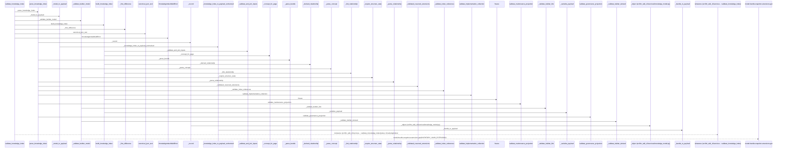
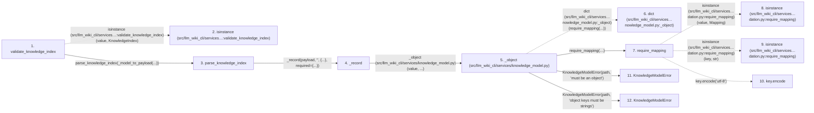

# validate_knowledge_index

**Entry point:** `validate_knowledge_index` (`api`)
**Source:** [knowledge_index](../modules/knowledge_index.md)
**Modules touched:** [analysis_compatibility](../modules/analysis_compatibility.md), [concept_identity](../modules/concept_identity.md), [immutable](../modules/immutable.md), and 21 more

**Complete modules touched:**

- [analysis_compatibility](../modules/analysis_compatibility.md)
- [concept_identity](../modules/concept_identity.md)
- [immutable](../modules/immutable.md)
- [implementation_evidence](../modules/implementation_evidence.md)
- [knowledge_envelope](../modules/knowledge_envelope.md)
- [knowledge_evidence](../modules/knowledge_evidence.md)
- [knowledge_governance](../modules/knowledge_governance.md)
- [knowledge_graph](../modules/knowledge_graph.md)
- [knowledge_index](../modules/knowledge_index.md)
- [knowledge_links](../modules/knowledge_links.md)
- [knowledge_model](../modules/knowledge_model.md)
- [knowledge_reuse](../modules/knowledge_reuse.md)
- [knowledge_storage](../modules/knowledge_storage.md)
- [maintenance_evidence](../modules/maintenance_evidence.md)
- [maintenance_projection](../modules/maintenance_projection.md)
- [maintenance_shapes](../modules/maintenance_shapes.md)
- [maintenance_state](../modules/maintenance_state.md)
- [markdown_sections](../modules/markdown_sections.md)
- [progress](../modules/progress.md)
- [python_implementation](../modules/python_implementation.md)
- [section_ownership](../modules/section_ownership.md)
- [validation](../modules/validation.md)
- [wiki_media](../modules/wiki_media.md)
- [wiki_surface](../modules/wiki_surface.md)

## Call sequence

> Static overview in presentation order, not runtime execution order. Arrows retain captured callers; representative internal continuations and boundary examples precede repeated helper detail.

<!-- Auto-generated from static call edges. Dashed arrows are external or unresolved calls. Reviewed runtime conditions and side effects belong in Behavior. -->

```mermaid
sequenceDiagram
    participant p0 as validate_knowledge_index
    participant p1 as parse_knowledge_index
    participant p2 as _model_to_payload
    participant p3 as _validate_builder_model
    participant p4 as build_knowledge_index
    participant p5 as _first_difference
    participant p6 as canonical_json_text
    participant p7 as KnowledgeIndexBuildError
    participant p8 as _record
    participant p9 as _knowledge_index_to_payload_unchecked
    participant p10 as _validate_and_join_inputs
    participant p11 as _concept_for_page
    participant p12 as _parse_bundle
    participant p13 as _derived_relationship
    participant p14 as _parse_concept
    participant p15 as _link_relationship
    participant p16 as _require_structure_state
    participant p17 as _parse_relationship
    participant p18 as _validated_reserved_extensions
    participant p19 as _validate_index_references
    participant p20 as validate_implementation_collection
    participant p21 as freeze
    participant p22 as validate_maintenance_projection
    participant p23 as _validate_builder_link
    participant p24 as _serialize_payload
    participant p25 as validate_governance_projection
    participant p26 as _validate_builder_derived
    participant p27 as _object (src/llm_wiki_cli/services/knowledge_model.py)
    participant p28 as _bundle_to_payload
    participant p29 as isinstance (src/llm_wiki_cli/services…:validate_knowledge_index)
    participant p30 as model.bundle.snapshot.extensions.get
    p0->>p1: parse_knowledge_index
    p0->>p2: _model_to_payload
    p0->>p3: _validate_builder_model
    p0->>p4: build_knowledge_index
    p0->>p5: _first_difference
    p0->>p6: canonical_json_text
    p0->>p7: KnowledgeIndexBuildError
    p1->>p8: _record
    p2->>p9: _knowledge_index_to_payload_unchecked
    p4->>p10: _validate_and_join_inputs
    p4->>p11: _concept_for_page
    p1->>p12: _parse_bundle
    p4->>p13: _derived_relationship
    p1->>p14: _parse_concept
    p4->>p15: _link_relationship
    p3->>p16: _require_structure_state
    p1->>p17: _parse_relationship
    p1->>p18: _validated_reserved_extensions
    p1->>p19: _validate_index_references
    p1->>p20: validate_implementation_collection
    p4->>p21: freeze
    p1->>p22: validate_maintenance_projection
    p3->>p23: _validate_builder_link
    p4->>p24: _serialize_payload
    p1->>p25: validate_governance_projection
    p3->>p26: _validate_builder_derived
    p8->>p27: _object (src/llm_wiki_cli/services/knowledge_model.py)
    p9->>p28: _bundle_to_payload
    p0-->>p29: isinstance (src/llm_wiki_cli/services…:validate_knowledge_index)(value, KnowledgeIndex)
    p3-->>p30: model.bundle.snapshot.extensions.get(INVENTORY_HASH_EXTENSION)
```

> Call sequence diagram shows 30 of 2323 interactions; 2293 omitted to keep the visualization within the 30-interaction and generated-diagram limits, with uncertain identities omitted rather than inferred.

> Captured boundary calls: external 1 of 615 (614 omitted); unresolved 1 of 408 (407 omitted). These counts cover the captured static trace.

Omitted captured detail, grouped by actual caller occurrence and target module:

| Caller | Parent step | Target module | Kind | Omitted interactions |
| --- | --- | --- | --- | --- |
| `src/llm_wiki_cli/services/knowledge_model.py:_object` | 5 | - | external | 1 |
| `src/llm_wiki_cli/services/knowledge_model.py:_object` | 5 | [src/llm_wiki_cli/services/validation.py](../modules/validation.md) | internal | 1 |
| `src/llm_wiki_cli/services/validation.py:require_mapping` | 7 | - | external | 2 |
| `src/llm_wiki_cli/services/validation.py:require_mapping` | 7 | - | unresolved | 1 |
| `src/llm_wiki_cli/services/knowledge_model.py:_object` | 5 | [src/llm_wiki_cli/services/knowledge_model.py](../modules/knowledge_model.md) | internal | 3 |
| `src/llm_wiki_cli/services/knowledge_model.py:_record` | 4 | - | external | 4 |
| `src/llm_wiki_cli/services/knowledge_model.py:_record` | 4 | [src/llm_wiki_cli/services/knowledge_model.py](../modules/knowledge_model.md) | internal | 6 |
| `src/llm_wiki_cli/services/knowledge_model.py:_parse_extensions` | 22 | [src/llm_wiki_cli/services/knowledge_model.py](../modules/knowledge_model.md) | internal | 7 |
> Omission summary shows 8 of 575 groups; 567 further groups are not expanded here. Counts above include all omitted interactions.
> Detailed flow queries retain their own coverage and limits; omitted paths may execute at runtime.

> Trace truncated at the depth limit; deeper calls are omitted.

## Data flow

<!-- Auto-generated static analysis. Treat values and boundaries as best-effort hints, not runtime proof. -->

### Analysis coverage

**Effect analysis partially available.** Flow assembly and source effect analysis are separate; empty observations do not prove an empty handler body.

Source steps: 1301; effect analysis evaluated: 775, partial: 0, unavailable: 526. Counts include steps omitted from the displayed trace.

- Callable record unavailable; the selected entry symbol has no represented callable body.
- Effect collector totals unavailable; observed counts cover captured records only.

| Step | Callable record | Effect analysis | Collector totals |
|---|---|---|---|
| `validate_knowledge_index` | `available` | `evaluated` | `available` |
| `isinstance (src/llm_wiki_cli/services…:validate_knowledge_index)` | `not_applicable` | `not_applicable` | `not_applicable` |
| `parse_knowledge_index` | `available` | `evaluated` | `available` |
| `_record` | `available` | `evaluated` | `available` |
| `_object (src/llm_wiki_cli/services/knowledge_model.py)` | `available` | `evaluated` | `available` |
| `dict (src/llm_wiki_cli/services…nowledge_model.py:_object)` | `not_applicable` | `not_applicable` | `not_applicable` |
| `require_mapping` | `available` | `evaluated` | `available` |
| `isinstance (src/llm_wiki_cli/services…dation.py:require_mapping)` | `not_applicable` | `not_applicable` | `not_applicable` |
| `isinstance (src/llm_wiki_cli/services…dation.py:require_mapping)` | `not_applicable` | `not_applicable` | `not_applicable` |
| `key.encode` | `not_applicable` | `not_applicable` | `not_applicable` |
| `KnowledgeModelError` | `unavailable` | `unavailable` | `unavailable` |
| `KnowledgeModelError` | `unavailable` | `unavailable` | `unavailable` |

```mermaid
flowchart LR
    s1["1. validate_knowledge_index"]
    s2["2. isinstance (src/llm_wiki_cli/services…:validate_knowledge_index)"]
    s3["3. parse_knowledge_index"]
    s4["4. _record"]
    s5["5. _object (src/llm_wiki_cli/services/knowledge_model.py)"]
    s6["6. dict (src/llm_wiki_cli/services…nowledge_model.py:_object)"]
    s7["7. require_mapping"]
    s8["8. isinstance (src/llm_wiki_cli/services…dation.py:require_mapping)"]
    s9["9. isinstance (src/llm_wiki_cli/services…dation.py:require_mapping)"]
    s10["10. key.encode"]
    s11["11. KnowledgeModelError"]
    s12["12. KnowledgeModelError"]
    s1 -. "isinstance (src/llm_wiki_cli/services…:validate_knowledge_index)(value, KnowledgeIndex)" .-> s2
    s1 -->|"parse_knowledge_index(_model_to_payload(...))"| s3
    s3 -->|"_record(payload, '', {...}, required={...})"| s4
    s4 -->|"_object (src/llm_wiki_cli/services/knowledge_model.py)(value, ...)"| s5
    s5 -. "dict (src/llm_wiki_cli/services…nowledge_model.py:_object)(require_mapping(...))" .-> s6
    s5 -->|"require_mapping(…)"| s7
    s7 -. "isinstance (src/llm_wiki_cli/services…dation.py:require_mapping)(value, Mapping)" .-> s8
    s7 -. "isinstance (src/llm_wiki_cli/services…dation.py:require_mapping)(key, str)" .-> s9
    s7 -. "key.encode('utf-8')" .-> s10
    s5 -->|"KnowledgeModelError(path, 'must be an object')"| s11
    s5 -->|"KnowledgeModelError(path, 'object keys must be strings')"| s12
    click s1 "../modules/knowledge_index.md"
    click s3 "../modules/knowledge_model.md"
    click s4 "../modules/knowledge_model.md"
    click s5 "../modules/knowledge_model.md"
    click s7 "../modules/validation.md"
    click s11 "../modules/knowledge_model.md"
    click s12 "../modules/knowledge_model.md"
```

### Step data

| Step | Inputs | Reads | Writes | Returns |
|---|---|---|---|---|
| `validate_knowledge_index` | `value: KnowledgeIndex \| object`, `inputs: KnowledgeIndexInputs \| None` | `KnowledgeIndex` | - | `model` |
| `isinstance (src/llm_wiki_cli/services…:validate_knowledge_index)` | - | - | - | - |
| `parse_knowledge_index` | `payload: object` | `KNOWLEDGE_SCHEMA_VERSION`, `KNOWLEDGE_SCHEMA_VERSION` | - | `model` |
| `_record` | `value: object`, `path: str`, `fields: AbstractSet[str]`, `required: AbstractSet[str]` | - | - | `(...)` |
| `_object (src/llm_wiki_cli/services/knowledge_model.py)` | `value: object`, `path: str` | - | - | `dict(...)` |
| `dict (src/llm_wiki_cli/services…nowledge_model.py:_object)` | - | - | - | - |
| `require_mapping` | `value: object`, `error: Exception`, `require_string_keys: bool`, `key_error: Exception \| None`, `require_utf8_keys: bool`, `utf8_key_error: Exception \| None` | `Mapping` | - | `value` |
| `isinstance (src/llm_wiki_cli/services…dation.py:require_mapping)` | - | - | - | - |
| `isinstance (src/llm_wiki_cli/services…dation.py:require_mapping)` | - | - | - | - |
| `key.encode` | - | - | - | - |
| `KnowledgeModelError` | - | - | - | - |
| `KnowledgeModelError` | - | - | - | - |

### Call data

| From | To | Line | Call |
|---|---|---:|---|
| validate_knowledge_index | isinstance (src/llm_wiki_cli/services…:validate_knowledge_index) | 269 | `isinstance(value, KnowledgeIndex)` |
| validate_knowledge_index | parse_knowledge_index | 271 | `parse_knowledge_index(_model_to_payload(...))` |
| parse_knowledge_index | _record | 526 | `_record(payload, '', {...}, required={...})` |
| _record | _object (src/llm_wiki_cli/services/knowledge_model.py) | 1608 | `_object(value, ...)` |
| _object (src/llm_wiki_cli/services/knowledge_model.py) | dict (src/llm_wiki_cli/services…nowledge_model.py:_object) | 1694 | `dict(require_mapping(...))` |
| _object (src/llm_wiki_cli/services/knowledge_model.py) | require_mapping | 1695 | `require_mapping(value, error=KnowledgeModelError(...), require_string_keys=True, key_error=KnowledgeModelError(...), require_utf8_keys=True, utf8_key_error=KnowledgeModelError(...))` |
| require_mapping | isinstance (src/llm_wiki_cli/services…dation.py:require_mapping) | 765 | `isinstance(value, Mapping)` |
| require_mapping | isinstance (src/llm_wiki_cli/services…dation.py:require_mapping) | 769 | `isinstance(key, str)` |
| require_mapping | key.encode | 774 | `key.encode('utf-8')` |
| _object (src/llm_wiki_cli/services/knowledge_model.py) | KnowledgeModelError | 1697 | `KnowledgeModelError(path, 'must be an object')` |
| _object (src/llm_wiki_cli/services/knowledge_model.py) | KnowledgeModelError | 1699 | `KnowledgeModelError(path, 'object keys must be strings')` |

### Boundary effects

*No boundary-effect observations were captured in this static trace.*

### Static analysis gaps

| Kind | Step | Target | Line |
|---|---|---|---:|
| external_call | `validate_knowledge_index` | `isinstance` | 269 |
| external_call | `require_mapping` | `isinstance` | 765 |
| external_call | `require_mapping` | `isinstance` | 769 |
| unresolved_call | `require_mapping` | `key.encode` | 774 |
| step_limit | `validate_knowledge_index` | `first 12 steps` | 0 |
| truncated_flow | `validate_knowledge_index` | `depth limit` | 0 |

## Behavior

This flow starts at `validate_knowledge_index` and is classified as `api`. The generated call and data-flow sections are bounded static projections; runtime conditions and side effects require source-level confirmation.
