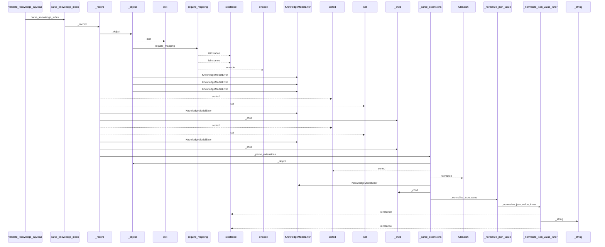
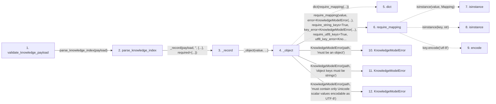

# validate_knowledge_payload

**Entry point:** `validate_knowledge_payload` (`api`)
**Source:** [knowledge_model](../modules/knowledge_model.md)
**Modules touched:** [concept_identity](../modules/concept_identity.md), [knowledge_evidence](../modules/knowledge_evidence.md), [knowledge_governance](../modules/knowledge_governance.md), and 7 more

**Complete modules touched:**

- [concept_identity](../modules/concept_identity.md)
- [knowledge_evidence](../modules/knowledge_evidence.md)
- [knowledge_governance](../modules/knowledge_governance.md)
- [knowledge_graph](../modules/knowledge_graph.md)
- [knowledge_model](../modules/knowledge_model.md)
- [markdown_sections](../modules/markdown_sections.md)
- [section_ownership](../modules/section_ownership.md)
- [validation](../modules/validation.md)
- [wiki_media](../modules/wiki_media.md)
- [wiki_surface](../modules/wiki_surface.md)

## Call sequence

<!-- Auto-generated from static call edges. Dashed arrows are external or unresolved calls. Reviewed runtime conditions and side effects belong in Behavior. -->

> Call sequence diagram shows 30 of 1449 interactions; 1419 omitted to keep the visualization within the 30-interaction and generated-diagram limits.

> Trace truncated at the depth limit; deeper calls are omitted.

## Data flow

<!-- Auto-generated static analysis. Treat values and boundaries as best-effort hints, not runtime proof. -->

### Step data

| Step | Inputs | Reads | Writes | Returns |
|---|---|---|---|---|
| `validate_knowledge_payload` | `payload: object` | - | - | `parse_knowledge_index(...)` |
| `parse_knowledge_index` | `payload: object` | `KNOWLEDGE_SCHEMA_VERSION`, `KNOWLEDGE_SCHEMA_VERSION` | - | `model` |
| `_record` | `value: object`, `path: str`, `fields: AbstractSet[str]`, `required: AbstractSet[str]` | - | - | `(...)` |
| `_object` | `value: object`, `path: str` | - | - | `dict(...)` |
| `dict` | - | - | - | - |
| `require_mapping` | `value: object`, `error: Exception`, `require_string_keys: bool`, `key_error: Exception \| None`, `require_utf8_keys: bool`, `utf8_key_error: Exception \| None` | `Mapping` | - | `value` |
| `isinstance` | - | - | - | - |
| `isinstance` | - | - | - | - |
| `encode` | - | - | - | - |
| `KnowledgeModelError` | - | - | - | - |
| `KnowledgeModelError` | - | - | - | - |
| `KnowledgeModelError` | - | - | - | - |

### Call data

| From | To | Line | Call |
|---|---|---:|---|
| validate_knowledge_payload | parse_knowledge_index | 635 | `parse_knowledge_index(payload)` |
| parse_knowledge_index | _record | 526 | `_record(payload, '', {...}, required={...})` |
| _record | _object | 1571 | `_object(value, ...)` |
| _object | dict | 1657 | `dict(require_mapping(...))` |
| _object | require_mapping | 1658 | `require_mapping(value, error=KnowledgeModelError(...), require_string_keys=True, key_error=KnowledgeModelError(...), require_utf8_keys=True, utf8_key_error=KnowledgeModelError(...))` |
| require_mapping | isinstance | 727 | `isinstance(value, Mapping)` |
| require_mapping | isinstance | 731 | `isinstance(key, str)` |
| require_mapping | encode | 736 | `key.encode('utf-8')` |
| _object | KnowledgeModelError | 1660 | `KnowledgeModelError(path, 'must be an object')` |
| _object | KnowledgeModelError | 1662 | `KnowledgeModelError(path, 'object keys must be strings')` |
| _object | KnowledgeModelError | 1666 | `KnowledgeModelError(path, 'must contain only Unicode scalar values encodable as UTF-8')` |

### Boundary effects

*No boundary effects detected.*

### Static analysis gaps

| Kind | Step | Target | Line |
|---|---|---|---:|
| unresolved_call | `require_mapping` | `isinstance` | 727 |
| unresolved_call | `require_mapping` | `isinstance` | 731 |
| unresolved_call | `require_mapping` | `key.encode` | 736 |
| step_limit | `validate_knowledge_payload` | `first 12 steps` | 0 |
| truncated_flow | `validate_knowledge_payload` | `depth limit` | 0 |

## Behavior

This flow starts at `validate_knowledge_payload` and is classified as `api`. The generated call and data-flow sections are bounded static projections; runtime conditions and side effects require source-level confirmation.
