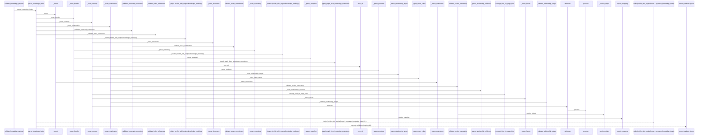
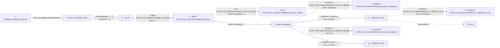

# validate_knowledge_payload

**Entry point:** `validate_knowledge_payload` (`api`)
**Source:** [knowledge_model](../modules/knowledge_model.md)
**Modules touched:** [analysis_compatibility](../modules/analysis_compatibility.md), [canonical_json](../modules/canonical_json.md), [integrations](../modules/integrations.md), and 11 more

**Complete modules touched:**

- [analysis_compatibility](../modules/analysis_compatibility.md)
- [canonical_json](../modules/canonical_json.md)
- [integrations](../modules/integrations.md)
- [knowledge_evidence](../modules/knowledge_evidence.md)
- [knowledge_graph](../modules/knowledge_graph.md)
- [knowledge_kinds](../modules/knowledge_kinds.md)
- [knowledge_model](../modules/knowledge_model.md)
- [knowledge_reuse_format](../modules/knowledge_reuse_format.md)
- [knowledge_validators](../modules/knowledge_validators.md)
- [markdown_sections](../modules/markdown_sections.md)
- [section_ownership](../modules/section_ownership.md)
- [validation](../modules/validation.md)
- [wiki_media](../modules/wiki_media.md)
- [wiki_surface](../modules/wiki_surface.md)

## Call sequence

> Static overview in presentation order, not runtime execution order. Arrows retain captured callers; representative internal continuations and boundary examples precede repeated helper detail.

<!-- Auto-generated from static call edges. Dashed arrows are external or unresolved calls. Reviewed runtime conditions and side effects belong in Behavior. -->

```mermaid
sequenceDiagram
    participant p0 as validate_knowledge_payload
    participant p1 as parse_knowledge_index
    participant p2 as _record
    participant p3 as _parse_bundle
    participant p4 as _parse_concept
    participant p5 as _parse_relationship
    participant p6 as _validated_reserved_extensions
    participant p7 as _validate_index_references
    participant p8 as _object (src/llm_wiki_engine/knowledge_model.py)
    participant p9 as _parse_document
    participant p10 as validate_reuse_commitment
    participant p11 as _parse_repository
    participant p12 as _locator (src/llm_wiki_engine/knowledge_model.py)
    participant p13 as _parse_snapshot
    participant p14 as typed_graph_from_knowledge_extensions
    participant p15 as mcp_uri
    participant p16 as _parse_producer
    participant p17 as _parse_relationship_target
    participant p18 as _open_enum_value
    participant p19 as _parse_extensions
    participant p20 as validate_section_ownership
    participant p21 as _parse_relationship_evidence
    participant p22 as concept_kind_for_page_kind
    participant p23 as _parse_facets
    participant p24 as _validate_relationship_shape
    participant p25 as attributes
    participant p26 as provider
    participant p27 as _section_object
    participant p28 as require_mapping
    participant p29 as tuple (src/llm_wiki_engine/knowl….py:parse_knowledge_index)
    participant p30 as current_validators().run
    p0->>p1: parse_knowledge_index
    p1->>p2: _record
    p1->>p3: _parse_bundle
    p1->>p4: _parse_concept
    p1->>p5: _parse_relationship
    p1->>p6: _validated_reserved_extensions
    p1->>p7: _validate_index_references
    p2->>p8: _object (src/llm_wiki_engine/knowledge_model.py)
    p4->>p9: _parse_document
    p6->>p10: validate_reuse_commitment
    p3->>p11: _parse_repository
    p4->>p12: _locator (src/llm_wiki_engine/knowledge_model.py)
    p3->>p13: _parse_snapshot
    p6->>p14: typed_graph_from_knowledge_extensions
    p4->>p15: mcp_uri
    p3->>p16: _parse_producer
    p5->>p17: _parse_relationship_target
    p4->>p18: _open_enum_value
    p2->>p19: _parse_extensions
    p6->>p20: validate_section_ownership
    p5->>p21: _parse_relationship_evidence
    p4->>p22: concept_kind_for_page_kind
    p4->>p23: _parse_facets
    p5->>p24: _validate_relationship_shape
    p4->>p25: attributes
    p25->>p26: provider
    p20->>p27: _section_object
    p8->>p28: require_mapping
    p1-->>p29: tuple (src/llm_wiki_engine/knowl….py:parse_knowledge_index)(...)
    p1-->>p30: current_validators().run(model)
```

> Call sequence diagram shows 30 of 806 interactions; 776 omitted to keep the visualization within the 30-interaction and generated-diagram limits, with uncertain identities omitted rather than inferred.

> Captured boundary calls: external 1 of 177 (176 omitted); unresolved 1 of 129 (128 omitted). These counts cover the captured static trace.

Omitted captured detail, grouped by actual caller occurrence and target module:

| Caller | Parent step | Target module | Kind | Omitted interactions |
| --- | --- | --- | --- | --- |
| `src/llm_wiki_engine/knowledge_model.py:_object` | 4 | - | external | 1 |
| `src/llm_wiki_engine/validation.py:require_mapping` | 6 | - | external | 2 |
| `src/llm_wiki_engine/validation.py:require_mapping` | 6 | [src/llm_wiki_engine/validation.py](../modules/validation.md) | internal | 3 |
| `src/llm_wiki_engine/validation.py:_validation_error` | 8 | - | external | 1 |
| `src/llm_wiki_engine/validation.py:_validation_error` | 8 | - | unresolved | 1 |
| `src/llm_wiki_engine/validation.py:require_mapping` | 6 | - | unresolved | 1 |
| `src/llm_wiki_engine/knowledge_model.py:_record` | 3 | - | external | 4 |
| `src/llm_wiki_engine/knowledge_model.py:_record` | 3 | [src/llm_wiki_engine/knowledge_model.py](../modules/knowledge_model.md) | internal | 5 |
> Omission summary shows 8 of 179 groups; 171 further groups are not expanded here. Counts above include all omitted interactions.
> Detailed flow queries retain their own coverage and limits; omitted paths may execute at runtime.

> Trace truncated at the depth limit; deeper calls are omitted.

## Data flow

<!-- Auto-generated static analysis. Treat values and boundaries as best-effort hints, not runtime proof. -->

### Analysis coverage

**Effect analysis partially available.** Flow assembly and source effect analysis are separate; empty observations do not prove an empty handler body.

Source steps: 501; effect analysis evaluated: 330, partial: 8, unavailable: 163. Counts include steps omitted from the displayed trace.

Collector observations for 338 source steps with known totals: observed: 1597, emitted: 1470, omitted: 127. Unavailable totals are excluded.

- Callable record unavailable for one or more source steps; those steps have no represented callable body.
- Effect collector omitted observations before flow assembly; displayed effects are partial.
- Effect collector totals unavailable; observed counts cover captured records only.

| Step | Callable record | Effect analysis | Collector totals | Observed | Emitted | Omitted |
|---|---|---|---|---:|---:|---:|
| `validate_knowledge_payload` | `available` | `evaluated` | `available` | `2` | `2` | `0` |
| `parse_knowledge_index` | `available` | `evaluated` | `available` | `4` | `4` | `0` |
| `_record` | `available` | `evaluated` | `available` | `5` | `5` | `0` |
| `_object (src/llm_wiki_engine/knowledge_model.py)` | `available` | `evaluated` | `available` | `6` | `6` | `0` |
| `dict (src/llm_wiki_engine/knowledge_model.py:_object)` | `not_applicable` | `not_applicable` | `not_applicable` | — | — | — |
| `require_mapping` | `available` | `evaluated` | `available` | `9` | `9` | `0` |
| `isinstance (src/llm_wiki_engine/validation.py:require_mapping)` | `not_applicable` | `not_applicable` | `not_applicable` | — | — | — |
| `_validation_error` | `available` | `evaluated` | `available` | `3` | `3` | `0` |
| `isinstance (src/llm_wiki_engine/validation.py:_validation_error)` | `not_applicable` | `not_applicable` | `not_applicable` | — | — | — |
| `error` | `not_applicable` | `not_applicable` | `not_applicable` | — | — | — |
| `isinstance (src/llm_wiki_engine/validation.py:require_mapping)` | `not_applicable` | `not_applicable` | `not_applicable` | — | — | — |
| `_validation_error` | `available` | `evaluated` | `available` | `3` | `3` | `0` |

```mermaid
flowchart LR
    s1["1. validate_knowledge_payload"]
    s2["2. parse_knowledge_index"]
    s3["3. _record"]
    s4["4. _object (src/llm_wiki_engine/knowledge_model.py)"]
    s5["5. dict (src/llm_wiki_engine/knowledge_model.py:_object)"]
    s6["6. require_mapping"]
    s7["7. isinstance (src/llm_wiki_engine/validation.py:require_mapping)"]
    s8["8. _validation_error"]
    s9["9. isinstance (src/llm_wiki_engine/validation.py:_validation_error)"]
    s10["10. error"]
    s11["11. isinstance (src/llm_wiki_engine/validation.py:require_mapping)"]
    s12["12. _validation_error"]
    s1 -->|"parse_knowledge_index(payload)"| s2
    s2 -->|"_record(payload, '', {...}, required={...})"| s3
    s3 -->|"_object (src/llm_wiki_engine/knowledge_model.py)(value, ...)"| s4
    s4 -. "dict (src/llm_wiki_engine/knowledge_model.py:_object)(require_mapping(...))" .-> s5
    s4 -->|"require_mapping(…)"| s6
    s6 -. "isinstance (src/llm_wiki_engine/validation.py:require_mapping)(value, Mapping)" .-> s7
    s6 -->|"_validation_error(error, error_context)"| s8
    s8 -. "isinstance (src/llm_wiki_engine/validation.py:_validation_error)(error, Exception)" .-> s9
    s8 -. "error(context)" .-> s10
    s6 -. "isinstance (src/llm_wiki_engine/validation.py:require_mapping)(key, str)" .-> s11
    s6 -->|"_validation_error(..., error_context)"| s12
    click s1 "../modules/knowledge_model.md"
    click s2 "../modules/knowledge_model.md"
    click s3 "../modules/knowledge_model.md"
    click s4 "../modules/knowledge_model.md"
    click s6 "../modules/validation.md"
    click s8 "../modules/validation.md"
    click s12 "../modules/validation.md"
```

### Step data

| Step | Inputs | Reads | Writes | Returns |
|---|---|---|---|---|
| `validate_knowledge_payload` | `payload: object` | - | - | `parse_knowledge_index(...)` |
| `parse_knowledge_index` | `payload: object` | `KNOWLEDGE_SCHEMA_VERSION`, `KNOWLEDGE_SCHEMA_VERSION` | - | `model` |
| `_record` | `value: object`, `path: str`, `fields: AbstractSet[str]`, `required: AbstractSet[str]` | - | - | `(...)` |
| `_object (src/llm_wiki_engine/knowledge_model.py)` | `value: object`, `path: str` | `_OBJECT_ERROR`, `_OBJECT_KEYS_ERROR`, `_UTF8_ERROR` | - | `dict(...)` |
| `dict (src/llm_wiki_engine/knowledge_model.py:_object)` | - | - | - | - |
| `require_mapping` | `value: object`, `error: _ValidationError`, `error_context: str`, `require_string_keys: bool`, `key_error: _ValidationError \| None`, `require_utf8_keys: bool`, `utf8_key_error: _ValidationError \| None` | `Mapping` | - | `value` |
| `isinstance (src/llm_wiki_engine/validation.py:require_mapping)` | - | - | - | - |
| `_validation_error` | `error: _ValidationError`, `context: str` | - | - | `...` |
| `isinstance (src/llm_wiki_engine/validation.py:_validation_error)` | - | - | - | - |
| `error` | - | - | - | - |
| `isinstance (src/llm_wiki_engine/validation.py:require_mapping)` | - | - | - | - |
| `_validation_error` | `error: _ValidationError`, `context: str` | - | - | `...` |

### Call data

| From | To | Line | Call |
|---|---|---:|---|
| validate_knowledge_payload | parse_knowledge_index | 661 | `parse_knowledge_index(payload)` |
| parse_knowledge_index | _record | 553 | `_record(payload, '', {...}, required={...})` |
| _record | _object (src/llm_wiki_engine/knowledge_model.py) | 1612 | `_object(value, ...)` |
| _object (src/llm_wiki_engine/knowledge_model.py) | dict (src/llm_wiki_engine/knowledge_model.py:_object) | 1698 | `dict(require_mapping(...))` |
| _object (src/llm_wiki_engine/knowledge_model.py) | require_mapping | 1699 | `require_mapping(value, error=_OBJECT_ERROR, error_context=path, require_string_keys=True, key_error=_OBJECT_KEYS_ERROR, require_utf8_keys=True, utf8_key_error=_UTF8_ERROR)` |
| require_mapping | isinstance (src/llm_wiki_engine/validation.py:require_mapping) | 783 | `isinstance(value, Mapping)` |
| require_mapping | _validation_error | 784 | `_validation_error(error, error_context)` |
| _validation_error | isinstance (src/llm_wiki_engine/validation.py:_validation_error) | 95 | `isinstance(error, Exception)` |
| _validation_error | error | 95 | `error(context)` |
| require_mapping | isinstance (src/llm_wiki_engine/validation.py:require_mapping) | 787 | `isinstance(key, str)` |
| require_mapping | _validation_error | 788 | `_validation_error(..., error_context)` |

### Boundary effects

*No boundary-effect observations were captured in this static trace.*

### Static analysis gaps

| Kind | Step | Target | Line |
|---|---|---|---:|
| external_call | `require_mapping` | `isinstance` | 783 |
| external_call | `_validation_error` | `isinstance` | 95 |
| unresolved_call | `_validation_error` | `error` | 95 |
| external_call | `require_mapping` | `isinstance` | 787 |
| step_limit | `validate_knowledge_payload` | `first 12 steps` | 0 |
| truncated_flow | `validate_knowledge_payload` | `depth limit` | 0 |

## Behavior

This flow starts at `validate_knowledge_payload` and is classified as `api`. The generated call and data-flow sections are bounded static projections; runtime conditions and side effects require source-level confirmation.
