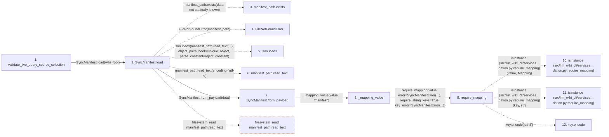

# validate_live_query_source_selection

**Entry point:** `validate_live_query_source_selection` (`api`)
**Source:** [documentation_query_builder](../modules/documentation_query_builder.md)
**Modules touched:** [common](../modules/common.md), [documentation_queries](../modules/documentation_queries.md), [documentation_query_builder](../modules/documentation_query_builder.md), and 4 more

**Complete modules touched:**

- [common](../modules/common.md)
- [documentation_queries](../modules/documentation_queries.md)
- [documentation_query_builder](../modules/documentation_query_builder.md)
- [knowledge_evidence](../modules/knowledge_evidence.md)
- [source_selection](../modules/source_selection.md)
- [sync_manifest](../modules/sync_manifest.md)
- [validation](../modules/validation.md)

## Call sequence

```mermaid
sequenceDiagram
    participant p0 as validate_live_query_source_selection
    participant p1 as SyncManifest.load
    participant p2 as manifest_path.exists
    participant p3 as FileNotFoundError
    participant p4 as json.loads
    participant p5 as manifest_path.read_text
    participant p6 as SyncManifest.from_payload
    participant p7 as _mapping_value
    participant p8 as require_mapping
    participant p9 as isinstance (src/llm_wiki_cli/services…dation.py:require_mapping)
    participant p10 as key.encode
    participant p11 as SyncManifestError
    participant p12 as data.get (src/llm_wiki_cli/services…SyncManifest.from_payload)
    participant p13 as isinstance (src/llm_wiki_cli/services…SyncManifest.from_payload)
    participant p14 as _copy_sources
    participant p15 as data.items
    participant p16 as isinstance (src/llm_wiki_cli/services…manifest.py:_copy_sources)
    participant p17 as deepcopy (src/llm_wiki_cli/services…manifest.py:_copy_sources)
    participant p18 as dict (src/llm_wiki_cli/services…manifest.py:_copy_sources)
    participant p19 as _infer_language_from_path
    participant p20 as Path (src/llm_wiki_cli/services…_infer_language_from_path)
    participant p21 as LANGUAGE_EXTENSIONS.items
    participant p22 as inventory_language_for_path
    p0->>p1: SyncManifest.load
    p1-->>p2: manifest_path.exists
    p1-->>p3: FileNotFoundError
    p1-->>p4: json.loads
    p1-->>p5: manifest_path.read_text
    p1->>p6: SyncManifest.from_payload
    p6->>p7: _mapping_value
    p7->>p8: require_mapping
    p8-->>p9: isinstance (src/llm_wiki_cli/services…dation.py:require_mapping)
    p8-->>p9: isinstance (src/llm_wiki_cli/services…dation.py:require_mapping)
    p8-->>p10: key.encode
    p7->>p11: SyncManifestError
    p7->>p11: SyncManifestError
    p6-->>p12: data.get (src/llm_wiki_cli/services…SyncManifest.from_payload)
    p6-->>p13: isinstance (src/llm_wiki_cli/services…SyncManifest.from_payload)
    p6-->>p13: isinstance (src/llm_wiki_cli/services…SyncManifest.from_payload)
    p6->>p11: SyncManifestError
    p6->>p11: SyncManifestError
    p6->>p11: SyncManifestError
    p6->>p14: _copy_sources
    p14->>p7: _mapping_value
    p14-->>p15: data.items
    p14-->>p16: isinstance (src/llm_wiki_cli/services…manifest.py:_copy_sources)
    p14->>p11: SyncManifestError
    p14-->>p17: deepcopy (src/llm_wiki_cli/services…manifest.py:_copy_sources)
    p14-->>p18: dict (src/llm_wiki_cli/services…manifest.py:_copy_sources)
    p14->>p19: _infer_language_from_path
    p19-->>p20: Path (src/llm_wiki_cli/services…_infer_language_from_path)
    p19-->>p21: LANGUAGE_EXTENSIONS.items
    p19->>p22: inventory_language_for_path
```

<!-- Auto-generated from static call edges. Dashed arrows are external or unresolved calls. Reviewed runtime conditions and side effects belong in Behavior. -->

> Call sequence diagram shows 30 of 286 interactions; 256 omitted to keep the visualization within the 30-interaction and generated-diagram limits.

> Trace truncated at the depth limit; deeper calls are omitted.

## Data flow

<!-- Auto-generated static analysis. Treat values and boundaries as best-effort hints, not runtime proof. -->

### Step data

| Step | Inputs | Reads | Writes | Returns |
|---|---|---|---|---|
| `validate_live_query_source_selection` | `source_root: Path`, `wiki_root: Path`, `live_identity: Mapping[str, object] \| None`, `live_selection_inputs: Mapping[str, object] \| None \| object`, `operation: str`, `allow_empty_wiki: bool` | `SyncManifestError`, `_UNSET_LIVE_SELECTION_INPUTS`, `SourceSelectionError` | - | `none` |
| `SyncManifest.load` | `wiki_dir: Path` | `MANIFEST_FILENAME` | - | `cls.from_payload(...)` |
| `manifest_path.exists` | - | - | - | - |
| `FileNotFoundError` | - | - | - | - |
| `json.loads` | - | - | - | - |
| `manifest_path.read_text` | - | - | - | - |
| `SyncManifest.from_payload` | `value: object` | `MANIFEST_VERSION`, `LEGACY_MANIFEST_VERSION`, `Mapping`, `LEGACY_MANIFEST_VERSION`, `Mapping`, `LEGACY_MANIFEST_VERSION`, `Mapping`, `Mapping` | `legacy_surfaces[...]`, `surfaces[...]` | `manifest`, `manifest` |
| `_mapping_value` | `value: object`, `field_name: str` | - | - | `require_mapping(...)` |
| `require_mapping` | `value: object`, `error: Exception`, `require_string_keys: bool`, `key_error: Exception \| None`, `require_utf8_keys: bool`, `utf8_key_error: Exception \| None` | `Mapping` | - | `value` |
| `isinstance (src/llm_wiki_cli/services…dation.py:require_mapping)` | - | - | - | - |
| `isinstance (src/llm_wiki_cli/services…dation.py:require_mapping)` | - | - | - | - |
| `key.encode` | - | - | - | - |

### Call data

| From | To | Line | Call |
|---|---|---:|---|
| validate_live_query_source_selection | SyncManifest.load | 298 | `SyncManifest.load(wiki_root)` |
| SyncManifest.load | manifest_path.exists | 1074 | `manifest_path.exists(data not statically known)` |
| SyncManifest.load | FileNotFoundError | 1075 | `FileNotFoundError(manifest_path)` |
| SyncManifest.load | json.loads | 1094 | `json.loads(manifest_path.read_text(...), object_pairs_hook=unique_object, parse_constant=reject_constant)` |
| SyncManifest.load | manifest_path.read_text | 1095 | `manifest_path.read_text(encoding='utf-8')` |
| SyncManifest.load | SyncManifest.from_payload | 1099 | `cls.from_payload(data)` |
| SyncManifest.from_payload | _mapping_value | 950 | `_mapping_value(value, 'manifest')` |
| _mapping_value | require_mapping | 138 | `require_mapping(value, error=SyncManifestError(...), require_string_keys=True, key_error=SyncManifestError(...))` |
| require_mapping | isinstance (src/llm_wiki_cli/services…dation.py:require_mapping) | 727 | `isinstance(value, Mapping)` |
| require_mapping | isinstance (src/llm_wiki_cli/services…dation.py:require_mapping) | 731 | `isinstance(key, str)` |
| require_mapping | key.encode | 736 | `key.encode('utf-8')` |

### Boundary effects

| Kind | Target | Step | Line |
|---|---|---|---:|
| filesystem_read | `manifest_path.read_text` | `SyncManifest.load` | 1095 |

### Static analysis gaps

| Kind | Step | Target | Line |
|---|---|---|---:|
| unresolved_call | `SyncManifest.load` | `manifest_path.exists` | 1074 |
| external_call | `SyncManifest.load` | `FileNotFoundError` | 1075 |
| external_call | `SyncManifest.load` | `json.loads` | 1094 |
| external_call | `require_mapping` | `isinstance` | 727 |
| external_call | `require_mapping` | `isinstance` | 731 |
| unresolved_call | `require_mapping` | `key.encode` | 736 |
| step_limit | `validate_live_query_source_selection` | `first 12 steps` | 0 |
| truncated_flow | `validate_live_query_source_selection` | `depth limit` | 0 |

## Behavior

This flow starts at `validate_live_query_source_selection` and is classified as `api`. The generated call and data-flow sections are bounded static projections; runtime conditions and side effects require source-level confirmation.
