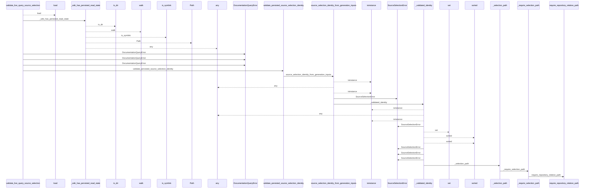
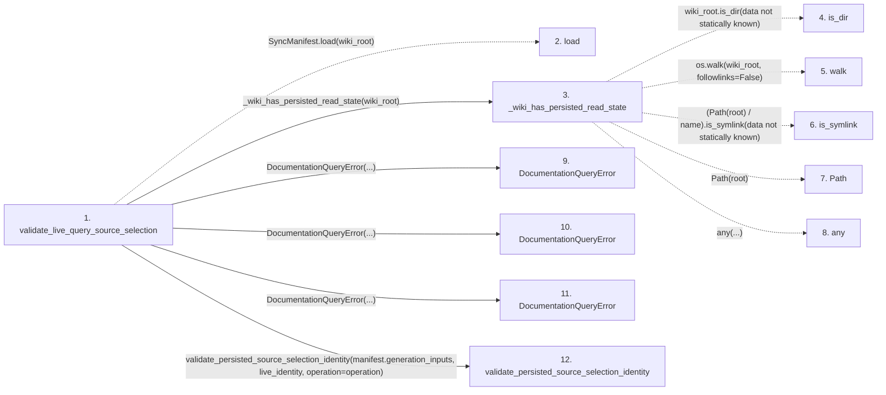

# validate_live_query_source_selection

**Entry point:** `validate_live_query_source_selection` (`api`)
**Source:** [documentation_query_builder](../modules/documentation_query_builder.md)
**Modules touched:** [documentation_queries](../modules/documentation_queries.md), [documentation_query_builder](../modules/documentation_query_builder.md), [source_selection](../modules/source_selection.md), and 1 more

**Complete modules touched:**

- [documentation_queries](../modules/documentation_queries.md)
- [documentation_query_builder](../modules/documentation_query_builder.md)
- [source_selection](../modules/source_selection.md)
- [validation](../modules/validation.md)

## Call sequence

<!-- Auto-generated from static call edges. Dashed arrows are external or unresolved calls. Reviewed runtime conditions and side effects belong in Behavior. -->

> Call sequence diagram shows 30 of 88 interactions; 58 omitted to keep the visualization within the 30-interaction and generated-diagram limits.

> Trace truncated at the depth limit; deeper calls are omitted.

## Data flow

<!-- Auto-generated static analysis. Treat values and boundaries as best-effort hints, not runtime proof. -->

### Step data

| Step | Inputs | Reads | Writes | Returns |
|---|---|---|---|---|
| `validate_live_query_source_selection` | `source_root: Path`, `wiki_root: Path`, `live_identity: Mapping[str, object] \| None`, `live_selection_inputs: Mapping[str, object] \| None \| object`, `operation: str`, `allow_empty_wiki: bool` | `SyncManifestError`, `_UNSET_LIVE_SELECTION_INPUTS`, `SourceSelectionError` | - | `none` |
| `load` | - | - | - | - |
| `_wiki_has_persisted_read_state` | `wiki_root: Path` | - | - | `False`, `True`, `True`, `False` |
| `is_dir` | - | - | - | - |
| `walk` | - | - | - | - |
| `is_symlink` | - | - | - | - |
| `Path` | - | - | - | - |
| `any` | - | - | - | - |
| `DocumentationQueryError` | - | - | - | - |
| `DocumentationQueryError` | - | - | - | - |
| `DocumentationQueryError` | - | - | - | - |
| `validate_persisted_source_selection_identity` | `persisted_generation_inputs: Mapping[str, object] \| None`, `live_identity: Mapping[str, object] \| None`, `operation: str`, `explicit_path_authorized: bool`, `allow_same_path_update: bool`, `live_selection_inputs: Mapping[str, object] \| None \| object` | `_UNSET_SELECTION_INPUTS`, `SOURCE_SELECTION_PATH` | - | `none`, `none`, `none`, `none`, `none` |

### Call data

| From | To | Line | Call |
|---|---|---:|---|
| validate_live_query_source_selection | load | 69 | `SyncManifest.load(wiki_root)` |
| validate_live_query_source_selection | _wiki_has_persisted_read_state | 72 | `_wiki_has_persisted_read_state(wiki_root)` |
| _wiki_has_persisted_read_state | is_dir | 37 | `wiki_root.is_dir(data not statically known)` |
| _wiki_has_persisted_read_state | walk | 39 | `os.walk(wiki_root, followlinks=False)` |
| _wiki_has_persisted_read_state | is_symlink | 43 | `(Path(root) / name).is_symlink(data not statically known)` |
| _wiki_has_persisted_read_state | Path | 43 | `Path(root)` |
| _wiki_has_persisted_read_state | any | 45 | `any(...)` |
| validate_live_query_source_selection | DocumentationQueryError | 75 | `DocumentationQueryError(...)` |
| validate_live_query_source_selection | DocumentationQueryError | 81 | `DocumentationQueryError(...)` |
| validate_live_query_source_selection | DocumentationQueryError | 87 | `DocumentationQueryError(...)` |
| validate_live_query_source_selection | validate_persisted_source_selection_identity | 95 | `validate_persisted_source_selection_identity(manifest.generation_inputs, live_identity, operation=operation)` |

### Boundary effects

*No boundary effects detected.*

### Static analysis gaps

| Kind | Step | Target | Line |
|---|---|---|---:|
| external_call | `validate_live_query_source_selection` | `SyncManifest.load` | 69 |
| unresolved_call | `_wiki_has_persisted_read_state` | `wiki_root.is_dir` | 37 |
| external_call | `_wiki_has_persisted_read_state` | `os.walk` | 39 |
| unresolved_call | `_wiki_has_persisted_read_state` | `(Path(root) / name).is_symlink` | 43 |
| unresolved_call | `_wiki_has_persisted_read_state` | `any` | 45 |
| step_limit | `validate_live_query_source_selection` | `first 12 steps` | 0 |
| truncated_flow | `validate_live_query_source_selection` | `depth limit` | 0 |

## Behavior

This flow starts at `validate_live_query_source_selection` and is classified as `api`. The generated call and data-flow sections are bounded static projections; runtime conditions and side effects require source-level confirmation.
