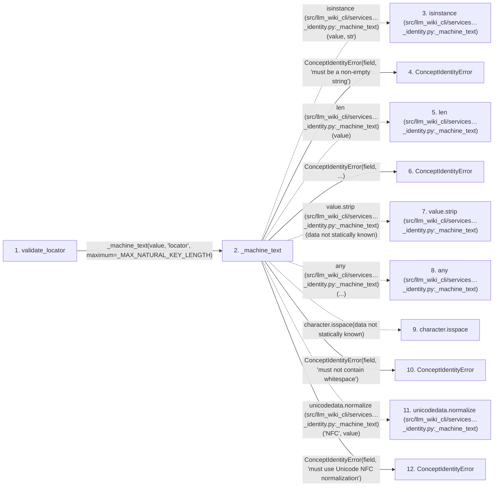

# validate_locator

**Entry point:** `validate_locator` (`api`)
**Source:** [concept_identity](../modules/concept_identity.md)
**Modules touched:** [concept_identity](../modules/concept_identity.md), [validation](../modules/validation.md), [wiki_surface](../modules/wiki_surface.md)

## Call sequence

```mermaid
sequenceDiagram
    participant p0 as validate_locator
    participant p1 as _machine_text
    participant p2 as isinstance (src/llm_wiki_cli/services…_identity.py:_machine_text)
    participant p3 as ConceptIdentityError
    participant p4 as len (src/llm_wiki_cli/services…_identity.py:_machine_text)
    participant p5 as value.strip (src/llm_wiki_cli/services…_identity.py:_machine_text)
    participant p6 as any (src/llm_wiki_cli/services…_identity.py:_machine_text)
    participant p7 as character.isspace
    participant p8 as unicodedata.normalize (src/llm_wiki_cli/services…_identity.py:_machine_text)
    participant p9 as unicodedata.category(…).startswith
    participant p10 as unicodedata.category
    participant p11 as _contains_uri_userinfo
    participant p12 as urlsplit
    participant p13 as _looks_absolute_path
    participant p14 as value.startswith
    participant p15 as _WINDOWS_ABSOLUTE_RE.match
    participant p16 as validate_exact_page_coordinate
    participant p17 as isinstance (src/llm_wiki_cli/services…date_exact_page_coordinate)
    participant p18 as value.strip (src/llm_wiki_cli/services…date_exact_page_coordinate)
    participant p19 as WikiSurfaceError
    participant p20 as any (src/llm_wiki_cli/services…date_exact_page_coordinate)
    participant p21 as ord (src/llm_wiki_cli/services…date_exact_page_coordinate)
    p0->>p1: _machine_text
    p1-->>p2: isinstance (src/llm_wiki_cli/services…_identity.py:_machine_text)
    p1->>p3: ConceptIdentityError
    p1-->>p4: len (src/llm_wiki_cli/services…_identity.py:_machine_text)
    p1->>p3: ConceptIdentityError
    p1-->>p5: value.strip (src/llm_wiki_cli/services…_identity.py:_machine_text)
    p1-->>p6: any (src/llm_wiki_cli/services…_identity.py:_machine_text)
    p1-->>p7: character.isspace
    p1->>p3: ConceptIdentityError
    p1-->>p8: unicodedata.normalize (src/llm_wiki_cli/services…_identity.py:_machine_text)
    p1->>p3: ConceptIdentityError
    p1-->>p6: any (src/llm_wiki_cli/services…_identity.py:_machine_text)
    p1-->>p9: unicodedata.category(…).startswith
    p1-->>p10: unicodedata.category
    p1->>p3: ConceptIdentityError
    p0->>p11: _contains_uri_userinfo
    p11-->>p12: urlsplit
    p0->>p13: _looks_absolute_path
    p13-->>p14: value.startswith
    p13-->>p15: _WINDOWS_ABSOLUTE_RE.match
    p0->>p3: ConceptIdentityError
    p0->>p16: validate_exact_page_coordinate
    p16-->>p17: isinstance (src/llm_wiki_cli/services…date_exact_page_coordinate)
    p16-->>p18: value.strip (src/llm_wiki_cli/services…date_exact_page_coordinate)
    p16->>p19: WikiSurfaceError
    p16-->>p18: value.strip (src/llm_wiki_cli/services…date_exact_page_coordinate)
    p16-->>p20: any (src/llm_wiki_cli/services…date_exact_page_coordinate)
    p16-->>p21: ord (src/llm_wiki_cli/services…date_exact_page_coordinate)
    p16-->>p21: ord (src/llm_wiki_cli/services…date_exact_page_coordinate)
    p16->>p19: WikiSurfaceError
```

<!-- Auto-generated from static call edges. Dashed arrows are external or unresolved calls. Reviewed runtime conditions and side effects belong in Behavior. -->

> Call sequence diagram shows 30 of 87 interactions; 57 omitted to keep the visualization within the 30-interaction and generated-diagram limits.

## Data flow

<!-- Auto-generated static analysis. Treat values and boundaries as best-effort hints, not runtime proof. -->

### Step data

| Step | Inputs | Reads | Writes | Returns |
|---|---|---|---|---|
| `validate_locator` | `value: object` | `_MAX_NATURAL_KEY_LENGTH`, `WikiSurfaceError` | - | `normalized` |
| `_machine_text` | `value: object`, `field: str`, `maximum: int` | - | - | `value` |
| `isinstance (src/llm_wiki_cli/services…_identity.py:_machine_text)` | - | - | - | - |
| `ConceptIdentityError` | - | - | - | - |
| `len (src/llm_wiki_cli/services…_identity.py:_machine_text)` | - | - | - | - |
| `ConceptIdentityError` | - | - | - | - |
| `value.strip (src/llm_wiki_cli/services…_identity.py:_machine_text)` | - | - | - | - |
| `any (src/llm_wiki_cli/services…_identity.py:_machine_text)` | - | - | - | - |
| `character.isspace` | - | - | - | - |
| `ConceptIdentityError` | - | - | - | - |
| `unicodedata.normalize (src/llm_wiki_cli/services…_identity.py:_machine_text)` | - | - | - | - |
| `ConceptIdentityError` | - | - | - | - |

### Call data

| From | To | Line | Call |
|---|---|---:|---|
| validate_locator | _machine_text | 408 | `_machine_text(value, 'locator', maximum=_MAX_NATURAL_KEY_LENGTH)` |
| _machine_text | isinstance (src/llm_wiki_cli/services…_identity.py:_machine_text) | 912 | `isinstance(value, str)` |
| _machine_text | ConceptIdentityError | 913 | `ConceptIdentityError(field, 'must be a non-empty string')` |
| _machine_text | len (src/llm_wiki_cli/services…_identity.py:_machine_text) | 914 | `len(value)` |
| _machine_text | ConceptIdentityError | 915 | `ConceptIdentityError(field, ...)` |
| _machine_text | value.strip (src/llm_wiki_cli/services…_identity.py:_machine_text) | 916 | `value.strip(data not statically known)` |
| _machine_text | any (src/llm_wiki_cli/services…_identity.py:_machine_text) | 916 | `any(...)` |
| _machine_text | character.isspace | 916 | `character.isspace(data not statically known)` |
| _machine_text | ConceptIdentityError | 917 | `ConceptIdentityError(field, 'must not contain whitespace')` |
| _machine_text | unicodedata.normalize (src/llm_wiki_cli/services…_identity.py:_machine_text) | 918 | `unicodedata.normalize('NFC', value)` |
| _machine_text | ConceptIdentityError | 919 | `ConceptIdentityError(field, 'must use Unicode NFC normalization')` |

### Boundary effects

*No boundary effects detected.*

### Static analysis gaps

| Kind | Step | Target | Line |
|---|---|---|---:|
| external_call | `_machine_text` | `isinstance` | 912 |
| unresolved_call | `_machine_text` | `value.strip` | 916 |
| external_call | `_machine_text` | `any` | 916 |
| unresolved_call | `_machine_text` | `character.isspace` | 916 |
| external_call | `_machine_text` | `unicodedata.normalize` | 918 |
| step_limit | `validate_locator` | `first 12 steps` | 0 |

## Behavior

This flow starts at `validate_locator` and is classified as `api`. The generated call and data-flow sections are bounded static projections; runtime conditions and side effects require source-level confirmation.
