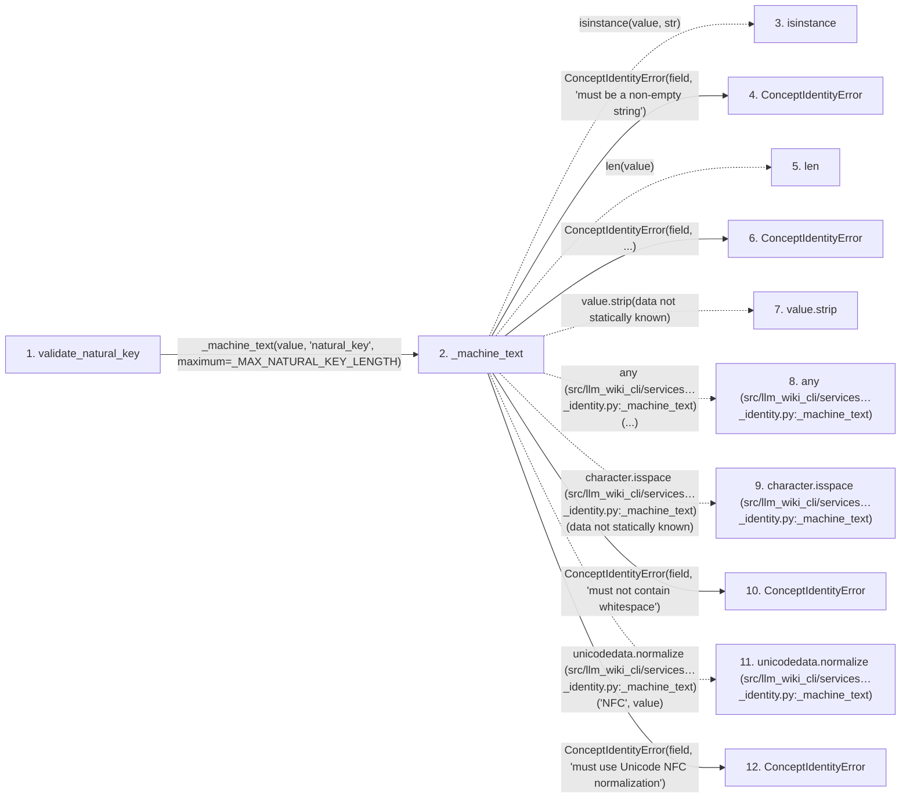

# validate_natural_key

**Entry point:** `validate_natural_key` (`api`)
**Source:** [concept_identity](../modules/concept_identity.md)
**Modules touched:** [concept_identity](../modules/concept_identity.md)

## Call sequence

```mermaid
sequenceDiagram
    participant p0 as validate_natural_key
    participant p1 as _machine_text
    participant p2 as isinstance
    participant p3 as ConceptIdentityError
    participant p4 as len
    participant p5 as value.strip
    participant p6 as any (src/llm_wiki_cli/services…_identity.py:_machine_text)
    participant p7 as character.isspace (src/llm_wiki_cli/services…_identity.py:_machine_text)
    participant p8 as unicodedata.normalize (src/llm_wiki_cli/services…_identity.py:_machine_text)
    participant p9 as unicodedata.category(…).startswith (src/llm_wiki_cli/services…_identity.py:_machine_text)
    participant p10 as unicodedata.category (src/llm_wiki_cli/services…_identity.py:_machine_text)
    participant p11 as text.partition
    participant p12 as _NATURAL_KEY_PREFIX_RE.fullmatch
    participant p13 as _NATURAL_KEY_PAYLOAD_RE.fullmatch
    participant p14 as _INVALID_PERCENT_RE.search
    participant p15 as _PERCENT_ESCAPE_RE.finditer
    participant p16 as match.group
    participant p17 as match.group(…).upper
    participant p18 as unquote
    participant p19 as _safe_decoded_coordinate
    p0->>p1: _machine_text
    p1-->>p2: isinstance
    p1->>p3: ConceptIdentityError
    p1-->>p4: len
    p1->>p3: ConceptIdentityError
    p1-->>p5: value.strip
    p1-->>p6: any (src/llm_wiki_cli/services…_identity.py:_machine_text)
    p1-->>p7: character.isspace (src/llm_wiki_cli/services…_identity.py:_machine_text)
    p1->>p3: ConceptIdentityError
    p1-->>p8: unicodedata.normalize (src/llm_wiki_cli/services…_identity.py:_machine_text)
    p1->>p3: ConceptIdentityError
    p1-->>p6: any (src/llm_wiki_cli/services…_identity.py:_machine_text)
    p1-->>p9: unicodedata.category(…).startswith (src/llm_wiki_cli/services…_identity.py:_machine_text)
    p1-->>p10: unicodedata.category (src/llm_wiki_cli/services…_identity.py:_machine_text)
    p1->>p3: ConceptIdentityError
    p0-->>p11: text.partition
    p0-->>p12: _NATURAL_KEY_PREFIX_RE.fullmatch
    p0-->>p13: _NATURAL_KEY_PAYLOAD_RE.fullmatch
    p0->>p3: ConceptIdentityError
    p0-->>p14: _INVALID_PERCENT_RE.search
    p0->>p3: ConceptIdentityError
    p0-->>p15: _PERCENT_ESCAPE_RE.finditer
    p0-->>p16: match.group
    p0-->>p17: match.group(…).upper
    p0-->>p16: match.group
    p0->>p3: ConceptIdentityError
    p0-->>p18: unquote
    p0->>p3: ConceptIdentityError
    p0->>p19: _safe_decoded_coordinate
    p19->>p3: ConceptIdentityError
```

<!-- Auto-generated from static call edges. Dashed arrows are external or unresolved calls. Reviewed runtime conditions and side effects belong in Behavior. -->

> Call sequence diagram shows 30 of 59 interactions; 29 omitted to keep the visualization within the 30-interaction and generated-diagram limits.

## Data flow

<!-- Auto-generated static analysis. Treat values and boundaries as best-effort hints, not runtime proof. -->

### Step data

| Step | Inputs | Reads | Writes | Returns |
|---|---|---|---|---|
| `validate_natural_key` | `value: object` | `_MAX_NATURAL_KEY_LENGTH`, `_NATURAL_KEY_QUOTE_SAFE` | - | `text` |
| `_machine_text` | `value: object`, `field: str`, `maximum: int` | - | - | `value` |
| `isinstance` | - | - | - | - |
| `ConceptIdentityError` | - | - | - | - |
| `len` | - | - | - | - |
| `ConceptIdentityError` | - | - | - | - |
| `value.strip` | - | - | - | - |
| `any (src/llm_wiki_cli/services…_identity.py:_machine_text)` | - | - | - | - |
| `character.isspace (src/llm_wiki_cli/services…_identity.py:_machine_text)` | - | - | - | - |
| `ConceptIdentityError` | - | - | - | - |
| `unicodedata.normalize (src/llm_wiki_cli/services…_identity.py:_machine_text)` | - | - | - | - |
| `ConceptIdentityError` | - | - | - | - |

### Call data

| From | To | Line | Call |
|---|---|---:|---|
| validate_natural_key | _machine_text | 328 | `_machine_text(value, 'natural_key', maximum=_MAX_NATURAL_KEY_LENGTH)` |
| _machine_text | isinstance | 912 | `isinstance(value, str)` |
| _machine_text | ConceptIdentityError | 913 | `ConceptIdentityError(field, 'must be a non-empty string')` |
| _machine_text | len | 914 | `len(value)` |
| _machine_text | ConceptIdentityError | 915 | `ConceptIdentityError(field, ...)` |
| _machine_text | value.strip | 916 | `value.strip(data not statically known)` |
| _machine_text | any (src/llm_wiki_cli/services…_identity.py:_machine_text) | 916 | `any(...)` |
| _machine_text | character.isspace (src/llm_wiki_cli/services…_identity.py:_machine_text) | 916 | `character.isspace(data not statically known)` |
| _machine_text | ConceptIdentityError | 917 | `ConceptIdentityError(field, 'must not contain whitespace')` |
| _machine_text | unicodedata.normalize (src/llm_wiki_cli/services…_identity.py:_machine_text) | 918 | `unicodedata.normalize('NFC', value)` |
| _machine_text | ConceptIdentityError | 919 | `ConceptIdentityError(field, 'must use Unicode NFC normalization')` |

### Boundary effects

*No boundary effects detected.*

### Static analysis gaps

| Kind | Step | Target | Line |
|---|---|---|---:|
| external_call | `_machine_text` | `isinstance` | 912 |
| unresolved_call | `_machine_text` | `value.strip` | 916 |
| external_call | `_machine_text` | `any` | 916 |
| unresolved_call | `_machine_text` | `character.isspace` | 916 |
| external_call | `_machine_text` | `unicodedata.normalize` | 918 |
| step_limit | `validate_natural_key` | `first 12 steps` | 0 |

## Behavior

This flow starts at `validate_natural_key` and is classified as `api`. The generated call and data-flow sections are bounded static projections; runtime conditions and side effects require source-level confirmation.
