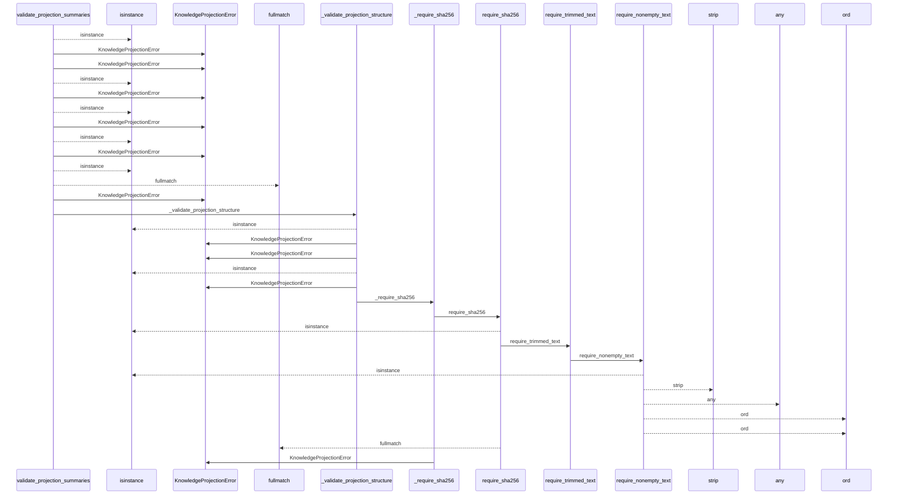
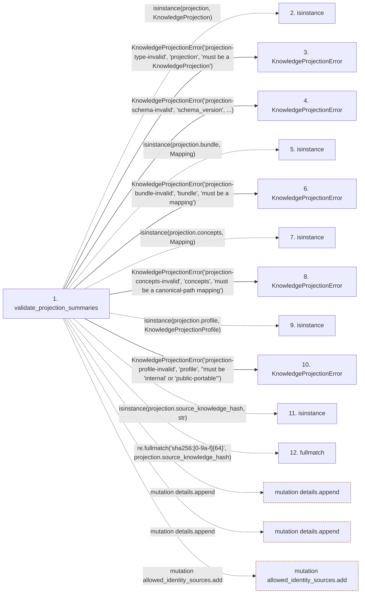

# validate_projection_summaries

**Entry point:** `validate_projection_summaries` (`api`)
**Source:** [knowledge_projection](../modules/knowledge_projection.md)
**Modules touched:** [concept_identity](../modules/concept_identity.md), [knowledge_envelope](../modules/knowledge_envelope.md), [knowledge_observability](../modules/knowledge_observability.md), and 2 more

**Complete modules touched:**

- [concept_identity](../modules/concept_identity.md)
- [knowledge_envelope](../modules/knowledge_envelope.md)
- [knowledge_observability](../modules/knowledge_observability.md)
- [knowledge_projection](../modules/knowledge_projection.md)
- [validation](../modules/validation.md)

## Call sequence

<!-- Auto-generated from static call edges. Dashed arrows are external or unresolved calls. Reviewed runtime conditions and side effects belong in Behavior. -->

> Call sequence diagram shows 30 of 688 interactions; 658 omitted to keep the visualization within the 30-interaction and generated-diagram limits.

> Trace truncated at the depth limit; deeper calls are omitted.

## Data flow

<!-- Auto-generated static analysis. Treat values and boundaries as best-effort hints, not runtime proof. -->

### Step data

| Step | Inputs | Reads | Writes | Returns |
|---|---|---|---|---|
| `validate_projection_summaries` | `projection: KnowledgeProjection`, `canonical_paths: Sequence[str]` | `KnowledgeProjection`, `PROJECTION_SCHEMA_VERSION`, `PROJECTION_SCHEMA_VERSION`, `Mapping`, `Mapping`, `KnowledgeProjectionProfile`, `Sequence`, `ConceptIdentityError` | `seen_uids[...]`, `summaries[...]` | `summaries` |
| `isinstance` | - | - | - | - |
| `KnowledgeProjectionError` | - | - | - | - |
| `KnowledgeProjectionError` | - | - | - | - |
| `isinstance` | - | - | - | - |
| `KnowledgeProjectionError` | - | - | - | - |
| `isinstance` | - | - | - | - |
| `KnowledgeProjectionError` | - | - | - | - |
| `isinstance` | - | - | - | - |
| `KnowledgeProjectionError` | - | - | - | - |
| `isinstance` | - | - | - | - |
| `fullmatch` | - | - | - | - |

### Call data

| From | To | Line | Call |
|---|---|---:|---|
| validate_projection_summaries | isinstance | 528 | `isinstance(projection, KnowledgeProjection)` |
| validate_projection_summaries | KnowledgeProjectionError | 529 | `KnowledgeProjectionError('projection-type-invalid', 'projection', 'must be a KnowledgeProjection')` |
| validate_projection_summaries | KnowledgeProjectionError | 535 | `KnowledgeProjectionError('projection-schema-invalid', 'schema_version', ...)` |
| validate_projection_summaries | isinstance | 540 | `isinstance(projection.bundle, Mapping)` |
| validate_projection_summaries | KnowledgeProjectionError | 541 | `KnowledgeProjectionError('projection-bundle-invalid', 'bundle', 'must be a mapping')` |
| validate_projection_summaries | isinstance | 546 | `isinstance(projection.concepts, Mapping)` |
| validate_projection_summaries | KnowledgeProjectionError | 547 | `KnowledgeProjectionError('projection-concepts-invalid', 'concepts', 'must be a canonical-path mapping')` |
| validate_projection_summaries | isinstance | 552 | `isinstance(projection.profile, KnowledgeProjectionProfile)` |
| validate_projection_summaries | KnowledgeProjectionError | 553 | `KnowledgeProjectionError('projection-profile-invalid', 'profile', "must be 'internal' or 'public-portable'")` |
| validate_projection_summaries | isinstance | 559 | `isinstance(projection.source_knowledge_hash, str)` |
| validate_projection_summaries | fullmatch | 560 | `re.fullmatch('sha256:[0-9a-f]{64}', projection.source_knowledge_hash)` |

### Boundary effects

| Kind | Target | Step | Line |
|---|---|---|---:|
| mutation | `details.append` | `validate_projection_summaries` | 596 |
| mutation | `details.append` | `validate_projection_summaries` | 598 |
| mutation | `allowed_identity_sources.add` | `validate_projection_summaries` | 622 |

### Static analysis gaps

| Kind | Step | Target | Line |
|---|---|---|---:|
| unresolved_call | `validate_projection_summaries` | `isinstance` | 528 |
| unresolved_call | `validate_projection_summaries` | `isinstance` | 540 |
| unresolved_call | `validate_projection_summaries` | `isinstance` | 546 |
| unresolved_call | `validate_projection_summaries` | `isinstance` | 552 |
| unresolved_call | `validate_projection_summaries` | `isinstance` | 559 |
| external_call | `validate_projection_summaries` | `re.fullmatch` | 560 |
| step_limit | `validate_projection_summaries` | `first 12 steps` | 0 |
| truncated_flow | `validate_projection_summaries` | `depth limit` | 0 |

## Behavior

This flow starts at `validate_projection_summaries` and is classified as `api`. The generated call and data-flow sections are bounded static projections; runtime conditions and side effects require source-level confirmation.
