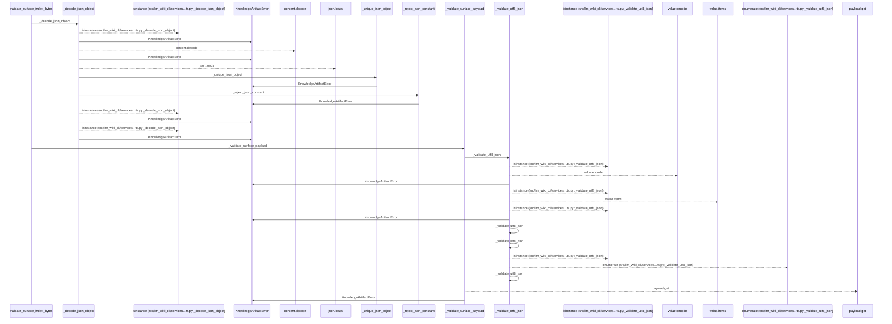
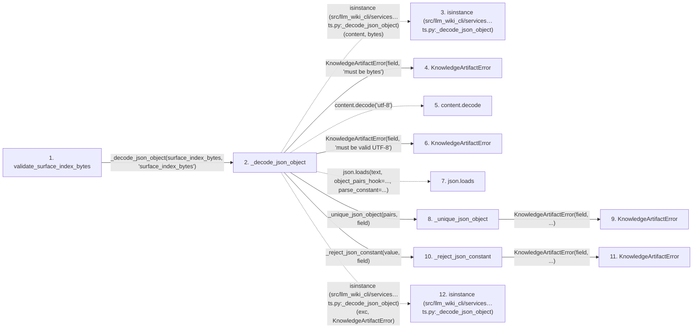

# validate_surface_index_bytes

**Entry point:** `validate_surface_index_bytes` (`api`)
**Source:** [knowledge_artifacts](../modules/knowledge_artifacts.md)
**Modules touched:** [knowledge_artifacts](../modules/knowledge_artifacts.md), [knowledge_evidence](../modules/knowledge_evidence.md), [validation](../modules/validation.md), [wiki_surface](../modules/wiki_surface.md)

## Call sequence

<!-- Auto-generated from static call edges. Dashed arrows are external or unresolved calls. Reviewed runtime conditions and side effects belong in Behavior. -->

> Call sequence diagram shows 30 of 334 interactions; 304 omitted to keep the visualization within the 30-interaction and generated-diagram limits.

> Trace truncated at the depth limit; deeper calls are omitted.

## Data flow

<!-- Auto-generated static analysis. Treat values and boundaries as best-effort hints, not runtime proof. -->

### Step data

| Step | Inputs | Reads | Writes | Returns |
|---|---|---|---|---|
| `validate_surface_index_bytes` | `surface_index_bytes: bytes` | - | - | `surface_payload` |
| `_decode_json_object` | `content: bytes`, `field: str` | `KnowledgeArtifactError`, `Mapping` | - | `value` |
| `isinstance (src/llm_wiki_cli/services…ts.py:_decode_json_object)` | - | - | - | - |
| `KnowledgeArtifactError` | - | - | - | - |
| `content.decode` | - | - | - | - |
| `KnowledgeArtifactError` | - | - | - | - |
| `json.loads` | - | - | - | - |
| `_unique_json_object` | `pairs: list[tuple[str, Any]]`, `field: str` | - | `result[...]` | `result` |
| `KnowledgeArtifactError` | - | - | - | - |
| `_reject_json_constant` | `value: str`, `field: str` | - | - | - |
| `KnowledgeArtifactError` | - | - | - | - |
| `isinstance (src/llm_wiki_cli/services…ts.py:_decode_json_object)` | - | - | - | - |

### Call data

| From | To | Line | Call |
|---|---|---:|---|
| validate_surface_index_bytes | _decode_json_object | 233 | `_decode_json_object(surface_index_bytes, 'surface_index_bytes')` |
| _decode_json_object | isinstance (src/llm_wiki_cli/services…ts.py:_decode_json_object) | 574 | `isinstance(content, bytes)` |
| _decode_json_object | KnowledgeArtifactError | 575 | `KnowledgeArtifactError(field, 'must be bytes')` |
| _decode_json_object | content.decode | 577 | `content.decode('utf-8')` |
| _decode_json_object | KnowledgeArtifactError | 579 | `KnowledgeArtifactError(field, 'must be valid UTF-8')` |
| _decode_json_object | json.loads | 581 | `json.loads(text, object_pairs_hook=..., parse_constant=...)` |
| _decode_json_object | _unique_json_object | 583 | `_unique_json_object(pairs, field)` |
| _unique_json_object | KnowledgeArtifactError | 602 | `KnowledgeArtifactError(field, ...)` |
| _decode_json_object | _reject_json_constant | 584 | `_reject_json_constant(value, field)` |
| _reject_json_constant | KnowledgeArtifactError | 608 | `KnowledgeArtifactError(field, ...)` |
| _decode_json_object | isinstance (src/llm_wiki_cli/services…ts.py:_decode_json_object) | 587 | `isinstance(exc, KnowledgeArtifactError)` |

### Boundary effects

*No boundary effects detected.*

### Static analysis gaps

| Kind | Step | Target | Line |
|---|---|---|---:|
| external_call | `_decode_json_object` | `isinstance` | 574 |
| unresolved_call | `_decode_json_object` | `content.decode` | 577 |
| external_call | `_decode_json_object` | `json.loads` | 581 |
| external_call | `_decode_json_object` | `isinstance` | 587 |
| step_limit | `validate_surface_index_bytes` | `first 12 steps` | 0 |
| truncated_flow | `validate_surface_index_bytes` | `depth limit` | 0 |

## Behavior

This flow starts at `validate_surface_index_bytes` and is classified as `api`. The generated call and data-flow sections are bounded static projections; runtime conditions and side effects require source-level confirmation.
