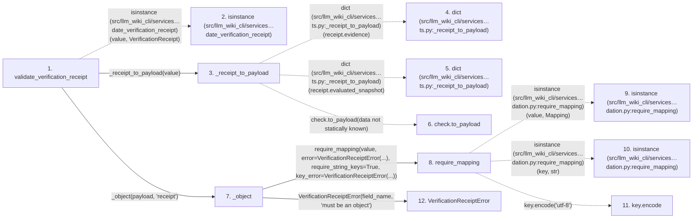

# validate_verification_receipt

**Entry point:** `validate_verification_receipt` (`api`)
**Source:** [verification_contracts](../modules/verification_contracts.md)
**Modules touched:** [knowledge_evidence](../modules/knowledge_evidence.md), [validation](../modules/validation.md), [verification_contracts](../modules/verification_contracts.md)

## Call sequence

```mermaid
sequenceDiagram
    participant p0 as validate_verification_receipt
    participant p1 as isinstance (src/llm_wiki_cli/services…date_verification_receipt)
    participant p2 as _receipt_to_payload
    participant p3 as dict (src/llm_wiki_cli/services…ts.py:_receipt_to_payload)
    participant p4 as check.to_payload
    participant p5 as _object
    participant p6 as require_mapping
    participant p7 as isinstance (src/llm_wiki_cli/services…dation.py:require_mapping)
    participant p8 as key.encode
    participant p9 as VerificationReceiptError
    participant p10 as _exact_fields
    participant p11 as set (src/llm_wiki_cli/services…ontracts.py:_exact_fields)
    participant p12 as require_exact_fields
    participant p13 as isinstance (src/llm_wiki_cli/services…n.py:require_exact_fields)
    participant p14 as str (src/llm_wiki_cli/services…n.py:require_exact_fields)
    participant p15 as set (src/llm_wiki_cli/services…n.py:require_exact_fields)
    participant p16 as tuple (src/llm_wiki_cli/services…n.py:require_exact_fields)
    participant p17 as sorted (src/llm_wiki_cli/services…n.py:require_exact_fields)
    participant p18 as invalid_error
    participant p19 as error_factory
    participant p20 as _string
    p0-->>p1: isinstance (src/llm_wiki_cli/services…date_verification_receipt)
    p0->>p2: _receipt_to_payload
    p2-->>p3: dict (src/llm_wiki_cli/services…ts.py:_receipt_to_payload)
    p2-->>p3: dict (src/llm_wiki_cli/services…ts.py:_receipt_to_payload)
    p2-->>p4: check.to_payload
    p0->>p5: _object
    p5->>p6: require_mapping
    p6-->>p7: isinstance (src/llm_wiki_cli/services…dation.py:require_mapping)
    p6-->>p7: isinstance (src/llm_wiki_cli/services…dation.py:require_mapping)
    p6-->>p8: key.encode
    p5->>p9: VerificationReceiptError
    p5->>p9: VerificationReceiptError
    p0->>p10: _exact_fields
    p10-->>p11: set (src/llm_wiki_cli/services…ontracts.py:_exact_fields)
    p10->>p12: require_exact_fields
    p12-->>p13: isinstance (src/llm_wiki_cli/services…n.py:require_exact_fields)
    p12-->>p14: str (src/llm_wiki_cli/services…n.py:require_exact_fields)
    p12-->>p15: set (src/llm_wiki_cli/services…n.py:require_exact_fields)
    p12-->>p15: set (src/llm_wiki_cli/services…n.py:require_exact_fields)
    p12-->>p15: set (src/llm_wiki_cli/services…n.py:require_exact_fields)
    p12-->>p16: tuple (src/llm_wiki_cli/services…n.py:require_exact_fields)
    p12-->>p17: sorted (src/llm_wiki_cli/services…n.py:require_exact_fields)
    p12-->>p16: tuple (src/llm_wiki_cli/services…n.py:require_exact_fields)
    p12-->>p17: sorted (src/llm_wiki_cli/services…n.py:require_exact_fields)
    p12-->>p18: invalid_error
    p12-->>p19: error_factory
    p10->>p9: VerificationReceiptError
    p10->>p9: VerificationReceiptError
    p10->>p9: VerificationReceiptError
    p0->>p20: _string
```

<!-- Auto-generated from static call edges. Dashed arrows are external or unresolved calls. Reviewed runtime conditions and side effects belong in Behavior. -->

> Call sequence diagram shows 30 of 169 interactions; 139 omitted to keep the visualization within the 30-interaction and generated-diagram limits.

## Data flow

<!-- Auto-generated static analysis. Treat values and boundaries as best-effort hints, not runtime proof. -->

### Step data

| Step | Inputs | Reads | Writes | Returns |
|---|---|---|---|---|
| `validate_verification_receipt` | `value: VerificationReceipt \| object` | `VerificationReceipt`, `VERIFICATION_RECEIPT_SCHEMA_VERSION`, `VERIFICATION_RECEIPT_SCHEMA_VERSION`, `VerificationContractError`, `MAX_CHECKS_PER_RECEIPT` | - | `VerificationReceipt(...)` |
| `isinstance (src/llm_wiki_cli/services…date_verification_receipt)` | - | - | - | - |
| `_receipt_to_payload` | `receipt: VerificationReceipt` | - | - | `{...}` |
| `dict (src/llm_wiki_cli/services…ts.py:_receipt_to_payload)` | - | - | - | - |
| `dict (src/llm_wiki_cli/services…ts.py:_receipt_to_payload)` | - | - | - | - |
| `check.to_payload` | - | - | - | - |
| `_object` | `value: object`, `field_name: str` | - | - | `require_mapping(...)` |
| `require_mapping` | `value: object`, `error: Exception`, `require_string_keys: bool`, `key_error: Exception \| None`, `require_utf8_keys: bool`, `utf8_key_error: Exception \| None` | `Mapping` | - | `value` |
| `isinstance (src/llm_wiki_cli/services…dation.py:require_mapping)` | - | - | - | - |
| `isinstance (src/llm_wiki_cli/services…dation.py:require_mapping)` | - | - | - | - |
| `key.encode` | - | - | - | - |
| `VerificationReceiptError` | - | - | - | - |

### Call data

| From | To | Line | Call |
|---|---|---:|---|
| validate_verification_receipt | isinstance (src/llm_wiki_cli/services…date_verification_receipt) | 806 | `isinstance(value, VerificationReceipt)` |
| validate_verification_receipt | _receipt_to_payload | 805 | `_receipt_to_payload(value)` |
| _receipt_to_payload | dict (src/llm_wiki_cli/services…ts.py:_receipt_to_payload) | 1101 | `dict(receipt.evidence)` |
| _receipt_to_payload | dict (src/llm_wiki_cli/services…ts.py:_receipt_to_payload) | 1103 | `dict(receipt.evaluated_snapshot)` |
| _receipt_to_payload | check.to_payload | 1107 | `check.to_payload(data not statically known)` |
| validate_verification_receipt | _object | 809 | `_object(payload, 'receipt')` |
| _object | require_mapping | 1441 | `require_mapping(value, error=VerificationReceiptError(...), require_string_keys=True, key_error=VerificationReceiptError(...))` |
| require_mapping | isinstance (src/llm_wiki_cli/services…dation.py:require_mapping) | 727 | `isinstance(value, Mapping)` |
| require_mapping | isinstance (src/llm_wiki_cli/services…dation.py:require_mapping) | 731 | `isinstance(key, str)` |
| require_mapping | key.encode | 736 | `key.encode('utf-8')` |
| _object | VerificationReceiptError | 1443 | `VerificationReceiptError(field_name, 'must be an object')` |

### Boundary effects

*No boundary effects detected.*

### Static analysis gaps

| Kind | Step | Target | Line |
|---|---|---|---:|
| external_call | `validate_verification_receipt` | `isinstance` | 806 |
| unresolved_call | `_receipt_to_payload` | `check.to_payload` | 1107 |
| external_call | `require_mapping` | `isinstance` | 727 |
| external_call | `require_mapping` | `isinstance` | 731 |
| unresolved_call | `require_mapping` | `key.encode` | 736 |
| step_limit | `validate_verification_receipt` | `first 12 steps` | 0 |

## Behavior

This flow starts at `validate_verification_receipt` and is classified as `api`. The generated call and data-flow sections are bounded static projections; runtime conditions and side effects require source-level confirmation.
