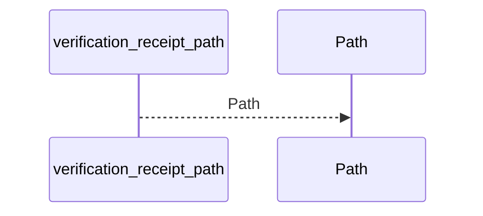
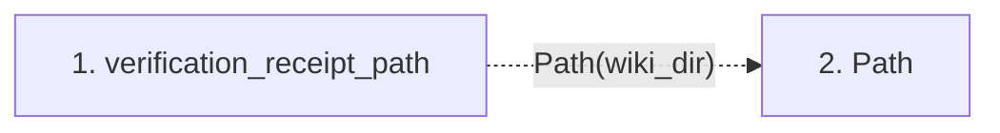

# verification_receipt_path

**Entry point:** `verification_receipt_path` (`api`)
**Source:** [verification_contracts](../modules/verification_contracts.md)
**Modules touched:** [verification_contracts](../modules/verification_contracts.md)

## Call sequence

<!-- Auto-generated from static call edges. Dashed arrows are external or unresolved calls. Reviewed runtime conditions and side effects belong in Behavior. -->

## Data flow

<!-- Auto-generated static analysis. Treat values and boundaries as best-effort hints, not runtime proof. -->

### Step data

| Step | Inputs | Reads | Writes | Returns |
|---|---|---|---|---|
| `verification_receipt_path` | `wiki_dir: str \| Path` | `VERIFICATION_RECEIPT_FILENAME` | - | `...` |
| `Path` | - | - | - | - |

### Call data

| From | To | Line | Call |
|---|---|---:|---|
| verification_receipt_path | Path | 946 | `Path(wiki_dir)` |

### Boundary effects

*No boundary effects detected.*

### Static analysis gaps

*No static analysis gaps detected.*

## Behavior

This flow starts at `verification_receipt_path` and is classified as `api`. The generated call and data-flow sections are bounded static projections; runtime conditions and side effects require source-level confirmation.
