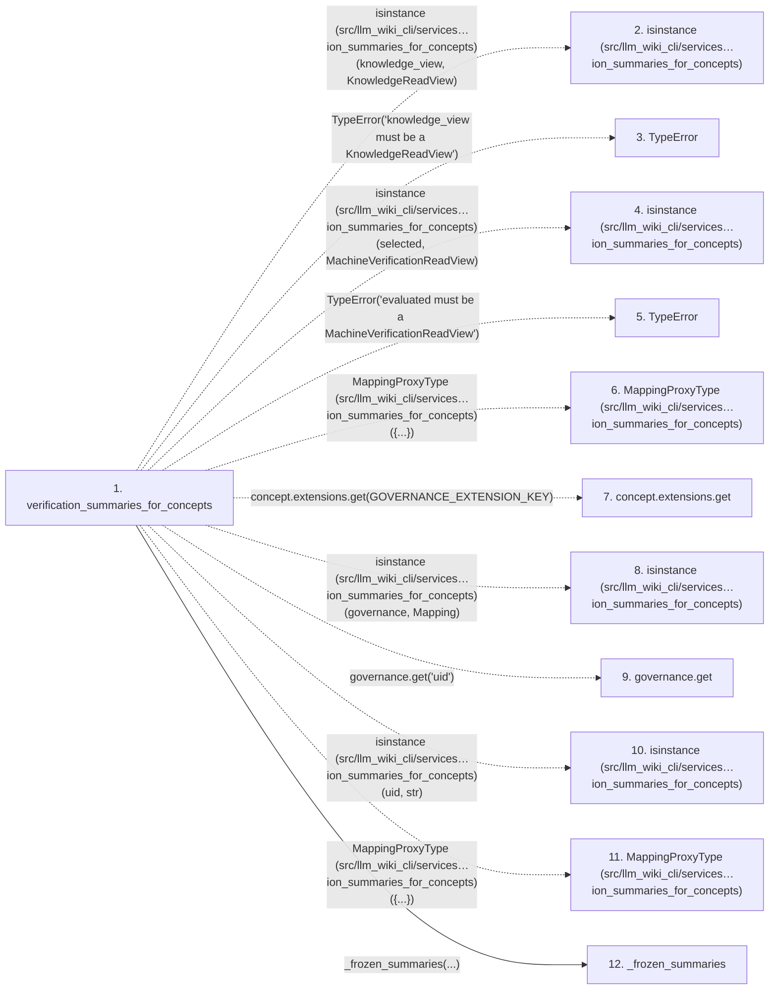

# verification_summaries_for_concepts

**Entry point:** `verification_summaries_for_concepts` (`api`)
**Source:** [knowledge_verification](../modules/knowledge_verification.md)
**Modules touched:** [knowledge_verification](../modules/knowledge_verification.md)

## Call sequence

```mermaid
sequenceDiagram
    participant p0 as verification_summaries_for_concepts
    participant p1 as isinstance (src/llm_wiki_cli/services…ion_summaries_for_concepts)
    participant p2 as TypeError
    participant p3 as MappingProxyType (src/llm_wiki_cli/services…ion_summaries_for_concepts)
    participant p4 as concept.extensions.get
    participant p5 as governance.get
    participant p6 as _frozen_summaries
    participant p7 as MappingProxyType (src/llm_wiki_cli/services…ation.py:_frozen_summaries)
    participant p8 as dict (src/llm_wiki_cli/services…ation.py:_frozen_summaries)
    participant p9 as sorted (src/llm_wiki_cli/services…ation.py:_frozen_summaries)
    participant p10 as dict (src/llm_wiki_cli/services…ion_summaries_for_concepts)
    participant p11 as sorted (src/llm_wiki_cli/services…ion_summaries_for_concepts)
    participant p12 as set
    participant p13 as concept_coordinates.values
    participant p14 as list
    participant p15 as _deep_copy
    participant p16 as isinstance (src/llm_wiki_cli/services…verification.py:_deep_copy)
    participant p17 as str
    participant p18 as sorted (src/llm_wiki_cli/services…verification.py:_deep_copy)
    participant p19 as value.items
    p0-->>p1: isinstance (src/llm_wiki_cli/services…ion_summaries_for_concepts)
    p0-->>p2: TypeError
    p0-->>p1: isinstance (src/llm_wiki_cli/services…ion_summaries_for_concepts)
    p0-->>p2: TypeError
    p0-->>p3: MappingProxyType (src/llm_wiki_cli/services…ion_summaries_for_concepts)
    p0-->>p4: concept.extensions.get
    p0-->>p1: isinstance (src/llm_wiki_cli/services…ion_summaries_for_concepts)
    p0-->>p5: governance.get
    p0-->>p1: isinstance (src/llm_wiki_cli/services…ion_summaries_for_concepts)
    p0-->>p3: MappingProxyType (src/llm_wiki_cli/services…ion_summaries_for_concepts)
    p0->>p6: _frozen_summaries
    p6-->>p7: MappingProxyType (src/llm_wiki_cli/services…ation.py:_frozen_summaries)
    p6-->>p7: MappingProxyType (src/llm_wiki_cli/services…ation.py:_frozen_summaries)
    p6-->>p8: dict (src/llm_wiki_cli/services…ation.py:_frozen_summaries)
    p6-->>p9: sorted (src/llm_wiki_cli/services…ation.py:_frozen_summaries)
    p0-->>p10: dict (src/llm_wiki_cli/services…ion_summaries_for_concepts)
    p0-->>p11: sorted (src/llm_wiki_cli/services…ion_summaries_for_concepts)
    p0-->>p12: set
    p0-->>p13: concept_coordinates.values
    p0-->>p14: list
    p0->>p15: _deep_copy
    p15-->>p16: isinstance (src/llm_wiki_cli/services…verification.py:_deep_copy)
    p15-->>p17: str
    p15->>p15: _deep_copy
    p15-->>p18: sorted (src/llm_wiki_cli/services…verification.py:_deep_copy)
    p15-->>p19: value.items
    p15-->>p17: str
    p15-->>p16: isinstance (src/llm_wiki_cli/services…verification.py:_deep_copy)
    p15->>p15: _deep_copy
    p15-->>p16: isinstance (src/llm_wiki_cli/services…verification.py:_deep_copy)
```

<!-- Auto-generated from static call edges. Dashed arrows are external or unresolved calls. Reviewed runtime conditions and side effects belong in Behavior. -->

> Call sequence diagram shows 30 of 41 interactions; 11 omitted to keep the visualization within the 30-interaction and generated-diagram limits.

## Data flow

<!-- Auto-generated static analysis. Treat values and boundaries as best-effort hints, not runtime proof. -->

### Step data

| Step | Inputs | Reads | Writes | Returns |
|---|---|---|---|---|
| `verification_summaries_for_concepts` | `knowledge_view: KnowledgeReadView`, `evaluated: MachineVerificationReadView \| None` | `KnowledgeReadView`, `MachineVerificationReadView`, `GOVERNANCE_EXTENSION_KEY`, `Mapping`, `MachineVerificationAvailability`, `MachineVerificationAvailability`, `MachineVerificationAvailability` | `concept_coordinates[...]` | `MappingProxyType(...)`, `MappingProxyType(...)`, `_frozen_summaries(...)`, `_frozen_summaries(...)`, `MappingProxyType(...)`, `MappingProxyType(...)`, `_frozen_summaries(...)` |
| `isinstance (src/llm_wiki_cli/services…ion_summaries_for_concepts)` | - | - | - | - |
| `TypeError` | - | - | - | - |
| `isinstance (src/llm_wiki_cli/services…ion_summaries_for_concepts)` | - | - | - | - |
| `TypeError` | - | - | - | - |
| `MappingProxyType (src/llm_wiki_cli/services…ion_summaries_for_concepts)` | - | - | - | - |
| `concept.extensions.get` | - | - | - | - |
| `isinstance (src/llm_wiki_cli/services…ion_summaries_for_concepts)` | - | - | - | - |
| `governance.get` | - | - | - | - |
| `isinstance (src/llm_wiki_cli/services…ion_summaries_for_concepts)` | - | - | - | - |
| `MappingProxyType (src/llm_wiki_cli/services…ion_summaries_for_concepts)` | - | - | - | - |
| `_frozen_summaries` | `values: Mapping[str, Mapping[str, Any]]` | - | - | `MappingProxyType(...)` |

### Call data

| From | To | Line | Call |
|---|---|---:|---|
| verification_summaries_for_concepts | isinstance (src/llm_wiki_cli/services…ion_summaries_for_concepts) | 167 | `isinstance(knowledge_view, KnowledgeReadView)` |
| verification_summaries_for_concepts | TypeError | 168 | `TypeError('knowledge_view must be a KnowledgeReadView')` |
| verification_summaries_for_concepts | isinstance (src/llm_wiki_cli/services…ion_summaries_for_concepts) | 174 | `isinstance(selected, MachineVerificationReadView)` |
| verification_summaries_for_concepts | TypeError | 175 | `TypeError('evaluated must be a MachineVerificationReadView')` |
| verification_summaries_for_concepts | MappingProxyType (src/llm_wiki_cli/services…ion_summaries_for_concepts) | 178 | `MappingProxyType({...})` |
| verification_summaries_for_concepts | concept.extensions.get | 181 | `concept.extensions.get(GOVERNANCE_EXTENSION_KEY)` |
| verification_summaries_for_concepts | isinstance (src/llm_wiki_cli/services…ion_summaries_for_concepts) | 182 | `isinstance(governance, Mapping)` |
| verification_summaries_for_concepts | governance.get | 182 | `governance.get('uid')` |
| verification_summaries_for_concepts | isinstance (src/llm_wiki_cli/services…ion_summaries_for_concepts) | 184 | `isinstance(uid, str)` |
| verification_summaries_for_concepts | MappingProxyType (src/llm_wiki_cli/services…ion_summaries_for_concepts) | 191 | `MappingProxyType({...})` |
| verification_summaries_for_concepts | _frozen_summaries | 197 | `_frozen_summaries(...)` |

### Boundary effects

*No boundary effects detected.*

### Static analysis gaps

| Kind | Step | Target | Line |
|---|---|---|---:|
| external_call | `verification_summaries_for_concepts` | `isinstance` | 167 |
| external_call | `verification_summaries_for_concepts` | `TypeError` | 168 |
| external_call | `verification_summaries_for_concepts` | `isinstance` | 174 |
| external_call | `verification_summaries_for_concepts` | `TypeError` | 175 |
| external_call | `verification_summaries_for_concepts` | `MappingProxyType` | 178 |
| unresolved_call | `verification_summaries_for_concepts` | `concept.extensions.get` | 181 |
| external_call | `verification_summaries_for_concepts` | `isinstance` | 182 |
| unresolved_call | `verification_summaries_for_concepts` | `governance.get` | 182 |
| external_call | `verification_summaries_for_concepts` | `isinstance` | 184 |
| external_call | `verification_summaries_for_concepts` | `MappingProxyType` | 191 |
| step_limit | `verification_summaries_for_concepts` | `first 12 steps` | 0 |

## Behavior

This flow starts at `verification_summaries_for_concepts` and is classified as `api`. The generated call and data-flow sections are bounded static projections; runtime conditions and side effects require source-level confirmation.
