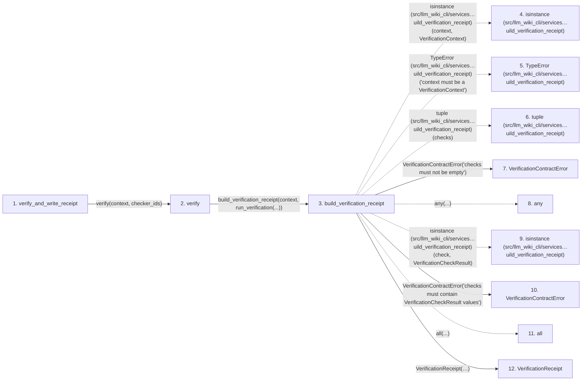

# verify_and_write_receipt

**Entry point:** `verify_and_write_receipt` (`api`)
**Source:** [verification_contracts](../modules/verification_contracts.md)
**Modules touched:** [io](../modules/io.md), [knowledge_evidence](../modules/knowledge_evidence.md), [validation](../modules/validation.md), [verification_contracts](../modules/verification_contracts.md)

## Call sequence

```mermaid
sequenceDiagram
    participant p0 as verify_and_write_receipt
    participant p1 as verify
    participant p2 as build_verification_receipt
    participant p3 as isinstance (src/llm_wiki_cli/services…uild_verification_receipt)
    participant p4 as TypeError (src/llm_wiki_cli/services…uild_verification_receipt)
    participant p5 as tuple (src/llm_wiki_cli/services…uild_verification_receipt)
    participant p6 as VerificationContractError
    participant p7 as any
    participant p8 as all
    participant p9 as VerificationReceipt
    participant p10 as run_verification
    participant p11 as isinstance (src/llm_wiki_cli/services…racts.py:run_verification)
    participant p12 as TypeError (src/llm_wiki_cli/services…racts.py:run_verification)
    participant p13 as _selected_contracts
    participant p14 as isinstance (src/llm_wiki_cli/services…ts.py:_selected_contracts)
    participant p15 as tuple (src/llm_wiki_cli/services…ts.py:_selected_contracts)
    participant p16 as sorted (src/llm_wiki_cli/services…ts.py:_selected_contracts)
    participant p17 as len (src/llm_wiki_cli/services…ts.py:_selected_contracts)
    participant p18 as set (src/llm_wiki_cli/services…ts.py:_selected_contracts)
    participant p19 as UnknownVerificationCheckerError
    participant p20 as _checker_id
    p0->>p1: verify
    p1->>p2: build_verification_receipt
    p2-->>p3: isinstance (src/llm_wiki_cli/services…uild_verification_receipt)
    p2-->>p4: TypeError (src/llm_wiki_cli/services…uild_verification_receipt)
    p2-->>p5: tuple (src/llm_wiki_cli/services…uild_verification_receipt)
    p2->>p6: VerificationContractError
    p2-->>p7: any
    p2-->>p3: isinstance (src/llm_wiki_cli/services…uild_verification_receipt)
    p2->>p6: VerificationContractError
    p2-->>p8: all
    p2->>p9: VerificationReceipt
    p1->>p10: run_verification
    p10-->>p11: isinstance (src/llm_wiki_cli/services…racts.py:run_verification)
    p10-->>p12: TypeError (src/llm_wiki_cli/services…racts.py:run_verification)
    p10->>p13: _selected_contracts
    p13-->>p14: isinstance (src/llm_wiki_cli/services…ts.py:_selected_contracts)
    p13->>p6: VerificationContractError
    p13-->>p15: tuple (src/llm_wiki_cli/services…ts.py:_selected_contracts)
    p13-->>p16: sorted (src/llm_wiki_cli/services…ts.py:_selected_contracts)
    p13-->>p15: tuple (src/llm_wiki_cli/services…ts.py:_selected_contracts)
    p13->>p6: VerificationContractError
    p13-->>p17: len (src/llm_wiki_cli/services…ts.py:_selected_contracts)
    p13->>p6: VerificationContractError
    p13-->>p17: len (src/llm_wiki_cli/services…ts.py:_selected_contracts)
    p13-->>p17: len (src/llm_wiki_cli/services…ts.py:_selected_contracts)
    p13-->>p18: set (src/llm_wiki_cli/services…ts.py:_selected_contracts)
    p13->>p6: VerificationContractError
    p13-->>p14: isinstance (src/llm_wiki_cli/services…ts.py:_selected_contracts)
    p13->>p19: UnknownVerificationCheckerError
    p13->>p20: _checker_id
```

<!-- Auto-generated from static call edges. Dashed arrows are external or unresolved calls. Reviewed runtime conditions and side effects belong in Behavior. -->

> Call sequence diagram shows 30 of 191 interactions; 161 omitted to keep the visualization within the 30-interaction and generated-diagram limits.

> Trace truncated at the depth limit; deeper calls are omitted.

## Data flow

<!-- Auto-generated static analysis. Treat values and boundaries as best-effort hints, not runtime proof. -->

### Step data

| Step | Inputs | Reads | Writes | Returns |
|---|---|---|---|---|
| `verify_and_write_receipt` | `wiki_dir: str \| Path`, `context: VerificationContext`, `checker_ids: Sequence[str] \| None` | - | - | `receipt` |
| `verify` | `context: VerificationContext`, `checker_ids: Sequence[str] \| None` | - | - | `build_verification_receipt(...)` |
| `build_verification_receipt` | `context: VerificationContext`, `checks: Sequence[VerificationCheckResult]` | `VerificationContext`, `VerificationCheckResult`, `VerificationResult`, `VerificationResult`, `VerificationResult` | - | `VerificationReceipt(...)` |
| `isinstance (src/llm_wiki_cli/services…uild_verification_receipt)` | - | - | - | - |
| `TypeError (src/llm_wiki_cli/services…uild_verification_receipt)` | - | - | - | - |
| `tuple (src/llm_wiki_cli/services…uild_verification_receipt)` | - | - | - | - |
| `VerificationContractError` | - | - | - | - |
| `any` | - | - | - | - |
| `isinstance (src/llm_wiki_cli/services…uild_verification_receipt)` | - | - | - | - |
| `VerificationContractError` | - | - | - | - |
| `all` | - | - | - | - |
| `VerificationReceipt` | - | - | - | - |

### Call data

| From | To | Line | Call |
|---|---|---:|---|
| verify_and_write_receipt | verify | 1026 | `verify(context, checker_ids)` |
| verify | build_verification_receipt | 770 | `build_verification_receipt(context, run_verification(...))` |
| build_verification_receipt | isinstance (src/llm_wiki_cli/services…uild_verification_receipt) | 731 | `isinstance(context, VerificationContext)` |
| build_verification_receipt | TypeError (src/llm_wiki_cli/services…uild_verification_receipt) | 732 | `TypeError('context must be a VerificationContext')` |
| build_verification_receipt | tuple (src/llm_wiki_cli/services…uild_verification_receipt) | 733 | `tuple(checks)` |
| build_verification_receipt | VerificationContractError | 735 | `VerificationContractError('checks must not be empty')` |
| build_verification_receipt | any | 736 | `any(...)` |
| build_verification_receipt | isinstance (src/llm_wiki_cli/services…uild_verification_receipt) | 737 | `isinstance(check, VerificationCheckResult)` |
| build_verification_receipt | VerificationContractError | 740 | `VerificationContractError('checks must contain VerificationCheckResult values')` |
| build_verification_receipt | all | 745 | `all(...)` |
| build_verification_receipt | VerificationReceipt | 751 | `VerificationReceipt(knowledge_hash=context.knowledge_hash, scope_uid=context.scope_uid, scope_hash=context.scope_hash, evidence=context.evidence, evidence_hash=context.evidence_hash, evaluated_snapshot=context.evaluated_snapshot, snapshot_hash=context.snapshot_hash, result=result, checks=normalized_checks)` |

### Boundary effects

*No boundary effects detected.*

### Static analysis gaps

| Kind | Step | Target | Line |
|---|---|---|---:|
| external_call | `build_verification_receipt` | `isinstance` | 731 |
| external_call | `build_verification_receipt` | `TypeError` | 732 |
| external_call | `build_verification_receipt` | `any` | 736 |
| external_call | `build_verification_receipt` | `isinstance` | 737 |
| external_call | `build_verification_receipt` | `all` | 745 |
| step_limit | `verify_and_write_receipt` | `first 12 steps` | 0 |
| truncated_flow | `verify_and_write_receipt` | `depth limit` | 0 |

## Behavior

This flow starts at `verify_and_write_receipt` and is classified as `api`. The generated call and data-flow sections are bounded static projections; runtime conditions and side effects require source-level confirmation.
