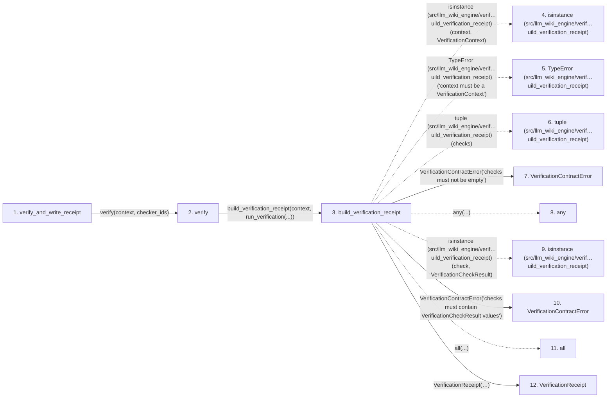

# verify_and_write_receipt

**Entry point:** `verify_and_write_receipt` (`api`)
**Source:** [verification_contracts](../modules/verification_contracts.md)
**Modules touched:** [canonical_json](../modules/canonical_json.md), [host](../modules/host.md), [io](../modules/io.md), [knowledge_evidence](../modules/knowledge_evidence.md), and 3 more

**Complete modules touched:**

- [canonical_json](../modules/canonical_json.md)
- [host](../modules/host.md)
- [io](../modules/io.md)
- [knowledge_evidence](../modules/knowledge_evidence.md)
- [validation](../modules/validation.md)
- [verification_contracts](../modules/verification_contracts.md)
- [wiki_write_basis](../modules/wiki_write_basis.md)

## Call sequence

> Static overview in presentation order, not runtime execution order. Arrows retain captured callers; representative internal continuations and boundary examples precede repeated helper detail.

<!-- Auto-generated from static call edges. Dashed arrows are external or unresolved calls. Reviewed runtime conditions and side effects belong in Behavior. -->

```mermaid
sequenceDiagram
    participant p0 as verify_and_write_receipt
    participant p1 as verify
    participant p2 as write_verification_receipt
    participant p3 as build_verification_receipt
    participant p4 as serialize_verification_receipt
    participant p5 as run_verification
    participant p6 as first_unsafe_path_component
    participant p7 as write_bytes_atomic
    participant p8 as formatted_json_bytes
    participant p9 as verification_receipt_to_payload
    participant p10 as _selected_contracts
    participant p11 as validate_verification_receipt
    participant p12 as _checker_id
    participant p13 as _object
    participant p14 as _exact_fields
    participant p15 as _string
    participant p16 as _receipt_hash
    participant p17 as _scope_uid
    participant p18 as _receipt_anchor_mapping
    participant p19 as hash_json
    participant p20 as _parse_check
    participant p21 as VerificationReceiptError
    participant p22 as verification_receipt_path
    participant p23 as VerificationContractError
    participant p24 as before_wiki_write
    participant p25 as current_host
    participant p26 as VerificationReceipt
    participant p27 as after_wiki_write
    participant p28 as indented_line_text
    participant p29 as Path (src/llm_wiki_engine/verif…rite_verification_receipt)
    participant p30 as root.is_symlink
    p0->>p1: verify
    p0->>p2: write_verification_receipt
    p1->>p3: build_verification_receipt
    p2->>p4: serialize_verification_receipt
    p1->>p5: run_verification
    p2->>p6: first_unsafe_path_component
    p2->>p7: write_bytes_atomic
    p4->>p8: formatted_json_bytes
    p4->>p9: verification_receipt_to_payload
    p5->>p10: _selected_contracts
    p9->>p11: validate_verification_receipt
    p10->>p12: _checker_id
    p11->>p13: _object
    p11->>p14: _exact_fields
    p11->>p15: _string
    p11->>p16: _receipt_hash
    p11->>p17: _scope_uid
    p11->>p18: _receipt_anchor_mapping
    p11->>p19: hash_json
    p11->>p20: _parse_check
    p2->>p21: VerificationReceiptError
    p2->>p22: verification_receipt_path
    p3->>p23: VerificationContractError
    p7->>p24: before_wiki_write
    p6->>p25: current_host
    p3->>p26: VerificationReceipt
    p7->>p27: after_wiki_write
    p8->>p28: indented_line_text
    p2-->>p29: Path (src/llm_wiki_engine/verif…rite_verification_receipt)(wiki_dir)
    p2-->>p30: root.is_symlink
```

> Call sequence diagram shows 30 of 213 interactions; 183 omitted to keep the visualization within the 30-interaction and generated-diagram limits, with uncertain identities omitted rather than inferred.

> Captured boundary calls: external 1 of 78 (77 omitted); unresolved 1 of 35 (34 omitted). These counts cover the captured static trace.

Omitted captured detail, grouped by actual caller occurrence and target module:

| Caller | Parent step | Target module | Kind | Omitted interactions |
| --- | --- | --- | --- | --- |
| `src/llm_wiki_engine/verification_contracts.py:build_verification_receipt` | 3 | - | external | 6 |
| `src/llm_wiki_engine/verification_contracts.py:build_verification_receipt` | 3 | [src/llm_wiki_engine/verification_contracts.py](../modules/verification_contracts.md) | internal | 1 |
| `src/llm_wiki_engine/verification_contracts.py:run_verification` | 13 | - | external | 3 |
| `src/llm_wiki_engine/verification_contracts.py:_selected_contracts` | 16 | - | external | 11 |
| `src/llm_wiki_engine/verification_contracts.py:_selected_contracts` | 16 | [src/llm_wiki_engine/verification_contracts.py](../modules/verification_contracts.md) | internal | 7 |
| `src/llm_wiki_engine/verification_contracts.py:_checker_id` | 31 | - | external | 1 |
| `src/llm_wiki_engine/verification_contracts.py:_checker_id` | 31 | - | unresolved | 1 |
| `src/llm_wiki_engine/verification_contracts.py:_checker_id` | 31 | [src/llm_wiki_engine/verification_contracts.py](../modules/verification_contracts.md) | internal | 1 |
> Omission summary shows 8 of 50 groups; 42 further groups are not expanded here. Counts above include all omitted interactions.
> Detailed flow queries retain their own coverage and limits; omitted paths may execute at runtime.

> Trace truncated at the depth limit; deeper calls are omitted.

## Data flow

<!-- Auto-generated static analysis. Treat values and boundaries as best-effort hints, not runtime proof. -->

### Analysis coverage

**Effect analysis partially available.** Flow assembly and source effect analysis are separate; empty observations do not prove an empty handler body.

Source steps: 101; effect analysis evaluated: 56, partial: 1, unavailable: 44. Counts include steps omitted from the displayed trace.

Collector observations for 57 source steps with known totals: observed: 229, emitted: 227, omitted: 2. Unavailable totals are excluded.

- Callable record unavailable for one or more source steps; those steps have no represented callable body.
- Effect collector omitted observations before flow assembly; displayed effects are partial.
- Effect collector totals unavailable; observed counts cover captured records only.

| Step | Callable record | Effect analysis | Collector totals | Observed | Emitted | Omitted |
|---|---|---|---|---:|---:|---:|
| `verify_and_write_receipt` | `available` | `evaluated` | `available` | `4` | `4` | `0` |
| `verify` | `available` | `evaluated` | `available` | `3` | `3` | `0` |
| `build_verification_receipt` | `available` | `evaluated` | `available` | `8` | `8` | `0` |
| `isinstance (src/llm_wiki_engine/verif…uild_verification_receipt)` | `not_applicable` | `not_applicable` | `not_applicable` | — | — | — |
| `TypeError (src/llm_wiki_engine/verif…uild_verification_receipt)` | `not_applicable` | `not_applicable` | `not_applicable` | — | — | — |
| `tuple (src/llm_wiki_engine/verif…uild_verification_receipt)` | `not_applicable` | `not_applicable` | `not_applicable` | — | — | — |
| `VerificationContractError` | `unavailable` | `unavailable` | `unavailable` | — | — | — |
| `any` | `not_applicable` | `not_applicable` | `not_applicable` | — | — | — |
| `isinstance (src/llm_wiki_engine/verif…uild_verification_receipt)` | `not_applicable` | `not_applicable` | `not_applicable` | — | — | — |
| `VerificationContractError` | `unavailable` | `unavailable` | `unavailable` | — | — | — |
| `all` | `not_applicable` | `not_applicable` | `not_applicable` | — | — | — |
| `VerificationReceipt` | `unavailable` | `unavailable` | `unavailable` | — | — | — |

```mermaid
flowchart LR
    s1["1. verify_and_write_receipt"]
    s2["2. verify"]
    s3["3. build_verification_receipt"]
    s4["4. isinstance (src/llm_wiki_engine/verif…uild_verification_receipt)"]
    s5["5. TypeError (src/llm_wiki_engine/verif…uild_verification_receipt)"]
    s6["6. tuple (src/llm_wiki_engine/verif…uild_verification_receipt)"]
    s7["7. VerificationContractError"]
    s8["8. any"]
    s9["9. isinstance (src/llm_wiki_engine/verif…uild_verification_receipt)"]
    s10["10. VerificationContractError"]
    s11["11. all"]
    s12["12. VerificationReceipt"]
    s1 -->|"verify(context, checker_ids)"| s2
    s2 -->|"build_verification_receipt(context, run_verification(...))"| s3
    s3 -. "isinstance (src/llm_wiki_engine/verif…uild_verification_receipt)(context, VerificationContext)" .-> s4
    s3 -. "TypeError (src/llm_wiki_engine/verif…uild_verification_receipt)('context must be a VerificationContext')" .-> s5
    s3 -. "tuple (src/llm_wiki_engine/verif…uild_verification_receipt)(checks)" .-> s6
    s3 -->|"VerificationContractError('checks must not be empty')"| s7
    s3 -. "any(...)" .-> s8
    s3 -. "isinstance (src/llm_wiki_engine/verif…uild_verification_receipt)(check, VerificationCheckResult)" .-> s9
    s3 -->|"VerificationContractError('checks must contain VerificationCheckResult values')"| s10
    s3 -. "all(...)" .-> s11
    s3 -->|"VerificationReceipt(…)"| s12
    click s1 "../modules/verification_contracts.md"
    click s2 "../modules/verification_contracts.md"
    click s3 "../modules/verification_contracts.md"
    click s7 "../modules/verification_contracts.md"
    click s10 "../modules/verification_contracts.md"
    click s12 "../modules/verification_contracts.md"
```

### Step data

| Step | Inputs | Reads | Writes | Returns |
|---|---|---|---|---|
| `verify_and_write_receipt` | `wiki_dir: str \| Path`, `context: VerificationContext`, `checker_ids: Sequence[str] \| None` | - | - | `receipt` |
| `verify` | `context: VerificationContext`, `checker_ids: Sequence[str] \| None` | - | - | `build_verification_receipt(...)` |
| `build_verification_receipt` | `context: VerificationContext`, `checks: Sequence[VerificationCheckResult]` | `VerificationContext`, `VerificationCheckResult`, `VerificationResult`, `VerificationResult`, `VerificationResult` | - | `VerificationReceipt(...)` |
| `isinstance (src/llm_wiki_engine/verif…uild_verification_receipt)` | - | - | - | - |
| `TypeError (src/llm_wiki_engine/verif…uild_verification_receipt)` | - | - | - | - |
| `tuple (src/llm_wiki_engine/verif…uild_verification_receipt)` | - | - | - | - |
| `VerificationContractError` | - | - | - | - |
| `any` | - | - | - | - |
| `isinstance (src/llm_wiki_engine/verif…uild_verification_receipt)` | - | - | - | - |
| `VerificationContractError` | - | - | - | - |
| `all` | - | - | - | - |
| `VerificationReceipt` | - | - | - | - |

### Call data

| From | To | Line | Call |
|---|---|---:|---|
| verify_and_write_receipt | verify | 1055 | `verify(context, checker_ids)` |
| verify | build_verification_receipt | 799 | `build_verification_receipt(context, run_verification(...))` |
| build_verification_receipt | isinstance (src/llm_wiki_engine/verif…uild_verification_receipt) | 760 | `isinstance(context, VerificationContext)` |
| build_verification_receipt | TypeError (src/llm_wiki_engine/verif…uild_verification_receipt) | 761 | `TypeError('context must be a VerificationContext')` |
| build_verification_receipt | tuple (src/llm_wiki_engine/verif…uild_verification_receipt) | 762 | `tuple(checks)` |
| build_verification_receipt | VerificationContractError | 764 | `VerificationContractError('checks must not be empty')` |
| build_verification_receipt | any | 765 | `any(...)` |
| build_verification_receipt | isinstance (src/llm_wiki_engine/verif…uild_verification_receipt) | 766 | `isinstance(check, VerificationCheckResult)` |
| build_verification_receipt | VerificationContractError | 769 | `VerificationContractError('checks must contain VerificationCheckResult values')` |
| build_verification_receipt | all | 774 | `all(...)` |
| build_verification_receipt | VerificationReceipt | 780 | `VerificationReceipt(knowledge_hash=context.knowledge_hash, scope_uid=context.scope_uid, scope_hash=context.scope_hash, evidence=context.evidence, evidence_hash=context.evidence_hash, evaluated_snapshot=context.evaluated_snapshot, snapshot_hash=context.snapshot_hash, result=result, checks=normalized_checks)` |

### Boundary effects

*No boundary-effect observations were captured in this static trace.*

### Static analysis gaps

| Kind | Step | Target | Line |
|---|---|---|---:|
| external_call | `build_verification_receipt` | `isinstance` | 760 |
| external_call | `build_verification_receipt` | `TypeError` | 761 |
| external_call | `build_verification_receipt` | `any` | 765 |
| external_call | `build_verification_receipt` | `isinstance` | 766 |
| external_call | `build_verification_receipt` | `all` | 774 |
| step_limit | `verify_and_write_receipt` | `first 12 steps` | 0 |
| truncated_flow | `verify_and_write_receipt` | `depth limit` | 0 |

## Behavior

This flow starts at `verify_and_write_receipt` and is classified as `api`. The generated call and data-flow sections are bounded static projections; runtime conditions and side effects require source-level confirmation.
