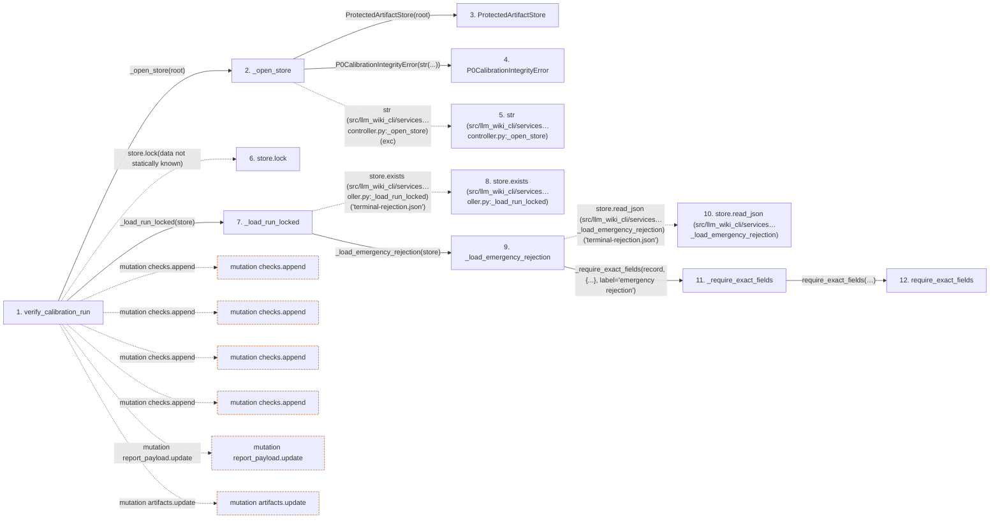

# verify_calibration_run

**Entry point:** `verify_calibration_run` (`api`)
**Source:** [controller](../modules/controller.md)
**Modules touched:** [calibration_contracts](../modules/calibration_contracts.md), [controller](../modules/controller.md), [documentation_policy](../modules/documentation_policy.md), and 4 more

**Complete modules touched:**

- [calibration_contracts](../modules/calibration_contracts.md)
- [controller](../modules/controller.md)
- [documentation_policy](../modules/documentation_policy.md)
- [filesystem_guard](../modules/filesystem_guard.md)
- [host_broker](../modules/host_broker.md)
- [protected_artifacts](../modules/protected_artifacts.md)
- [validation](../modules/validation.md)

## Call sequence

```mermaid
sequenceDiagram
    participant p0 as verify_calibration_run
    participant p1 as _open_store
    participant p2 as ProtectedArtifactStore
    participant p3 as P0CalibrationIntegrityError
    participant p4 as str (src/llm_wiki_cli/services…controller.py:_open_store)
    participant p5 as store.lock
    participant p6 as _load_run_locked
    participant p7 as store.exists (src/llm_wiki_cli/services…oller.py:_load_run_locked)
    participant p8 as _load_emergency_rejection
    participant p9 as store.read_json (src/llm_wiki_cli/services…_load_emergency_rejection)
    participant p10 as _require_exact_fields
    participant p11 as require_exact_fields
    participant p12 as isinstance (src/llm_wiki_cli/services…n.py:require_exact_fields)
    participant p13 as str (src/llm_wiki_cli/services…n.py:require_exact_fields)
    participant p14 as set (src/llm_wiki_cli/services…n.py:require_exact_fields)
    participant p15 as tuple (src/llm_wiki_cli/services…n.py:require_exact_fields)
    participant p16 as sorted (src/llm_wiki_cli/services…n.py:require_exact_fields)
    participant p17 as invalid_error
    participant p18 as error_factory
    participant p19 as P0CalibrationSchemaError
    participant p20 as label.title (src/llm_wiki_cli/services….py:_require_exact_fields)
    participant p21 as AssertionError
    participant p22 as format_field_differences
    participant p23 as tuple (src/llm_wiki_cli/services…:format_field_differences)
    p0->>p1: _open_store
    p1->>p2: ProtectedArtifactStore
    p1->>p3: P0CalibrationIntegrityError
    p1-->>p4: str (src/llm_wiki_cli/services…controller.py:_open_store)
    p0-->>p5: store.lock
    p0->>p6: _load_run_locked
    p6-->>p7: store.exists (src/llm_wiki_cli/services…oller.py:_load_run_locked)
    p6->>p8: _load_emergency_rejection
    p8-->>p9: store.read_json (src/llm_wiki_cli/services…_load_emergency_rejection)
    p8->>p10: _require_exact_fields
    p10->>p11: require_exact_fields
    p11-->>p12: isinstance (src/llm_wiki_cli/services…n.py:require_exact_fields)
    p11-->>p13: str (src/llm_wiki_cli/services…n.py:require_exact_fields)
    p11-->>p14: set (src/llm_wiki_cli/services…n.py:require_exact_fields)
    p11-->>p14: set (src/llm_wiki_cli/services…n.py:require_exact_fields)
    p11-->>p14: set (src/llm_wiki_cli/services…n.py:require_exact_fields)
    p11-->>p15: tuple (src/llm_wiki_cli/services…n.py:require_exact_fields)
    p11-->>p16: sorted (src/llm_wiki_cli/services…n.py:require_exact_fields)
    p11-->>p15: tuple (src/llm_wiki_cli/services…n.py:require_exact_fields)
    p11-->>p16: sorted (src/llm_wiki_cli/services…n.py:require_exact_fields)
    p11-->>p17: invalid_error
    p11-->>p18: error_factory
    p10->>p19: P0CalibrationSchemaError
    p10-->>p20: label.title (src/llm_wiki_cli/services….py:_require_exact_fields)
    p10-->>p21: AssertionError
    p10-->>p21: AssertionError
    p10->>p19: P0CalibrationSchemaError
    p10-->>p20: label.title (src/llm_wiki_cli/services….py:_require_exact_fields)
    p10->>p22: format_field_differences
    p22-->>p23: tuple (src/llm_wiki_cli/services…:format_field_differences)
```

<!-- Auto-generated from static call edges. Dashed arrows are external or unresolved calls. Reviewed runtime conditions and side effects belong in Behavior. -->

> Call sequence diagram shows 30 of 1562 interactions; 1532 omitted to keep the visualization within the 30-interaction and generated-diagram limits.

> Trace truncated at the depth limit; deeper calls are omitted.

## Data flow

<!-- Auto-generated static analysis. Treat values and boundaries as best-effort hints, not runtime proof. -->

### Step data

| Step | Inputs | Reads | Writes | Returns |
|---|---|---|---|---|
| `verify_calibration_run` | `root: str \| Path`, `advance: bool` | `CALIBRATION_ROLES`, `CALIBRATION_ROLES`, `_MAX_BUNDLE_BYTES`, `CALIBRATION_ROLES`, `_MAX_RESULT_BYTES`, `P0CalibrationError`, `ProtectedArtifactError`, `P0_CALIBRATION_VERIFICATION_REPORT_SCHEMA_VERSION` | `frozen_results[...]`, `report_payload[...]`, `report_payload[...]`, `report_payload[...]` | `P0CalibrationVerificationReport.from_dict(...)`, `P0CalibrationVerificationReport.from_dict(...)`, `P0CalibrationVerificationReport.from_dict(...)`, `P0CalibrationVerificationReport.from_dict(...)` |
| `_open_store` | `root: str \| Path` | `ProtectedArtifactError` | - | `ProtectedArtifactStore(...)` |
| `ProtectedArtifactStore` | - | - | - | - |
| `P0CalibrationIntegrityError` | - | - | - | - |
| `str (src/llm_wiki_cli/services…controller.py:_open_store)` | - | - | - | - |
| `store.lock` | - | - | - | - |
| `_load_run_locked` | `store: ProtectedArtifactStore` | `P0CalibrationRecoveryError`, `P0CalibrationError`, `ProtectedArtifactError`, `ProtectedArtifactError`, `CALIBRATION_TERMINAL_STATES`, `P0CalibrationError`, `ProtectedArtifactError` | - | `_load_emergency_rejection(...)`, `_block_ambiguous_recovery(...)`, `_persist_emergency_rejection(...)`, `_terminal_transition_locked(...)`, `run`, `_persist_emergency_rejection(...)` |
| `store.exists (src/llm_wiki_cli/services…oller.py:_load_run_locked)` | - | - | - | - |
| `_load_emergency_rejection` | `store: ProtectedArtifactStore` | `P0_CALIBRATION_EMERGENCY_REJECTION_SCHEMA_VERSION`, `P0_CALIBRATION_DECISION_SCOPE` | - | `run` |
| `store.read_json (src/llm_wiki_cli/services…_load_emergency_rejection)` | - | - | - | - |
| `_require_exact_fields` | `payload: Mapping[str, Any]`, `fields: set[str]`, `label: str` | - | - | `require_shared_exact_fields(...)` |
| `require_exact_fields` | `value: object`, `allowed: Iterable[str]`, `required: Iterable[str]`, `mapping_error: Exception`, `missing_error: _ErrorFactory`, `unknown_error: _ErrorFactory`, `invalid_error: Callable[[tuple[str, ...], tuple[str, ...]], Exception] \| None`, `stringify_keys: bool` | `Mapping` | - | - |

### Call data

| From | To | Line | Call |
|---|---|---:|---|
| verify_calibration_run | _open_store | 3200 | `_open_store(root)` |
| _open_store | ProtectedArtifactStore | 5824 | `ProtectedArtifactStore(root)` |
| _open_store | P0CalibrationIntegrityError | 5826 | `P0CalibrationIntegrityError(str(...))` |
| _open_store | str (src/llm_wiki_cli/services…controller.py:_open_store) | 5826 | `str(exc)` |
| verify_calibration_run | store.lock | 3201 | `store.lock(data not statically known)` |
| verify_calibration_run | _load_run_locked | 3202 | `_load_run_locked(store)` |
| _load_run_locked | store.exists (src/llm_wiki_cli/services…oller.py:_load_run_locked) | 4771 | `store.exists('terminal-rejection.json')` |
| _load_run_locked | _load_emergency_rejection | 4772 | `_load_emergency_rejection(store)` |
| _load_emergency_rejection | store.read_json (src/llm_wiki_cli/services…_load_emergency_rejection) | 4931 | `store.read_json('terminal-rejection.json')` |
| _load_emergency_rejection | _require_exact_fields | 4932 | `_require_exact_fields(record, {...}, label='emergency rejection')` |
| _require_exact_fields | require_exact_fields | 6663 | `require_shared_exact_fields(payload, allowed=fields, required=fields, mapping_error=P0CalibrationSchemaError(...), missing_error=..., unknown_error=..., invalid_error=...)` |

### Boundary effects

| Kind | Target | Step | Line |
|---|---|---|---:|
| mutation | `checks.append` | `verify_calibration_run` | 3205 |
| mutation | `checks.append` | `verify_calibration_run` | 3213 |
| mutation | `checks.append` | `verify_calibration_run` | 3224 |
| mutation | `checks.append` | `verify_calibration_run` | 3267 |
| mutation | `report_payload.update` | `verify_calibration_run` | 3371 |
| mutation | `artifacts.update` | `verify_calibration_run` | 3385 |

### Static analysis gaps

| Kind | Step | Target | Line |
|---|---|---|---:|
| unresolved_call | `verify_calibration_run` | `store.lock` | 3201 |
| unresolved_call | `_load_run_locked` | `store.exists` | 4771 |
| unresolved_call | `_load_emergency_rejection` | `store.read_json` | 4931 |
| step_limit | `verify_calibration_run` | `first 12 steps` | 0 |
| truncated_flow | `verify_calibration_run` | `depth limit` | 0 |

## Behavior

This flow starts at `verify_calibration_run` and is classified as `api`. The generated call and data-flow sections are bounded static projections; runtime conditions and side effects require source-level confirmation.
