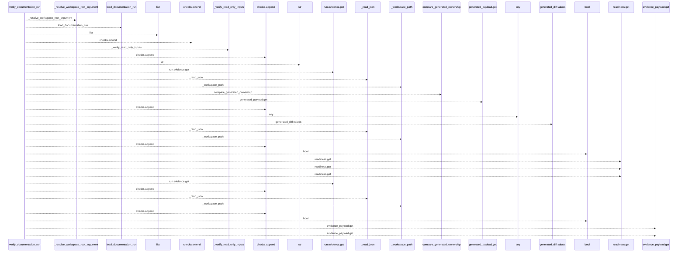
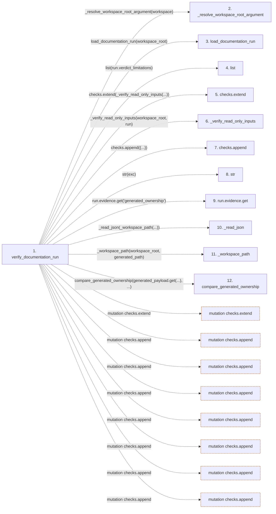

# verify_documentation_run

**Entry point:** `verify_documentation_run` (`api`)
**Source:** [verify](../modules/verify.md)
**Modules touched:** [verify](../modules/verify.md)

## Call sequence

<!-- Auto-generated from static call edges. Dashed arrows are external or unresolved calls. Reviewed runtime conditions and side effects belong in Behavior. -->

> Call sequence diagram shows 30 of 79 interactions; 49 omitted to keep the visualization within the 30-interaction and generated-diagram limits.

## Data flow

<!-- Auto-generated static analysis. Treat values and boundaries as best-effort hints, not runtime proof. -->

### Step data

| Step | Inputs | Reads | Writes | Returns |
|---|---|---|---|---|
| `verify_documentation_run` | `workspace: str \| Path`, `advance: bool` | - | `run.evidence[...]`, `run.validation_results` | `report` |
| `_resolve_workspace_root_argument` | - | - | - | - |
| `load_documentation_run` | - | - | - | - |
| `list` | - | - | - | - |
| `checks.extend` | - | - | - | - |
| `_verify_read_only_inputs` | - | - | - | - |
| `checks.append` | - | - | - | - |
| `str` | - | - | - | - |
| `run.evidence.get` | - | - | - | - |
| `_read_json` | - | - | - | - |
| `_workspace_path` | - | - | - | - |
| `compare_generated_ownership` | - | - | - | - |

### Call data

| From | To | Line | Call |
|---|---|---:|---|
| verify_documentation_run | _resolve_workspace_root_argument | 20 | `_resolve_workspace_root_argument(workspace)` |
| verify_documentation_run | load_documentation_run | 21 | `load_documentation_run(workspace_root)` |
| verify_documentation_run | list | 23 | `list(run.verdict_limitations)` |
| verify_documentation_run | checks.extend | 25 | `checks.extend(_verify_read_only_inputs(...))` |
| verify_documentation_run | _verify_read_only_inputs | 25 | `_verify_read_only_inputs(workspace_root, run)` |
| verify_documentation_run | checks.append | 27 | `checks.append({...})` |
| verify_documentation_run | str | 27 | `str(exc)` |
| verify_documentation_run | run.evidence.get | 29 | `run.evidence.get('generated_ownership')` |
| verify_documentation_run | _read_json | 31 | `_read_json(_workspace_path(...))` |
| verify_documentation_run | _workspace_path | 31 | `_workspace_path(workspace_root, generated_path)` |
| verify_documentation_run | compare_generated_ownership | 32 | `compare_generated_ownership(generated_payload.get(...), ...)` |

### Boundary effects

| Kind | Target | Step | Line |
|---|---|---|---:|
| mutation | `checks.extend` | `verify_documentation_run` | 25 |
| mutation | `checks.append` | `verify_documentation_run` | 27 |
| mutation | `checks.append` | `verify_documentation_run` | 36 |
| mutation | `checks.append` | `verify_documentation_run` | 47 |
| mutation | `checks.append` | `verify_documentation_run` | 58 |
| mutation | `checks.append` | `verify_documentation_run` | 67 |
| mutation | `checks.append` | `verify_documentation_run` | 80 |
| mutation | `checks.append` | `verify_documentation_run` | 82 |

### Static analysis gaps

| Kind | Step | Target | Line |
|---|---|---|---:|
| unresolved_call | `verify_documentation_run` | `_resolve_workspace_root_argument` | 20 |
| unresolved_call | `verify_documentation_run` | `load_documentation_run` | 21 |
| unresolved_call | `verify_documentation_run` | `run.evidence.get` | 29 |
| unresolved_call | `verify_documentation_run` | `_read_json` | 31 |
| unresolved_call | `verify_documentation_run` | `_workspace_path` | 31 |
| unresolved_call | `verify_documentation_run` | `compare_generated_ownership` | 32 |
| step_limit | `verify_documentation_run` | `first 12 steps` | 0 |

## Behavior

This flow starts at `verify_documentation_run` and is classified as `api`. The generated call and data-flow sections are bounded static projections; runtime conditions and side effects require source-level confirmation.
