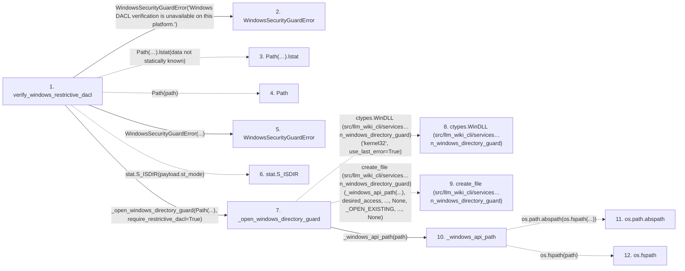

# verify_windows_restrictive_dacl

**Entry point:** `verify_windows_restrictive_dacl` (`api`)
**Source:** [filesystem_guard](../modules/filesystem_guard.md)
**Modules touched:** [filesystem_guard](../modules/filesystem_guard.md)

## Call sequence

```mermaid
sequenceDiagram
    participant p0 as verify_windows_restrictive_dacl
    participant p1 as WindowsSecurityGuardError
    participant p2 as Path(…).lstat
    participant p3 as Path
    participant p4 as stat.S_ISDIR
    participant p5 as _open_windows_directory_guard
    participant p6 as ctypes.WinDLL (src/llm_wiki_cli/services…n_windows_directory_guard)
    participant p7 as create_file (src/llm_wiki_cli/services…n_windows_directory_guard)
    participant p8 as _windows_api_path
    participant p9 as os.path.abspath
    participant p10 as os.fspath
    participant p11 as value.startswith
    participant p12 as wintypes.HANDLE (src/llm_wiki_cli/services…n_windows_directory_guard)
    participant p13 as ctypes.get_last_error (src/llm_wiki_cli/services…n_windows_directory_guard)
    participant p14 as ctypes.WinError (src/llm_wiki_cli/services…n_windows_directory_guard)
    participant p15 as _WindowsDirectoryGuardUnavailableError
    participant p16 as WindowsDirectoryGuardError
    participant p17 as _ByHandleFileInformation (src/llm_wiki_cli/services…n_windows_directory_guard)
    participant p18 as get_information (src/llm_wiki_cli/services…n_windows_directory_guard)
    participant p19 as ctypes.byref (src/llm_wiki_cli/services…n_windows_directory_guard)
    participant p20 as _close_windows_handle
    participant p21 as ctypes.WinDLL (src/llm_wiki_cli/services….py:_close_windows_handle)
    participant p22 as close_handle
    participant p23 as wintypes.HANDLE (src/llm_wiki_cli/services….py:_close_windows_handle)
    participant p24 as int (src/llm_wiki_cli/services…n_windows_directory_guard)
    p0->>p1: WindowsSecurityGuardError
    p0-->>p2: Path(…).lstat
    p0-->>p3: Path
    p0->>p1: WindowsSecurityGuardError
    p0-->>p4: stat.S_ISDIR
    p0->>p5: _open_windows_directory_guard
    p5-->>p6: ctypes.WinDLL (src/llm_wiki_cli/services…n_windows_directory_guard)
    p5-->>p7: create_file (src/llm_wiki_cli/services…n_windows_directory_guard)
    p5->>p8: _windows_api_path
    p8-->>p9: os.path.abspath
    p8-->>p10: os.fspath
    p8-->>p11: value.startswith
    p8-->>p11: value.startswith
    p5-->>p12: wintypes.HANDLE (src/llm_wiki_cli/services…n_windows_directory_guard)
    p5-->>p13: ctypes.get_last_error (src/llm_wiki_cli/services…n_windows_directory_guard)
    p5-->>p14: ctypes.WinError (src/llm_wiki_cli/services…n_windows_directory_guard)
    p5->>p15: _WindowsDirectoryGuardUnavailableError
    p5->>p16: WindowsDirectoryGuardError
    p5-->>p17: _ByHandleFileInformation (src/llm_wiki_cli/services…n_windows_directory_guard)
    p5-->>p18: get_information (src/llm_wiki_cli/services…n_windows_directory_guard)
    p5-->>p19: ctypes.byref (src/llm_wiki_cli/services…n_windows_directory_guard)
    p5-->>p14: ctypes.WinError (src/llm_wiki_cli/services…n_windows_directory_guard)
    p5-->>p13: ctypes.get_last_error (src/llm_wiki_cli/services…n_windows_directory_guard)
    p5->>p20: _close_windows_handle
    p20-->>p21: ctypes.WinDLL (src/llm_wiki_cli/services….py:_close_windows_handle)
    p20-->>p22: close_handle
    p20-->>p23: wintypes.HANDLE (src/llm_wiki_cli/services….py:_close_windows_handle)
    p5-->>p24: int (src/llm_wiki_cli/services…n_windows_directory_guard)
    p5->>p16: WindowsDirectoryGuardError
    p5-->>p24: int (src/llm_wiki_cli/services…n_windows_directory_guard)
```

<!-- Auto-generated from static call edges. Dashed arrows are external or unresolved calls. Reviewed runtime conditions and side effects belong in Behavior. -->

> Call sequence diagram shows 30 of 183 interactions; 153 omitted to keep the visualization within the 30-interaction and generated-diagram limits.

## Data flow

<!-- Auto-generated static analysis. Treat values and boundaries as best-effort hints, not runtime proof. -->

### Step data

| Step | Inputs | Reads | Writes | Returns |
|---|---|---|---|---|
| `verify_windows_restrictive_dacl` | `path: Path` | `os` | - | `none` |
| `WindowsSecurityGuardError` | - | - | - | - |
| `Path(…).lstat` | - | - | - | - |
| `Path` | - | - | - | - |
| `WindowsSecurityGuardError` | - | - | - | - |
| `stat.S_ISDIR` | - | - | - | - |
| `_open_windows_directory_guard` | `path: Path`, `require_restrictive_dacl: bool` | `_FILE_LIST_DIRECTORY`, `_FILE_READ_ATTRIBUTES`, `_READ_CONTROL`, `_FILE_SHARE_READ`, `_FILE_SHARE_WRITE`, `_OPEN_EXISTING`, `_FILE_FLAG_BACKUP_SEMANTICS`, `_FILE_FLAG_OPEN_REPARSE_POINT` | `create_file.argtypes`, `create_file.restype`, `get_information.argtypes`, `get_information.restype` | `int(...)` |
| `ctypes.WinDLL (src/llm_wiki_cli/services…n_windows_directory_guard)` | - | - | - | - |
| `create_file (src/llm_wiki_cli/services…n_windows_directory_guard)` | - | - | - | - |
| `_windows_api_path` | `path: Path` | - | - | `value`, `...`, `...` |
| `os.path.abspath` | - | - | - | - |
| `os.fspath` | - | - | - | - |

### Call data

| From | To | Line | Call |
|---|---|---:|---|
| verify_windows_restrictive_dacl | WindowsSecurityGuardError | 719 | `WindowsSecurityGuardError('Windows DACL verification is unavailable on this platform.')` |
| verify_windows_restrictive_dacl | Path(…).lstat | 722 | `Path(path).lstat(data not statically known)` |
| verify_windows_restrictive_dacl | Path | 722 | `Path(path)` |
| verify_windows_restrictive_dacl | WindowsSecurityGuardError | 724 | `WindowsSecurityGuardError(...)` |
| verify_windows_restrictive_dacl | stat.S_ISDIR | 727 | `stat.S_ISDIR(payload.st_mode)` |
| verify_windows_restrictive_dacl | _open_windows_directory_guard | 728 | `_open_windows_directory_guard(Path(...), require_restrictive_dacl=True)` |
| _open_windows_directory_guard | ctypes.WinDLL (src/llm_wiki_cli/services…n_windows_directory_guard) | 235 | `ctypes.WinDLL('kernel32', use_last_error=True)` |
| _open_windows_directory_guard | create_file (src/llm_wiki_cli/services…n_windows_directory_guard) | 259 | `create_file(_windows_api_path(...), desired_access, ..., None, _OPEN_EXISTING, ..., None)` |
| _open_windows_directory_guard | _windows_api_path | 260 | `_windows_api_path(path)` |
| _windows_api_path | os.path.abspath | 1298 | `os.path.abspath(os.fspath(...))` |
| _windows_api_path | os.fspath | 1298 | `os.fspath(path)` |

### Boundary effects

*No boundary effects detected.*

### Static analysis gaps

| Kind | Step | Target | Line |
|---|---|---|---:|
| unresolved_call | `verify_windows_restrictive_dacl` | `Path(path).lstat` | 722 |
| external_call | `verify_windows_restrictive_dacl` | `stat.S_ISDIR` | 727 |
| external_call | `_open_windows_directory_guard` | `ctypes.WinDLL` | 235 |
| unresolved_call | `_open_windows_directory_guard` | `create_file` | 259 |
| external_call | `_windows_api_path` | `os.path.abspath` | 1298 |
| external_call | `_windows_api_path` | `os.fspath` | 1298 |
| step_limit | `verify_windows_restrictive_dacl` | `first 12 steps` | 0 |

## Behavior

This flow starts at `verify_windows_restrictive_dacl` and is classified as `api`. The generated call and data-flow sections are bounded static projections; runtime conditions and side effects require source-level confirmation.
