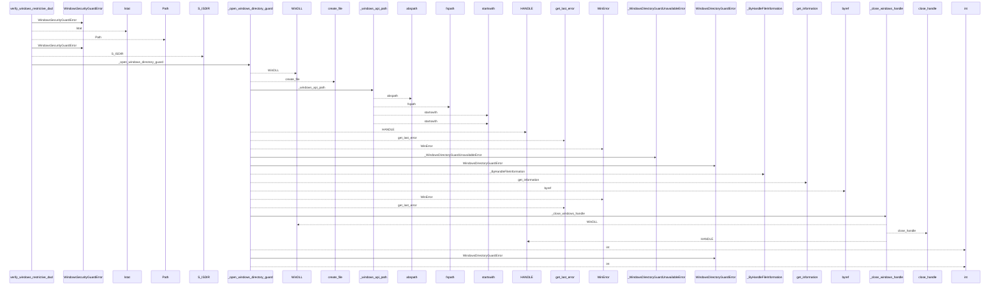
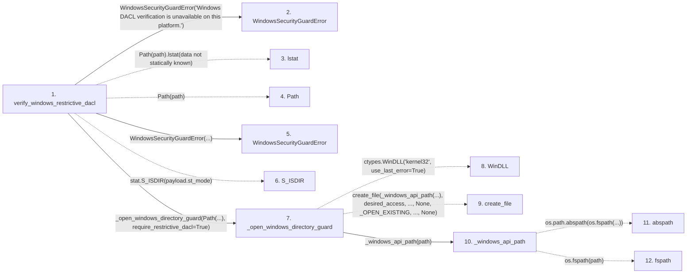

# verify_windows_restrictive_dacl

**Entry point:** `verify_windows_restrictive_dacl` (`api`)
**Source:** [filesystem_guard](../modules/filesystem_guard.md)
**Modules touched:** [filesystem_guard](../modules/filesystem_guard.md)

## Call sequence

<!-- Auto-generated from static call edges. Dashed arrows are external or unresolved calls. Reviewed runtime conditions and side effects belong in Behavior. -->

> Call sequence diagram shows 30 of 183 interactions; 153 omitted to keep the visualization within the 30-interaction and generated-diagram limits.

## Data flow

<!-- Auto-generated static analysis. Treat values and boundaries as best-effort hints, not runtime proof. -->

### Step data

| Step | Inputs | Reads | Writes | Returns |
|---|---|---|---|---|
| `verify_windows_restrictive_dacl` | `path: Path` | `os` | - | `none` |
| `WindowsSecurityGuardError` | - | - | - | - |
| `lstat` | - | - | - | - |
| `Path` | - | - | - | - |
| `WindowsSecurityGuardError` | - | - | - | - |
| `S_ISDIR` | - | - | - | - |
| `_open_windows_directory_guard` | `path: Path`, `require_restrictive_dacl: bool` | `_FILE_LIST_DIRECTORY`, `_FILE_READ_ATTRIBUTES`, `_READ_CONTROL`, `_FILE_SHARE_READ`, `_FILE_SHARE_WRITE`, `_OPEN_EXISTING`, `_FILE_FLAG_BACKUP_SEMANTICS`, `_FILE_FLAG_OPEN_REPARSE_POINT` | `create_file.argtypes`, `create_file.restype`, `get_information.argtypes`, `get_information.restype` | `int(...)` |
| `WinDLL` | - | - | - | - |
| `create_file` | - | - | - | - |
| `_windows_api_path` | `path: Path` | - | - | `value`, `...`, `...` |
| `abspath` | - | - | - | - |
| `fspath` | - | - | - | - |

### Call data

| From | To | Line | Call |
|---|---|---:|---|
| verify_windows_restrictive_dacl | WindowsSecurityGuardError | 706 | `WindowsSecurityGuardError('Windows DACL verification is unavailable on this platform.')` |
| verify_windows_restrictive_dacl | lstat | 709 | `Path(path).lstat(data not statically known)` |
| verify_windows_restrictive_dacl | Path | 709 | `Path(path)` |
| verify_windows_restrictive_dacl | WindowsSecurityGuardError | 711 | `WindowsSecurityGuardError(...)` |
| verify_windows_restrictive_dacl | S_ISDIR | 714 | `stat.S_ISDIR(payload.st_mode)` |
| verify_windows_restrictive_dacl | _open_windows_directory_guard | 715 | `_open_windows_directory_guard(Path(...), require_restrictive_dacl=True)` |
| _open_windows_directory_guard | WinDLL | 230 | `ctypes.WinDLL('kernel32', use_last_error=True)` |
| _open_windows_directory_guard | create_file | 254 | `create_file(_windows_api_path(...), desired_access, ..., None, _OPEN_EXISTING, ..., None)` |
| _open_windows_directory_guard | _windows_api_path | 255 | `_windows_api_path(path)` |
| _windows_api_path | abspath | 1285 | `os.path.abspath(os.fspath(...))` |
| _windows_api_path | fspath | 1285 | `os.fspath(path)` |

### Boundary effects

*No boundary effects detected.*

### Static analysis gaps

| Kind | Step | Target | Line |
|---|---|---|---:|
| unresolved_call | `verify_windows_restrictive_dacl` | `Path(path).lstat` | 709 |
| external_call | `verify_windows_restrictive_dacl` | `stat.S_ISDIR` | 714 |
| external_call | `_open_windows_directory_guard` | `ctypes.WinDLL` | 230 |
| unresolved_call | `_open_windows_directory_guard` | `create_file` | 254 |
| external_call | `_windows_api_path` | `os.path.abspath` | 1285 |
| external_call | `_windows_api_path` | `os.fspath` | 1285 |
| step_limit | `verify_windows_restrictive_dacl` | `first 12 steps` | 0 |

## Behavior

This flow starts at `verify_windows_restrictive_dacl` and is classified as `api`. The generated call and data-flow sections are bounded static projections; runtime conditions and side effects require source-level confirmation.
