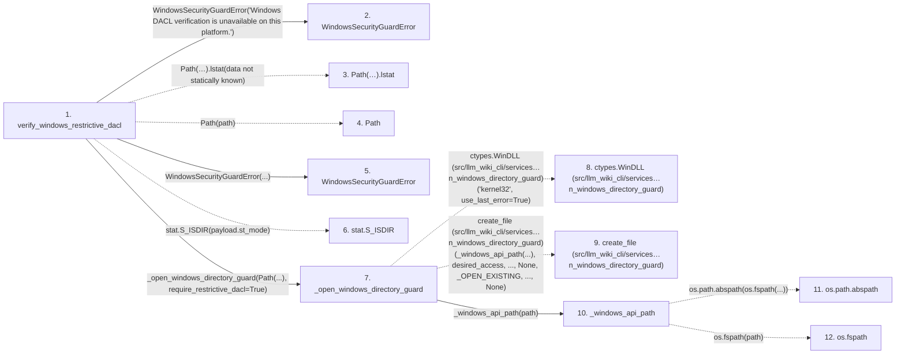

# verify_windows_restrictive_dacl

**Entry point:** `verify_windows_restrictive_dacl` (`api`)
**Source:** [filesystem_guard](../modules/filesystem_guard.md)
**Modules touched:** [filesystem_guard](../modules/filesystem_guard.md)

## Call sequence

> Static overview in presentation order, not runtime execution order. Arrows retain captured callers; representative internal continuations and boundary examples precede repeated helper detail.

<!-- Auto-generated from static call edges. Dashed arrows are external or unresolved calls. Reviewed runtime conditions and side effects belong in Behavior. -->

```mermaid
sequenceDiagram
    participant p0 as verify_windows_restrictive_dacl
    participant p1 as _open_windows_directory_guard
    participant p2 as _open_windows_file_metadata_guard
    participant p3 as WindowsSecurityGuardError
    participant p4 as _close_windows_handle
    participant p5 as _assert_windows_regular_file_handle
    participant p6 as _verify_windows_handle_restrictive_dacl
    participant p7 as _windows_handle_information
    participant p8 as _current_windows_user_sid
    participant p9 as _windows_sid_string
    participant p10 as _windows_api_path
    participant p11 as _WindowsDirectoryGuardUnavailableError
    participant p12 as WindowsFileGuardError
    participant p13 as WindowsDirectoryGuardError
    participant p14 as Path
    participant p15 as Path(…).lstat
    participant p16 as stat.S_ISDIR
    participant p17 as ctypes.WinDLL (src/llm_wiki_cli/services…n_windows_directory_guard)
    participant p18 as ctypes.WinDLL (src/llm_wiki_cli/services…ndows_file_metadata_guard)
    participant p19 as create_file (src/llm_wiki_cli/services…n_windows_directory_guard)
    participant p20 as create_file (src/llm_wiki_cli/services…ndows_file_metadata_guard)
    participant p21 as wintypes.HANDLE (src/llm_wiki_cli/services…n_windows_directory_guard)
    participant p22 as wintypes.HANDLE (src/llm_wiki_cli/services…ndows_file_metadata_guard)
    participant p23 as ctypes.get_last_error (src/llm_wiki_cli/services…n_windows_directory_guard)
    participant p24 as ctypes.WinError (src/llm_wiki_cli/services…ndows_file_metadata_guard)
    participant p25 as ctypes.WinError (src/llm_wiki_cli/services…n_windows_directory_guard)
    participant p26 as ctypes.get_last_error (src/llm_wiki_cli/services…ndows_file_metadata_guard)
    participant p27 as int (src/llm_wiki_cli/services…ndows_file_metadata_guard)
    participant p28 as _ByHandleFileInformation (src/llm_wiki_cli/services…n_windows_directory_guard)
    p0->>p1: _open_windows_directory_guard
    p0->>p2: _open_windows_file_metadata_guard
    p0->>p3: WindowsSecurityGuardError
    p0->>p4: _close_windows_handle
    p2->>p5: _assert_windows_regular_file_handle
    p1->>p6: _verify_windows_handle_restrictive_dacl
    p5->>p7: _windows_handle_information
    p6->>p8: _current_windows_user_sid
    p8->>p9: _windows_sid_string
    p1->>p10: _windows_api_path
    p1->>p11: _WindowsDirectoryGuardUnavailableError
    p2->>p12: WindowsFileGuardError
    p1->>p13: WindowsDirectoryGuardError
    p0-->>p14: Path(path)
    p0-->>p15: Path(…).lstat
    p0-->>p16: stat.S_ISDIR(payload.st_mode)
    p0-->>p14: Path(path)
    p0-->>p14: Path(path)
    p1-->>p17: ctypes.WinDLL (src/llm_wiki_cli/services…n_windows_directory_guard)('kernel32', use_last_error=True)
    p2-->>p18: ctypes.WinDLL (src/llm_wiki_cli/services…ndows_file_metadata_guard)('kernel32', use_last_error=True)
    p1-->>p19: create_file (src/llm_wiki_cli/services…n_windows_directory_guard)(_windows_api_path(...), desired_access, ..., None, _OPEN_EXISTING, ..., None)
    p2-->>p20: create_file (src/llm_wiki_cli/services…ndows_file_metadata_guard)(_windows_api_path(...), ..., ..., None, 3, 2097152, None)
    p1-->>p21: wintypes.HANDLE (src/llm_wiki_cli/services…n_windows_directory_guard)(...)
    p2-->>p22: wintypes.HANDLE (src/llm_wiki_cli/services…ndows_file_metadata_guard)(...)
    p1-->>p23: ctypes.get_last_error (src/llm_wiki_cli/services…n_windows_directory_guard)
    p2-->>p24: ctypes.WinError (src/llm_wiki_cli/services…ndows_file_metadata_guard)(ctypes.get_last_error(...))
    p1-->>p25: ctypes.WinError (src/llm_wiki_cli/services…n_windows_directory_guard)(error_number)
    p2-->>p26: ctypes.get_last_error (src/llm_wiki_cli/services…ndows_file_metadata_guard)
    p2-->>p27: int (src/llm_wiki_cli/services…ndows_file_metadata_guard)(handle)
    p1-->>p28: _ByHandleFileInformation (src/llm_wiki_cli/services…n_windows_directory_guard)
```

> Call sequence diagram shows 30 of 183 interactions; 153 omitted to keep the visualization within the 30-interaction and generated-diagram limits, with uncertain identities omitted rather than inferred.

> Captured boundary calls: external 13 of 114 (101 omitted); unresolved 4 of 22 (18 omitted). These counts cover the captured static trace.

Omitted captured detail, grouped by actual caller occurrence and target module:

| Caller | Parent step | Target module | Kind | Omitted interactions |
| --- | --- | --- | --- | --- |
| `src/llm_wiki_cli/services/filesystem_guard.py:verify_windows_restrictive_dacl` | 1 | [src/llm_wiki_cli/services/filesystem_guard.py](../modules/filesystem_guard.md) | internal | 2 |
| `src/llm_wiki_cli/services/filesystem_guard.py:_windows_api_path` | 10 | - | external | 2 |
| `src/llm_wiki_cli/services/filesystem_guard.py:_windows_api_path` | 10 | - | unresolved | 2 |
| `src/llm_wiki_cli/services/filesystem_guard.py:_open_windows_directory_guard` | 7 | - | unresolved | 1 |
| `src/llm_wiki_cli/services/filesystem_guard.py:_open_windows_directory_guard` | 7 | - | external | 10 |
| `src/llm_wiki_cli/services/filesystem_guard.py:_open_windows_directory_guard` | 7 | [src/llm_wiki_cli/services/filesystem_guard.py](../modules/filesystem_guard.md) | internal | 5 |
| `src/llm_wiki_cli/services/filesystem_guard.py:_close_windows_handle` | 25 | - | external | 2 |
| `src/llm_wiki_cli/services/filesystem_guard.py:_close_windows_handle` | 25 | - | unresolved | 1 |
> Omission summary shows 8 of 24 groups; 16 further groups are not expanded here. Counts above include all omitted interactions.
> Detailed flow queries retain their own coverage and limits; omitted paths may execute at runtime.

## Data flow

<!-- Auto-generated static analysis. Treat values and boundaries as best-effort hints, not runtime proof. -->

### Analysis coverage

**Effect analysis partially available.** Flow assembly and source effect analysis are separate; empty observations do not prove an empty handler body.

Source steps: 48; effect analysis evaluated: 17, partial: 3, unavailable: 28. Counts include steps omitted from the displayed trace.

Collector observations for 20 source steps with known totals: observed: 127, emitted: 122, omitted: 5. Unavailable totals are excluded.

- Callable record unavailable for one or more source steps; those steps have no represented callable body.
- Effect collector omitted observations before flow assembly; displayed effects are partial.
- Effect collector totals unavailable; observed counts cover captured records only.

| Step | Callable record | Effect analysis | Collector totals | Observed | Emitted | Omitted |
|---|---|---|---|---:|---:|---:|
| `verify_windows_restrictive_dacl` | `available` | `evaluated` | `available` | `3` | `3` | `0` |
| `WindowsSecurityGuardError` | `unavailable` | `unavailable` | `unavailable` | — | — | — |
| `Path(…).lstat` | `not_applicable` | `not_applicable` | `not_applicable` | — | — | — |
| `Path` | `not_applicable` | `not_applicable` | `not_applicable` | — | — | — |
| `WindowsSecurityGuardError` | `unavailable` | `unavailable` | `unavailable` | — | — | — |
| `stat.S_ISDIR` | `not_applicable` | `not_applicable` | `not_applicable` | — | — | — |
| `_open_windows_directory_guard` | `available` | `partial` | `available` | `16` | `15` | `1` |
| `ctypes.WinDLL (src/llm_wiki_cli/services…n_windows_directory_guard)` | `not_applicable` | `not_applicable` | `not_applicable` | — | — | — |
| `create_file (src/llm_wiki_cli/services…n_windows_directory_guard)` | `not_applicable` | `not_applicable` | `not_applicable` | — | — | — |
| `_windows_api_path` | `available` | `evaluated` | `available` | `4` | `4` | `0` |
| `os.path.abspath` | `not_applicable` | `not_applicable` | `not_applicable` | — | — | — |
| `os.fspath` | `not_applicable` | `not_applicable` | `not_applicable` | — | — | — |

```mermaid
flowchart LR
    s1["1. verify_windows_restrictive_dacl"]
    s2["2. WindowsSecurityGuardError"]
    s3["3. Path(…).lstat"]
    s4["4. Path"]
    s5["5. WindowsSecurityGuardError"]
    s6["6. stat.S_ISDIR"]
    s7["7. _open_windows_directory_guard"]
    s8["8. ctypes.WinDLL (src/llm_wiki_cli/services…n_windows_directory_guard)"]
    s9["9. create_file (src/llm_wiki_cli/services…n_windows_directory_guard)"]
    s10["10. _windows_api_path"]
    s11["11. os.path.abspath"]
    s12["12. os.fspath"]
    s1 -->|"WindowsSecurityGuardError('Windows DACL verification is unavailable on this platform.')"| s2
    s1 -. "Path(…).lstat(data not statically known)" .-> s3
    s1 -. "Path(path)" .-> s4
    s1 -->|"WindowsSecurityGuardError(...)"| s5
    s1 -. "stat.S_ISDIR(payload.st_mode)" .-> s6
    s1 -->|"_open_windows_directory_guard(Path(...), require_restrictive_dacl=True)"| s7
    s7 -. "ctypes.WinDLL (src/llm_wiki_cli/services…n_windows_directory_guard)('kernel32', use_last_error=True)" .-> s8
    s7 -. "create_file (src/llm_wiki_cli/services…n_windows_directory_guard)(_windows_api_path(...), desired_access, ..., None, _OPEN_EXISTING, ..., None)" .-> s9
    s7 -->|"_windows_api_path(path)"| s10
    s10 -. "os.path.abspath(os.fspath(...))" .-> s11
    s10 -. "os.fspath(path)" .-> s12
    click s1 "../modules/filesystem_guard.md"
    click s2 "../modules/filesystem_guard.md"
    click s5 "../modules/filesystem_guard.md"
    click s7 "../modules/filesystem_guard.md"
    click s10 "../modules/filesystem_guard.md"
```

### Step data

| Step | Inputs | Reads | Writes | Returns |
|---|---|---|---|---|
| `verify_windows_restrictive_dacl` | `path: Path` | `os` | - | `none` |
| `WindowsSecurityGuardError` | - | - | - | - |
| `Path(…).lstat` | - | - | - | - |
| `Path` | - | - | - | - |
| `WindowsSecurityGuardError` | - | - | - | - |
| `stat.S_ISDIR` | - | - | - | - |
| `_open_windows_directory_guard` | `path: Path`, `require_restrictive_dacl: bool` | `_FILE_LIST_DIRECTORY`, `_FILE_READ_ATTRIBUTES`, `_READ_CONTROL`, `_FILE_SHARE_READ`, `_FILE_SHARE_WRITE`, `_OPEN_EXISTING`, `_FILE_FLAG_BACKUP_SEMANTICS`, `_FILE_FLAG_OPEN_REPARSE_POINT` | `create_file.argtypes`, `create_file.restype`, `get_information.argtypes`, `get_information.restype` | `int(...)` |
| `ctypes.WinDLL (src/llm_wiki_cli/services…n_windows_directory_guard)` | - | - | - | - |
| `create_file (src/llm_wiki_cli/services…n_windows_directory_guard)` | - | - | - | - |
| `_windows_api_path` | `path: Path` | - | - | `value`, `...`, `...` |
| `os.path.abspath` | - | - | - | - |
| `os.fspath` | - | - | - | - |

### Call data

| From | To | Line | Call |
|---|---|---:|---|
| verify_windows_restrictive_dacl | WindowsSecurityGuardError | 731 | `WindowsSecurityGuardError('Windows DACL verification is unavailable on this platform.')` |
| verify_windows_restrictive_dacl | Path(…).lstat | 734 | `Path(path).lstat(data not statically known)` |
| verify_windows_restrictive_dacl | Path | 734 | `Path(path)` |
| verify_windows_restrictive_dacl | WindowsSecurityGuardError | 736 | `WindowsSecurityGuardError(...)` |
| verify_windows_restrictive_dacl | stat.S_ISDIR | 739 | `stat.S_ISDIR(payload.st_mode)` |
| verify_windows_restrictive_dacl | _open_windows_directory_guard | 740 | `_open_windows_directory_guard(Path(...), require_restrictive_dacl=True)` |
| _open_windows_directory_guard | ctypes.WinDLL (src/llm_wiki_cli/services…n_windows_directory_guard) | 235 | `ctypes.WinDLL('kernel32', use_last_error=True)` |
| _open_windows_directory_guard | create_file (src/llm_wiki_cli/services…n_windows_directory_guard) | 259 | `create_file(_windows_api_path(...), desired_access, ..., None, _OPEN_EXISTING, ..., None)` |
| _open_windows_directory_guard | _windows_api_path | 260 | `_windows_api_path(path)` |
| _windows_api_path | os.path.abspath | 1310 | `os.path.abspath(os.fspath(...))` |
| _windows_api_path | os.fspath | 1310 | `os.fspath(path)` |

### Boundary effects

*No boundary-effect observations were captured in this static trace.*

### Static analysis gaps

| Kind | Step | Target | Line |
|---|---|---|---:|
| unresolved_call | `verify_windows_restrictive_dacl` | `Path(path).lstat` | 734 |
| external_call | `verify_windows_restrictive_dacl` | `stat.S_ISDIR` | 739 |
| external_call | `_open_windows_directory_guard` | `ctypes.WinDLL` | 235 |
| unresolved_call | `_open_windows_directory_guard` | `create_file` | 259 |
| external_call | `_windows_api_path` | `os.path.abspath` | 1310 |
| external_call | `_windows_api_path` | `os.fspath` | 1310 |
| step_limit | `verify_windows_restrictive_dacl` | `first 12 steps` | 0 |

## Behavior

This flow starts at `verify_windows_restrictive_dacl` and is classified as `api`. The generated call and data-flow sections are bounded static projections; runtime conditions and side effects require source-level confirmation.
