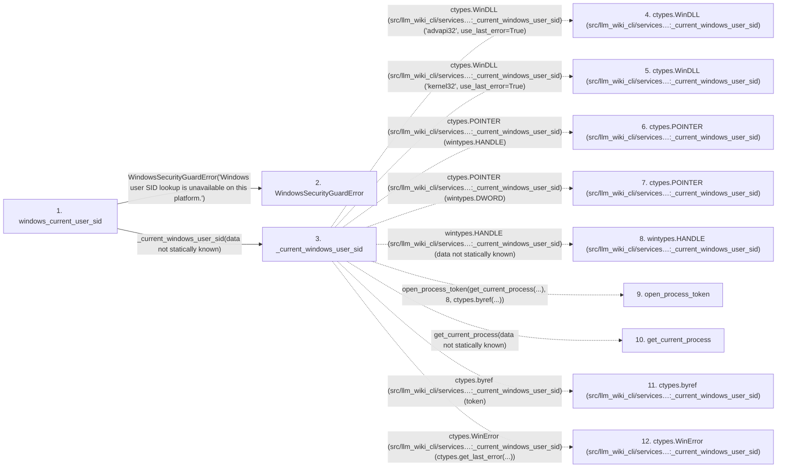

# windows_current_user_sid

**Entry point:** `windows_current_user_sid` (`api`)
**Source:** [filesystem_guard](../modules/filesystem_guard.md)
**Modules touched:** [filesystem_guard](../modules/filesystem_guard.md)

## Call sequence

```mermaid
sequenceDiagram
    participant p0 as windows_current_user_sid
    participant p1 as WindowsSecurityGuardError
    participant p2 as _current_windows_user_sid
    participant p3 as ctypes.WinDLL (src/llm_wiki_cli/services…:_current_windows_user_sid)
    participant p4 as ctypes.POINTER (src/llm_wiki_cli/services…:_current_windows_user_sid)
    participant p5 as wintypes.HANDLE (src/llm_wiki_cli/services…:_current_windows_user_sid)
    participant p6 as open_process_token
    participant p7 as get_current_process
    participant p8 as ctypes.byref (src/llm_wiki_cli/services…:_current_windows_user_sid)
    participant p9 as ctypes.WinError (src/llm_wiki_cli/services…:_current_windows_user_sid)
    participant p10 as ctypes.get_last_error (src/llm_wiki_cli/services…:_current_windows_user_sid)
    participant p11 as wintypes.DWORD
    participant p12 as get_token_information
    participant p13 as ctypes.create_string_buffer
    participant p14 as ctypes.cast (src/llm_wiki_cli/services…:_current_windows_user_sid)
    participant p15 as _windows_sid_string
    participant p16 as ctypes.WinDLL (src/llm_wiki_cli/services…ard.py:_windows_sid_string)
    p0->>p1: WindowsSecurityGuardError
    p0->>p2: _current_windows_user_sid
    p2-->>p3: ctypes.WinDLL (src/llm_wiki_cli/services…:_current_windows_user_sid)
    p2-->>p3: ctypes.WinDLL (src/llm_wiki_cli/services…:_current_windows_user_sid)
    p2-->>p4: ctypes.POINTER (src/llm_wiki_cli/services…:_current_windows_user_sid)
    p2-->>p4: ctypes.POINTER (src/llm_wiki_cli/services…:_current_windows_user_sid)
    p2-->>p5: wintypes.HANDLE (src/llm_wiki_cli/services…:_current_windows_user_sid)
    p2-->>p6: open_process_token
    p2-->>p7: get_current_process
    p2-->>p8: ctypes.byref (src/llm_wiki_cli/services…:_current_windows_user_sid)
    p2-->>p9: ctypes.WinError (src/llm_wiki_cli/services…:_current_windows_user_sid)
    p2-->>p10: ctypes.get_last_error (src/llm_wiki_cli/services…:_current_windows_user_sid)
    p2->>p1: WindowsSecurityGuardError
    p2-->>p11: wintypes.DWORD
    p2-->>p12: get_token_information
    p2-->>p8: ctypes.byref (src/llm_wiki_cli/services…:_current_windows_user_sid)
    p2-->>p9: ctypes.WinError (src/llm_wiki_cli/services…:_current_windows_user_sid)
    p2-->>p10: ctypes.get_last_error (src/llm_wiki_cli/services…:_current_windows_user_sid)
    p2->>p1: WindowsSecurityGuardError
    p2-->>p13: ctypes.create_string_buffer
    p2-->>p12: get_token_information
    p2-->>p8: ctypes.byref (src/llm_wiki_cli/services…:_current_windows_user_sid)
    p2-->>p9: ctypes.WinError (src/llm_wiki_cli/services…:_current_windows_user_sid)
    p2-->>p10: ctypes.get_last_error (src/llm_wiki_cli/services…:_current_windows_user_sid)
    p2->>p1: WindowsSecurityGuardError
    p2-->>p14: ctypes.cast (src/llm_wiki_cli/services…:_current_windows_user_sid)
    p2-->>p4: ctypes.POINTER (src/llm_wiki_cli/services…:_current_windows_user_sid)
    p2->>p15: _windows_sid_string
    p15-->>p16: ctypes.WinDLL (src/llm_wiki_cli/services…ard.py:_windows_sid_string)
    p15-->>p16: ctypes.WinDLL (src/llm_wiki_cli/services…ard.py:_windows_sid_string)
```

<!-- Auto-generated from static call edges. Dashed arrows are external or unresolved calls. Reviewed runtime conditions and side effects belong in Behavior. -->

> Call sequence diagram shows 30 of 45 interactions; 15 omitted to keep the visualization within the 30-interaction and generated-diagram limits.

## Data flow

<!-- Auto-generated static analysis. Treat values and boundaries as best-effort hints, not runtime proof. -->

### Step data

| Step | Inputs | Reads | Writes | Returns |
|---|---|---|---|---|
| `windows_current_user_sid` | - | `os` | - | `_current_windows_user_sid(...)` |
| `WindowsSecurityGuardError` | - | - | - | - |
| `_current_windows_user_sid` | - | `ctypes` | `open_process_token.argtypes`, `open_process_token.restype`, `get_token_information.argtypes`, `get_token_information.restype`, `get_current_process.argtypes`, `get_current_process.restype` | `_windows_sid_string(...)` |
| `ctypes.WinDLL (src/llm_wiki_cli/services…:_current_windows_user_sid)` | - | - | - | - |
| `ctypes.WinDLL (src/llm_wiki_cli/services…:_current_windows_user_sid)` | - | - | - | - |
| `ctypes.POINTER (src/llm_wiki_cli/services…:_current_windows_user_sid)` | - | - | - | - |
| `ctypes.POINTER (src/llm_wiki_cli/services…:_current_windows_user_sid)` | - | - | - | - |
| `wintypes.HANDLE (src/llm_wiki_cli/services…:_current_windows_user_sid)` | - | - | - | - |
| `open_process_token` | - | - | - | - |
| `get_current_process` | - | - | - | - |
| `ctypes.byref (src/llm_wiki_cli/services…:_current_windows_user_sid)` | - | - | - | - |
| `ctypes.WinError (src/llm_wiki_cli/services…:_current_windows_user_sid)` | - | - | - | - |

### Call data

| From | To | Line | Call |
|---|---|---:|---|
| windows_current_user_sid | WindowsSecurityGuardError | 742 | `WindowsSecurityGuardError('Windows user SID lookup is unavailable on this platform.')` |
| windows_current_user_sid | _current_windows_user_sid | 745 | `_current_windows_user_sid(data not statically known)` |
| _current_windows_user_sid | ctypes.WinDLL (src/llm_wiki_cli/services…:_current_windows_user_sid) | 992 | `ctypes.WinDLL('advapi32', use_last_error=True)` |
| _current_windows_user_sid | ctypes.WinDLL (src/llm_wiki_cli/services…:_current_windows_user_sid) | 993 | `ctypes.WinDLL('kernel32', use_last_error=True)` |
| _current_windows_user_sid | ctypes.POINTER (src/llm_wiki_cli/services…:_current_windows_user_sid) | 998 | `ctypes.POINTER(wintypes.HANDLE)` |
| _current_windows_user_sid | ctypes.POINTER (src/llm_wiki_cli/services…:_current_windows_user_sid) | 1007 | `ctypes.POINTER(wintypes.DWORD)` |
| _current_windows_user_sid | wintypes.HANDLE (src/llm_wiki_cli/services…:_current_windows_user_sid) | 1014 | `wintypes.HANDLE(data not statically known)` |
| _current_windows_user_sid | open_process_token | 1015 | `open_process_token(get_current_process(...), 8, ctypes.byref(...))` |
| _current_windows_user_sid | get_current_process | 1016 | `get_current_process(data not statically known)` |
| _current_windows_user_sid | ctypes.byref (src/llm_wiki_cli/services…:_current_windows_user_sid) | 1018 | `ctypes.byref(token)` |
| _current_windows_user_sid | ctypes.WinError (src/llm_wiki_cli/services…:_current_windows_user_sid) | 1020 | `ctypes.WinError(ctypes.get_last_error(...))` |

### Boundary effects

*No boundary effects detected.*

### Static analysis gaps

| Kind | Step | Target | Line |
|---|---|---|---:|
| external_call | `_current_windows_user_sid` | `ctypes.WinDLL` | 992 |
| external_call | `_current_windows_user_sid` | `ctypes.WinDLL` | 993 |
| external_call | `_current_windows_user_sid` | `ctypes.POINTER` | 998 |
| external_call | `_current_windows_user_sid` | `ctypes.POINTER` | 1007 |
| external_call | `_current_windows_user_sid` | `wintypes.HANDLE` | 1014 |
| unresolved_call | `_current_windows_user_sid` | `open_process_token` | 1015 |
| unresolved_call | `_current_windows_user_sid` | `get_current_process` | 1016 |
| external_call | `_current_windows_user_sid` | `ctypes.byref` | 1018 |
| external_call | `_current_windows_user_sid` | `ctypes.WinError` | 1020 |
| step_limit | `windows_current_user_sid` | `first 12 steps` | 0 |

## Behavior

This flow starts at `windows_current_user_sid` and is classified as `api`. The generated call and data-flow sections are bounded static projections; runtime conditions and side effects require source-level confirmation.
