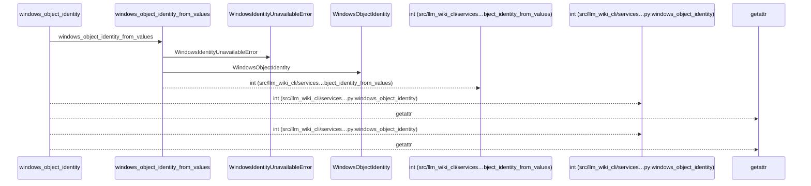
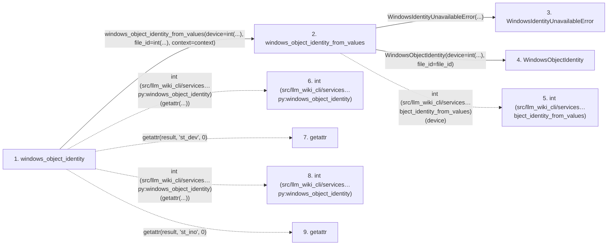

# windows_object_identity

**Entry point:** `windows_object_identity` (`api`)
**Source:** [filesystem_guard](../modules/filesystem_guard.md)
**Modules touched:** [filesystem_guard](../modules/filesystem_guard.md)

## Call sequence

<!-- Auto-generated from static call edges. Dashed arrows are external or unresolved calls. Reviewed runtime conditions and side effects belong in Behavior. -->

## Data flow

<!-- Auto-generated static analysis. Treat values and boundaries as best-effort hints, not runtime proof. -->

### Step data

| Step | Inputs | Reads | Writes | Returns |
|---|---|---|---|---|
| `windows_object_identity` | `result: os.stat_result`, `context: str` | - | - | `windows_object_identity_from_values(...)` |
| `windows_object_identity_from_values` | `device: int`, `file_id: int`, `context: str` | - | - | `WindowsObjectIdentity(...)` |
| `WindowsIdentityUnavailableError` | - | - | - | - |
| `WindowsObjectIdentity` | - | - | - | - |
| `int (src/llm_wiki_cli/services…bject_identity_from_values)` | - | - | - | - |
| `int (src/llm_wiki_cli/services…py:windows_object_identity)` | - | - | - | - |
| `getattr` | - | - | - | - |
| `int (src/llm_wiki_cli/services…py:windows_object_identity)` | - | - | - | - |
| `getattr` | - | - | - | - |

### Call data

| From | To | Line | Call |
|---|---|---:|---|
| windows_object_identity | windows_object_identity_from_values | 108 | `windows_object_identity_from_values(device=int(...), file_id=int(...), context=context)` |
| windows_object_identity_from_values | WindowsIdentityUnavailableError | 124 | `WindowsIdentityUnavailableError(...)` |
| windows_object_identity_from_values | WindowsObjectIdentity | 127 | `WindowsObjectIdentity(device=int(...), file_id=file_id)` |
| windows_object_identity_from_values | int (src/llm_wiki_cli/services…bject_identity_from_values) | 128 | `int(device)` |
| windows_object_identity | int (src/llm_wiki_cli/services…py:windows_object_identity) | 109 | `int(getattr(...))` |
| windows_object_identity | getattr | 109 | `getattr(result, 'st_dev', 0)` |
| windows_object_identity | int (src/llm_wiki_cli/services…py:windows_object_identity) | 110 | `int(getattr(...))` |
| windows_object_identity | getattr | 110 | `getattr(result, 'st_ino', 0)` |

### Boundary effects

*No boundary effects detected.*

### Static analysis gaps

| Kind | Step | Target | Line |
|---|---|---|---:|
| external_call | `windows_object_identity` | `getattr` | 109 |
| external_call | `windows_object_identity` | `getattr` | 110 |

## Behavior

This flow starts at `windows_object_identity` and is classified as `api`. The generated call and data-flow sections are bounded static projections; runtime conditions and side effects require source-level confirmation.
