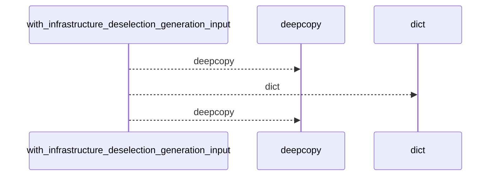
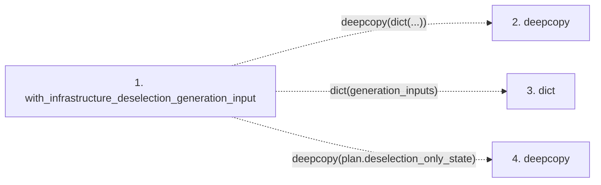

# with_infrastructure_deselection_generation_input

**Entry point:** `with_infrastructure_deselection_generation_input` (`api`)
**Source:** [infrastructure_sync](../modules/infrastructure_sync.md)
**Modules touched:** [infrastructure_sync](../modules/infrastructure_sync.md)

## Call sequence

<!-- Auto-generated from static call edges. Dashed arrows are external or unresolved calls. Reviewed runtime conditions and side effects belong in Behavior. -->

## Data flow

<!-- Auto-generated static analysis. Treat values and boundaries as best-effort hints, not runtime proof. -->

### Step data

| Step | Inputs | Reads | Writes | Returns |
|---|---|---|---|---|
| `with_infrastructure_deselection_generation_input` | `generation_inputs: Mapping[str, object]`, `plan: InfrastructureSyncPlan` | - | `result[...]` | `result` |
| `deepcopy` | - | - | - | - |
| `dict` | - | - | - | - |
| `deepcopy` | - | - | - | - |

### Call data

| From | To | Line | Call |
|---|---|---:|---|
| with_infrastructure_deselection_generation_input | deepcopy | 771 | `deepcopy(dict(...))` |
| with_infrastructure_deselection_generation_input | dict | 771 | `dict(generation_inputs)` |
| with_infrastructure_deselection_generation_input | deepcopy | 773 | `deepcopy(plan.deselection_only_state)` |

### Boundary effects

*No boundary effects detected.*

### Static analysis gaps

| Kind | Step | Target | Line |
|---|---|---|---:|
| external_call | `with_infrastructure_deselection_generation_input` | `deepcopy` | 771 |
| external_call | `with_infrastructure_deselection_generation_input` | `deepcopy` | 773 |

## Behavior

This flow starts at `with_infrastructure_deselection_generation_input` and is classified as `api`. The generated call and data-flow sections are bounded static projections; runtime conditions and side effects require source-level confirmation.
