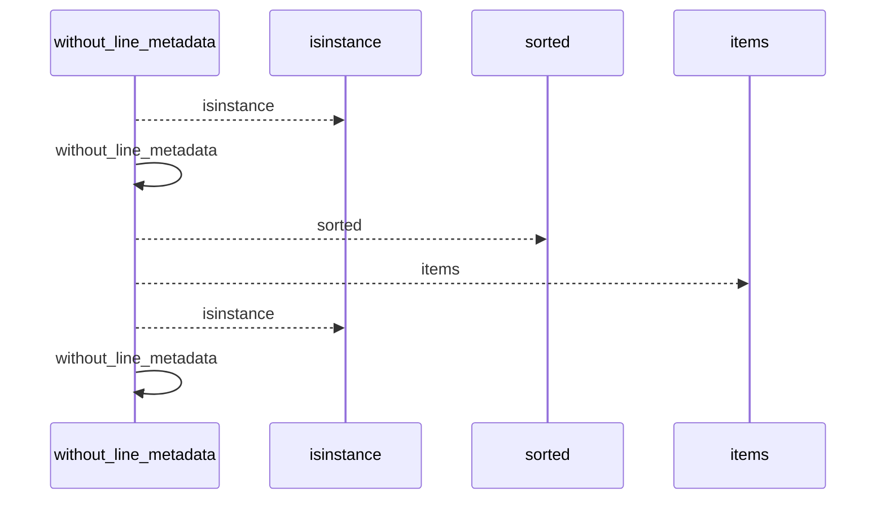
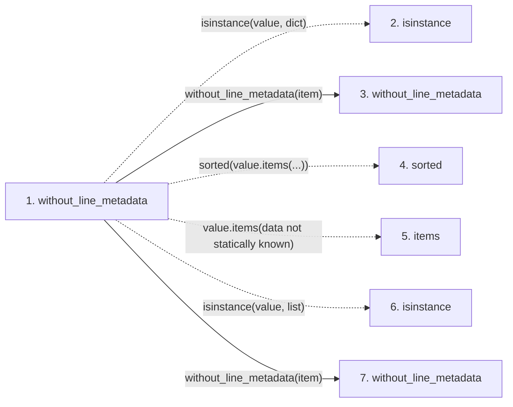

# without_line_metadata

**Entry point:** `without_line_metadata` (`api`)
**Source:** [knowledge_evidence](../modules/knowledge_evidence.md)
**Modules touched:** [knowledge_evidence](../modules/knowledge_evidence.md)

## Call sequence

<!-- Auto-generated from static call edges. Dashed arrows are external or unresolved calls. Reviewed runtime conditions and side effects belong in Behavior. -->

## Data flow

<!-- Auto-generated static analysis. Treat values and boundaries as best-effort hints, not runtime proof. -->

### Step data

| Step | Inputs | Reads | Writes | Returns |
|---|---|---|---|---|
| `without_line_metadata` | `value: Any` | - | - | `...`, `...`, `value` |
| `isinstance` | - | - | - | - |
| `without_line_metadata` | `value: Any` | - | - | `...`, `...`, `value` |
| `sorted` | - | - | - | - |
| `items` | - | - | - | - |
| `isinstance` | - | - | - | - |
| `without_line_metadata` | `value: Any` | - | - | `...`, `...`, `value` |

### Call data

| From | To | Line | Call |
|---|---|---:|---|
| without_line_metadata | isinstance | 921 | `isinstance(value, dict)` |
| without_line_metadata | without_line_metadata | 923 | `without_line_metadata(item)` |
| without_line_metadata | sorted | 924 | `sorted(value.items(...))` |
| without_line_metadata | items | 924 | `value.items(data not statically known)` |
| without_line_metadata | isinstance | 927 | `isinstance(value, list)` |
| without_line_metadata | without_line_metadata | 928 | `without_line_metadata(item)` |

### Boundary effects

*No boundary effects detected.*

### Static analysis gaps

| Kind | Step | Target | Line |
|---|---|---|---:|
| unresolved_call | `without_line_metadata` | `isinstance` | 921 |
| unresolved_call | `without_line_metadata` | `sorted` | 924 |
| unresolved_call | `without_line_metadata` | `value.items` | 924 |
| unresolved_call | `without_line_metadata` | `isinstance` | 927 |

## Behavior

This flow starts at `without_line_metadata` and is classified as `api`. The generated call and data-flow sections are bounded static projections; runtime conditions and side effects require source-level confirmation.
