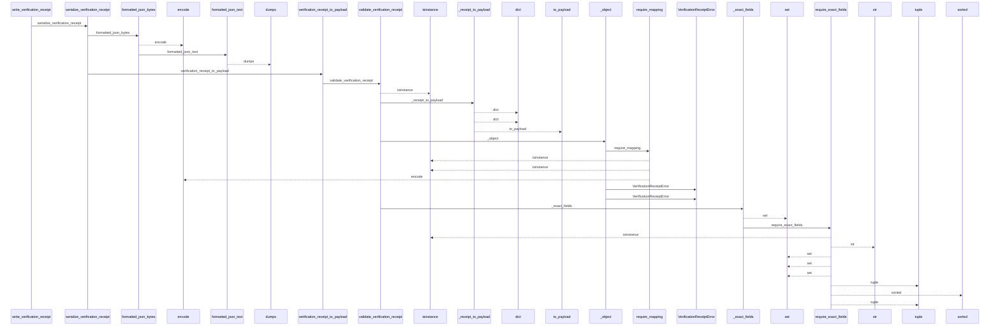
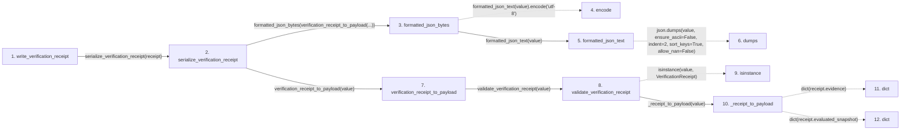

# write_verification_receipt

**Entry point:** `write_verification_receipt` (`api`)
**Source:** [verification_contracts](../modules/verification_contracts.md)
**Modules touched:** [io](../modules/io.md), [knowledge_evidence](../modules/knowledge_evidence.md), [validation](../modules/validation.md), [verification_contracts](../modules/verification_contracts.md)

## Call sequence

<!-- Auto-generated from static call edges. Dashed arrows are external or unresolved calls. Reviewed runtime conditions and side effects belong in Behavior. -->

> Call sequence diagram shows 30 of 212 interactions; 182 omitted to keep the visualization within the 30-interaction and generated-diagram limits.

> Trace truncated at the depth limit; deeper calls are omitted.

## Data flow

<!-- Auto-generated static analysis. Treat values and boundaries as best-effort hints, not runtime proof. -->

### Step data

| Step | Inputs | Reads | Writes | Returns |
|---|---|---|---|---|
| `write_verification_receipt` | `wiki_dir: str \| Path`, `receipt: VerificationReceipt \| object` | `VERIFICATION_RECEIPT_FILENAME`, `VERIFICATION_RECEIPT_FILENAME` | - | `path` |
| `serialize_verification_receipt` | `value: VerificationReceipt \| object` | `MAX_RECEIPT_BYTES` | - | `content` |
| `formatted_json_bytes` | `value: Any` | - | - | `...` |
| `encode` | - | - | - | - |
| `formatted_json_text` | `value: Any` | - | - | `...` |
| `dumps` | - | - | - | - |
| `verification_receipt_to_payload` | `value: VerificationReceipt \| object` | - | - | `_receipt_to_payload(...)` |
| `validate_verification_receipt` | `value: VerificationReceipt \| object` | `VerificationReceipt`, `VERIFICATION_RECEIPT_SCHEMA_VERSION`, `VERIFICATION_RECEIPT_SCHEMA_VERSION`, `VerificationContractError`, `MAX_CHECKS_PER_RECEIPT` | - | `VerificationReceipt(...)` |
| `isinstance` | - | - | - | - |
| `_receipt_to_payload` | `receipt: VerificationReceipt` | - | - | `{...}` |
| `dict` | - | - | - | - |
| `dict` | - | - | - | - |

### Call data

| From | To | Line | Call |
|---|---|---:|---|
| write_verification_receipt | serialize_verification_receipt | 981 | `serialize_verification_receipt(receipt)` |
| serialize_verification_receipt | formatted_json_bytes | 790 | `formatted_json_bytes(verification_receipt_to_payload(...))` |
| formatted_json_bytes | encode | 191 | `formatted_json_text(value).encode('utf-8')` |
| formatted_json_bytes | formatted_json_text | 191 | `formatted_json_text(value)` |
| formatted_json_text | dumps | 177 | `json.dumps(value, ensure_ascii=False, indent=2, sort_keys=True, allow_nan=False)` |
| serialize_verification_receipt | verification_receipt_to_payload | 790 | `verification_receipt_to_payload(value)` |
| verification_receipt_to_payload | validate_verification_receipt | 781 | `validate_verification_receipt(value)` |
| validate_verification_receipt | isinstance | 806 | `isinstance(value, VerificationReceipt)` |
| validate_verification_receipt | _receipt_to_payload | 805 | `_receipt_to_payload(value)` |
| _receipt_to_payload | dict | 1101 | `dict(receipt.evidence)` |
| _receipt_to_payload | dict | 1103 | `dict(receipt.evaluated_snapshot)` |

### Boundary effects

*No boundary effects detected.*

### Static analysis gaps

| Kind | Step | Target | Line |
|---|---|---|---:|
| unresolved_call | `formatted_json_bytes` | `formatted_json_text(value).encode` | 191 |
| external_call | `formatted_json_text` | `json.dumps` | 177 |
| unresolved_call | `validate_verification_receipt` | `isinstance` | 806 |
| step_limit | `write_verification_receipt` | `first 12 steps` | 0 |
| truncated_flow | `write_verification_receipt` | `depth limit` | 0 |

## Behavior

This flow starts at `write_verification_receipt` and is classified as `api`. The generated call and data-flow sections are bounded static projections; runtime conditions and side effects require source-level confirmation.
