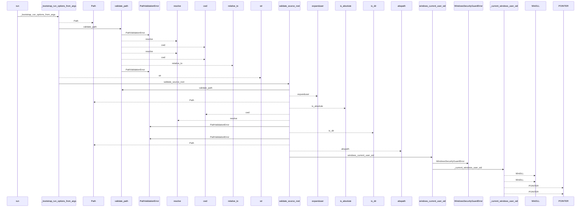
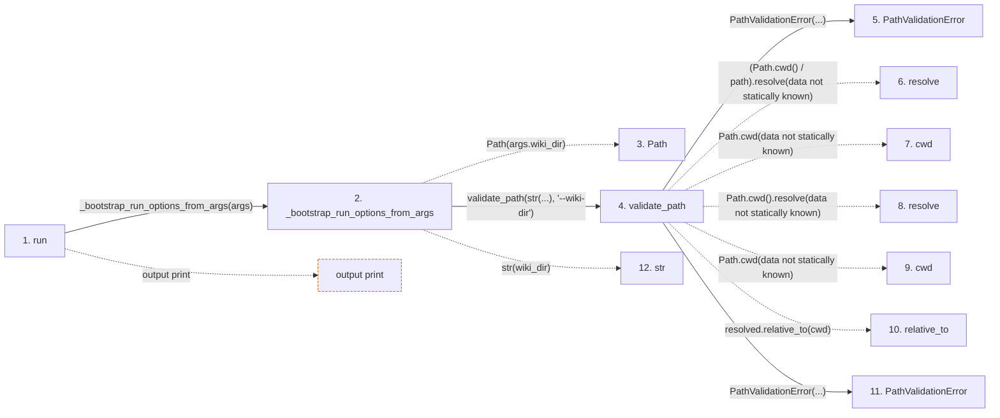

# bootstrap

**Entry point:** `run` (`cli`)
**Source:** [bootstrap_runtime](../modules/bootstrap_runtime.md)
**Modules touched:** [api_contracts](../modules/api_contracts.md), [bootstrap_runtime](../modules/bootstrap_runtime.md), [bootstrap_service](../modules/bootstrap_service.md), [common](../modules/common.md), and 39 more

**Complete modules touched:**

- [api_contracts](../modules/api_contracts.md)
- [bootstrap_runtime](../modules/bootstrap_runtime.md)
- [bootstrap_service](../modules/bootstrap_service.md)
- [common](../modules/common.md)
- [concept_identity](../modules/concept_identity.md)
- [config](../modules/config.md)
- [data_flow](../modules/data_flow.md)
- [dependency_versions](../modules/dependency_versions.md)
- [diagrams](../modules/diagrams.md)
- [entrypoints](../modules/entrypoints.md)
- [extraction_jobs](../modules/extraction_jobs.md)
- [extraction_service](../modules/extraction_service.md)
- [filesystem_guard](../modules/filesystem_guard.md)
- [imports](../modules/imports.md)
- [infrastructure_inventory](../modules/infrastructure_inventory.md)
- [infrastructure_sync](../modules/infrastructure_sync.md)
- [inventory_cache](../modules/inventory_cache.md)
- [io](../modules/io.md)
- [knowledge_artifacts](../modules/knowledge_artifacts.md)
- [knowledge_envelope](../modules/knowledge_envelope.md)
- [knowledge_evidence](../modules/knowledge_evidence.md)
- [knowledge_generation](../modules/knowledge_generation.md)
- [knowledge_governance](../modules/knowledge_governance.md)
- [knowledge_graph](../modules/knowledge_graph.md)
- [knowledge_index](../modules/knowledge_index.md)
- [knowledge_model](../modules/knowledge_model.md)
- [knowledge_orchestration](../modules/knowledge_orchestration.md)
- [markdown_sections](../modules/markdown_sections.md)
- [module_maps](../modules/module_maps.md)
- [packages](../modules/packages.md)
- [paths](../modules/paths.md)
- [plugins](../modules/plugins.md)
- [relationships](../modules/relationships.md)
- [section_ownership](../modules/section_ownership.md)
- [services_dependencies](../modules/services_dependencies.md)
- [services_schema](../modules/services_schema.md)
- [source_selection](../modules/source_selection.md)
- [source_snapshot](../modules/source_snapshot.md)
- [validation](../modules/validation.md)
- [wiki_lifecycle](../modules/wiki_lifecycle.md)
- [wiki_media](../modules/wiki_media.md)
- [wiki_surface](../modules/wiki_surface.md)
- [wiki_surface_index](../modules/wiki_surface_index.md)

## Call sequence

<!-- Auto-generated from static call edges. Dashed arrows are external or unresolved calls. Reviewed runtime conditions and side effects belong in Behavior. -->

> Call sequence diagram shows 30 of 4058 interactions; 4028 omitted to keep the visualization within the 30-interaction and generated-diagram limits.

> Trace truncated at the depth limit; deeper calls are omitted.

## Data flow

<!-- Auto-generated static analysis. Treat values and boundaries as best-effort hints, not runtime proof. -->

### Step data

| Step | Inputs | Reads | Writes | Returns |
|---|---|---|---|---|
| `run` | `args` | `BootstrapExtractionError`, `BootstrapContractError`, `options.progress_stream` | - | - |
| `_bootstrap_run_options_from_args` | `args` | `sys` | - | `_BootstrapRunOptions(...)` |
| `Path` | - | - | - | - |
| `validate_path` | `path: str`, `label: str` | - | - | `resolved` |
| `PathValidationError` | - | - | - | - |
| `resolve` | - | - | - | - |
| `cwd` | - | - | - | - |
| `resolve` | - | - | - | - |
| `cwd` | - | - | - | - |
| `relative_to` | - | - | - | - |
| `PathValidationError` | - | - | - | - |
| `str` | - | - | - | - |

### Call data

| From | To | Line | Call |
|---|---|---:|---|
| run | _bootstrap_run_options_from_args | 6058 | `_bootstrap_run_options_from_args(args)` |
| _bootstrap_run_options_from_args | Path | 4189 | `Path(args.wiki_dir)` |
| _bootstrap_run_options_from_args | validate_path | 4190 | `validate_path(str(...), '--wiki-dir')` |
| validate_path | PathValidationError | 128 | `PathValidationError(...)` |
| validate_path | resolve | 131 | `(Path.cwd() / path).resolve(data not statically known)` |
| validate_path | cwd | 131 | `Path.cwd(data not statically known)` |
| validate_path | resolve | 132 | `Path.cwd().resolve(data not statically known)` |
| validate_path | cwd | 132 | `Path.cwd(data not statically known)` |
| validate_path | relative_to | 134 | `resolved.relative_to(cwd)` |
| validate_path | PathValidationError | 136 | `PathValidationError(...)` |
| _bootstrap_run_options_from_args | str | 4190 | `str(wiki_dir)` |

### Boundary effects

| Kind | Target | Step | Line |
|---|---|---|---:|
| output | `print` | `run` | 6064 |

### Static analysis gaps

| Kind | Step | Target | Line |
|---|---|---|---:|
| unresolved_call | `validate_path` | `(Path.cwd() / path).resolve` | 131 |
| external_call | `validate_path` | `Path.cwd` | 131 |
| external_call | `validate_path` | `Path.cwd().resolve` | 132 |
| external_call | `validate_path` | `Path.cwd` | 132 |
| unresolved_call | `validate_path` | `resolved.relative_to` | 134 |
| step_limit | `run` | `first 12 steps` | 0 |
| truncated_flow | `run` | `depth limit` | 0 |

## Behavior

Validates first-use options and the source/wiki boundaries, then delegates to
the deterministic bootstrap service. The target must be empty or the untouched
init scaffold; existing managed or custom content is rejected before
extraction. A successful run writes the selected wiki surfaces and consistent
generated artifacts, then prints either progress text or the structured
bootstrap result.
