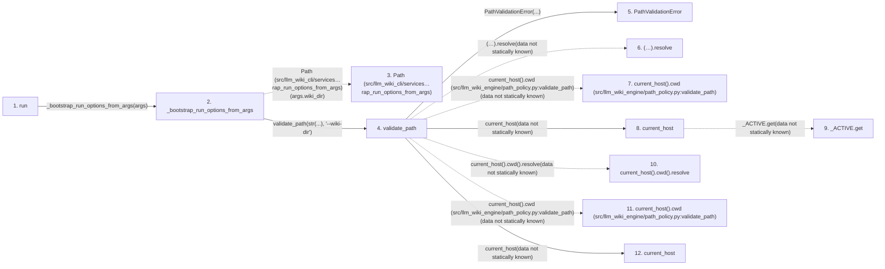

# bootstrap

**Entry point:** `run` (`cli`)
**Source:** [bootstrap_runtime](../modules/bootstrap_runtime.md)
**Modules touched:** [analysis_capture](../modules/analysis_capture.md), [api_contracts](../modules/api_contracts.md), [bootstrap_recovery](../modules/bootstrap_recovery.md), [bootstrap_runtime](../modules/bootstrap_runtime.md), and 67 more

**Complete modules touched:**

- [analysis_capture](../modules/analysis_capture.md)
- [api_contracts](../modules/api_contracts.md)
- [bootstrap_recovery](../modules/bootstrap_recovery.md)
- [bootstrap_runtime](../modules/bootstrap_runtime.md)
- [bootstrap_service](../modules/bootstrap_service.md)
- [canonical_json](../modules/canonical_json.md)
- [common](../modules/common.md)
- [current_contracts](../modules/current_contracts.md)
- [data_flow](../modules/data_flow.md)
- [domain_pack](../modules/domain_pack.md)
- [entrypoints](../modules/entrypoints.md)
- [extraction_service](../modules/extraction_service.md)
- [extractor_helpers](../modules/extractor_helpers.md)
- [filesystem_guard](../modules/filesystem_guard.md)
- [gitignore](../modules/gitignore.md)
- [helper_cache](../modules/helper_cache.md)
- [helper_runtime](../modules/helper_runtime.md)
- [host](../modules/host.md)
- [imports](../modules/imports.md)
- [infrastructure_inventory](../modules/infrastructure_inventory.md)
- [infrastructure_state](../modules/infrastructure_state.md)
- [infrastructure_sync](../modules/infrastructure_sync.md)
- [integrations](../modules/integrations.md)
- [inventory_cache](../modules/inventory_cache.md)
- [io](../modules/io.md)
- [knowledge_artifacts](../modules/knowledge_artifacts.md)
- [knowledge_consumption](../modules/knowledge_consumption.md)
- [knowledge_envelope](../modules/knowledge_envelope.md)
- [knowledge_evidence](../modules/knowledge_evidence.md)
- [knowledge_governance](../modules/knowledge_governance.md)
- [knowledge_loader](../modules/knowledge_loader.md)
- [knowledge_orchestration](../modules/knowledge_orchestration.md)
- [knowledge_packs](../modules/knowledge_packs.md)
- [knowledge_reuse](../modules/knowledge_reuse.md)
- [knowledge_reuse_format](../modules/knowledge_reuse_format.md)
- [knowledge_storage](../modules/knowledge_storage.md)
- [knowledge_storage_io](../modules/knowledge_storage_io.md)
- [knowledge_storage_lifecycle](../modules/knowledge_storage_lifecycle.md)
- [knowledge_verification](../modules/knowledge_verification.md)
- [maintenance_evidence](../modules/maintenance_evidence.md)
- [maintenance_projection](../modules/maintenance_projection.md)
- [maintenance_protocol](../modules/maintenance_protocol.md)
- [maintenance_recovery](../modules/maintenance_recovery.md)
- [maintenance_service](../modules/maintenance_service.md)
- [maintenance_shapes](../modules/maintenance_shapes.md)
- [maintenance_state](../modules/maintenance_state.md)
- [manifest_storage](../modules/manifest_storage.md)
- [markdown_sections](../modules/markdown_sections.md)
- [module_maps](../modules/module_maps.md)
- [pack_interfaces](../modules/pack_interfaces.md)
- [path_policy](../modules/path_policy.md)
- [paths](../modules/paths.md)
- [plugins](../modules/plugins.md)
- [python_calls](../modules/python_calls.md)
- [python_implementation](../modules/python_implementation.md)
- [python_imports](../modules/python_imports.md)
- [relationships](../modules/relationships.md)
- [services_dependencies](../modules/services_dependencies.md)
- [services_schema](../modules/services_schema.md)
- [source_selection](../modules/source_selection.md)
- [source_snapshot](../modules/source_snapshot.md)
- [storage_spool](../modules/storage_spool.md)
- [sync_manifest](../modules/sync_manifest.md)
- [validation](../modules/validation.md)
- [wiki_lifecycle](../modules/wiki_lifecycle.md)
- [wiki_media](../modules/wiki_media.md)
- [wiki_surface](../modules/wiki_surface.md)
- [wiki_surface_index](../modules/wiki_surface_index.md)
- [wiki_write_basis](../modules/wiki_write_basis.md)
- [yaml_formats](../modules/yaml_formats.md)
- [yaml_syntax](../modules/yaml_syntax.md)

## Call sequence

> Static overview in presentation order, not runtime execution order. Arrows retain captured callers; representative internal continuations and boundary examples precede repeated helper detail.

<!-- Auto-generated from static call edges. Dashed arrows are external or unresolved calls. Reviewed runtime conditions and side effects belong in Behavior. -->

```mermaid
sequenceDiagram
    participant p0 as run
    participant p1 as _bootstrap_run_options_from_args
    participant p2 as _execute_bootstrap_options
    participant p3 as emit
    participant p4 as pending_bootstrap
    participant p5 as validate_path
    participant p6 as guard_maintenance_owner
    participant p7 as _preflight_public_bootstrap
    participant p8 as validate_source_root
    participant p9 as maintenance_write_operation
    participant p10 as bootstrap_write_operation
    participant p11 as _preflight_bootstrap_analysis
    participant p12 as _execute_bootstrap_options_locked
    participant p13 as _load_record
    participant p14 as _preflight_bootstrap_source_selection
    participant p15 as _start_bootstrap
    participant p16 as _absolute_path
    participant p17 as _first_use_guidance
    participant p18 as _preflight_bootstrap_governance
    participant p19 as _extract_bootstrap_inventory
    participant p20 as attributes
    participant p21 as _is_pristine_bootstrap_target
    participant p22 as governance_writer_lock
    participant p23 as _finish_if_empty_bootstrap_inventory
    participant p24 as load_adoption_marker
    participant p25 as storage_writer_lock
    participant p26 as _bootstrap_result
    participant p27 as SyncManifest.load
    participant p28 as _recover
    participant p29 as SystemExit
    participant p30 as (…).resolve
    p0->>p1: _bootstrap_run_options_from_args
    p0->>p2: _execute_bootstrap_options
    p0->>p3: emit
    p2->>p4: pending_bootstrap
    p1->>p5: validate_path
    p2->>p6: guard_maintenance_owner
    p2->>p7: _preflight_public_bootstrap
    p1->>p8: validate_source_root
    p2->>p9: maintenance_write_operation
    p2->>p10: bootstrap_write_operation
    p2->>p11: _preflight_bootstrap_analysis
    p2->>p12: _execute_bootstrap_options_locked
    p4->>p13: _load_record
    p11->>p14: _preflight_bootstrap_source_selection
    p12->>p15: _start_bootstrap
    p4->>p16: _absolute_path
    p7->>p17: _first_use_guidance
    p11->>p18: _preflight_bootstrap_governance
    p12->>p19: _extract_bootstrap_inventory
    p6->>p20: attributes
    p7->>p21: _is_pristine_bootstrap_target
    p9->>p22: governance_writer_lock
    p12->>p23: _finish_if_empty_bootstrap_inventory
    p6->>p24: load_adoption_marker
    p9->>p25: storage_writer_lock
    p12->>p26: _bootstrap_result
    p6->>p27: SyncManifest.load
    p10->>p28: _recover
    p0-->>p29: SystemExit(1)
    p5-->>p30: (…).resolve
```

> Call sequence diagram shows 30 of 3418 interactions; 3388 omitted to keep the visualization within the 30-interaction and generated-diagram limits, with uncertain identities omitted rather than inferred.

> Captured boundary calls: external 1 of 1121 (1120 omitted); unresolved 1 of 920 (919 omitted). These counts cover the captured static trace.

Omitted captured detail, grouped by actual caller occurrence and target module:

| Caller | Parent step | Target module | Kind | Omitted interactions |
| --- | --- | --- | --- | --- |
| `src/llm_wiki_cli/services/bootstrap_runtime.py:_bootstrap_run_options_from_args` | 2 | - | external | 19 |
| `src/llm_wiki_engine/path_policy.py:validate_path` | 4 | [src/llm_wiki_engine/path_policy.py](../modules/path_policy.md) | internal | 2 |
| `src/llm_wiki_engine/path_policy.py:validate_path` | 4 | - | unresolved | 4 |
| `src/llm_wiki_engine/path_policy.py:validate_path` | 4 | [src/llm_wiki_engine/host.py](../modules/host.md) | internal | 2 |
| `src/llm_wiki_engine/host.py:current_host` | 8 | - | unresolved | 1 |
| `src/llm_wiki_engine/path_policy.py:validate_source_root` | 16 | [src/llm_wiki_engine/path_policy.py](../modules/path_policy.md) | internal | 7 |
| `src/llm_wiki_engine/path_policy.py:validate_source_root` | 16 | - | unresolved | 6 |
| `src/llm_wiki_engine/path_policy.py:validate_source_root` | 16 | - | external | 10 |
> Omission summary shows 8 of 882 groups; 874 further groups are not expanded here. Counts above include all omitted interactions.
> Detailed flow queries retain their own coverage and limits; omitted paths may execute at runtime.

> Trace truncated at the depth limit; deeper calls are omitted.

## Data flow

<!-- Auto-generated static analysis. Treat values and boundaries as best-effort hints, not runtime proof. -->

### Analysis coverage

**Effect analysis partially available.** Flow assembly and source effect analysis are separate; empty observations do not prove an empty handler body.

Source steps: 1378; effect analysis evaluated: 1034, partial: 64, unavailable: 280. Counts include steps omitted from the displayed trace.

Collector observations for 1098 source steps with known totals: observed: 6474, emitted: 6168, omitted: 306. Unavailable totals are excluded.

- Callable record unavailable for one or more source steps; those steps have no represented callable body.
- Effect collector omitted observations before flow assembly; displayed effects are partial.
- Effect collector totals unavailable; observed counts cover captured records only.

| Step | Callable record | Effect analysis | Collector totals | Observed | Emitted | Omitted |
|---|---|---|---|---:|---:|---:|
| `run` | `available` | `evaluated` | `available` | `3` | `3` | `0` |
| `_bootstrap_run_options_from_args` | `available` | `evaluated` | `available` | `2` | `2` | `0` |
| `Path (src/llm_wiki_cli/services…rap_run_options_from_args)` | `not_applicable` | `not_applicable` | `not_applicable` | — | — | — |
| `validate_path` | `available` | `evaluated` | `available` | `3` | `3` | `0` |
| `PathValidationError` | `unavailable` | `unavailable` | `unavailable` | — | — | — |
| `(…).resolve` | `not_applicable` | `not_applicable` | `not_applicable` | — | — | — |
| `current_host().cwd (src/llm_wiki_engine/path_policy.py:validate_path)` | `not_applicable` | `not_applicable` | `not_applicable` | — | — | — |
| `current_host` | `available` | `evaluated` | `available` | `2` | `2` | `0` |
| `_ACTIVE.get` | `not_applicable` | `not_applicable` | `not_applicable` | — | — | — |
| `current_host().cwd().resolve` | `not_applicable` | `not_applicable` | `not_applicable` | — | — | — |
| `current_host().cwd (src/llm_wiki_engine/path_policy.py:validate_path)` | `not_applicable` | `not_applicable` | `not_applicable` | — | — | — |
| `current_host` | `available` | `evaluated` | `available` | `2` | `2` | `0` |

```mermaid
flowchart LR
    s1["1. run"]
    s2["2. _bootstrap_run_options_from_args"]
    s3["3. Path (src/llm_wiki_cli/services…rap_run_options_from_args)"]
    s4["4. validate_path"]
    s5["5. PathValidationError"]
    s6["6. (…).resolve"]
    s7["7. current_host().cwd (src/llm_wiki_engine/path_policy.py:validate_path)"]
    s8["8. current_host"]
    s9["9. _ACTIVE.get"]
    s10["10. current_host().cwd().resolve"]
    s11["11. current_host().cwd (src/llm_wiki_engine/path_policy.py:validate_path)"]
    s12["12. current_host"]
    s1 -->|"_bootstrap_run_options_from_args(args)"| s2
    s2 -. "Path (src/llm_wiki_cli/services…rap_run_options_from_args)(args.wiki_dir)" .-> s3
    s2 -->|"validate_path(str(...), '--wiki-dir')"| s4
    s4 -->|"PathValidationError(...)"| s5
    s4 -. "(…).resolve(data not statically known)" .-> s6
    s4 -. "current_host().cwd (src/llm_wiki_engine/path_policy.py:validate_path)(data not statically known)" .-> s7
    s4 -->|"current_host(data not statically known)"| s8
    s8 -. "_ACTIVE.get(data not statically known)" .-> s9
    s4 -. "current_host().cwd().resolve(data not statically known)" .-> s10
    s4 -. "current_host().cwd (src/llm_wiki_engine/path_policy.py:validate_path)(data not statically known)" .-> s11
    s4 -->|"current_host(data not statically known)"| s12
    click s1 "../modules/bootstrap_runtime.md"
    click s2 "../modules/bootstrap_runtime.md"
    click s4 "../modules/path_policy.md"
    click s5 "../modules/path_policy.md"
    click s8 "../modules/host.md"
    click s12 "../modules/host.md"
```

### Step data

| Step | Inputs | Reads | Writes | Returns |
|---|---|---|---|---|
| `run` | `args` | `BootstrapExtractionError`, `BootstrapContractError` | - | - |
| `_bootstrap_run_options_from_args` | `args` | - | - | `_BootstrapRunOptions(...)` |
| `Path (src/llm_wiki_cli/services…rap_run_options_from_args)` | - | - | - | - |
| `validate_path` | `path: str`, `label: str` | - | - | `resolved` |
| `PathValidationError` | - | - | - | - |
| `(…).resolve` | - | - | - | - |
| `current_host().cwd (src/llm_wiki_engine/path_policy.py:validate_path)` | - | - | - | - |
| `current_host` | - | `_DEFAULT` | - | `...` |
| `_ACTIVE.get` | - | - | - | - |
| `current_host().cwd().resolve` | - | - | - | - |
| `current_host().cwd (src/llm_wiki_engine/path_policy.py:validate_path)` | - | - | - | - |
| `current_host` | - | `_DEFAULT` | - | `...` |

### Call data

| From | To | Line | Call |
|---|---|---:|---|
| run | _bootstrap_run_options_from_args | 6978 | `_bootstrap_run_options_from_args(args)` |
| _bootstrap_run_options_from_args | Path (src/llm_wiki_cli/services…rap_run_options_from_args) | 4948 | `Path(args.wiki_dir)` |
| _bootstrap_run_options_from_args | validate_path | 4949 | `validate_path(str(...), '--wiki-dir')` |
| validate_path | PathValidationError | 102 | `PathValidationError(...)` |
| validate_path | (…).resolve | 103 | `(current_host().cwd() / path).resolve(data not statically known)` |
| validate_path | current_host().cwd (src/llm_wiki_engine/path_policy.py:validate_path) | 103 | `current_host().cwd(data not statically known)` |
| validate_path | current_host | 103 | `current_host(data not statically known)` |
| current_host | _ACTIVE.get | 167 | `_ACTIVE.get(data not statically known)` |
| validate_path | current_host().cwd().resolve | 104 | `current_host().cwd().resolve(data not statically known)` |
| validate_path | current_host().cwd (src/llm_wiki_engine/path_policy.py:validate_path) | 104 | `current_host().cwd(data not statically known)` |
| validate_path | current_host | 104 | `current_host(data not statically known)` |

### Boundary effects

*No boundary-effect observations were captured in this static trace.*

### Static analysis gaps

| Kind | Step | Target | Line |
|---|---|---|---:|
| unresolved_call | `validate_path` | `(current_host().cwd() / path).resolve` | 103 |
| unresolved_call | `validate_path` | `current_host().cwd` | 103 |
| unresolved_call | `current_host` | `_ACTIVE.get` | 167 |
| unresolved_call | `validate_path` | `current_host().cwd().resolve` | 104 |
| unresolved_call | `validate_path` | `current_host().cwd` | 104 |
| step_limit | `run` | `first 12 steps` | 0 |
| truncated_flow | `run` | `depth limit` | 0 |

## Behavior

Validates first-use options and the source/wiki boundaries, then delegates to
the deterministic bootstrap service. The target must be empty or the untouched
init scaffold; existing managed or custom content is rejected before
extraction. A successful run writes the selected wiki surfaces and consistent
generated artifacts, then prints either progress text or the structured
bootstrap result.
