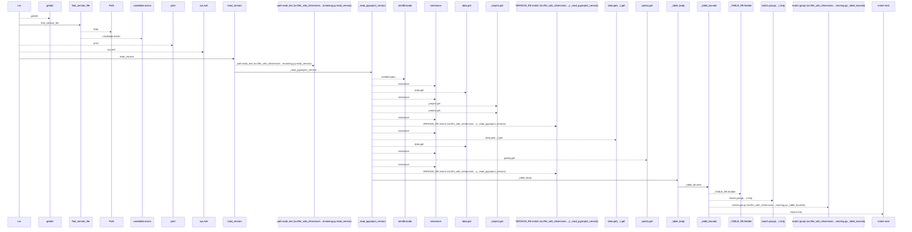
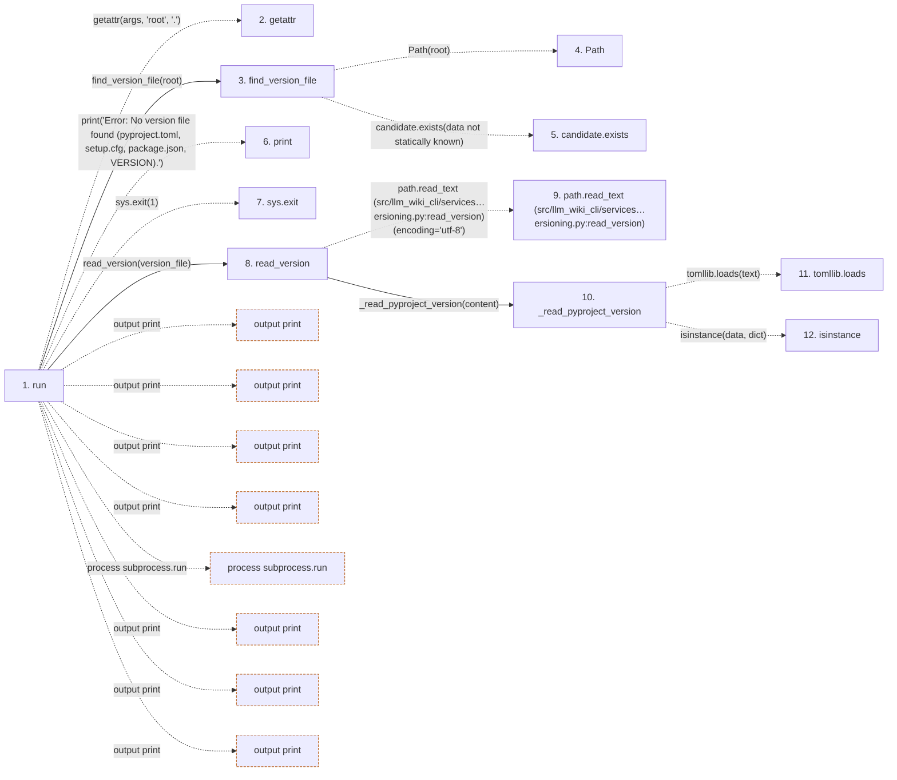

# bump

**Entry point:** `run` (`cli`)
**Source:** [bump_cmd](../modules/bump_cmd.md)
**Modules touched:** [bump_cmd](../modules/bump_cmd.md), [versioning](../modules/versioning.md)

## Call sequence

<!-- Auto-generated from static call edges. Dashed arrows are external or unresolved calls. Reviewed runtime conditions and side effects belong in Behavior. -->

> Call sequence diagram shows 30 of 99 interactions; 69 omitted to keep the visualization within the 30-interaction and generated-diagram limits.

## Data flow

<!-- Auto-generated static analysis. Treat values and boundaries as best-effort hints, not runtime proof. -->

### Step data

| Step | Inputs | Reads | Writes | Returns |
|---|---|---|---|---|
| `run` | `args` | `sys`, `subprocess`, `sys`, `sys` | - | - |
| `getattr` | - | - | - | - |
| `find_version_file` | `root: str` | `VERSION_PATTERNS` | - | `candidate`, `None` |
| `Path` | - | - | - | - |
| `candidate.exists` | - | - | - | - |
| `print` | - | - | - | - |
| `sys.exit` | - | - | - | - |
| `read_version` | `path: Path` | `VERSION_PATTERNS` | - | `_read_pyproject_version(...)`, `g`, `None` |
| `path.read_text (src/llm_wiki_cli/services…ersioning.py:read_version)` | - | - | - | - |
| `_read_pyproject_version` | `text: str` | - | - | `None`, `version`, `version`, `None`, `version`, `_static_version_from_body(...)`, `None` |
| `tomllib.loads` | - | - | - | - |
| `isinstance` | - | - | - | - |

### Call data

| From | To | Line | Call |
|---|---|---:|---|
| run | getattr | 14 | `getattr(args, 'root', '.')` |
| run | find_version_file | 15 | `find_version_file(root)` |
| find_version_file | Path | 31 | `Path(root)` |
| find_version_file | candidate.exists | 34 | `candidate.exists(data not statically known)` |
| run | print | 18 | `print('Error: No version file found (pyproject.toml, setup.cfg, package.json, VERSION).')` |
| run | sys.exit | 21 | `sys.exit(1)` |
| run | read_version | 23 | `read_version(version_file)` |
| read_version | path.read_text (src/llm_wiki_cli/services…ersioning.py:read_version) | 41 | `path.read_text(encoding='utf-8')` |
| read_version | _read_pyproject_version | 43 | `_read_pyproject_version(content)` |
| _read_pyproject_version | tomllib.loads | 90 | `tomllib.loads(text)` |
| _read_pyproject_version | isinstance | 93 | `isinstance(data, dict)` |

### Boundary effects

| Kind | Target | Step | Line |
|---|---|---|---:|
| output | `print` | `run` | 18 |
| output | `print` | `run` | 25 |
| output | `print` | `run` | 33 |
| output | `print` | `run` | 37 |
| process | `subprocess.run` | `run` | 42 |
| output | `print` | `run` | 49 |
| output | `print` | `run` | 55 |
| output | `print` | `run` | 57 |

### Static analysis gaps

| Kind | Step | Target | Line |
|---|---|---|---:|
| external_call | `run` | `getattr` | 14 |
| unresolved_call | `find_version_file` | `candidate.exists` | 34 |
| external_call | `run` | `sys.exit` | 21 |
| unresolved_call | `read_version` | `path.read_text` | 41 |
| unresolved_call | `_read_pyproject_version` | `tomllib.loads` | 90 |
| external_call | `_read_pyproject_version` | `isinstance` | 93 |
| step_limit | `run` | `first 12 steps` | 0 |

## Behavior

This flow starts at `run` and is classified as `cli`. The generated call and data-flow sections are bounded static projections; runtime conditions and side effects require source-level confirmation.
