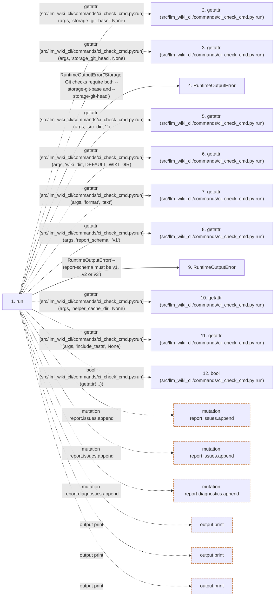

# ci-check

**Entry point:** `run` (`cli`)
**Source:** [ci_check_cmd](../modules/ci_check_cmd.md)
**Modules touched:** [bootstrap_runtime](../modules/bootstrap_runtime.md), [canonical_pages](../modules/canonical_pages.md), [ci_check_cmd](../modules/ci_check_cmd.md), [ci_report](../modules/ci_report.md), and 59 more

**Complete modules touched:**

- [bootstrap_runtime](../modules/bootstrap_runtime.md)
- [canonical_pages](../modules/canonical_pages.md)
- [ci_check_cmd](../modules/ci_check_cmd.md)
- [ci_report](../modules/ci_report.md)
- [common](../modules/common.md)
- [config](../modules/config.md)
- [data_flow](../modules/data_flow.md)
- [dependency_versions](../modules/dependency_versions.md)
- [doctor_service](../modules/doctor_service.md)
- [entrypoints](../modules/entrypoints.md)
- [extraction_jobs](../modules/extraction_jobs.md)
- [extraction_service](../modules/extraction_service.md)
- [filesystem_guard](../modules/filesystem_guard.md)
- [go_calls](../modules/go_calls.md)
- [health_contract](../modules/health_contract.md)
- [health_details](../modules/health_details.md)
- [health_policy](../modules/health_policy.md)
- [immutable](../modules/immutable.md)
- [imports](../modules/imports.md)
- [infrastructure_inventory](../modules/infrastructure_inventory.md)
- [infrastructure_sync](../modules/infrastructure_sync.md)
- [inventory_cache](../modules/inventory_cache.md)
- [io](../modules/io.md)
- [knowledge_artifacts](../modules/knowledge_artifacts.md)
- [knowledge_consumption](../modules/knowledge_consumption.md)
- [knowledge_envelope](../modules/knowledge_envelope.md)
- [knowledge_evidence](../modules/knowledge_evidence.md)
- [knowledge_freshness](../modules/knowledge_freshness.md)
- [knowledge_generation](../modules/knowledge_generation.md)
- [knowledge_governance](../modules/knowledge_governance.md)
- [knowledge_graph](../modules/knowledge_graph.md)
- [knowledge_loader](../modules/knowledge_loader.md)
- [knowledge_model](../modules/knowledge_model.md)
- [knowledge_observability](../modules/knowledge_observability.md)
- [knowledge_orchestration](../modules/knowledge_orchestration.md)
- [knowledge_packs](../modules/knowledge_packs.md)
- [knowledge_storage](../modules/knowledge_storage.md)
- [knowledge_storage_diagnostics](../modules/knowledge_storage_diagnostics.md)
- [knowledge_storage_io](../modules/knowledge_storage_io.md)
- [knowledge_storage_lifecycle](../modules/knowledge_storage_lifecycle.md)
- [knowledge_verification](../modules/knowledge_verification.md)
- [lint_service](../modules/lint_service.md)
- [manifest_storage](../modules/manifest_storage.md)
- [metrics](../modules/metrics.md)
- [packages](../modules/packages.md)
- [plugins](../modules/plugins.md)
- [progress](../modules/progress.md)
- [python_calls](../modules/python_calls.md)
- [python_contracts](../modules/python_contracts.md)
- [python_imports](../modules/python_imports.md)
- [python_observations](../modules/python_observations.md)
- [runtime_output](../modules/runtime_output.md)
- [services_dependencies](../modules/services_dependencies.md)
- [source_selection](../modules/source_selection.md)
- [source_snapshot](../modules/source_snapshot.md)
- [sync_analysis](../modules/sync_analysis.md)
- [sync_manifest](../modules/sync_manifest.md)
- [team](../modules/team.md)
- [validation](../modules/validation.md)
- [verification_contracts](../modules/verification_contracts.md)
- [wiki_lifecycle](../modules/wiki_lifecycle.md)
- [wiki_media](../modules/wiki_media.md)
- [wiki_surface](../modules/wiki_surface.md)

## Call sequence

```mermaid
sequenceDiagram
    participant p0 as run
    participant p1 as getattr (src/llm_wiki_cli/commands/ci_check_cmd.py:run)
    participant p2 as RuntimeOutputError
    participant p3 as bool (src/llm_wiki_cli/commands/ci_check_cmd.py:run)
    participant p4 as validate_source_root
    participant p5 as validate_path
    participant p6 as PathValidationError
    participant p7 as (…).resolve (src/llm_wiki_cli/config.py:validate_path)
    participant p8 as Path.cwd (src/llm_wiki_cli/config.py:validate_path)
    participant p9 as Path.cwd().resolve (src/llm_wiki_cli/config.py:validate_path)
    participant p10 as resolved.relative_to (src/llm_wiki_cli/config.py:validate_path)
    participant p11 as Path(…).expanduser (src/llm_wiki_cli/config.py:validate_source_root)
    participant p12 as Path (src/llm_wiki_cli/config.py:validate_source_root)
    participant p13 as candidate.is_absolute
    participant p14 as Path.cwd (src/llm_wiki_cli/config.py:validate_source_root)
    participant p15 as candidate.resolve (src/llm_wiki_cli/config.py:validate_source_root)
    participant p16 as resolved.is_dir
    p0-->>p1: getattr (src/llm_wiki_cli/commands/ci_check_cmd.py:run)
    p0-->>p1: getattr (src/llm_wiki_cli/commands/ci_check_cmd.py:run)
    p0->>p2: RuntimeOutputError
    p0-->>p1: getattr (src/llm_wiki_cli/commands/ci_check_cmd.py:run)
    p0-->>p1: getattr (src/llm_wiki_cli/commands/ci_check_cmd.py:run)
    p0-->>p1: getattr (src/llm_wiki_cli/commands/ci_check_cmd.py:run)
    p0-->>p1: getattr (src/llm_wiki_cli/commands/ci_check_cmd.py:run)
    p0->>p2: RuntimeOutputError
    p0-->>p1: getattr (src/llm_wiki_cli/commands/ci_check_cmd.py:run)
    p0-->>p1: getattr (src/llm_wiki_cli/commands/ci_check_cmd.py:run)
    p0-->>p3: bool (src/llm_wiki_cli/commands/ci_check_cmd.py:run)
    p0-->>p1: getattr (src/llm_wiki_cli/commands/ci_check_cmd.py:run)
    p0-->>p1: getattr (src/llm_wiki_cli/commands/ci_check_cmd.py:run)
    p0->>p4: validate_source_root
    p4->>p5: validate_path
    p5->>p6: PathValidationError
    p5-->>p7: (…).resolve (src/llm_wiki_cli/config.py:validate_path)
    p5-->>p8: Path.cwd (src/llm_wiki_cli/config.py:validate_path)
    p5-->>p9: Path.cwd().resolve (src/llm_wiki_cli/config.py:validate_path)
    p5-->>p8: Path.cwd (src/llm_wiki_cli/config.py:validate_path)
    p5-->>p10: resolved.relative_to (src/llm_wiki_cli/config.py:validate_path)
    p5->>p6: PathValidationError
    p4-->>p11: Path(…).expanduser (src/llm_wiki_cli/config.py:validate_source_root)
    p4-->>p12: Path (src/llm_wiki_cli/config.py:validate_source_root)
    p4-->>p13: candidate.is_absolute
    p4-->>p14: Path.cwd (src/llm_wiki_cli/config.py:validate_source_root)
    p4-->>p15: candidate.resolve (src/llm_wiki_cli/config.py:validate_source_root)
    p4->>p6: PathValidationError
    p4-->>p16: resolved.is_dir
    p4->>p6: PathValidationError
```

<!-- Auto-generated from static call edges. Dashed arrows are external or unresolved calls. Reviewed runtime conditions and side effects belong in Behavior. -->

> Call sequence diagram shows 30 of 4099 interactions; 4069 omitted to keep the visualization within the 30-interaction and generated-diagram limits.

> Trace truncated at the depth limit; deeper calls are omitted.

## Data flow

<!-- Auto-generated static analysis. Treat values and boundaries as best-effort hints, not runtime proof. -->

### Step data

| Step | Inputs | Reads | Writes | Returns |
|---|---|---|---|---|
| `run` | `args` | `DEFAULT_WIKI_DIR`, `print_extraction_job_plan`, `sys`, `sys` | - | - |
| `getattr (src/llm_wiki_cli/commands/ci_check_cmd.py:run)` | - | - | - | - |
| `getattr (src/llm_wiki_cli/commands/ci_check_cmd.py:run)` | - | - | - | - |
| `RuntimeOutputError` | - | - | - | - |
| `getattr (src/llm_wiki_cli/commands/ci_check_cmd.py:run)` | - | - | - | - |
| `getattr (src/llm_wiki_cli/commands/ci_check_cmd.py:run)` | - | - | - | - |
| `getattr (src/llm_wiki_cli/commands/ci_check_cmd.py:run)` | - | - | - | - |
| `getattr (src/llm_wiki_cli/commands/ci_check_cmd.py:run)` | - | - | - | - |
| `RuntimeOutputError` | - | - | - | - |
| `getattr (src/llm_wiki_cli/commands/ci_check_cmd.py:run)` | - | - | - | - |
| `getattr (src/llm_wiki_cli/commands/ci_check_cmd.py:run)` | - | - | - | - |
| `bool (src/llm_wiki_cli/commands/ci_check_cmd.py:run)` | - | - | - | - |

### Call data

| From | To | Line | Call |
|---|---|---:|---|
| run | getattr (src/llm_wiki_cli/commands/ci_check_cmd.py:run) | 98 | `getattr(args, 'storage_git_base', None)` |
| run | getattr (src/llm_wiki_cli/commands/ci_check_cmd.py:run) | 99 | `getattr(args, 'storage_git_head', None)` |
| run | RuntimeOutputError | 101 | `RuntimeOutputError('Storage Git checks require both --storage-git-base and --storage-git-head')` |
| run | getattr (src/llm_wiki_cli/commands/ci_check_cmd.py:run) | 102 | `getattr(args, 'src_dir', '.')` |
| run | getattr (src/llm_wiki_cli/commands/ci_check_cmd.py:run) | 103 | `getattr(args, 'wiki_dir', DEFAULT_WIKI_DIR)` |
| run | getattr (src/llm_wiki_cli/commands/ci_check_cmd.py:run) | 104 | `getattr(args, 'format', 'text')` |
| run | getattr (src/llm_wiki_cli/commands/ci_check_cmd.py:run) | 105 | `getattr(args, 'report_schema', 'v1')` |
| run | RuntimeOutputError | 107 | `RuntimeOutputError('--report-schema must be v1, v2 or v3')` |
| run | getattr (src/llm_wiki_cli/commands/ci_check_cmd.py:run) | 108 | `getattr(args, 'helper_cache_dir', None)` |
| run | getattr (src/llm_wiki_cli/commands/ci_check_cmd.py:run) | 109 | `getattr(args, 'include_tests', None)` |
| run | bool (src/llm_wiki_cli/commands/ci_check_cmd.py:run) | 110 | `bool(getattr(...))` |

### Boundary effects

| Kind | Target | Step | Line |
|---|---|---|---:|
| mutation | `report.issues.append` | `run` | 151 |
| mutation | `report.issues.append` | `run` | 154 |
| mutation | `report.diagnostics.append` | `run` | 157 |
| output | `print` | `run` | 182 |
| output | `print` | `run` | 196 |
| output | `print` | `run` | 203 |

### Static analysis gaps

| Kind | Step | Target | Line |
|---|---|---|---:|
| external_call | `run` | `getattr` | 98 |
| external_call | `run` | `getattr` | 99 |
| external_call | `run` | `getattr` | 102 |
| external_call | `run` | `getattr` | 103 |
| external_call | `run` | `getattr` | 104 |
| external_call | `run` | `getattr` | 105 |
| external_call | `run` | `getattr` | 108 |
| external_call | `run` | `getattr` | 109 |
| step_limit | `run` | `first 12 steps` | 0 |
| truncated_flow | `run` | `depth limit` | 0 |

## Behavior

Runs the lint report builder with strict validation unconditionally. It writes
a Markdown report to the requested artifact path, emits text, Markdown, or JSON
to the console, and records best-effort local metrics. The report is written
even when issues are found, then the command exits nonzero if the strict result
does not pass.
