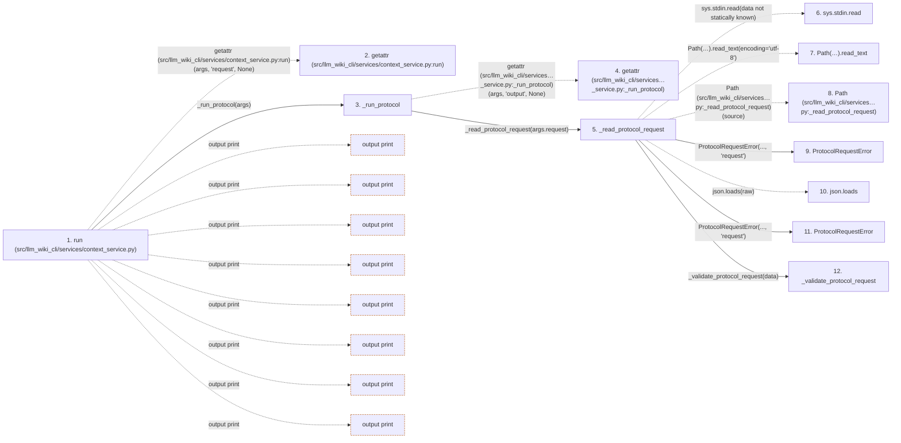

# context

**Entry point:** `run` (`cli`)
**Source:** [context_service](../modules/context_service.md)
**Modules touched:** [bootstrap_runtime](../modules/bootstrap_runtime.md), [change_selection](../modules/change_selection.md), [common](../modules/common.md), [config](../modules/config.md), and 26 more

**Complete modules touched:**

- [bootstrap_runtime](../modules/bootstrap_runtime.md)
- [change_selection](../modules/change_selection.md)
- [common](../modules/common.md)
- [config](../modules/config.md)
- [context_budget](../modules/context_budget.md)
- [context_packet](../modules/context_packet.md)
- [context_service](../modules/context_service.md)
- [data_flow](../modules/data_flow.md)
- [documentation_queries](../modules/documentation_queries.md)
- [documentation_query_builder](../modules/documentation_query_builder.md)
- [entrypoints](../modules/entrypoints.md)
- [extraction_jobs](../modules/extraction_jobs.md)
- [extraction_service](../modules/extraction_service.md)
- [filesystem_guard](../modules/filesystem_guard.md)
- [imports](../modules/imports.md)
- [infrastructure_inventory](../modules/infrastructure_inventory.md)
- [io](../modules/io.md)
- [knowledge_consumption](../modules/knowledge_consumption.md)
- [knowledge_loader](../modules/knowledge_loader.md)
- [knowledge_orchestration](../modules/knowledge_orchestration.md)
- [knowledge_verification](../modules/knowledge_verification.md)
- [plugins](../modules/plugins.md)
- [services_dependencies](../modules/services_dependencies.md)
- [source_selection](../modules/source_selection.md)
- [source_snapshot](../modules/source_snapshot.md)
- [sync_manifest](../modules/sync_manifest.md)
- [token_counting](../modules/token_counting.md)
- [wiki_media](../modules/wiki_media.md)
- [wiki_surface](../modules/wiki_surface.md)
- [wiki_surface_index](../modules/wiki_surface_index.md)

## Call sequence

```mermaid
sequenceDiagram
    participant p0 as run (src/llm_wiki_cli/services/context_service.py)
    participant p1 as getattr (src/llm_wiki_cli/services/context_service.py:run)
    participant p2 as _run_protocol
    participant p3 as getattr (src/llm_wiki_cli/services…_service.py:_run_protocol)
    participant p4 as _read_protocol_request
    participant p5 as sys.stdin.read
    participant p6 as Path(…).read_text
    participant p7 as Path (src/llm_wiki_cli/services…py:_read_protocol_request)
    participant p8 as ProtocolRequestError
    participant p9 as json.loads
    participant p10 as _validate_protocol_request
    participant p11 as isinstance (src/llm_wiki_cli/services…validate_protocol_request)
    participant p12 as data.get (src/llm_wiki_cli/services…validate_protocol_request)
    participant p13 as _validate_protocol_request_impl
    participant p14 as isinstance (src/llm_wiki_cli/services…ate_protocol_request_impl)
    participant p15 as any (src/llm_wiki_cli/services…ate_protocol_request_impl)
    participant p16 as data.get (src/llm_wiki_cli/services…ate_protocol_request_impl)
    participant p17 as validate_request
    participant p18 as set (src/llm_wiki_cli/services…udget.py:validate_request)
    participant p19 as sorted (src/llm_wiki_cli/services…udget.py:validate_request)
    participant p20 as dict (src/llm_wiki_cli/services…udget.py:validate_request)
    participant p21 as data.get (src/llm_wiki_cli/services…udget.py:validate_request)
    participant p22 as legacy.pop
    p0-->>p1: getattr (src/llm_wiki_cli/services/context_service.py:run)
    p0->>p2: _run_protocol
    p2-->>p3: getattr (src/llm_wiki_cli/services…_service.py:_run_protocol)
    p2->>p4: _read_protocol_request
    p4-->>p5: sys.stdin.read
    p4-->>p6: Path(…).read_text
    p4-->>p7: Path (src/llm_wiki_cli/services…py:_read_protocol_request)
    p4->>p8: ProtocolRequestError
    p4-->>p9: json.loads
    p4->>p8: ProtocolRequestError
    p4->>p10: _validate_protocol_request
    p10-->>p11: isinstance (src/llm_wiki_cli/services…validate_protocol_request)
    p10-->>p12: data.get (src/llm_wiki_cli/services…validate_protocol_request)
    p10->>p13: _validate_protocol_request_impl
    p13-->>p14: isinstance (src/llm_wiki_cli/services…ate_protocol_request_impl)
    p13->>p8: ProtocolRequestError
    p13-->>p15: any (src/llm_wiki_cli/services…ate_protocol_request_impl)
    p13-->>p14: isinstance (src/llm_wiki_cli/services…ate_protocol_request_impl)
    p13->>p8: ProtocolRequestError
    p13-->>p16: data.get (src/llm_wiki_cli/services…ate_protocol_request_impl)
    p13->>p17: validate_request
    p17-->>p18: set (src/llm_wiki_cli/services…udget.py:validate_request)
    p17->>p8: ProtocolRequestError
    p17-->>p19: sorted (src/llm_wiki_cli/services…udget.py:validate_request)
    p17-->>p20: dict (src/llm_wiki_cli/services…udget.py:validate_request)
    p17-->>p21: data.get (src/llm_wiki_cli/services…udget.py:validate_request)
    p17-->>p21: data.get (src/llm_wiki_cli/services…udget.py:validate_request)
    p17-->>p21: data.get (src/llm_wiki_cli/services…udget.py:validate_request)
    p17-->>p22: legacy.pop
    p17-->>p22: legacy.pop
```

<!-- Auto-generated from static call edges. Dashed arrows are external or unresolved calls. Reviewed runtime conditions and side effects belong in Behavior. -->

> Call sequence diagram shows 30 of 1281 interactions; 1251 omitted to keep the visualization within the 30-interaction and generated-diagram limits.

> Trace truncated at the depth limit; deeper calls are omitted.

## Data flow

<!-- Auto-generated static analysis. Treat values and boundaries as best-effort hints, not runtime proof. -->

### Step data

| Step | Inputs | Reads | Writes | Returns |
|---|---|---|---|---|
| `run (src/llm_wiki_cli/services/context_service.py)` | `args` | `DEFAULT_WIKI_DIR`, `sys`, `sys`, `print_extraction_job_plan`, `ProtocolRequestError`, `sys`, `KnowledgeRequiredUnavailableError`, `sys` | - | `none`, `none`, `none`, `none` |
| `getattr (src/llm_wiki_cli/services/context_service.py:run)` | - | - | - | - |
| `_run_protocol` | `args` | `DEFAULT_WIKI_DIR`, `DEFAULT_WIKI_DIR`, `KNOWLEDGE_PROTOCOL_VERSION`, `print_extraction_job_plan`, `ProtocolRequestError`, `KnowledgeRequiredUnavailableError`, `sys` | `exc.protocol` | `none`, `none`, `none` |
| `getattr (src/llm_wiki_cli/services…_service.py:_run_protocol)` | - | - | - | - |
| `_read_protocol_request` | `source: str` | `json` | - | `_validate_protocol_request(...)` |
| `sys.stdin.read` | - | - | - | - |
| `Path(…).read_text` | - | - | - | - |
| `Path (src/llm_wiki_cli/services…py:_read_protocol_request)` | - | - | - | - |
| `ProtocolRequestError` | - | - | - | - |
| `json.loads` | - | - | - | - |
| `ProtocolRequestError` | - | - | - | - |
| `_validate_protocol_request` | `data: object` | `PROTOCOL_VERSION`, `ProtocolRequestError`, `PROTOCOL_VERSION`, `KNOWLEDGE_PROTOCOL_VERSION` | `exc.protocol` | `_validate_protocol_request_impl(...)` |

### Call data

| From | To | Line | Call |
|---|---|---:|---|
| run (src/llm_wiki_cli/services/context_service.py) | getattr (src/llm_wiki_cli/services/context_service.py:run) | 3530 | `getattr(args, 'request', None)` |
| run (src/llm_wiki_cli/services/context_service.py) | _run_protocol | 3531 | `_run_protocol(args)` |
| _run_protocol | getattr (src/llm_wiki_cli/services…_service.py:_run_protocol) | 3368 | `getattr(args, 'output', None)` |
| _run_protocol | _read_protocol_request | 3371 | `_read_protocol_request(args.request)` |
| _read_protocol_request | sys.stdin.read | 1059 | `sys.stdin.read(data not statically known)` |
| _read_protocol_request | Path(…).read_text | 1061 | `Path(source).read_text(encoding='utf-8')` |
| _read_protocol_request | Path (src/llm_wiki_cli/services…py:_read_protocol_request) | 1061 | `Path(source)` |
| _read_protocol_request | ProtocolRequestError | 1064 | `ProtocolRequestError(..., 'request')` |
| _read_protocol_request | json.loads | 1067 | `json.loads(raw)` |
| _read_protocol_request | ProtocolRequestError | 1069 | `ProtocolRequestError(..., 'request')` |
| _read_protocol_request | _validate_protocol_request | 1071 | `_validate_protocol_request(data)` |

### Boundary effects

| Kind | Target | Step | Line |
|---|---|---|---:|
| output | `print` | `run` | 3547 |
| output | `print` | `run` | 3550 |
| output | `print` | `run` | 3594 |
| output | `print` | `run` | 3597 |
| output | `print` | `run` | 3604 |
| output | `print` | `run` | 3606 |
| output | `print` | `run` | 3615 |
| output | `print` | `run` | 3617 |

### Static analysis gaps

| Kind | Step | Target | Line |
|---|---|---|---:|
| external_call | `run` | `getattr` | 3530 |
| external_call | `_run_protocol` | `getattr` | 3368 |
| external_call | `_read_protocol_request` | `sys.stdin.read` | 1059 |
| unresolved_call | `_read_protocol_request` | `Path(source).read_text` | 1061 |
| external_call | `_read_protocol_request` | `json.loads` | 1067 |
| step_limit | `run` | `first 12 steps` | 0 |
| truncated_flow | `run` | `depth limit` | 0 |

## Behavior

This flow starts at `run` and is classified as `cli`. The generated call and data-flow sections are bounded static projections; runtime conditions and side effects require source-level confirmation.
