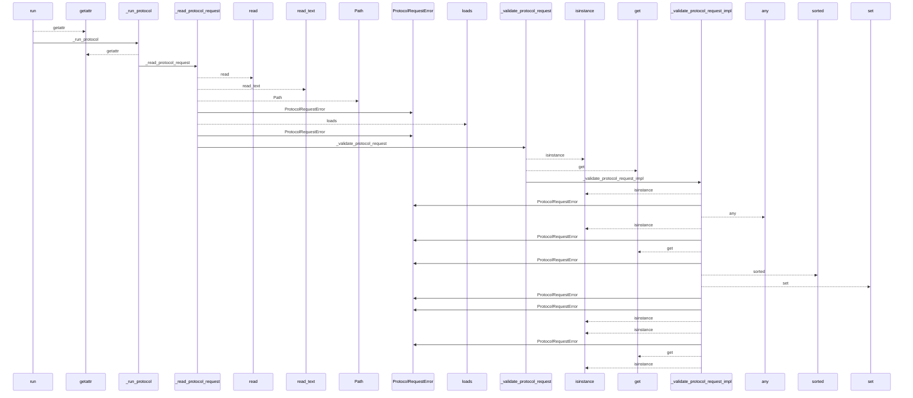
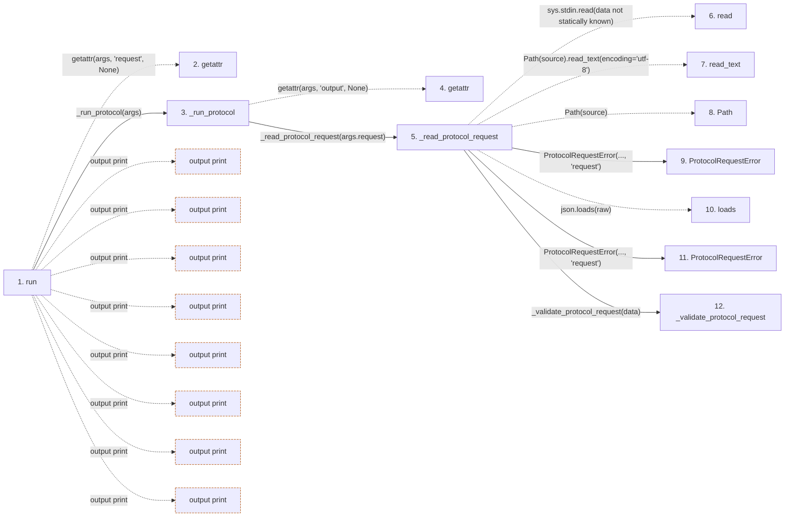

# context

**Entry point:** `run` (`cli`)
**Source:** [context_service](../modules/context_service.md)
**Modules touched:** [common](../modules/common.md), [config](../modules/config.md), [context_packet](../modules/context_packet.md), [context_service](../modules/context_service.md), and 22 more

**Complete modules touched:**

- [common](../modules/common.md)
- [config](../modules/config.md)
- [context_packet](../modules/context_packet.md)
- [context_service](../modules/context_service.md)
- [data_flow](../modules/data_flow.md)
- [documentation_queries](../modules/documentation_queries.md)
- [documentation_query_builder](../modules/documentation_query_builder.md)
- [entrypoints](../modules/entrypoints.md)
- [extraction_service](../modules/extraction_service.md)
- [filesystem_guard](../modules/filesystem_guard.md)
- [imports](../modules/imports.md)
- [infrastructure_inventory](../modules/infrastructure_inventory.md)
- [io](../modules/io.md)
- [knowledge_consumption](../modules/knowledge_consumption.md)
- [knowledge_evidence](../modules/knowledge_evidence.md)
- [knowledge_loader](../modules/knowledge_loader.md)
- [knowledge_orchestration](../modules/knowledge_orchestration.md)
- [knowledge_verification](../modules/knowledge_verification.md)
- [plugins](../modules/plugins.md)
- [services_dependencies](../modules/services_dependencies.md)
- [source_selection](../modules/source_selection.md)
- [source_snapshot](../modules/source_snapshot.md)
- [validation](../modules/validation.md)
- [wiki_media](../modules/wiki_media.md)
- [wiki_surface](../modules/wiki_surface.md)
- [wiki_surface_index](../modules/wiki_surface_index.md)

## Call sequence

<!-- Auto-generated from static call edges. Dashed arrows are external or unresolved calls. Reviewed runtime conditions and side effects belong in Behavior. -->

> Call sequence diagram shows 30 of 1669 interactions; 1639 omitted to keep the visualization within the 30-interaction and generated-diagram limits.

> Trace truncated at the depth limit; deeper calls are omitted.

## Data flow

<!-- Auto-generated static analysis. Treat values and boundaries as best-effort hints, not runtime proof. -->

### Step data

| Step | Inputs | Reads | Writes | Returns |
|---|---|---|---|---|
| `run` | `args` | `DEFAULT_WIKI_DIR`, `sys`, `sys`, `print_extraction_job_plan`, `ProtocolRequestError`, `sys`, `KnowledgeRequiredUnavailableError`, `sys` | - | `none`, `none`, `none` |
| `getattr` | - | - | - | - |
| `_run_protocol` | `args` | `DEFAULT_WIKI_DIR`, `KNOWLEDGE_PROTOCOL_VERSION`, `print_extraction_job_plan`, `ProtocolRequestError`, `KnowledgeRequiredUnavailableError`, `sys` | `exc.protocol` | `none` |
| `getattr` | - | - | - | - |
| `_read_protocol_request` | `source: str` | `json` | - | `_validate_protocol_request(...)` |
| `read` | - | - | - | - |
| `read_text` | - | - | - | - |
| `Path` | - | - | - | - |
| `ProtocolRequestError` | - | - | - | - |
| `loads` | - | - | - | - |
| `ProtocolRequestError` | - | - | - | - |
| `_validate_protocol_request` | `data: object` | `PROTOCOL_VERSION`, `ProtocolRequestError`, `PROTOCOL_VERSION`, `KNOWLEDGE_PROTOCOL_VERSION` | `exc.protocol` | `_validate_protocol_request_impl(...)` |

### Call data

| From | To | Line | Call |
|---|---|---:|---|
| run | getattr | 3403 | `getattr(args, 'request', None)` |
| run | _run_protocol | 3404 | `_run_protocol(args)` |
| _run_protocol | getattr | 3292 | `getattr(args, 'output', None)` |
| _run_protocol | _read_protocol_request | 3295 | `_read_protocol_request(args.request)` |
| _read_protocol_request | read | 1011 | `sys.stdin.read(data not statically known)` |
| _read_protocol_request | read_text | 1013 | `Path(source).read_text(encoding='utf-8')` |
| _read_protocol_request | Path | 1013 | `Path(source)` |
| _read_protocol_request | ProtocolRequestError | 1016 | `ProtocolRequestError(..., 'request')` |
| _read_protocol_request | loads | 1019 | `json.loads(raw)` |
| _read_protocol_request | ProtocolRequestError | 1021 | `ProtocolRequestError(..., 'request')` |
| _read_protocol_request | _validate_protocol_request | 1023 | `_validate_protocol_request(data)` |

### Boundary effects

| Kind | Target | Step | Line |
|---|---|---|---:|
| output | `print` | `run` | 3420 |
| output | `print` | `run` | 3423 |
| output | `print` | `run` | 3457 |
| output | `print` | `run` | 3460 |
| output | `print` | `run` | 3467 |
| output | `print` | `run` | 3469 |
| output | `print` | `run` | 3478 |
| output | `print` | `run` | 3480 |

### Static analysis gaps

| Kind | Step | Target | Line |
|---|---|---|---:|
| unresolved_call | `run` | `getattr` | 3403 |
| unresolved_call | `_run_protocol` | `getattr` | 3292 |
| external_call | `_read_protocol_request` | `sys.stdin.read` | 1011 |
| unresolved_call | `_read_protocol_request` | `Path(source).read_text` | 1013 |
| external_call | `_read_protocol_request` | `json.loads` | 1019 |
| step_limit | `run` | `first 12 steps` | 0 |
| truncated_flow | `run` | `depth limit` | 0 |

## Behavior

This flow starts at `run` and is classified as `cli`. The generated call and data-flow sections are bounded static projections; runtime conditions and side effects require source-level confirmation.
