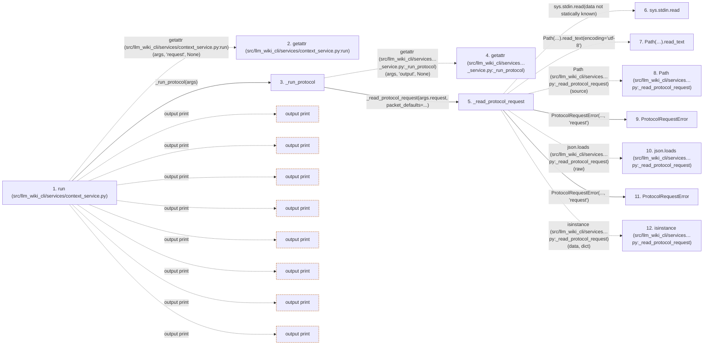

# context

**Entry point:** `run` (`cli`)
**Source:** [context_service](../modules/context_service.md)
**Modules touched:** [bootstrap_recovery](../modules/bootstrap_recovery.md), [bootstrap_runtime](../modules/bootstrap_runtime.md), [change_selection](../modules/change_selection.md), [common](../modules/common.md), and 36 more

**Complete modules touched:**

- [bootstrap_recovery](../modules/bootstrap_recovery.md)
- [bootstrap_runtime](../modules/bootstrap_runtime.md)
- [change_selection](../modules/change_selection.md)
- [common](../modules/common.md)
- [config](../modules/config.md)
- [context_budget](../modules/context_budget.md)
- [context_packet](../modules/context_packet.md)
- [context_service](../modules/context_service.md)
- [data_flow](../modules/data_flow.md)
- [documentation_queries](../modules/documentation_queries.md)
- [documentation_query_builder](../modules/documentation_query_builder.md)
- [entrypoints](../modules/entrypoints.md)
- [extraction_jobs](../modules/extraction_jobs.md)
- [extraction_service](../modules/extraction_service.md)
- [filesystem_guard](../modules/filesystem_guard.md)
- [imports](../modules/imports.md)
- [infrastructure_inventory](../modules/infrastructure_inventory.md)
- [io](../modules/io.md)
- [knowledge_consumption](../modules/knowledge_consumption.md)
- [knowledge_governance](../modules/knowledge_governance.md)
- [knowledge_loader](../modules/knowledge_loader.md)
- [knowledge_orchestration](../modules/knowledge_orchestration.md)
- [knowledge_storage](../modules/knowledge_storage.md)
- [knowledge_storage_io](../modules/knowledge_storage_io.md)
- [knowledge_verification](../modules/knowledge_verification.md)
- [maintenance_protocol](../modules/maintenance_protocol.md)
- [maintenance_service](../modules/maintenance_service.md)
- [maintenance_state](../modules/maintenance_state.md)
- [maintenance_status](../modules/maintenance_status.md)
- [plugins](../modules/plugins.md)
- [services_dependencies](../modules/services_dependencies.md)
- [source_retirement](../modules/source_retirement.md)
- [source_selection](../modules/source_selection.md)
- [source_snapshot](../modules/source_snapshot.md)
- [sync_manifest](../modules/sync_manifest.md)
- [token_counting](../modules/token_counting.md)
- [wiki_media](../modules/wiki_media.md)
- [wiki_surface](../modules/wiki_surface.md)
- [wiki_surface_index](../modules/wiki_surface_index.md)
- [wiki_write_basis](../modules/wiki_write_basis.md)

## Call sequence

> Static overview in presentation order, not runtime execution order. Arrows retain captured callers; representative internal continuations and boundary examples precede repeated helper detail.

<!-- Auto-generated from static call edges. Dashed arrows are external or unresolved calls. Reviewed runtime conditions and side effects belong in Behavior. -->

```mermaid
sequenceDiagram
    participant p0 as run (src/llm_wiki_cli/services/context_service.py)
    participant p1 as _run_protocol
    participant p2 as changes_from_args
    participant p3 as run (src/llm_wiki_cli/services/context_budget.py)
    participant p4 as _run_packet_output
    participant p5 as _build_context
    participant p6 as ExtractionJobRequest.resolved
    participant p7 as write_text_output
    participant p8 as _render_markdown
    participant p9 as _read_protocol_request
    participant p10 as _validate_request_cli_options
    participant p11 as _emit_protocol_error
    participant p12 as build_qualified_context
    participant p13 as _build_context_impl
    participant p14 as _normalized_request
    participant p15 as build_budgeted_context
    participant p16 as _emit_packet_error
    participant p17 as _packet_contract_for_request
    participant p18 as _write_utf8_text
    participant p19 as _validate_protocol_request
    participant p20 as validate_changes
    participant p21 as capture_context_read
    participant p22 as _protocol_success_payload
    participant p23 as select_changes
    participant p24 as affected_page_map
    participant p25 as _fit_knowledge_packet_response
    participant p26 as packet_from_captured_response
    participant p27 as build_context_from_captured_read
    participant p28 as fit_payload
    participant p29 as getattr (src/llm_wiki_cli/services/context_service.py:run)
    participant p30 as request.get (src/llm_wiki_cli/services…_service.py:_run_protocol)
    p0->>p1: _run_protocol
    p0->>p2: changes_from_args
    p0->>p3: run (src/llm_wiki_cli/services/context_budget.py)
    p0->>p4: _run_packet_output
    p0->>p5: _build_context
    p0->>p6: ExtractionJobRequest.resolved
    p0->>p7: write_text_output
    p0->>p8: _render_markdown
    p1->>p9: _read_protocol_request
    p1->>p10: _validate_request_cli_options
    p1->>p11: _emit_protocol_error
    p4->>p12: build_qualified_context
    p5->>p13: _build_context_impl
    p9->>p14: _normalized_request
    p3->>p15: build_budgeted_context
    p3->>p16: _emit_packet_error
    p12->>p17: _packet_contract_for_request
    p7->>p18: _write_utf8_text
    p14->>p19: _validate_protocol_request
    p2->>p20: validate_changes
    p15->>p21: capture_context_read
    p12->>p22: _protocol_success_payload
    p15->>p23: select_changes
    p15->>p24: affected_page_map
    p12->>p25: _fit_knowledge_packet_response
    p12->>p26: packet_from_captured_response
    p15->>p27: build_context_from_captured_read
    p15->>p28: fit_payload
    p0-->>p29: getattr (src/llm_wiki_cli/services/context_service.py:run)(args, 'request', None)
    p1-->>p30: request.get (src/llm_wiki_cli/services…_service.py:_run_protocol)('knowledge_mode')
```

> Call sequence diagram shows 30 of 1496 interactions; 1466 omitted to keep the visualization within the 30-interaction and generated-diagram limits, with uncertain identities omitted rather than inferred.

> Captured boundary calls: external 1 of 512 (511 omitted); unresolved 1 of 454 (453 omitted). These counts cover the captured static trace.

Omitted captured detail, grouped by actual caller occurrence and target module:

| Caller | Parent step | Target module | Kind | Omitted interactions |
| --- | --- | --- | --- | --- |
| `src/llm_wiki_cli/services/context_service.py:_run_protocol` | 3 | - | external | 22 |
| `src/llm_wiki_cli/services/context_service.py:_read_protocol_request` | 5 | - | external | 4 |
| `src/llm_wiki_cli/services/context_service.py:_read_protocol_request` | 5 | - | unresolved | 1 |
| `src/llm_wiki_cli/services/context_service.py:_read_protocol_request` | 5 | [src/llm_wiki_cli/services/context_service.py](../modules/context_service.md) | internal | 3 |
| `src/llm_wiki_cli/services/context_packet.py:_normalized_request` | 13 | - | external | 3 |
| `src/llm_wiki_cli/services/context_packet.py:_normalized_request` | 13 | [src/llm_wiki_cli/services/context_service.py](../modules/context_service.md) | internal | 1 |
| `src/llm_wiki_cli/services/context_packet.py:_normalized_request` | 13 | - | unresolved | 2 |
| `src/llm_wiki_cli/services/context_service.py:_validate_protocol_request` | 20 | - | external | 2 |
> Omission summary shows 8 of 285 groups; 277 further groups are not expanded here. Counts above include all omitted interactions.
> Detailed flow queries retain their own coverage and limits; omitted paths may execute at runtime.

> Trace truncated at the depth limit; deeper calls are omitted.

## Data flow

<!-- Auto-generated static analysis. Treat values and boundaries as best-effort hints, not runtime proof. -->

```mermaid
flowchart LR
    s1["1. run (src/llm_wiki_cli/services/context_service.py)"]
    s2["2. getattr (src/llm_wiki_cli/services/context_service.py:run)"]
    s3["3. _run_protocol"]
    s4["4. getattr (src/llm_wiki_cli/services…_service.py:_run_protocol)"]
    s5["5. _read_protocol_request"]
    s6["6. sys.stdin.read"]
    s7["7. Path(…).read_text"]
    s8["8. Path (src/llm_wiki_cli/services…py:_read_protocol_request)"]
    s9["9. ProtocolRequestError"]
    s10["10. json.loads (src/llm_wiki_cli/services…py:_read_protocol_request)"]
    s11["11. ProtocolRequestError"]
    s12["12. isinstance (src/llm_wiki_cli/services…py:_read_protocol_request)"]
    s1 -. "getattr (src/llm_wiki_cli/services/context_service.py:run)(args, 'request', None)" .-> s2
    s1 -->|"_run_protocol(args)"| s3
    s3 -. "getattr (src/llm_wiki_cli/services…_service.py:_run_protocol)(args, 'output', None)" .-> s4
    s3 -->|"_read_protocol_request(args.request, packet_defaults=...)"| s5
    s5 -. "sys.stdin.read(data not statically known)" .-> s6
    s5 -. "Path(…).read_text(encoding='utf-8')" .-> s7
    s5 -. "Path (src/llm_wiki_cli/services…py:_read_protocol_request)(source)" .-> s8
    s5 -->|"ProtocolRequestError(..., 'request')"| s9
    s5 -. "json.loads (src/llm_wiki_cli/services…py:_read_protocol_request)(raw)" .-> s10
    s5 -->|"ProtocolRequestError(..., 'request')"| s11
    s5 -. "isinstance (src/llm_wiki_cli/services…py:_read_protocol_request)(data, dict)" .-> s12
    b0["output print"]
    s1 -. "output print" .-> b0
    b1["output print"]
    s1 -. "output print" .-> b1
    b2["output print"]
    s1 -. "output print" .-> b2
    b3["output print"]
    s1 -. "output print" .-> b3
    b4["output print"]
    s1 -. "output print" .-> b4
    b5["output print"]
    s1 -. "output print" .-> b5
    b6["output print"]
    s1 -. "output print" .-> b6
    b7["output print"]
    s1 -. "output print" .-> b7
    click s1 "../modules/context_service.md"
    click s3 "../modules/context_service.md"
    click s5 "../modules/context_service.md"
    click s9 "../modules/context_service.md"
    click s11 "../modules/context_service.md"
    classDef boundary stroke:#b45309,stroke-dasharray: 4 2
    class b0 boundary
    class b1 boundary
    class b2 boundary
    class b3 boundary
    class b4 boundary
    class b5 boundary
    class b6 boundary
    class b7 boundary
```

### Step data

| Step | Inputs | Reads | Writes | Returns |
|---|---|---|---|---|
| `run (src/llm_wiki_cli/services/context_service.py)` | `args` | `DEFAULT_WIKI_DIR`, `sys`, `sys`, `print_extraction_job_plan`, `ProtocolRequestError`, `sys`, `KnowledgeRequiredUnavailableError`, `sys` | - | `none`, `none`, `none`, `none` |
| `getattr (src/llm_wiki_cli/services/context_service.py:run)` | - | - | - | - |
| `_run_protocol` | `args` | `DEFAULT_WIKI_DIR`, `DEFAULT_WIKI_DIR`, `KNOWLEDGE_PROTOCOL_VERSION`, `print_extraction_job_plan`, `ProtocolRequestError`, `KnowledgeRequiredUnavailableError`, `sys` | `exc.protocol` | `none`, `none`, `none` |
| `getattr (src/llm_wiki_cli/services…_service.py:_run_protocol)` | - | - | - | - |
| `_read_protocol_request` | `source: str`, `packet_defaults: bool` | `json` | - | `_normalized_request(...)`, `_validate_protocol_request(...)` |
| `sys.stdin.read` | - | - | - | - |
| `Path(…).read_text` | - | - | - | - |
| `Path (src/llm_wiki_cli/services…py:_read_protocol_request)` | - | - | - | - |
| `ProtocolRequestError` | - | - | - | - |
| `json.loads (src/llm_wiki_cli/services…py:_read_protocol_request)` | - | - | - | - |
| `ProtocolRequestError` | - | - | - | - |
| `isinstance (src/llm_wiki_cli/services…py:_read_protocol_request)` | - | - | - | - |

### Call data

| From | To | Line | Call |
|---|---|---:|---|
| run (src/llm_wiki_cli/services/context_service.py) | getattr (src/llm_wiki_cli/services/context_service.py:run) | 3650 | `getattr(args, 'request', None)` |
| run (src/llm_wiki_cli/services/context_service.py) | _run_protocol | 3651 | `_run_protocol(args)` |
| _run_protocol | getattr (src/llm_wiki_cli/services…_service.py:_run_protocol) | 3491 | `getattr(args, 'output', None)` |
| _run_protocol | _read_protocol_request | 3494 | `_read_protocol_request(args.request, packet_defaults=...)` |
| _read_protocol_request | sys.stdin.read | 1092 | `sys.stdin.read(data not statically known)` |
| _read_protocol_request | Path(…).read_text | 1094 | `Path(source).read_text(encoding='utf-8')` |
| _read_protocol_request | Path (src/llm_wiki_cli/services…py:_read_protocol_request) | 1094 | `Path(source)` |
| _read_protocol_request | ProtocolRequestError | 1097 | `ProtocolRequestError(..., 'request')` |
| _read_protocol_request | json.loads (src/llm_wiki_cli/services…py:_read_protocol_request) | 1100 | `json.loads(raw)` |
| _read_protocol_request | ProtocolRequestError | 1102 | `ProtocolRequestError(..., 'request')` |
| _read_protocol_request | isinstance (src/llm_wiki_cli/services…py:_read_protocol_request) | 1104 | `isinstance(data, dict)` |

### Boundary effects

| Kind | Target | Step | Line |
|---|---|---|---:|
| output | `print` | `run` | 3667 |
| output | `print` | `run` | 3670 |
| output | `print` | `run` | 3714 |
| output | `print` | `run` | 3717 |
| output | `print` | `run` | 3724 |
| output | `print` | `run` | 3726 |
| output | `print` | `run` | 3735 |
| output | `print` | `run` | 3737 |

### Static analysis gaps

| Kind | Step | Target | Line |
|---|---|---|---:|
| external_call | `run` | `getattr` | 3650 |
| external_call | `_run_protocol` | `getattr` | 3491 |
| external_call | `_read_protocol_request` | `sys.stdin.read` | 1092 |
| unresolved_call | `_read_protocol_request` | `Path(source).read_text` | 1094 |
| external_call | `_read_protocol_request` | `json.loads` | 1100 |
| external_call | `_read_protocol_request` | `isinstance` | 1104 |
| step_limit | `run` | `first 12 steps` | 0 |
| truncated_flow | `run` | `depth limit` | 0 |

## Behavior

This flow starts at `run` and is classified as `cli`. The generated call and data-flow sections are bounded static projections; runtime conditions and side effects require source-level confirmation.

Declared ordinary maintenance authority is required to remain coherent. A damaged owner or immutable marker produces a bounded `maintenance-authority-unavailable` refusal, with a safe original cause and an explicit matching committed-recovery template. No native packet or promoted fallback is returned, and no backup, identity, setup or repair is chosen by the read. The caller must preserve recovery preconditions and the original source/wiki boundaries.
