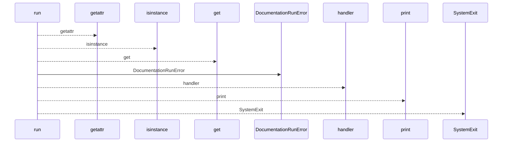
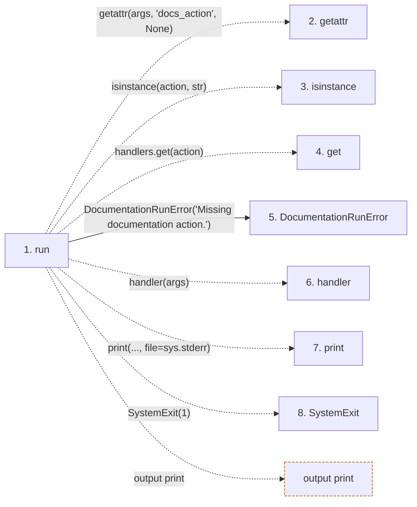

# docs

**Entry point:** `run` (`cli`)
**Source:** [docs_cmd](../modules/docs_cmd.md)
**Modules touched:** [docs_cmd](../modules/docs_cmd.md), [documentation_run_contracts](../modules/documentation_run_contracts.md)

## Call sequence

<!-- Auto-generated from static call edges. Dashed arrows are external or unresolved calls. Reviewed runtime conditions and side effects belong in Behavior. -->

## Data flow

<!-- Auto-generated static analysis. Treat values and boundaries as best-effort hints, not runtime proof. -->

### Step data

| Step | Inputs | Reads | Writes | Returns |
|---|---|---|---|---|
| `run` | `args` | `_prepare`, `_status`, `_packet`, `_record_result`, `_verify`, `_export`, `_calibration`, `PathValidationError` | - | - |
| `getattr` | - | - | - | - |
| `isinstance` | - | - | - | - |
| `get` | - | - | - | - |
| `DocumentationRunError` | - | - | - | - |
| `handler` | - | - | - | - |
| `print` | - | - | - | - |
| `SystemExit` | - | - | - | - |

### Call data

| From | To | Line | Call |
|---|---|---:|---|
| run | getattr | 654 | `getattr(args, 'docs_action', None)` |
| run | isinstance | 664 | `isinstance(action, str)` |
| run | get | 664 | `handlers.get(action)` |
| run | DocumentationRunError | 666 | `DocumentationRunError('Missing documentation action.')` |
| run | handler | 668 | `handler(args)` |
| run | print | 672 | `print(..., file=sys.stderr)` |
| run | SystemExit | 673 | `SystemExit(1)` |

### Boundary effects

| Kind | Target | Step | Line |
|---|---|---|---:|
| output | `print` | `run` | 672 |

### Static analysis gaps

| Kind | Step | Target | Line |
|---|---|---|---:|
| unresolved_call | `run` | `getattr` | 654 |
| unresolved_call | `run` | `isinstance` | 664 |
| unresolved_call | `run` | `handlers.get` | 664 |
| unresolved_call | `run` | `handler` | 668 |
| unresolved_call | `run` | `SystemExit` | 673 |

## Behavior

This flow starts at `run` and is classified as `cli`. The generated call and data-flow sections are bounded static projections; runtime conditions and side effects require source-level confirmation.
