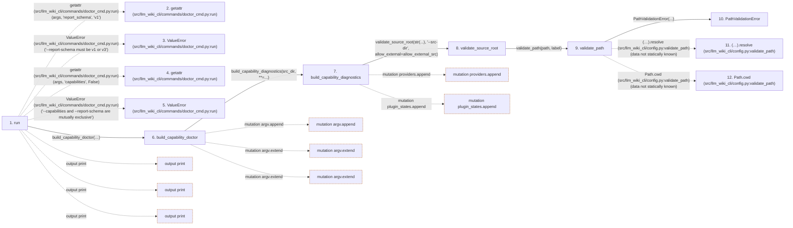

# doctor

**Entry point:** `run` (`cli`)
**Source:** [doctor_cmd](../modules/doctor_cmd.md)
**Modules touched:** [capability_diagnostics](../modules/capability_diagnostics.md), [common](../modules/common.md), [config](../modules/config.md), [data_flow](../modules/data_flow.md), and 37 more

**Complete modules touched:**

- [capability_diagnostics](../modules/capability_diagnostics.md)
- [common](../modules/common.md)
- [config](../modules/config.md)
- [data_flow](../modules/data_flow.md)
- [doctor_cmd](../modules/doctor_cmd.md)
- [doctor_service](../modules/doctor_service.md)
- [entrypoints](../modules/entrypoints.md)
- [extraction_jobs](../modules/extraction_jobs.md)
- [extraction_service](../modules/extraction_service.md)
- [extractor_helpers](../modules/extractor_helpers.md)
- [filesystem_guard](../modules/filesystem_guard.md)
- [health_contract](../modules/health_contract.md)
- [health_details](../modules/health_details.md)
- [health_policy](../modules/health_policy.md)
- [health_summary](../modules/health_summary.md)
- [immutable](../modules/immutable.md)
- [infrastructure_inventory](../modules/infrastructure_inventory.md)
- [inventory_cache](../modules/inventory_cache.md)
- [io](../modules/io.md)
- [knowledge_artifacts](../modules/knowledge_artifacts.md)
- [knowledge_consumption](../modules/knowledge_consumption.md)
- [knowledge_envelope](../modules/knowledge_envelope.md)
- [knowledge_evidence](../modules/knowledge_evidence.md)
- [knowledge_freshness](../modules/knowledge_freshness.md)
- [knowledge_loader](../modules/knowledge_loader.md)
- [knowledge_observability](../modules/knowledge_observability.md)
- [knowledge_orchestration](../modules/knowledge_orchestration.md)
- [knowledge_verification](../modules/knowledge_verification.md)
- [lint_service](../modules/lint_service.md)
- [plugins](../modules/plugins.md)
- [progress](../modules/progress.md)
- [runtime_output](../modules/runtime_output.md)
- [services_dependencies](../modules/services_dependencies.md)
- [source_selection](../modules/source_selection.md)
- [source_snapshot](../modules/source_snapshot.md)
- [sync_analysis](../modules/sync_analysis.md)
- [sync_manifest](../modules/sync_manifest.md)
- [team](../modules/team.md)
- [validation](../modules/validation.md)
- [wiki_lifecycle](../modules/wiki_lifecycle.md)
- [wiki_media](../modules/wiki_media.md)

## Call sequence

```mermaid
sequenceDiagram
    participant p0 as run
    participant p1 as getattr (src/llm_wiki_cli/commands/doctor_cmd.py:run)
    participant p2 as ValueError (src/llm_wiki_cli/commands/doctor_cmd.py:run)
    participant p3 as build_capability_doctor
    participant p4 as build_capability_diagnostics
    participant p5 as validate_source_root
    participant p6 as validate_path
    participant p7 as PathValidationError
    participant p8 as (…).resolve (src/llm_wiki_cli/config.py:validate_path)
    participant p9 as Path.cwd (src/llm_wiki_cli/config.py:validate_path)
    participant p10 as Path.cwd().resolve (src/llm_wiki_cli/config.py:validate_path)
    participant p11 as resolved.relative_to (src/llm_wiki_cli/config.py:validate_path)
    participant p12 as Path(…).expanduser (src/llm_wiki_cli/config.py:validate_source_root)
    participant p13 as Path (src/llm_wiki_cli/config.py:validate_source_root)
    participant p14 as candidate.is_absolute
    participant p15 as Path.cwd (src/llm_wiki_cli/config.py:validate_source_root)
    participant p16 as candidate.resolve (src/llm_wiki_cli/config.py:validate_source_root)
    participant p17 as resolved.is_dir
    participant p18 as os.path.abspath (src/llm_wiki_cli/config.py:validate_source_root)
    participant p19 as windows_current_user_sid
    participant p20 as WindowsSecurityGuardError
    participant p21 as _current_windows_user_sid
    participant p22 as ctypes.WinDLL
    p0-->>p1: getattr (src/llm_wiki_cli/commands/doctor_cmd.py:run)
    p0-->>p2: ValueError (src/llm_wiki_cli/commands/doctor_cmd.py:run)
    p0-->>p1: getattr (src/llm_wiki_cli/commands/doctor_cmd.py:run)
    p0-->>p2: ValueError (src/llm_wiki_cli/commands/doctor_cmd.py:run)
    p0->>p3: build_capability_doctor
    p3->>p4: build_capability_diagnostics
    p4->>p5: validate_source_root
    p5->>p6: validate_path
    p6->>p7: PathValidationError
    p6-->>p8: (…).resolve (src/llm_wiki_cli/config.py:validate_path)
    p6-->>p9: Path.cwd (src/llm_wiki_cli/config.py:validate_path)
    p6-->>p10: Path.cwd().resolve (src/llm_wiki_cli/config.py:validate_path)
    p6-->>p9: Path.cwd (src/llm_wiki_cli/config.py:validate_path)
    p6-->>p11: resolved.relative_to (src/llm_wiki_cli/config.py:validate_path)
    p6->>p7: PathValidationError
    p5-->>p12: Path(…).expanduser (src/llm_wiki_cli/config.py:validate_source_root)
    p5-->>p13: Path (src/llm_wiki_cli/config.py:validate_source_root)
    p5-->>p14: candidate.is_absolute
    p5-->>p15: Path.cwd (src/llm_wiki_cli/config.py:validate_source_root)
    p5-->>p16: candidate.resolve (src/llm_wiki_cli/config.py:validate_source_root)
    p5->>p7: PathValidationError
    p5-->>p17: resolved.is_dir
    p5->>p7: PathValidationError
    p5-->>p13: Path (src/llm_wiki_cli/config.py:validate_source_root)
    p5-->>p18: os.path.abspath (src/llm_wiki_cli/config.py:validate_source_root)
    p5->>p19: windows_current_user_sid
    p19->>p20: WindowsSecurityGuardError
    p19->>p21: _current_windows_user_sid
    p21-->>p22: ctypes.WinDLL
    p21-->>p22: ctypes.WinDLL
```

<!-- Auto-generated from static call edges. Dashed arrows are external or unresolved calls. Reviewed runtime conditions and side effects belong in Behavior. -->

> Call sequence diagram shows 30 of 1319 interactions; 1289 omitted to keep the visualization within the 30-interaction and generated-diagram limits.

> Trace truncated at the depth limit; deeper calls are omitted.

## Data flow

<!-- Auto-generated static analysis. Treat values and boundaries as best-effort hints, not runtime proof. -->

### Step data

| Step | Inputs | Reads | Writes | Returns |
|---|---|---|---|---|
| `run` | `args` | `DEFAULT_WIKI_DIR` | - | `none` |
| `getattr (src/llm_wiki_cli/commands/doctor_cmd.py:run)` | - | - | - | - |
| `ValueError (src/llm_wiki_cli/commands/doctor_cmd.py:run)` | - | - | - | - |
| `getattr (src/llm_wiki_cli/commands/doctor_cmd.py:run)` | - | - | - | - |
| `ValueError (src/llm_wiki_cli/commands/doctor_cmd.py:run)` | - | - | - | - |
| `build_capability_doctor` | `wiki_dir`, `src_dir`, `kwargs` | `sys`, `DOCTOR_CAPABILITY_VERSION` | - | `{...}` |
| `build_capability_diagnostics` | `src_dir`, `helper_cache_dir`, `source_selection`, `allow_external_src`, `include_tests` | `helpers`, `_LANGUAGE_LABELS`, `sys`, `_TOOL_HINTS`, `LANGUAGE_EXTENSIONS`, `sys` | `tools[...]` | `{...}` |
| `validate_source_root` | `path: str`, `label: str`, `allow_external: bool` | `sys`, `os`, `WindowsSecurityGuardError`, `sys` | - | `validate_path(...)`, `resolved` |
| `validate_path` | `path: str`, `label: str` | - | - | `resolved` |
| `PathValidationError` | - | - | - | - |
| `(…).resolve (src/llm_wiki_cli/config.py:validate_path)` | - | - | - | - |
| `Path.cwd (src/llm_wiki_cli/config.py:validate_path)` | - | - | - | - |

### Call data

| From | To | Line | Call |
|---|---|---:|---|
| run | getattr (src/llm_wiki_cli/commands/doctor_cmd.py:run) | 13 | `getattr(args, 'report_schema', 'v1')` |
| run | ValueError (src/llm_wiki_cli/commands/doctor_cmd.py:run) | 15 | `ValueError('--report-schema must be v1 or v3')` |
| run | getattr (src/llm_wiki_cli/commands/doctor_cmd.py:run) | 16 | `getattr(args, 'capabilities', False)` |
| run | ValueError (src/llm_wiki_cli/commands/doctor_cmd.py:run) | 18 | `ValueError('--capabilities and --report-schema are mutually exclusive')` |
| run | build_capability_doctor | 21 | `build_capability_doctor(args.wiki_dir, args.src_dir, strict=args.strict, allow_external_src=args.allow_external_src, helper_cache_dir=args.helper_cache_dir, source_selection=args.source_selection, include_tests=args.include_tests, parallel_jobs=args.jobs, job_request=extraction_job_request_from_args(...))` |
| build_capability_doctor | build_capability_diagnostics | 253 | `build_capability_diagnostics(src_dir, **=...)` |
| build_capability_diagnostics | validate_source_root | 47 | `validate_source_root(str(...), '--src-dir', allow_external=allow_external_src)` |
| validate_source_root | validate_path | 160 | `validate_path(path, label)` |
| validate_path | PathValidationError | 134 | `PathValidationError(...)` |
| validate_path | (…).resolve (src/llm_wiki_cli/config.py:validate_path) | 135 | `(Path.cwd() / path).resolve(data not statically known)` |
| validate_path | Path.cwd (src/llm_wiki_cli/config.py:validate_path) | 135 | `Path.cwd(data not statically known)` |

### Boundary effects

| Kind | Target | Step | Line |
|---|---|---|---:|
| output | `print` | `run` | 26 |
| output | `print` | `run` | 44 |
| output | `print` | `run` | 46 |
| mutation | `argv.append` | `build_capability_doctor` | 287 |
| mutation | `argv.extend` | `build_capability_doctor` | 289 |
| mutation | `argv.extend` | `build_capability_doctor` | 291 |
| mutation | `providers.append` | `build_capability_diagnostics` | 143 |
| mutation | `plugin_states.append` | `build_capability_diagnostics` | 210 |

### Static analysis gaps

| Kind | Step | Target | Line |
|---|---|---|---:|
| external_call | `run` | `getattr` | 13 |
| external_call | `run` | `ValueError` | 15 |
| external_call | `run` | `getattr` | 16 |
| external_call | `run` | `ValueError` | 18 |
| unresolved_call | `validate_path` | `(Path.cwd() / path).resolve` | 135 |
| external_call | `validate_path` | `Path.cwd` | 135 |
| step_limit | `run` | `first 12 steps` | 0 |
| truncated_flow | `run` | `depth limit` | 0 |

## Behavior

This flow starts at `run` and is classified as `cli`. The generated call and data-flow sections are bounded static projections; runtime conditions and side effects require source-level confirmation.
