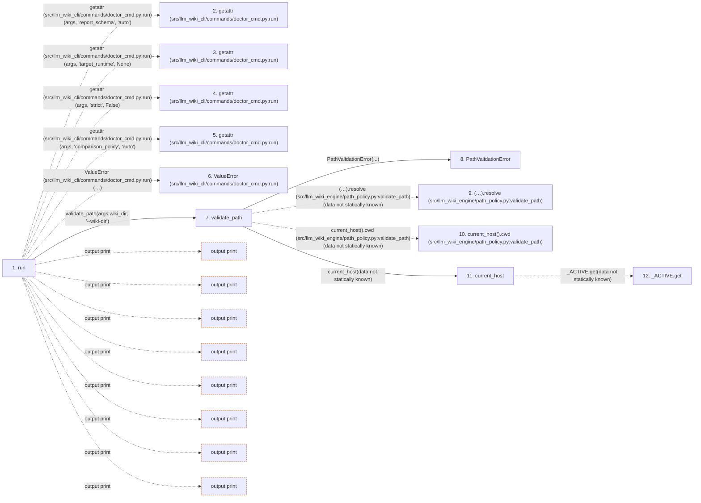

# doctor

**Entry point:** `run` (`cli`)
**Source:** [doctor_cmd](../modules/doctor_cmd.md)
**Modules touched:** [analysis_capture](../modules/analysis_capture.md), [analysis_compatibility](../modules/analysis_compatibility.md), [analysis_targets](../modules/analysis_targets.md), [api](../modules/api.md), and 69 more

**Complete modules touched:**

- [analysis_capture](../modules/analysis_capture.md)
- [analysis_compatibility](../modules/analysis_compatibility.md)
- [analysis_targets](../modules/analysis_targets.md)
- [api](../modules/api.md)
- [canonical_json](../modules/canonical_json.md)
- [capability_diagnostics](../modules/capability_diagnostics.md)
- [common](../modules/common.md)
- [data_flow](../modules/data_flow.md)
- [doctor_cmd](../modules/doctor_cmd.md)
- [doctor_service](../modules/doctor_service.md)
- [domain_pack](../modules/domain_pack.md)
- [entrypoints](../modules/entrypoints.md)
- [extraction_jobs](../modules/extraction_jobs.md)
- [extraction_service](../modules/extraction_service.md)
- [extractor_helpers](../modules/extractor_helpers.md)
- [filesystem_guard](../modules/filesystem_guard.md)
- [flow_followup](../modules/flow_followup.md)
- [gitignore](../modules/gitignore.md)
- [health_contract](../modules/health_contract.md)
- [health_details](../modules/health_details.md)
- [health_policy](../modules/health_policy.md)
- [health_summary](../modules/health_summary.md)
- [helper_cache](../modules/helper_cache.md)
- [helper_runtime](../modules/helper_runtime.md)
- [host](../modules/host.md)
- [immutable](../modules/immutable.md)
- [infrastructure_inventory](../modules/infrastructure_inventory.md)
- [integrations](../modules/integrations.md)
- [inventory_cache](../modules/inventory_cache.md)
- [io](../modules/io.md)
- [knowledge_artifacts](../modules/knowledge_artifacts.md)
- [knowledge_consumption](../modules/knowledge_consumption.md)
- [knowledge_envelope](../modules/knowledge_envelope.md)
- [knowledge_evidence](../modules/knowledge_evidence.md)
- [knowledge_freshness](../modules/knowledge_freshness.md)
- [knowledge_graph](../modules/knowledge_graph.md)
- [knowledge_kinds](../modules/knowledge_kinds.md)
- [knowledge_loader](../modules/knowledge_loader.md)
- [knowledge_model](../modules/knowledge_model.md)
- [knowledge_observability](../modules/knowledge_observability.md)
- [knowledge_orchestration](../modules/knowledge_orchestration.md)
- [knowledge_packs](../modules/knowledge_packs.md)
- [knowledge_reuse_format](../modules/knowledge_reuse_format.md)
- [knowledge_storage](../modules/knowledge_storage.md)
- [knowledge_storage_io](../modules/knowledge_storage_io.md)
- [knowledge_validators](../modules/knowledge_validators.md)
- [knowledge_verification](../modules/knowledge_verification.md)
- [lint_service](../modules/lint_service.md)
- [maintenance_state](../modules/maintenance_state.md)
- [manifest_storage](../modules/manifest_storage.md)
- [markdown_sections](../modules/markdown_sections.md)
- [module_coverage](../modules/module_coverage.md)
- [pack_interfaces](../modules/pack_interfaces.md)
- [path_policy](../modules/path_policy.md)
- [paths](../modules/paths.md)
- [plugins](../modules/plugins.md)
- [progress](../modules/progress.md)
- [runtime_output](../modules/runtime_output.md)
- [section_ownership](../modules/section_ownership.md)
- [services_dependencies](../modules/services_dependencies.md)
- [source_retirement](../modules/source_retirement.md)
- [source_selection](../modules/source_selection.md)
- [source_snapshot](../modules/source_snapshot.md)
- [sync_analysis](../modules/sync_analysis.md)
- [sync_manifest](../modules/sync_manifest.md)
- [team](../modules/team.md)
- [typescript_helper_identity](../modules/typescript_helper_identity.md)
- [validation](../modules/validation.md)
- [wiki_lifecycle](../modules/wiki_lifecycle.md)
- [wiki_media](../modules/wiki_media.md)
- [wiki_surface](../modules/wiki_surface.md)
- [yaml_formats](../modules/yaml_formats.md)
- [yaml_syntax](../modules/yaml_syntax.md)

## Call sequence

> Static overview in presentation order, not runtime execution order. Arrows retain captured callers; representative internal continuations and boundary examples precede repeated helper detail.

<!-- Auto-generated from static call edges. Dashed arrows are external or unresolved calls. Reviewed runtime conditions and side effects belong in Behavior. -->

```mermaid
sequenceDiagram
    participant p0 as run
    participant p1 as validate_path
    participant p2 as inspect_targets
    participant p3 as load_targets
    participant p4 as get_analysis_input_status
    participant p5 as build_capability_doctor
    participant p6 as extraction_job_request_from_args
    participant p7 as render_capability_doctor
    participant p8 as render_doctor_text
    participant p9 as _render_analysis_input_text
    participant p10 as build_doctor_report
    participant p11 as analysis_input_status
    participant p12 as build_capability_diagnostics
    participant p13 as extraction_job_request_for
    participant p14 as read_guarded
    participant p15 as StorageReadSession.read
    participant p16 as _parse_bundle
    participant p17 as parse_packed_root
    participant p18 as parse_knowledge_index
    participant p19 as SyncManifest.load
    participant p20 as render_capability_doctor.<locals>.command
    participant p21 as _render_doctor_payload
    participant p22 as compare_targets
    participant p23 as _require_relative_name
    participant p24 as _record
    participant p25 as decode_bytes
    participant p26 as validate_source_root
    participant p27 as _fields
    participant p28 as _absolute_path
    participant p29 as getattr (src/llm_wiki_cli/commands/doctor_cmd.py:run)
    participant p30 as report.to_payload (src/llm_wiki_cli/commands/doctor_cmd.py:run)
    p0->>p1: validate_path
    p0->>p2: inspect_targets
    p0->>p3: load_targets
    p0->>p4: get_analysis_input_status
    p0->>p5: build_capability_doctor
    p0->>p6: extraction_job_request_from_args
    p0->>p7: render_capability_doctor
    p0->>p8: render_doctor_text
    p0->>p9: _render_analysis_input_text
    p0->>p10: build_doctor_report
    p4->>p11: analysis_input_status
    p5->>p12: build_capability_diagnostics
    p6->>p13: extraction_job_request_for
    p3->>p14: read_guarded
    p2->>p15: StorageReadSession.read
    p2->>p16: _parse_bundle
    p2->>p17: parse_packed_root
    p2->>p18: parse_knowledge_index
    p2->>p19: SyncManifest.load
    p7->>p20: render_capability_doctor.<locals>.command
    p7->>p21: _render_doctor_payload
    p2->>p22: compare_targets
    p15->>p23: _require_relative_name
    p16->>p24: _record
    p17->>p25: decode_bytes
    p12->>p26: validate_source_root
    p17->>p27: _fields
    p14->>p28: _absolute_path
    p0-->>p29: getattr (src/llm_wiki_cli/commands/doctor_cmd.py:run)(args, 'report_schema', 'auto')
    p0-->>p30: report.to_payload (src/llm_wiki_cli/commands/doctor_cmd.py:run)(report_schema=report_schema)
```

> Call sequence diagram shows 30 of 3100 interactions; 3070 omitted to keep the visualization within the 30-interaction and generated-diagram limits, with uncertain identities omitted rather than inferred.

> Captured boundary calls: external 1 of 940 (939 omitted); unresolved 1 of 771 (770 omitted). These counts cover the captured static trace.

Omitted captured detail, grouped by actual caller occurrence and target module:

| Caller | Parent step | Target module | Kind | Omitted interactions |
| --- | --- | --- | --- | --- |
| `src/llm_wiki_cli/commands/doctor_cmd.py:run` | 1 | - | external | 40 |
| `src/llm_wiki_engine/path_policy.py:validate_path` | 7 | [src/llm_wiki_engine/path_policy.py](../modules/path_policy.md) | internal | 2 |
| `src/llm_wiki_engine/path_policy.py:validate_path` | 7 | - | unresolved | 5 |
| `src/llm_wiki_engine/path_policy.py:validate_path` | 7 | [src/llm_wiki_engine/host.py](../modules/host.md) | internal | 2 |
| `src/llm_wiki_engine/host.py:current_host` | 11 | - | unresolved | 1 |
| `src/llm_wiki_cli/commands/doctor_cmd.py:run` | 1 | [src/llm_wiki_engine/path_policy.py](../modules/path_policy.md) | internal | 1 |
| `src/llm_wiki_cli/services/analysis_targets.py:inspect_targets` | 19 | [src/llm_wiki_engine/knowledge_storage_io.py](../modules/knowledge_storage_io.md) | internal | 4 |
| `src/llm_wiki_cli/services/analysis_targets.py:inspect_targets` | 19 | - | external | 7 |
> Omission summary shows 8 of 769 groups; 761 further groups are not expanded here. Counts above include all omitted interactions.
> Detailed flow queries retain their own coverage and limits; omitted paths may execute at runtime.

> Trace truncated at the depth limit; deeper calls are omitted.

## Data flow

<!-- Auto-generated static analysis. Treat values and boundaries as best-effort hints, not runtime proof. -->

### Analysis coverage

**Effect analysis partially available.** Flow assembly and source effect analysis are separate; empty observations do not prove an empty handler body.

Source steps: 1390; effect analysis evaluated: 975, partial: 48, unavailable: 367. Counts include steps omitted from the displayed trace.

Collector observations for 1023 source steps with known totals: observed: 5642, emitted: 5388, omitted: 254. Unavailable totals are excluded.

- Callable record unavailable for one or more source steps; those steps have no represented callable body.
- Effect collector omitted observations before flow assembly; displayed effects are partial.
- Effect collector totals unavailable; observed counts cover captured records only.

| Step | Callable record | Effect analysis | Collector totals | Observed | Emitted | Omitted |
|---|---|---|---|---:|---:|---:|
| `run` | `available` | `partial` | `available` | `14` | `13` | `1` |
| `getattr (src/llm_wiki_cli/commands/doctor_cmd.py:run)` | `not_applicable` | `not_applicable` | `not_applicable` | — | — | — |
| `getattr (src/llm_wiki_cli/commands/doctor_cmd.py:run)` | `not_applicable` | `not_applicable` | `not_applicable` | — | — | — |
| `getattr (src/llm_wiki_cli/commands/doctor_cmd.py:run)` | `not_applicable` | `not_applicable` | `not_applicable` | — | — | — |
| `getattr (src/llm_wiki_cli/commands/doctor_cmd.py:run)` | `not_applicable` | `not_applicable` | `not_applicable` | — | — | — |
| `ValueError (src/llm_wiki_cli/commands/doctor_cmd.py:run)` | `not_applicable` | `not_applicable` | `not_applicable` | — | — | — |
| `validate_path` | `available` | `evaluated` | `available` | `3` | `3` | `0` |
| `PathValidationError` | `unavailable` | `unavailable` | `unavailable` | — | — | — |
| `(…).resolve (src/llm_wiki_engine/path_policy.py:validate_path)` | `not_applicable` | `not_applicable` | `not_applicable` | — | — | — |
| `current_host().cwd (src/llm_wiki_engine/path_policy.py:validate_path)` | `not_applicable` | `not_applicable` | `not_applicable` | — | — | — |
| `current_host` | `available` | `evaluated` | `available` | `2` | `2` | `0` |
| `_ACTIVE.get` | `not_applicable` | `not_applicable` | `not_applicable` | — | — | — |

```mermaid
flowchart LR
    s1["1. run"]
    s2["2. getattr (src/llm_wiki_cli/commands/doctor_cmd.py:run)"]
    s3["3. getattr (src/llm_wiki_cli/commands/doctor_cmd.py:run)"]
    s4["4. getattr (src/llm_wiki_cli/commands/doctor_cmd.py:run)"]
    s5["5. getattr (src/llm_wiki_cli/commands/doctor_cmd.py:run)"]
    s6["6. ValueError (src/llm_wiki_cli/commands/doctor_cmd.py:run)"]
    s7["7. validate_path"]
    s8["8. PathValidationError"]
    s9["9. (…).resolve (src/llm_wiki_engine/path_policy.py:validate_path)"]
    s10["10. current_host().cwd (src/llm_wiki_engine/path_policy.py:validate_path)"]
    s11["11. current_host"]
    s12["12. _ACTIVE.get"]
    s1 -. "getattr (src/llm_wiki_cli/commands/doctor_cmd.py:run)(args, 'report_schema', 'auto')" .-> s2
    s1 -. "getattr (src/llm_wiki_cli/commands/doctor_cmd.py:run)(args, 'target_runtime', None)" .-> s3
    s1 -. "getattr (src/llm_wiki_cli/commands/doctor_cmd.py:run)(args, 'strict', False)" .-> s4
    s1 -. "getattr (src/llm_wiki_cli/commands/doctor_cmd.py:run)(args, 'comparison_policy', 'auto')" .-> s5
    s1 -. "ValueError (src/llm_wiki_cli/commands/doctor_cmd.py:run)(…)" .-> s6
    s1 -->|"validate_path(args.wiki_dir, '--wiki-dir')"| s7
    s7 -->|"PathValidationError(...)"| s8
    s7 -. "(…).resolve (src/llm_wiki_engine/path_policy.py:validate_path)(data not statically known)" .-> s9
    s7 -. "current_host().cwd (src/llm_wiki_engine/path_policy.py:validate_path)(data not statically known)" .-> s10
    s7 -->|"current_host(data not statically known)"| s11
    s11 -. "_ACTIVE.get(data not statically known)" .-> s12
    b0["output print"]
    s1 -. "output print" .-> b0
    b1["output print"]
    s1 -. "output print" .-> b1
    b2["output print"]
    s1 -. "output print" .-> b2
    b3["output print"]
    s1 -. "output print" .-> b3
    b4["output print"]
    s1 -. "output print" .-> b4
    b5["output print"]
    s1 -. "output print" .-> b5
    b6["output print"]
    s1 -. "output print" .-> b6
    b7["output print"]
    s1 -. "output print" .-> b7
    click s1 "../modules/doctor_cmd.md"
    click s7 "../modules/path_policy.md"
    click s8 "../modules/path_policy.md"
    click s11 "../modules/host.md"
    classDef boundary stroke:#b45309,stroke-dasharray: 4 2
    class b0 boundary
    class b1 boundary
    class b2 boundary
    class b3 boundary
    class b4 boundary
    class b5 boundary
    class b6 boundary
    class b7 boundary
```

### Step data

| Step | Inputs | Reads | Writes | Returns |
|---|---|---|---|---|
| `run` | `args` | `DEFAULT_WIKI_DIR` | - | `none`, `none`, `none` |
| `getattr (src/llm_wiki_cli/commands/doctor_cmd.py:run)` | - | - | - | - |
| `getattr (src/llm_wiki_cli/commands/doctor_cmd.py:run)` | - | - | - | - |
| `getattr (src/llm_wiki_cli/commands/doctor_cmd.py:run)` | - | - | - | - |
| `getattr (src/llm_wiki_cli/commands/doctor_cmd.py:run)` | - | - | - | - |
| `ValueError (src/llm_wiki_cli/commands/doctor_cmd.py:run)` | - | - | - | - |
| `validate_path` | `path: str`, `label: str` | - | - | `resolved` |
| `PathValidationError` | - | - | - | - |
| `(…).resolve (src/llm_wiki_engine/path_policy.py:validate_path)` | - | - | - | - |
| `current_host().cwd (src/llm_wiki_engine/path_policy.py:validate_path)` | - | - | - | - |
| `current_host` | - | `_DEFAULT` | - | `...` |
| `_ACTIVE.get` | - | - | - | - |

### Call data

| From | To | Line | Call |
|---|---|---:|---|
| run | getattr (src/llm_wiki_cli/commands/doctor_cmd.py:run) | 34 | `getattr(args, 'report_schema', 'auto')` |
| run | getattr (src/llm_wiki_cli/commands/doctor_cmd.py:run) | 35 | `getattr(args, 'target_runtime', None)` |
| run | getattr (src/llm_wiki_cli/commands/doctor_cmd.py:run) | 37 | `getattr(args, 'strict', False)` |
| run | getattr (src/llm_wiki_cli/commands/doctor_cmd.py:run) | 38 | `getattr(args, 'comparison_policy', 'auto')` |
| run | ValueError (src/llm_wiki_cli/commands/doctor_cmd.py:run) | 40 | `ValueError('--target-runtime checks declared prerequisites only; run strict health and comparison-policy checks separately')` |
| run | validate_path | 46 | `validate_path(args.wiki_dir, '--wiki-dir')` |
| validate_path | PathValidationError | 102 | `PathValidationError(...)` |
| validate_path | (…).resolve (src/llm_wiki_engine/path_policy.py:validate_path) | 103 | `(current_host().cwd() / path).resolve(data not statically known)` |
| validate_path | current_host().cwd (src/llm_wiki_engine/path_policy.py:validate_path) | 103 | `current_host().cwd(data not statically known)` |
| validate_path | current_host | 103 | `current_host(data not statically known)` |
| current_host | _ACTIVE.get | 167 | `_ACTIVE.get(data not statically known)` |

### Boundary effects

| Kind | Target | Step | Line |
|---|---|---|---:|
| output | `print` | `run` | 50 |
| output | `print` | `run` | 52 |
| output | `print` | `run` | 54 |
| output | `print` | `run` | 60 |
| output | `print` | `run` | 61 |
| output | `print` | `run` | 73 |
| output | `print` | `run` | 104 |
| output | `print` | `run` | 127 |

### Static analysis gaps

| Kind | Step | Target | Line |
|---|---|---|---:|
| external_call | `run` | `getattr` | 34 |
| external_call | `run` | `getattr` | 35 |
| external_call | `run` | `getattr` | 37 |
| external_call | `run` | `getattr` | 38 |
| external_call | `run` | `ValueError` | 40 |
| unresolved_call | `validate_path` | `(current_host().cwd() / path).resolve` | 103 |
| unresolved_call | `validate_path` | `current_host().cwd` | 103 |
| unresolved_call | `current_host` | `_ACTIVE.get` | 167 |
| step_limit | `run` | `first 12 steps` | 0 |
| truncated_flow | `run` | `depth limit` | 0 |

## Behavior

This flow starts at `run` and is classified as `cli`. The generated call and data-flow sections are bounded static projections; runtime conditions and side effects require source-level confirmation.

With `--target-runtime`, the command validates the local declaration/wiki paths and reads the target file and committed metadata. It reports matching declared provenance, registered portability, capture-required mismatches or unknown prerequisites without source inventory, extraction, helper setup or target execution. Aggregate qualification includes omitted rows. Exit 0 only establishes declared prerequisite alignment; exit 2 retains unresolved/capture requirements. Strict health and explicit comparison-policy requests must run separately. The diagnostic cannot replace fresh target-native proof or authorize a writer.
