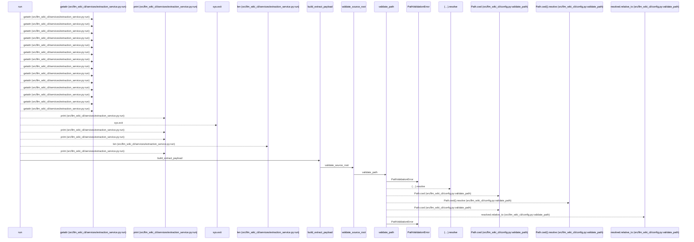
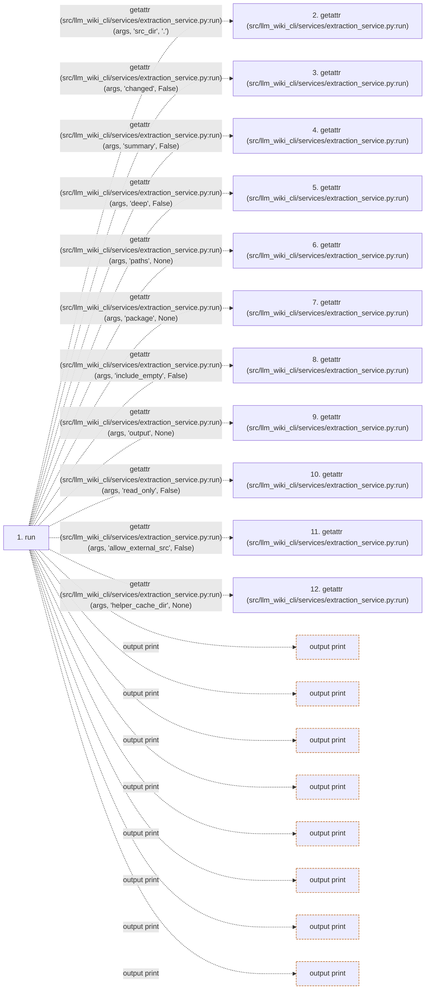

# extract

**Entry point:** `run` (`cli`)
**Source:** [extraction_service](../modules/extraction_service.md)
**Modules touched:** [api_contracts](../modules/api_contracts.md), [common](../modules/common.md), [config](../modules/config.md), [data_flow](../modules/data_flow.md), and 20 more

**Complete modules touched:**

- [api_contracts](../modules/api_contracts.md)
- [common](../modules/common.md)
- [config](../modules/config.md)
- [data_flow](../modules/data_flow.md)
- [dependency_versions](../modules/dependency_versions.md)
- [entrypoints](../modules/entrypoints.md)
- [extraction_jobs](../modules/extraction_jobs.md)
- [extraction_service](../modules/extraction_service.md)
- [filesystem_guard](../modules/filesystem_guard.md)
- [imports](../modules/imports.md)
- [inventory_cache](../modules/inventory_cache.md)
- [io](../modules/io.md)
- [packages](../modules/packages.md)
- [plugins](../modules/plugins.md)
- [progress](../modules/progress.md)
- [python_calls](../modules/python_calls.md)
- [python_contracts](../modules/python_contracts.md)
- [python_imports](../modules/python_imports.md)
- [python_observations](../modules/python_observations.md)
- [resource_diagnostics](../modules/resource_diagnostics.md)
- [services_dependencies](../modules/services_dependencies.md)
- [source_selection](../modules/source_selection.md)
- [source_snapshot](../modules/source_snapshot.md)
- [validation](../modules/validation.md)

## Call sequence

<!-- Auto-generated from static call edges. Dashed arrows are external or unresolved calls. Reviewed runtime conditions and side effects belong in Behavior. -->

> Call sequence diagram shows 30 of 2650 interactions; 2620 omitted to keep the visualization within the 30-interaction and generated-diagram limits.

> Trace truncated at the depth limit; deeper calls are omitted.

## Data flow

<!-- Auto-generated static analysis. Treat values and boundaries as best-effort hints, not runtime proof. -->

### Step data

| Step | Inputs | Reads | Writes | Returns |
|---|---|---|---|---|
| `run` | `args` | `sys`, `sys`, `sys`, `sys`, `ExtractorFailureError`, `PathValidationError`, `sys`, `sys` | - | `none` |
| `getattr (src/llm_wiki_cli/services/extraction_service.py:run)` | - | - | - | - |
| `getattr (src/llm_wiki_cli/services/extraction_service.py:run)` | - | - | - | - |
| `getattr (src/llm_wiki_cli/services/extraction_service.py:run)` | - | - | - | - |
| `getattr (src/llm_wiki_cli/services/extraction_service.py:run)` | - | - | - | - |
| `getattr (src/llm_wiki_cli/services/extraction_service.py:run)` | - | - | - | - |
| `getattr (src/llm_wiki_cli/services/extraction_service.py:run)` | - | - | - | - |
| `getattr (src/llm_wiki_cli/services/extraction_service.py:run)` | - | - | - | - |
| `getattr (src/llm_wiki_cli/services/extraction_service.py:run)` | - | - | - | - |
| `getattr (src/llm_wiki_cli/services/extraction_service.py:run)` | - | - | - | - |
| `getattr (src/llm_wiki_cli/services/extraction_service.py:run)` | - | - | - | - |
| `getattr (src/llm_wiki_cli/services/extraction_service.py:run)` | - | - | - | - |

### Call data

| From | To | Line | Call |
|---|---|---:|---|
| run | getattr (src/llm_wiki_cli/services/extraction_service.py:run) | 2265 | `getattr(args, 'src_dir', '.')` |
| run | getattr (src/llm_wiki_cli/services/extraction_service.py:run) | 2266 | `getattr(args, 'changed', False)` |
| run | getattr (src/llm_wiki_cli/services/extraction_service.py:run) | 2267 | `getattr(args, 'summary', False)` |
| run | getattr (src/llm_wiki_cli/services/extraction_service.py:run) | 2268 | `getattr(args, 'deep', False)` |
| run | getattr (src/llm_wiki_cli/services/extraction_service.py:run) | 2269 | `getattr(args, 'paths', None)` |
| run | getattr (src/llm_wiki_cli/services/extraction_service.py:run) | 2270 | `getattr(args, 'package', None)` |
| run | getattr (src/llm_wiki_cli/services/extraction_service.py:run) | 2271 | `getattr(args, 'include_empty', False)` |
| run | getattr (src/llm_wiki_cli/services/extraction_service.py:run) | 2272 | `getattr(args, 'output', None)` |
| run | getattr (src/llm_wiki_cli/services/extraction_service.py:run) | 2273 | `getattr(args, 'read_only', False)` |
| run | getattr (src/llm_wiki_cli/services/extraction_service.py:run) | 2274 | `getattr(args, 'allow_external_src', False)` |
| run | getattr (src/llm_wiki_cli/services/extraction_service.py:run) | 2275 | `getattr(args, 'helper_cache_dir', None)` |

### Boundary effects

| Kind | Target | Step | Line |
|---|---|---|---:|
| output | `print` | `run` | 2281 |
| output | `print` | `run` | 2285 |
| output | `print` | `run` | 2287 |
| output | `print` | `run` | 2289 |
| output | `print` | `run` | 2315 |
| output | `print` | `run` | 2317 |
| output | `print` | `run` | 2322 |
| output | `print` | `run` | 2326 |

### Static analysis gaps

| Kind | Step | Target | Line |
|---|---|---|---:|
| external_call | `run` | `getattr` | 2265 |
| external_call | `run` | `getattr` | 2266 |
| external_call | `run` | `getattr` | 2267 |
| external_call | `run` | `getattr` | 2268 |
| external_call | `run` | `getattr` | 2269 |
| external_call | `run` | `getattr` | 2270 |
| external_call | `run` | `getattr` | 2271 |
| external_call | `run` | `getattr` | 2272 |
| external_call | `run` | `getattr` | 2273 |
| external_call | `run` | `getattr` | 2274 |
| external_call | `run` | `getattr` | 2275 |
| step_limit | `run` | `first 12 steps` | 0 |

## Behavior

Builds the stable extraction payload for the requested source boundary and
writes JSON to stdout or an explicitly selected output. Changed, path, package,
summary, and deep modes narrow or enrich that payload without importing the
target application. Extractor failures are reported on stderr and return a
nonzero status; successful output retains the source-relative inventory
contract.
