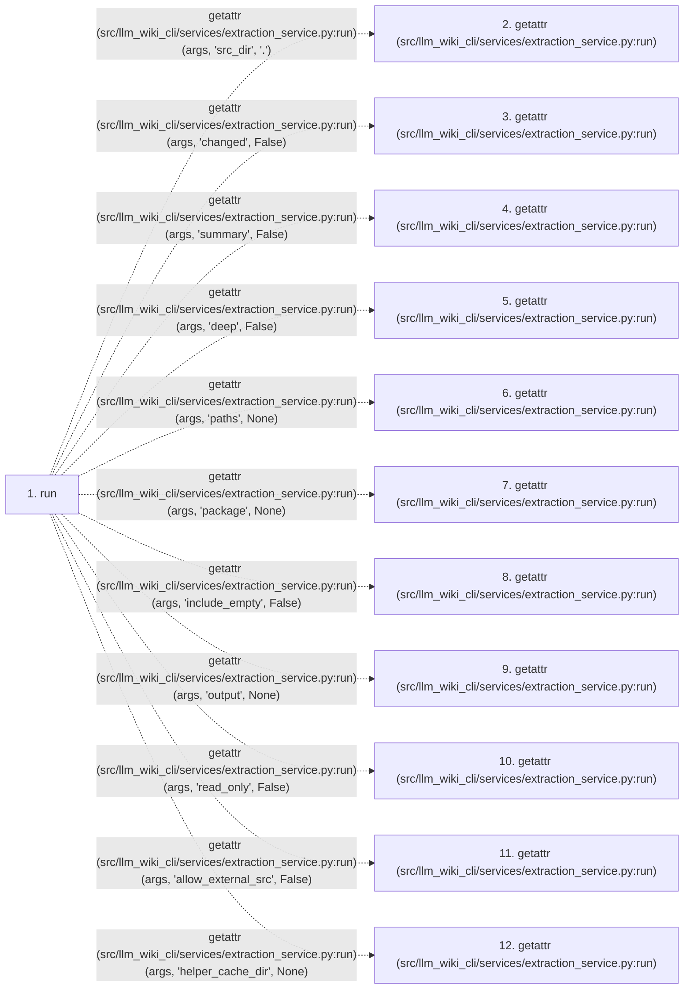

# extract

**Entry point:** `run` (`cli`)
**Source:** [extraction_service](../modules/extraction_service.md)
**Modules touched:** [analysis_capture](../modules/analysis_capture.md), [analysis_compatibility](../modules/analysis_compatibility.md), [api_contracts](../modules/api_contracts.md), [common](../modules/common.md), and 37 more

**Complete modules touched:**

- [analysis_capture](../modules/analysis_capture.md)
- [analysis_compatibility](../modules/analysis_compatibility.md)
- [api_contracts](../modules/api_contracts.md)
- [common](../modules/common.md)
- [data_flow](../modules/data_flow.md)
- [dependency_versions](../modules/dependency_versions.md)
- [dockerfile_parser](../modules/dockerfile_parser.md)
- [domain_pack](../modules/domain_pack.md)
- [engine_events](../modules/engine_events.md)
- [entrypoints](../modules/entrypoints.md)
- [extraction_jobs](../modules/extraction_jobs.md)
- [extraction_service](../modules/extraction_service.md)
- [extractor_helpers](../modules/extractor_helpers.md)
- [filesystem_guard](../modules/filesystem_guard.md)
- [gitignore](../modules/gitignore.md)
- [go_calls](../modules/go_calls.md)
- [helper_cache](../modules/helper_cache.md)
- [helper_runtime](../modules/helper_runtime.md)
- [host](../modules/host.md)
- [imports](../modules/imports.md)
- [inventory_cache](../modules/inventory_cache.md)
- [io](../modules/io.md)
- [knowledge_artifacts](../modules/knowledge_artifacts.md)
- [packages](../modules/packages.md)
- [path_policy](../modules/path_policy.md)
- [paths](../modules/paths.md)
- [plugins](../modules/plugins.md)
- [progress](../modules/progress.md)
- [python_bindings](../modules/python_bindings.md)
- [python_calls](../modules/python_calls.md)
- [python_contracts](../modules/python_contracts.md)
- [python_implementation](../modules/python_implementation.md)
- [python_imports](../modules/python_imports.md)
- [python_observations](../modules/python_observations.md)
- [resource_diagnostics](../modules/resource_diagnostics.md)
- [services_dependencies](../modules/services_dependencies.md)
- [source_selection](../modules/source_selection.md)
- [source_snapshot](../modules/source_snapshot.md)
- [validation](../modules/validation.md)
- [wiki_write_basis](../modules/wiki_write_basis.md)
- [yaml_syntax](../modules/yaml_syntax.md)

## Call sequence

> Static overview in presentation order, not runtime execution order. Arrows retain captured callers; representative internal continuations and boundary examples precede repeated helper detail.

<!-- Auto-generated from static call edges. Dashed arrows are external or unresolved calls. Reviewed runtime conditions and side effects belong in Behavior. -->

```mermaid
sequenceDiagram
    participant p0 as run
    participant p1 as emit
    participant p2 as build_extract_payload
    participant p3 as print_inventory_failures
    participant p4 as write_text_output
    participant p5 as format_unsupported_source_summary
    participant p6 as validate_source_root
    participant p7 as _format_unsupported_language_count
    participant p8 as _write_utf8_text
    participant p9 as validate_source_paths
    participant p10 as _publish_message
    participant p11 as _source_snapshot_for_inventory_request
    participant p12 as _git_changed_files
    participant p13 as _build_extract_source_snapshot
    participant p14 as _partition_snapshot_git_changes
    participant p15 as analyze_dependencies
    participant p16 as build_api_contracts
    participant p17 as _data_flow_details_contract
    participant p18 as _extract_output_paths
    participant p19 as get_inventory_result
    participant p20 as get_docker_inventory
    participant p21 as unsupported_source_summary
    participant p22 as read_console_scripts
    participant p23 as detect_entry_points
    participant p24 as attach_routes_to_entry_points
    participant p25 as resolve_call_edges
    participant p26 as build_flow_context
    participant p27 as build_data_flow_context
    participant p28 as analyze_data_flow_detailed
    participant p29 as getattr (src/llm_wiki_cli/services/extraction_service.py:run)
    participant p30 as message.startswith
    p0->>p1: emit
    p0->>p2: build_extract_payload
    p0->>p3: print_inventory_failures
    p0->>p4: write_text_output
    p0->>p5: format_unsupported_source_summary
    p2->>p6: validate_source_root
    p5->>p7: _format_unsupported_language_count
    p4->>p8: _write_utf8_text
    p2->>p9: validate_source_paths
    p1->>p10: _publish_message
    p2->>p11: _source_snapshot_for_inventory_request
    p2->>p12: _git_changed_files
    p2->>p13: _build_extract_source_snapshot
    p2->>p14: _partition_snapshot_git_changes
    p2->>p15: analyze_dependencies
    p2->>p16: build_api_contracts
    p2->>p17: _data_flow_details_contract
    p2->>p18: _extract_output_paths
    p2->>p19: get_inventory_result
    p2->>p20: get_docker_inventory
    p2->>p21: unsupported_source_summary
    p2->>p22: read_console_scripts
    p2->>p23: detect_entry_points
    p2->>p24: attach_routes_to_entry_points
    p2->>p25: resolve_call_edges
    p2->>p26: build_flow_context
    p2->>p27: build_data_flow_context
    p2->>p28: analyze_data_flow_detailed
    p0-->>p29: getattr (src/llm_wiki_cli/services/extraction_service.py:run)(args, 'src_dir', '.')
    p0-->>p30: message.startswith('No files found for package')
```

> Call sequence diagram shows 30 of 3370 interactions; 3340 omitted to keep the visualization within the 30-interaction and generated-diagram limits, with uncertain identities omitted rather than inferred.

> Captured boundary calls: external 1 of 1117 (1116 omitted); unresolved 1 of 1386 (1385 omitted). These counts cover the captured static trace.

Omitted captured detail, grouped by actual caller occurrence and target module:

| Caller | Parent step | Target module | Kind | Omitted interactions |
| --- | --- | --- | --- | --- |
| `src/llm_wiki_cli/services/extraction_service.py:run` | 1 | - | external | 20 |
| `src/llm_wiki_engine/host.py:emit` | 16 | [src/llm_wiki_engine/host.py](../modules/host.md) | internal | 1 |
| `src/llm_wiki_engine/host.py:current_host` | 17 | - | unresolved | 1 |
| `src/llm_wiki_engine/host.py:emit` | 16 | - | external | 3 |
| `src/llm_wiki_engine/host.py:emit` | 16 | - | unresolved | 2 |
| `src/llm_wiki_engine/host.py:_publish_message` | 24 | [src/llm_wiki_engine/engine_events.py](../modules/engine_events.md) | internal | 2 |
| `src/llm_wiki_engine/engine_events.py:current_operation` | 25 | - | unresolved | 1 |
| `src/llm_wiki_engine/host.py:_publish_message` | 24 | - | unresolved | 1 |
> Omission summary shows 8 of 761 groups; 753 further groups are not expanded here. Counts above include all omitted interactions.
> Detailed flow queries retain their own coverage and limits; omitted paths may execute at runtime.

> Trace truncated at the depth limit; deeper calls are omitted.

## Data flow

<!-- Auto-generated static analysis. Treat values and boundaries as best-effort hints, not runtime proof. -->

### Analysis coverage

**Effect analysis partially available.** Flow assembly and source effect analysis are separate; empty observations do not prove an empty handler body.

Source steps: 868; effect analysis evaluated: 712, partial: 37, unavailable: 119. Counts include steps omitted from the displayed trace.

Collector observations for 749 source steps with known totals: observed: 4479, emitted: 4360, omitted: 119. Unavailable totals are excluded.

- Callable record unavailable for one or more source steps; those steps have no represented callable body.
- Effect collector omitted observations before flow assembly; displayed effects are partial.
- Effect collector totals unavailable; observed counts cover captured records only.

| Step | Callable record | Effect analysis | Collector totals | Observed | Emitted | Omitted |
|---|---|---|---|---:|---:|---:|
| `run` | `available` | `evaluated` | `available` | `4` | `4` | `0` |
| `getattr (src/llm_wiki_cli/services/extraction_service.py:run)` | `not_applicable` | `not_applicable` | `not_applicable` | — | — | — |
| `getattr (src/llm_wiki_cli/services/extraction_service.py:run)` | `not_applicable` | `not_applicable` | `not_applicable` | — | — | — |
| `getattr (src/llm_wiki_cli/services/extraction_service.py:run)` | `not_applicable` | `not_applicable` | `not_applicable` | — | — | — |
| `getattr (src/llm_wiki_cli/services/extraction_service.py:run)` | `not_applicable` | `not_applicable` | `not_applicable` | — | — | — |
| `getattr (src/llm_wiki_cli/services/extraction_service.py:run)` | `not_applicable` | `not_applicable` | `not_applicable` | — | — | — |
| `getattr (src/llm_wiki_cli/services/extraction_service.py:run)` | `not_applicable` | `not_applicable` | `not_applicable` | — | — | — |
| `getattr (src/llm_wiki_cli/services/extraction_service.py:run)` | `not_applicable` | `not_applicable` | `not_applicable` | — | — | — |
| `getattr (src/llm_wiki_cli/services/extraction_service.py:run)` | `not_applicable` | `not_applicable` | `not_applicable` | — | — | — |
| `getattr (src/llm_wiki_cli/services/extraction_service.py:run)` | `not_applicable` | `not_applicable` | `not_applicable` | — | — | — |
| `getattr (src/llm_wiki_cli/services/extraction_service.py:run)` | `not_applicable` | `not_applicable` | `not_applicable` | — | — | — |
| `getattr (src/llm_wiki_cli/services/extraction_service.py:run)` | `not_applicable` | `not_applicable` | `not_applicable` | — | — | — |

```mermaid
flowchart LR
    s1["1. run"]
    s2["2. getattr (src/llm_wiki_cli/services/extraction_service.py:run)"]
    s3["3. getattr (src/llm_wiki_cli/services/extraction_service.py:run)"]
    s4["4. getattr (src/llm_wiki_cli/services/extraction_service.py:run)"]
    s5["5. getattr (src/llm_wiki_cli/services/extraction_service.py:run)"]
    s6["6. getattr (src/llm_wiki_cli/services/extraction_service.py:run)"]
    s7["7. getattr (src/llm_wiki_cli/services/extraction_service.py:run)"]
    s8["8. getattr (src/llm_wiki_cli/services/extraction_service.py:run)"]
    s9["9. getattr (src/llm_wiki_cli/services/extraction_service.py:run)"]
    s10["10. getattr (src/llm_wiki_cli/services/extraction_service.py:run)"]
    s11["11. getattr (src/llm_wiki_cli/services/extraction_service.py:run)"]
    s12["12. getattr (src/llm_wiki_cli/services/extraction_service.py:run)"]
    s1 -. "getattr (src/llm_wiki_cli/services/extraction_service.py:run)(args, 'src_dir', '.')" .-> s2
    s1 -. "getattr (src/llm_wiki_cli/services/extraction_service.py:run)(args, 'changed', False)" .-> s3
    s1 -. "getattr (src/llm_wiki_cli/services/extraction_service.py:run)(args, 'summary', False)" .-> s4
    s1 -. "getattr (src/llm_wiki_cli/services/extraction_service.py:run)(args, 'deep', False)" .-> s5
    s1 -. "getattr (src/llm_wiki_cli/services/extraction_service.py:run)(args, 'paths', None)" .-> s6
    s1 -. "getattr (src/llm_wiki_cli/services/extraction_service.py:run)(args, 'package', None)" .-> s7
    s1 -. "getattr (src/llm_wiki_cli/services/extraction_service.py:run)(args, 'include_empty', False)" .-> s8
    s1 -. "getattr (src/llm_wiki_cli/services/extraction_service.py:run)(args, 'output', None)" .-> s9
    s1 -. "getattr (src/llm_wiki_cli/services/extraction_service.py:run)(args, 'read_only', False)" .-> s10
    s1 -. "getattr (src/llm_wiki_cli/services/extraction_service.py:run)(args, 'allow_external_src', False)" .-> s11
    s1 -. "getattr (src/llm_wiki_cli/services/extraction_service.py:run)(args, 'helper_cache_dir', None)" .-> s12
    click s1 "../modules/extraction_service.md"
```

### Step data

| Step | Inputs | Reads | Writes | Returns |
|---|---|---|---|---|
| `run` | `args` | `ExtractorFailureError`, `PathValidationError` | - | `none` |
| `getattr (src/llm_wiki_cli/services/extraction_service.py:run)` | - | - | - | - |
| `getattr (src/llm_wiki_cli/services/extraction_service.py:run)` | - | - | - | - |
| `getattr (src/llm_wiki_cli/services/extraction_service.py:run)` | - | - | - | - |
| `getattr (src/llm_wiki_cli/services/extraction_service.py:run)` | - | - | - | - |
| `getattr (src/llm_wiki_cli/services/extraction_service.py:run)` | - | - | - | - |
| `getattr (src/llm_wiki_cli/services/extraction_service.py:run)` | - | - | - | - |
| `getattr (src/llm_wiki_cli/services/extraction_service.py:run)` | - | - | - | - |
| `getattr (src/llm_wiki_cli/services/extraction_service.py:run)` | - | - | - | - |
| `getattr (src/llm_wiki_cli/services/extraction_service.py:run)` | - | - | - | - |
| `getattr (src/llm_wiki_cli/services/extraction_service.py:run)` | - | - | - | - |
| `getattr (src/llm_wiki_cli/services/extraction_service.py:run)` | - | - | - | - |

### Call data

| From | To | Line | Call |
|---|---|---:|---|
| run | getattr (src/llm_wiki_cli/services/extraction_service.py:run) | 2599 | `getattr(args, 'src_dir', '.')` |
| run | getattr (src/llm_wiki_cli/services/extraction_service.py:run) | 2600 | `getattr(args, 'changed', False)` |
| run | getattr (src/llm_wiki_cli/services/extraction_service.py:run) | 2601 | `getattr(args, 'summary', False)` |
| run | getattr (src/llm_wiki_cli/services/extraction_service.py:run) | 2602 | `getattr(args, 'deep', False)` |
| run | getattr (src/llm_wiki_cli/services/extraction_service.py:run) | 2603 | `getattr(args, 'paths', None)` |
| run | getattr (src/llm_wiki_cli/services/extraction_service.py:run) | 2604 | `getattr(args, 'package', None)` |
| run | getattr (src/llm_wiki_cli/services/extraction_service.py:run) | 2605 | `getattr(args, 'include_empty', False)` |
| run | getattr (src/llm_wiki_cli/services/extraction_service.py:run) | 2606 | `getattr(args, 'output', None)` |
| run | getattr (src/llm_wiki_cli/services/extraction_service.py:run) | 2607 | `getattr(args, 'read_only', False)` |
| run | getattr (src/llm_wiki_cli/services/extraction_service.py:run) | 2608 | `getattr(args, 'allow_external_src', False)` |
| run | getattr (src/llm_wiki_cli/services/extraction_service.py:run) | 2609 | `getattr(args, 'helper_cache_dir', None)` |

### Boundary effects

*No boundary-effect observations were captured in this static trace.*

### Static analysis gaps

| Kind | Step | Target | Line |
|---|---|---|---:|
| external_call | `run` | `getattr` | 2599 |
| external_call | `run` | `getattr` | 2600 |
| external_call | `run` | `getattr` | 2601 |
| external_call | `run` | `getattr` | 2602 |
| external_call | `run` | `getattr` | 2603 |
| external_call | `run` | `getattr` | 2604 |
| external_call | `run` | `getattr` | 2605 |
| external_call | `run` | `getattr` | 2606 |
| external_call | `run` | `getattr` | 2607 |
| external_call | `run` | `getattr` | 2608 |
| external_call | `run` | `getattr` | 2609 |
| step_limit | `run` | `first 12 steps` | 0 |

## Behavior

Builds the stable extraction payload for the requested source boundary and
writes JSON to stdout or an explicitly selected output. Changed, path, package,
summary, and deep modes narrow or enrich that payload without importing the
target application. Extractor failures are reported on stderr and return a
nonzero status; successful output retains the source-relative inventory
contract.

Help identifies the one-file raw JSON inspection route with deep read-only
extraction. It retains source selection and prepared helper-cache bindings and
does not take a wiki argument. Raw success is a fresh observation, not a repair
of captured manifest evidence. Missing helper setup and runtime mismatch retain
their explicit owner and authorization requirements.

Python imports include class bodies, methods and nested scopes with source locations and eager/deferred/type-only classifications. These dependency facts are distinct from captured module bindings and do not imply that the target application was executed.
