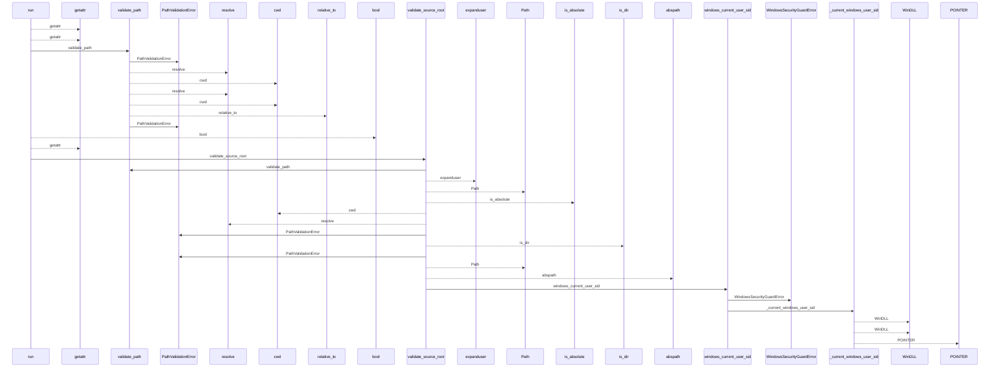
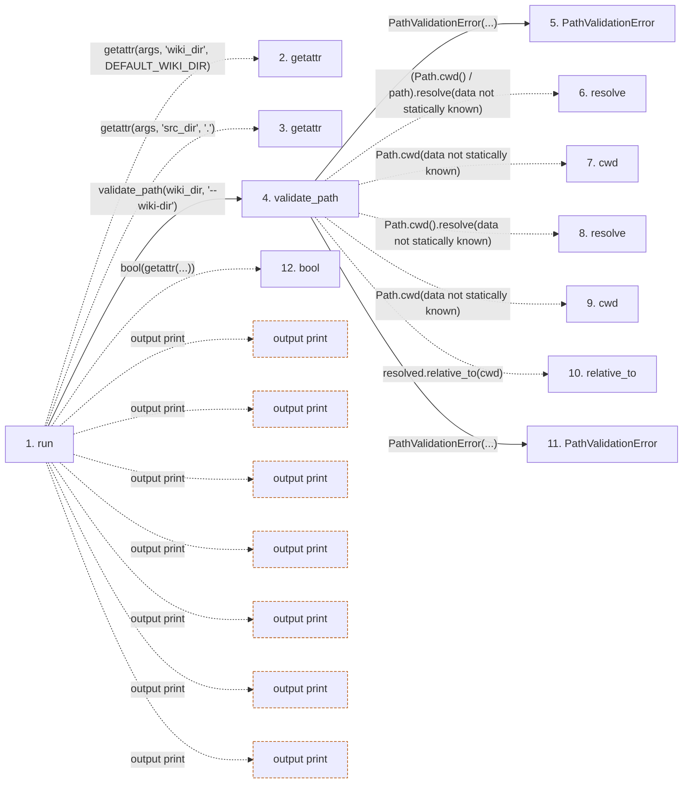

# generate-prompt

**Entry point:** `run` (`cli`)
**Source:** [generate_prompt_cmd](../modules/generate_prompt_cmd.md)
**Modules touched:** [common](../modules/common.md), [config](../modules/config.md), [documentation_queries](../modules/documentation_queries.md), [documentation_query_builder](../modules/documentation_query_builder.md), and 15 more

**Complete modules touched:**

- [common](../modules/common.md)
- [config](../modules/config.md)
- [documentation_queries](../modules/documentation_queries.md)
- [documentation_query_builder](../modules/documentation_query_builder.md)
- [extraction_service](../modules/extraction_service.md)
- [filesystem_guard](../modules/filesystem_guard.md)
- [generate_prompt_cmd](../modules/generate_prompt_cmd.md)
- [io](../modules/io.md)
- [knowledge_observability](../modules/knowledge_observability.md)
- [metrics](../modules/metrics.md)
- [paths](../modules/paths.md)
- [plugins](../modules/plugins.md)
- [redaction](../modules/redaction.md)
- [secure_file](../modules/secure_file.md)
- [source_selection](../modules/source_selection.md)
- [source_snapshot](../modules/source_snapshot.md)
- [team](../modules/team.md)
- [validation](../modules/validation.md)
- [wiki_git_policy](../modules/wiki_git_policy.md)

## Call sequence

<!-- Auto-generated from static call edges. Dashed arrows are external or unresolved calls. Reviewed runtime conditions and side effects belong in Behavior. -->

> Call sequence diagram shows 30 of 1021 interactions; 991 omitted to keep the visualization within the 30-interaction and generated-diagram limits.

> Trace truncated at the depth limit; deeper calls are omitted.

## Data flow

<!-- Auto-generated static analysis. Treat values and boundaries as best-effort hints, not runtime proof. -->

### Step data

| Step | Inputs | Reads | Writes | Returns |
|---|---|---|---|---|
| `run` | `args` | `DEFAULT_WIKI_DIR`, `_DEFAULT_PROMPT_FILE`, `TeamConfigError`, `sys`, `PluginError`, `sys` | - | `none` |
| `getattr` | - | - | - | - |
| `getattr` | - | - | - | - |
| `validate_path` | `path: str`, `label: str` | - | - | `resolved` |
| `PathValidationError` | - | - | - | - |
| `resolve` | - | - | - | - |
| `cwd` | - | - | - | - |
| `resolve` | - | - | - | - |
| `cwd` | - | - | - | - |
| `relative_to` | - | - | - | - |
| `PathValidationError` | - | - | - | - |
| `bool` | - | - | - | - |

### Call data

| From | To | Line | Call |
|---|---|---:|---|
| run | getattr | 636 | `getattr(args, 'wiki_dir', DEFAULT_WIKI_DIR)` |
| run | getattr | 637 | `getattr(args, 'src_dir', '.')` |
| run | validate_path | 638 | `validate_path(wiki_dir, '--wiki-dir')` |
| validate_path | PathValidationError | 128 | `PathValidationError(...)` |
| validate_path | resolve | 131 | `(Path.cwd() / path).resolve(data not statically known)` |
| validate_path | cwd | 131 | `Path.cwd(data not statically known)` |
| validate_path | resolve | 132 | `Path.cwd().resolve(data not statically known)` |
| validate_path | cwd | 132 | `Path.cwd(data not statically known)` |
| validate_path | relative_to | 134 | `resolved.relative_to(cwd)` |
| validate_path | PathValidationError | 136 | `PathValidationError(...)` |
| run | bool | 639 | `bool(getattr(...))` |

### Boundary effects

| Kind | Target | Step | Line |
|---|---|---|---:|
| output | `print` | `run` | 655 |
| output | `print` | `run` | 680 |
| output | `print` | `run` | 694 |
| output | `print` | `run` | 727 |
| output | `print` | `run` | 728 |
| output | `print` | `run` | 729 |
| output | `print` | `run` | 730 |

### Static analysis gaps

| Kind | Step | Target | Line |
|---|---|---|---:|
| unresolved_call | `run` | `getattr` | 636 |
| unresolved_call | `run` | `getattr` | 637 |
| unresolved_call | `validate_path` | `(Path.cwd() / path).resolve` | 131 |
| external_call | `validate_path` | `Path.cwd` | 131 |
| external_call | `validate_path` | `Path.cwd().resolve` | 132 |
| external_call | `validate_path` | `Path.cwd` | 132 |
| unresolved_call | `validate_path` | `resolved.relative_to` | 134 |
| step_limit | `run` | `first 12 steps` | 0 |
| truncated_flow | `run` | `depth limit` | 0 |

## Behavior

This flow starts at `run` and is classified as `cli`. The generated call and data-flow sections are bounded static projections; runtime conditions and side effects require source-level confirmation.
