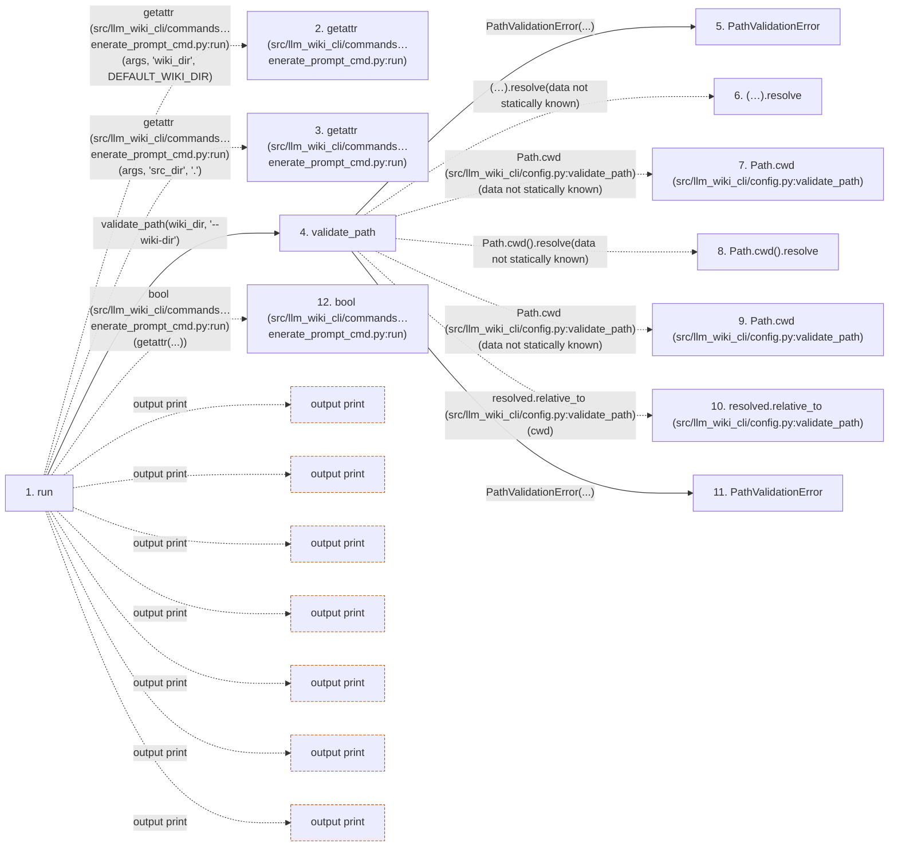

# generate-prompt

**Entry point:** `run` (`cli`)
**Source:** [generate_prompt_cmd](../modules/generate_prompt_cmd.md)
**Modules touched:** [common](../modules/common.md), [config](../modules/config.md), [documentation_queries](../modules/documentation_queries.md), [documentation_query_builder](../modules/documentation_query_builder.md), and 16 more

**Complete modules touched:**

- [common](../modules/common.md)
- [config](../modules/config.md)
- [documentation_queries](../modules/documentation_queries.md)
- [documentation_query_builder](../modules/documentation_query_builder.md)
- [extraction_service](../modules/extraction_service.md)
- [filesystem_guard](../modules/filesystem_guard.md)
- [generate_prompt_cmd](../modules/generate_prompt_cmd.md)
- [io](../modules/io.md)
- [knowledge_observability](../modules/knowledge_observability.md)
- [metrics](../modules/metrics.md)
- [paths](../modules/paths.md)
- [plugins](../modules/plugins.md)
- [redaction](../modules/redaction.md)
- [secure_file](../modules/secure_file.md)
- [source_selection](../modules/source_selection.md)
- [source_snapshot](../modules/source_snapshot.md)
- [sync_manifest](../modules/sync_manifest.md)
- [team](../modules/team.md)
- [validation](../modules/validation.md)
- [wiki_git_policy](../modules/wiki_git_policy.md)

## Call sequence

```mermaid
sequenceDiagram
    participant p0 as run
    participant p1 as getattr (src/llm_wiki_cli/commands…enerate_prompt_cmd.py:run)
    participant p2 as validate_path
    participant p3 as PathValidationError
    participant p4 as (…).resolve
    participant p5 as Path.cwd (src/llm_wiki_cli/config.py:validate_path)
    participant p6 as Path.cwd().resolve
    participant p7 as resolved.relative_to (src/llm_wiki_cli/config.py:validate_path)
    participant p8 as bool (src/llm_wiki_cli/commands…enerate_prompt_cmd.py:run)
    participant p9 as validate_source_root
    participant p10 as Path(…).expanduser
    participant p11 as Path (src/llm_wiki_cli/config.py:validate_source_root)
    participant p12 as candidate.is_absolute (src/llm_wiki_cli/config.py:validate_source_root)
    participant p13 as Path.cwd (src/llm_wiki_cli/config.py:validate_source_root)
    participant p14 as candidate.resolve (src/llm_wiki_cli/config.py:validate_source_root)
    participant p15 as resolved.is_dir
    participant p16 as os.path.abspath (src/llm_wiki_cli/config.py:validate_source_root)
    participant p17 as windows_current_user_sid
    participant p18 as WindowsSecurityGuardError
    participant p19 as _current_windows_user_sid
    participant p20 as ctypes.WinDLL (src/llm_wiki_cli/services…_current_windows_user_sid)
    participant p21 as ctypes.POINTER (src/llm_wiki_cli/services…_current_windows_user_sid)
    p0-->>p1: getattr (src/llm_wiki_cli/commands…enerate_prompt_cmd.py:run)
    p0-->>p1: getattr (src/llm_wiki_cli/commands…enerate_prompt_cmd.py:run)
    p0->>p2: validate_path
    p2->>p3: PathValidationError
    p2-->>p4: (…).resolve
    p2-->>p5: Path.cwd (src/llm_wiki_cli/config.py:validate_path)
    p2-->>p6: Path.cwd().resolve
    p2-->>p5: Path.cwd (src/llm_wiki_cli/config.py:validate_path)
    p2-->>p7: resolved.relative_to (src/llm_wiki_cli/config.py:validate_path)
    p2->>p3: PathValidationError
    p0-->>p8: bool (src/llm_wiki_cli/commands…enerate_prompt_cmd.py:run)
    p0-->>p1: getattr (src/llm_wiki_cli/commands…enerate_prompt_cmd.py:run)
    p0->>p9: validate_source_root
    p9->>p2: validate_path
    p9-->>p10: Path(…).expanduser
    p9-->>p11: Path (src/llm_wiki_cli/config.py:validate_source_root)
    p9-->>p12: candidate.is_absolute (src/llm_wiki_cli/config.py:validate_source_root)
    p9-->>p13: Path.cwd (src/llm_wiki_cli/config.py:validate_source_root)
    p9-->>p14: candidate.resolve (src/llm_wiki_cli/config.py:validate_source_root)
    p9->>p3: PathValidationError
    p9-->>p15: resolved.is_dir
    p9->>p3: PathValidationError
    p9-->>p11: Path (src/llm_wiki_cli/config.py:validate_source_root)
    p9-->>p16: os.path.abspath (src/llm_wiki_cli/config.py:validate_source_root)
    p9->>p17: windows_current_user_sid
    p17->>p18: WindowsSecurityGuardError
    p17->>p19: _current_windows_user_sid
    p19-->>p20: ctypes.WinDLL (src/llm_wiki_cli/services…_current_windows_user_sid)
    p19-->>p20: ctypes.WinDLL (src/llm_wiki_cli/services…_current_windows_user_sid)
    p19-->>p21: ctypes.POINTER (src/llm_wiki_cli/services…_current_windows_user_sid)
```

<!-- Auto-generated from static call edges. Dashed arrows are external or unresolved calls. Reviewed runtime conditions and side effects belong in Behavior. -->

> Call sequence diagram shows 30 of 1217 interactions; 1187 omitted to keep the visualization within the 30-interaction and generated-diagram limits.

> Trace truncated at the depth limit; deeper calls are omitted.

## Data flow

<!-- Auto-generated static analysis. Treat values and boundaries as best-effort hints, not runtime proof. -->

### Step data

| Step | Inputs | Reads | Writes | Returns |
|---|---|---|---|---|
| `run` | `args` | `DEFAULT_WIKI_DIR`, `_DEFAULT_PROMPT_FILE`, `TeamConfigError`, `sys`, `PluginError`, `sys` | - | `none` |
| `getattr (src/llm_wiki_cli/commands…enerate_prompt_cmd.py:run)` | - | - | - | - |
| `getattr (src/llm_wiki_cli/commands…enerate_prompt_cmd.py:run)` | - | - | - | - |
| `validate_path` | `path: str`, `label: str` | - | - | `resolved` |
| `PathValidationError` | - | - | - | - |
| `(…).resolve` | - | - | - | - |
| `Path.cwd (src/llm_wiki_cli/config.py:validate_path)` | - | - | - | - |
| `Path.cwd().resolve` | - | - | - | - |
| `Path.cwd (src/llm_wiki_cli/config.py:validate_path)` | - | - | - | - |
| `resolved.relative_to (src/llm_wiki_cli/config.py:validate_path)` | - | - | - | - |
| `PathValidationError` | - | - | - | - |
| `bool (src/llm_wiki_cli/commands…enerate_prompt_cmd.py:run)` | - | - | - | - |

### Call data

| From | To | Line | Call |
|---|---|---:|---|
| run | getattr (src/llm_wiki_cli/commands…enerate_prompt_cmd.py:run) | 636 | `getattr(args, 'wiki_dir', DEFAULT_WIKI_DIR)` |
| run | getattr (src/llm_wiki_cli/commands…enerate_prompt_cmd.py:run) | 637 | `getattr(args, 'src_dir', '.')` |
| run | validate_path | 638 | `validate_path(wiki_dir, '--wiki-dir')` |
| validate_path | PathValidationError | 132 | `PathValidationError(...)` |
| validate_path | (…).resolve | 133 | `(Path.cwd() / path).resolve(data not statically known)` |
| validate_path | Path.cwd (src/llm_wiki_cli/config.py:validate_path) | 133 | `Path.cwd(data not statically known)` |
| validate_path | Path.cwd().resolve | 134 | `Path.cwd().resolve(data not statically known)` |
| validate_path | Path.cwd (src/llm_wiki_cli/config.py:validate_path) | 134 | `Path.cwd(data not statically known)` |
| validate_path | resolved.relative_to (src/llm_wiki_cli/config.py:validate_path) | 136 | `resolved.relative_to(cwd)` |
| validate_path | PathValidationError | 138 | `PathValidationError(...)` |
| run | bool (src/llm_wiki_cli/commands…enerate_prompt_cmd.py:run) | 639 | `bool(getattr(...))` |

### Boundary effects

| Kind | Target | Step | Line |
|---|---|---|---:|
| output | `print` | `run` | 655 |
| output | `print` | `run` | 680 |
| output | `print` | `run` | 694 |
| output | `print` | `run` | 727 |
| output | `print` | `run` | 728 |
| output | `print` | `run` | 729 |
| output | `print` | `run` | 730 |

### Static analysis gaps

| Kind | Step | Target | Line |
|---|---|---|---:|
| external_call | `run` | `getattr` | 636 |
| external_call | `run` | `getattr` | 637 |
| unresolved_call | `validate_path` | `(Path.cwd() / path).resolve` | 133 |
| external_call | `validate_path` | `Path.cwd` | 133 |
| unresolved_call | `validate_path` | `Path.cwd().resolve` | 134 |
| external_call | `validate_path` | `Path.cwd` | 134 |
| unresolved_call | `validate_path` | `resolved.relative_to` | 136 |
| step_limit | `run` | `first 12 steps` | 0 |
| truncated_flow | `run` | `depth limit` | 0 |

## Behavior

This flow starts at `run` and is classified as `cli`. The generated call and data-flow sections are bounded static projections; runtime conditions and side effects require source-level confirmation.
