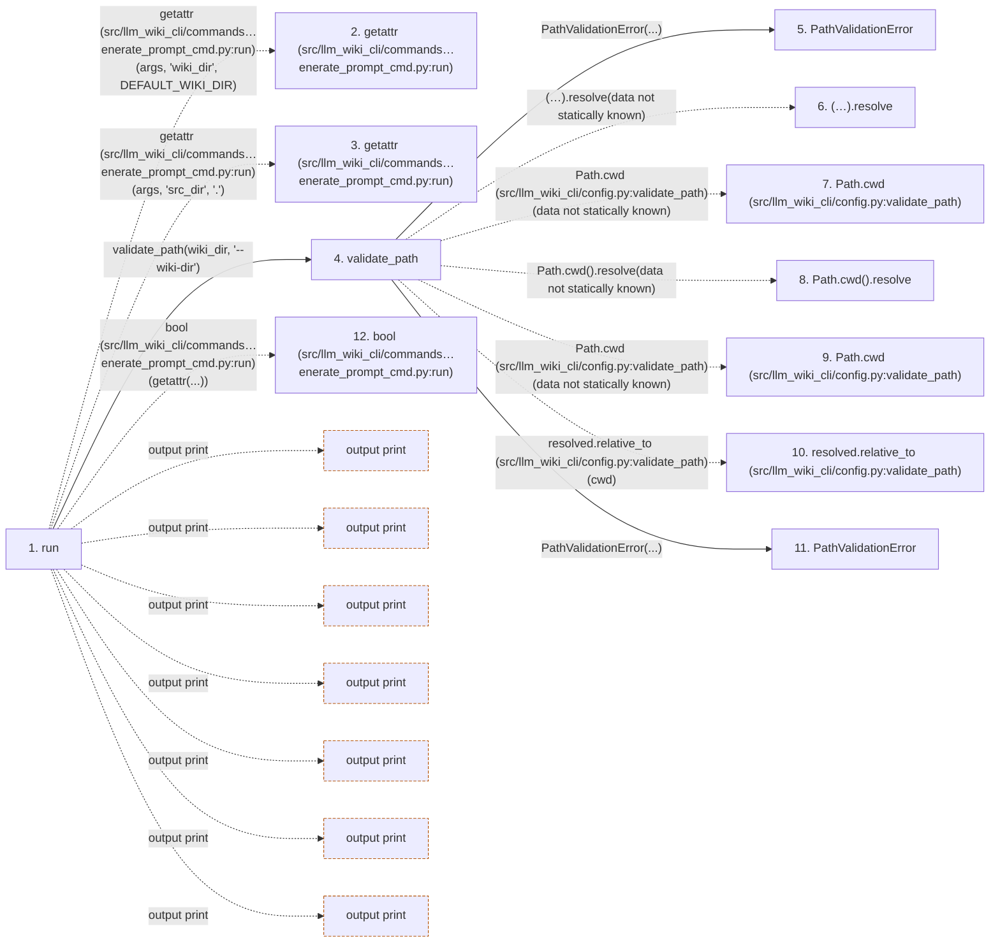

# generate-prompt

**Entry point:** `run` (`cli`)
**Source:** [generate_prompt_cmd](../modules/generate_prompt_cmd.md)
**Modules touched:** [common](../modules/common.md), [config](../modules/config.md), [documentation_queries](../modules/documentation_queries.md), [documentation_query_builder](../modules/documentation_query_builder.md), and 20 more

**Complete modules touched:**

- [common](../modules/common.md)
- [config](../modules/config.md)
- [documentation_queries](../modules/documentation_queries.md)
- [documentation_query_builder](../modules/documentation_query_builder.md)
- [extraction_service](../modules/extraction_service.md)
- [filesystem_guard](../modules/filesystem_guard.md)
- [generate_prompt_cmd](../modules/generate_prompt_cmd.md)
- [io](../modules/io.md)
- [knowledge_observability](../modules/knowledge_observability.md)
- [knowledge_storage](../modules/knowledge_storage.md)
- [knowledge_storage_io](../modules/knowledge_storage_io.md)
- [maintenance_state](../modules/maintenance_state.md)
- [manifest_storage](../modules/manifest_storage.md)
- [metrics](../modules/metrics.md)
- [paths](../modules/paths.md)
- [plugins](../modules/plugins.md)
- [redaction](../modules/redaction.md)
- [secure_file](../modules/secure_file.md)
- [source_selection](../modules/source_selection.md)
- [source_snapshot](../modules/source_snapshot.md)
- [sync_manifest](../modules/sync_manifest.md)
- [team](../modules/team.md)
- [validation](../modules/validation.md)
- [wiki_git_policy](../modules/wiki_git_policy.md)

## Call sequence

> Static overview in presentation order, not runtime execution order. Arrows retain captured callers; siblings are shown before deeper helper detail.

<!-- Auto-generated from static call edges. Dashed arrows are external or unresolved calls. Reviewed runtime conditions and side effects belong in Behavior. -->

```mermaid
sequenceDiagram
    participant p0 as run
    participant p1 as getattr (src/llm_wiki_cli/commands…enerate_prompt_cmd.py:run)
    participant p2 as validate_path
    participant p3 as bool (src/llm_wiki_cli/commands…enerate_prompt_cmd.py:run)
    participant p4 as validate_source_root
    participant p5 as str (src/llm_wiki_cli/commands…enerate_prompt_cmd.py:run)
    participant p6 as team_prompt_template_default
    participant p7 as print
    participant p8 as SystemExit
    participant p9 as classify_wiki_git_policy
    participant p10 as Path.cwd (src/llm_wiki_cli/commands…enerate_prompt_cmd.py:run)
    participant p11 as _validated_prompt_snapshot
    participant p12 as _prompt_git_diff
    participant p13 as _build_prompt
    participant p14 as _redact_prompt_artifact
    participant p15 as _selected_prompt_diff
    participant p16 as resolve_change_type
    participant p17 as resolve_agent
    participant p18 as record_event
    participant p19 as write_private_text
    p0-->>p1: getattr (src/llm_wiki_cli/commands…enerate_prompt_cmd.py:run)(args, 'wiki_dir', DEFAULT_WIKI_DIR)
    p0-->>p1: getattr (src/llm_wiki_cli/commands…enerate_prompt_cmd.py:run)(args, 'src_dir', '.')
    p0->>p2: validate_path
    p0-->>p3: bool (src/llm_wiki_cli/commands…enerate_prompt_cmd.py:run)(getattr(...))
    p0-->>p1: getattr (src/llm_wiki_cli/commands…enerate_prompt_cmd.py:run)(args, 'allow_external_src', False)
    p0->>p4: validate_source_root
    p0-->>p5: str (src/llm_wiki_cli/commands…enerate_prompt_cmd.py:run)(source_root)
    p0-->>p1: getattr (src/llm_wiki_cli/commands…enerate_prompt_cmd.py:run)(args, 'output', _DEFAULT_PROMPT_FILE)
    p0-->>p1: getattr (src/llm_wiki_cli/commands…enerate_prompt_cmd.py:run)(args, 'print_prompt', False)
    p0-->>p1: getattr (src/llm_wiki_cli/commands…enerate_prompt_cmd.py:run)(args, 'change_type', 'auto')
    p0-->>p1: getattr (src/llm_wiki_cli/commands…enerate_prompt_cmd.py:run)(args, 'template', None)
    p0->>p6: team_prompt_template_default
    p0-->>p7: print(..., file=sys.stderr)
    p0-->>p8: SystemExit(1)
    p0->>p9: classify_wiki_git_policy
    p0-->>p10: Path.cwd (src/llm_wiki_cli/commands…enerate_prompt_cmd.py:run)
    p0-->>p1: getattr (src/llm_wiki_cli/commands…enerate_prompt_cmd.py:run)(args, 'source_selection', None)
    p0->>p11: _validated_prompt_snapshot
    p0->>p12: _prompt_git_diff
    p0->>p13: _build_prompt
    p0-->>p7: print(..., file=sys.stderr)
    p0-->>p8: SystemExit(1)
    p0->>p14: _redact_prompt_artifact
    p0->>p15: _selected_prompt_diff
    p0->>p16: resolve_change_type
    p0->>p17: resolve_agent
    p0-->>p7: print(prompt)
    p0->>p18: record_event
    p0->>p19: write_private_text
    p0->>p18: record_event
```

> Call sequence diagram shows 30 of 1376 interactions; 1346 omitted to keep the visualization within the 30-interaction and generated-diagram limits, with uncertain identities omitted rather than inferred.

> Captured boundary calls: external 16 of 424 (408 omitted); unresolved 0 of 386 (386 omitted). These counts cover the captured static trace.

Omitted captured detail, grouped by actual caller occurrence and target module:

| Caller | Parent step | Target module | Kind | Omitted interactions |
| --- | --- | --- | --- | --- |
| `src/llm_wiki_cli/config.py:validate_path` | 4 | [src/llm_wiki_cli/config.py](../modules/config.md) | internal | 2 |
| `src/llm_wiki_cli/config.py:validate_path` | 4 | - | unresolved | 3 |
| `src/llm_wiki_cli/config.py:validate_path` | 4 | - | external | 2 |
| `src/llm_wiki_cli/config.py:validate_source_root` | 14 | [src/llm_wiki_cli/config.py](../modules/config.md) | internal | 7 |
| `src/llm_wiki_cli/config.py:validate_source_root` | 14 | - | unresolved | 5 |
| `src/llm_wiki_cli/config.py:validate_source_root` | 14 | - | external | 11 |
| `src/llm_wiki_cli/config.py:validate_source_root` | 14 | [src/llm_wiki_cli/services/filesystem_guard.py](../modules/filesystem_guard.md) | internal | 1 |
| `src/llm_wiki_cli/services/filesystem_guard.py:windows_current_user_sid` | 26 | [src/llm_wiki_cli/services/filesystem_guard.py](../modules/filesystem_guard.md) | internal | 2 |
> Omission summary shows 8 of 395 groups; 387 further groups are not expanded here. Counts above include all omitted interactions.
> Detailed flow queries retain their own coverage and limits; omitted paths may execute at runtime.

> Trace truncated at the depth limit; deeper calls are omitted.

## Data flow

<!-- Auto-generated static analysis. Treat values and boundaries as best-effort hints, not runtime proof. -->

```mermaid
flowchart LR
    s1["1. run"]
    s2["2. getattr (src/llm_wiki_cli/commands…enerate_prompt_cmd.py:run)"]
    s3["3. getattr (src/llm_wiki_cli/commands…enerate_prompt_cmd.py:run)"]
    s4["4. validate_path"]
    s5["5. PathValidationError"]
    s6["6. (…).resolve"]
    s7["7. Path.cwd (src/llm_wiki_cli/config.py:validate_path)"]
    s8["8. Path.cwd().resolve"]
    s9["9. Path.cwd (src/llm_wiki_cli/config.py:validate_path)"]
    s10["10. resolved.relative_to (src/llm_wiki_cli/config.py:validate_path)"]
    s11["11. PathValidationError"]
    s12["12. bool (src/llm_wiki_cli/commands…enerate_prompt_cmd.py:run)"]
    s1 -. "getattr (src/llm_wiki_cli/commands…enerate_prompt_cmd.py:run)(args, 'wiki_dir', DEFAULT_WIKI_DIR)" .-> s2
    s1 -. "getattr (src/llm_wiki_cli/commands…enerate_prompt_cmd.py:run)(args, 'src_dir', '.')" .-> s3
    s1 -->|"validate_path(wiki_dir, '--wiki-dir')"| s4
    s4 -->|"PathValidationError(...)"| s5
    s4 -. "(…).resolve(data not statically known)" .-> s6
    s4 -. "Path.cwd (src/llm_wiki_cli/config.py:validate_path)(data not statically known)" .-> s7
    s4 -. "Path.cwd().resolve(data not statically known)" .-> s8
    s4 -. "Path.cwd (src/llm_wiki_cli/config.py:validate_path)(data not statically known)" .-> s9
    s4 -. "resolved.relative_to (src/llm_wiki_cli/config.py:validate_path)(cwd)" .-> s10
    s4 -->|"PathValidationError(...)"| s11
    s1 -. "bool (src/llm_wiki_cli/commands…enerate_prompt_cmd.py:run)(getattr(...))" .-> s12
    b0["output print"]
    s1 -. "output print" .-> b0
    b1["output print"]
    s1 -. "output print" .-> b1
    b2["output print"]
    s1 -. "output print" .-> b2
    b3["output print"]
    s1 -. "output print" .-> b3
    b4["output print"]
    s1 -. "output print" .-> b4
    b5["output print"]
    s1 -. "output print" .-> b5
    b6["output print"]
    s1 -. "output print" .-> b6
    click s1 "../modules/generate_prompt_cmd.md"
    click s4 "../modules/config.md"
    click s5 "../modules/config.md"
    click s11 "../modules/config.md"
    classDef boundary stroke:#b45309,stroke-dasharray: 4 2
    class b0 boundary
    class b1 boundary
    class b2 boundary
    class b3 boundary
    class b4 boundary
    class b5 boundary
    class b6 boundary
```

### Step data

| Step | Inputs | Reads | Writes | Returns |
|---|---|---|---|---|
| `run` | `args` | `DEFAULT_WIKI_DIR`, `_DEFAULT_PROMPT_FILE`, `TeamConfigError`, `sys`, `PluginError`, `sys` | - | `none` |
| `getattr (src/llm_wiki_cli/commands…enerate_prompt_cmd.py:run)` | - | - | - | - |
| `getattr (src/llm_wiki_cli/commands…enerate_prompt_cmd.py:run)` | - | - | - | - |
| `validate_path` | `path: str`, `label: str` | - | - | `resolved` |
| `PathValidationError` | - | - | - | - |
| `(…).resolve` | - | - | - | - |
| `Path.cwd (src/llm_wiki_cli/config.py:validate_path)` | - | - | - | - |
| `Path.cwd().resolve` | - | - | - | - |
| `Path.cwd (src/llm_wiki_cli/config.py:validate_path)` | - | - | - | - |
| `resolved.relative_to (src/llm_wiki_cli/config.py:validate_path)` | - | - | - | - |
| `PathValidationError` | - | - | - | - |
| `bool (src/llm_wiki_cli/commands…enerate_prompt_cmd.py:run)` | - | - | - | - |

### Call data

| From | To | Line | Call |
|---|---|---:|---|
| run | getattr (src/llm_wiki_cli/commands…enerate_prompt_cmd.py:run) | 639 | `getattr(args, 'wiki_dir', DEFAULT_WIKI_DIR)` |
| run | getattr (src/llm_wiki_cli/commands…enerate_prompt_cmd.py:run) | 640 | `getattr(args, 'src_dir', '.')` |
| run | validate_path | 641 | `validate_path(wiki_dir, '--wiki-dir')` |
| validate_path | PathValidationError | 134 | `PathValidationError(...)` |
| validate_path | (…).resolve | 135 | `(Path.cwd() / path).resolve(data not statically known)` |
| validate_path | Path.cwd (src/llm_wiki_cli/config.py:validate_path) | 135 | `Path.cwd(data not statically known)` |
| validate_path | Path.cwd().resolve | 136 | `Path.cwd().resolve(data not statically known)` |
| validate_path | Path.cwd (src/llm_wiki_cli/config.py:validate_path) | 136 | `Path.cwd(data not statically known)` |
| validate_path | resolved.relative_to (src/llm_wiki_cli/config.py:validate_path) | 138 | `resolved.relative_to(cwd)` |
| validate_path | PathValidationError | 140 | `PathValidationError(...)` |
| run | bool (src/llm_wiki_cli/commands…enerate_prompt_cmd.py:run) | 642 | `bool(getattr(...))` |

### Boundary effects

| Kind | Target | Step | Line |
|---|---|---|---:|
| output | `print` | `run` | 658 |
| output | `print` | `run` | 683 |
| output | `print` | `run` | 697 |
| output | `print` | `run` | 730 |
| output | `print` | `run` | 731 |
| output | `print` | `run` | 732 |
| output | `print` | `run` | 733 |

### Static analysis gaps

| Kind | Step | Target | Line |
|---|---|---|---:|
| external_call | `run` | `getattr` | 639 |
| external_call | `run` | `getattr` | 640 |
| unresolved_call | `validate_path` | `(Path.cwd() / path).resolve` | 135 |
| external_call | `validate_path` | `Path.cwd` | 135 |
| unresolved_call | `validate_path` | `Path.cwd().resolve` | 136 |
| external_call | `validate_path` | `Path.cwd` | 136 |
| unresolved_call | `validate_path` | `resolved.relative_to` | 138 |
| step_limit | `run` | `first 12 steps` | 0 |
| truncated_flow | `run` | `depth limit` | 0 |

## Behavior

This flow starts at `run` and is classified as `cli`. The generated call and data-flow sections are bounded static projections; runtime conditions and side effects require source-level confirmation.
